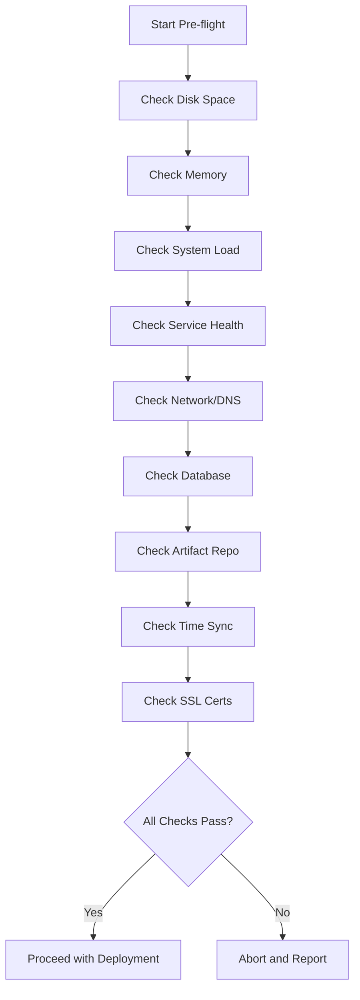

# How to Use Ansible for Pre-Flight Checks Before Deployment

Author: [nawazdhandala](https://www.github.com/nawazdhandala)

Tags: Ansible, Pre-Flight Checks, Deployment, Validation

Description: Implement comprehensive pre-flight checks with Ansible to validate infrastructure readiness before deployments and catch problems early.

---

A deployment that fails halfway through is worse than one that never starts. Pre-flight checks verify that everything is ready before making any changes. Disk space, service health, network connectivity, dependency availability, and configuration validity should all pass before the first task runs.

## Pre-Flight Check Playbook

Run this before every deployment:

```yaml
# playbooks/preflight.yml
# Comprehensive pre-flight checks before deployment
- name: Pre-flight checks
  hosts: "{{ target_hosts | default('all') }}"
  become: yes
  gather_facts: yes
  any_errors_fatal: true

  tasks:
    - name: Check minimum disk space
      ansible.builtin.assert:
        that:
          - item.size_available > min_disk_bytes | default(2147483648)
        fail_msg: >
          Insufficient disk space on {{ item.mount }}:
          {{ (item.size_available / 1073741824) | round(2) }}GB available,
          need {{ (min_disk_bytes | default(2147483648) / 1073741824) | round(2) }}GB
      loop: "{{ ansible_mounts }}"
      when: item.mount == '/'
      loop_control:
        label: "{{ item.mount }}"

    - name: Check memory availability
      ansible.builtin.assert:
        that:
          - ansible_memfree_mb > min_free_memory_mb | default(512)
        fail_msg: >
          Insufficient free memory: {{ ansible_memfree_mb }}MB available,
          need {{ min_free_memory_mb | default(512) }}MB

    - name: Check system load
      ansible.builtin.command: cat /proc/loadavg
      register: loadavg
      changed_when: false

    - name: Verify load average is acceptable
      ansible.builtin.assert:
        that:
          - (loadavg.stdout.split()[0] | float) < (ansible_processor_vcpus * 2)
        fail_msg: >
          System load too high: {{ loadavg.stdout.split()[0] }}.
          Max acceptable: {{ ansible_processor_vcpus * 2 }}

    - name: Check required services are running
      ansible.builtin.service_facts:

    - name: Verify critical services
      ansible.builtin.assert:
        that:
          - "'{{ item }}.service' in services"
          - "services['{{ item }}.service'].state == 'running'"
        fail_msg: "Required service {{ item }} is not running"
      loop: "{{ required_services | default(['sshd']) }}"

    - name: Verify DNS resolution
      ansible.builtin.command: "host {{ item }}"
      loop:
        - "{{ app_repo_host | default('github.com') }}"
        - "{{ db_host | default('localhost') }}"
        - "{{ artifact_host | default('registry.example.com') }}"
      register: dns_checks
      changed_when: false
      failed_when: dns_checks.rc != 0

    - name: Verify database connectivity
      ansible.builtin.wait_for:
        host: "{{ db_host }}"
        port: "{{ db_port | default(5432) }}"
        timeout: 5
      when: db_host is defined

    - name: Verify artifact repository is accessible
      ansible.builtin.uri:
        url: "{{ artifact_repo_url }}/health"
        status_code: 200
        timeout: 10
      when: artifact_repo_url is defined
      delegate_to: localhost
      run_once: true

    - name: Verify target version exists in repository
      ansible.builtin.uri:
        url: "{{ artifact_repo_url }}/{{ app_name }}/{{ app_version }}"
        method: HEAD
        status_code: 200
      when:
        - artifact_repo_url is defined
        - app_version is defined
      delegate_to: localhost
      run_once: true

    - name: Check NTP synchronization
      ansible.builtin.command: timedatectl show --property=NTPSynchronized
      register: ntp_status
      changed_when: false

    - name: Verify time is synchronized
      ansible.builtin.assert:
        that:
          - "'NTPSynchronized=yes' in ntp_status.stdout"
        fail_msg: "NTP is not synchronized on {{ inventory_hostname }}"

    - name: Check for pending reboot
      ansible.builtin.stat:
        path: /var/run/reboot-required
      register: reboot_required

    - name: Warn about pending reboot
      ansible.builtin.debug:
        msg: "WARNING: {{ inventory_hostname }} has a pending reboot"
      when: reboot_required.stat.exists

    - name: Verify SSL certificate is not expiring soon
      ansible.builtin.command: >
        openssl x509 -enddate -noout -in {{ ssl_cert_path }}
      register: cert_expiry
      changed_when: false
      when: ssl_cert_path is defined

    - name: All pre-flight checks passed
      ansible.builtin.debug:
        msg: "All pre-flight checks passed on {{ inventory_hostname }}"
```

## Running Pre-Flight Before Deployment

Chain pre-flight checks with deployment:

```yaml
# playbooks/safe-deploy.yml
# Pre-flight then deploy
- name: Run pre-flight checks
  ansible.builtin.import_playbook: preflight.yml

- name: Deploy application
  ansible.builtin.import_playbook: deploy.yml
```

```bash
# Run pre-flight checks independently
ansible-playbook playbooks/preflight.yml -i inventories/production/hosts.yml

# Run full safe deployment
ansible-playbook playbooks/safe-deploy.yml \
  -i inventories/production/hosts.yml \
  -e "app_version=v2.1.0"
```

## Pre-Flight Check Flow



## Custom Pre-Flight for Specific Deployments

Extend pre-flight checks for specific deployment types:

```yaml
# tasks/preflight-database-deploy.yml
# Additional checks before database changes

- name: Verify backup exists from today
  ansible.builtin.stat:
    path: "/opt/backups/{{ db_name }}-{{ ansible_date_time.date }}.dump"
  register: today_backup

- name: Ensure fresh backup exists
  ansible.builtin.assert:
    that:
      - today_backup.stat.exists
      - today_backup.stat.size > 0
    fail_msg: >
      No backup found for today. Run backup playbook first:
      ansible-playbook playbooks/database-backup.yml

- name: Check database replication lag
  ansible.builtin.command:
    cmd: psql -c "SELECT EXTRACT(EPOCH FROM now() - pg_last_xact_replay_timestamp()) AS lag_seconds"
  register: replication_lag
  become_user: postgres
  changed_when: false
  when: db_role == 'replica'

- name: Verify replication is caught up
  ansible.builtin.assert:
    that:
      - replication_lag.stdout | regex_search('[0-9.]+') | float < 30
    fail_msg: "Replication lag is {{ replication_lag.stdout }}s. Must be under 30s before migration."
  when: db_role == 'replica'

- name: Verify no active long-running queries
  ansible.builtin.command:
    cmd: >
      psql -c "SELECT count(*) FROM pg_stat_activity
      WHERE state = 'active' AND query_start < now() - interval '5 minutes'"
  register: long_queries
  become_user: postgres
  changed_when: false

- name: Warn about long-running queries
  ansible.builtin.assert:
    that:
      - long_queries.stdout | trim | int == 0
    fail_msg: "There are {{ long_queries.stdout | trim }} long-running queries. Consider waiting."
```

## Generating Pre-Flight Reports

```yaml
# playbooks/preflight-report.yml
# Generate a pre-flight report without failing
- name: Generate pre-flight report
  hosts: all
  become: yes
  gather_facts: yes

  tasks:
    - name: Collect all checks
      ansible.builtin.set_fact:
        preflight_results:
          hostname: "{{ inventory_hostname }}"
          disk_free_gb: "{{ (ansible_mounts | selectattr('mount', 'equalto', '/') | first).size_available / 1073741824 | round(2) }}"
          memory_free_mb: "{{ ansible_memfree_mb }}"
          cpu_count: "{{ ansible_processor_vcpus }}"
          os: "{{ ansible_distribution }} {{ ansible_distribution_version }}"
          uptime_days: "{{ (ansible_uptime_seconds / 86400) | round(1) }}"

    - name: Write report
      ansible.builtin.copy:
        content: "{{ preflight_results | to_nice_json }}"
        dest: "/tmp/preflight-{{ inventory_hostname }}.json"
      delegate_to: localhost
```

## Summary

Pre-flight checks are your safety net against half-completed deployments. Check disk space, memory, system load, service health, network connectivity, database access, artifact availability, time sync, and certificate expiration before making any changes. Use `any_errors_fatal: true` to stop the entire deployment if any host fails pre-flight. Run pre-flight checks independently to diagnose issues without triggering a deployment. Make them a mandatory step in every deployment pipeline so problems are caught before they become incidents.
