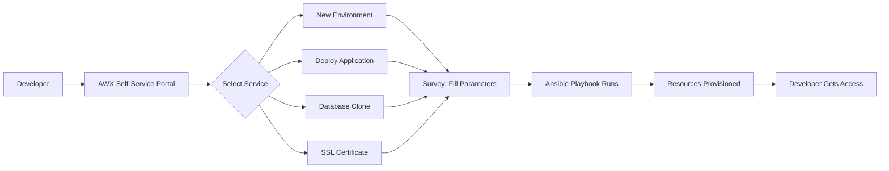

# How to Use Ansible for Self-Service Infrastructure

Author: [nawazdhandala](https://www.github.com/nawazdhandala)

Tags: Ansible, Self-Service, AWX, Platform Engineering

Description: Build a self-service infrastructure platform using Ansible and AWX where developers can provision resources without waiting for ops team intervention.

---

Developers should not wait three days for a staging environment. Platform engineering is about building self-service systems where teams can provision what they need, within guardrails, without filing tickets. Ansible combined with AWX provides the automation layer, and survey-based job templates create the user interface.

## The Self-Service Model

Instead of developers submitting tickets and waiting for the ops team, they click a button, fill in parameters, and get their infrastructure in minutes.



## AWX Survey-Based Job Templates

AWX surveys create web forms that collect variables from users:

```yaml
# AWX job template configuration (via API)
# This creates a "New Development Environment" self-service option

job_template:
  name: "Self-Service: New Development Environment"
  playbook: playbooks/provision-dev-env.yml
  inventory: dynamic-cloud-inventory
  credentials:
    - cloud-credentials
    - vault-credentials
  survey_enabled: true
  survey_spec:
    name: "Development Environment Parameters"
    description: "Provision a new development environment"
    spec:
      - question_name: "Team Name"
        variable: team_name
        type: text
        required: true
        max: 20

      - question_name: "Environment Name"
        variable: env_name
        type: text
        required: true
        max: 30

      - question_name: "Application Stack"
        variable: app_stack
        type: multiplechoice
        required: true
        choices:
          - "python-django"
          - "nodejs-express"
          - "java-spring"
          - "go-fiber"

      - question_name: "Database Type"
        variable: db_type
        type: multiplechoice
        required: true
        choices:
          - "postgresql"
          - "mysql"
          - "mongodb"
          - "none"

      - question_name: "Instance Size"
        variable: instance_size
        type: multiplechoice
        required: true
        choices:
          - "small (2 CPU, 4GB RAM)"
          - "medium (4 CPU, 8GB RAM)"
          - "large (8 CPU, 16GB RAM)"

      - question_name: "Auto-Shutdown After Hours"
        variable: auto_shutdown_hours
        type: integer
        required: false
        default: 8
        min: 1
        max: 72
```

## The Provisioning Playbook

```yaml
# playbooks/provision-dev-env.yml
# Self-service development environment provisioning
- name: Provision development environment
  hosts: localhost
  gather_facts: false

  vars:
    instance_sizes:
      "small (2 CPU, 4GB RAM)":
        type: t3.medium
        cpu: 2
        memory: 4
      "medium (4 CPU, 8GB RAM)":
        type: t3.xlarge
        cpu: 4
        memory: 8
      "large (8 CPU, 16GB RAM)":
        type: t3.2xlarge
        cpu: 8
        memory: 16

  pre_tasks:
    - name: Validate inputs
      ansible.builtin.assert:
        that:
          - team_name is match('^[a-z][a-z0-9-]+$')
          - env_name is match('^[a-z][a-z0-9-]+$')
        fail_msg: "Names must be lowercase alphanumeric with hyphens only"

    - name: Check team quota
      ansible.builtin.uri:
        url: "{{ quota_api }}/teams/{{ team_name }}/quota"
        method: GET
        headers:
          Authorization: "Bearer {{ api_token }}"
      register: quota
      delegate_to: localhost

    - name: Verify quota not exceeded
      ansible.builtin.assert:
        that:
          - quota.json.environments_remaining > 0
        fail_msg: "Team {{ team_name }} has reached their environment limit"

  tasks:
    - name: Provision EC2 instance
      amazon.aws.ec2_instance:
        name: "dev-{{ team_name }}-{{ env_name }}"
        instance_type: "{{ instance_sizes[instance_size].type }}"
        image_id: "{{ base_ami }}"
        key_name: "{{ team_name }}-key"
        security_group: dev-environment-sg
        subnet_id: "{{ dev_subnet }}"
        state: running
        wait: yes
        tags:
          Environment: development
          Team: "{{ team_name }}"
          Owner: "{{ awx_user_name }}"
          AutoShutdown: "{{ auto_shutdown_hours }}"
          ManagedBy: ansible-self-service
          Stack: "{{ app_stack }}"
      register: ec2

    - name: Wait for SSH
      ansible.builtin.wait_for:
        host: "{{ ec2.instances[0].private_ip_address }}"
        port: 22
        delay: 30
        timeout: 300

    - name: Add new instance to in-memory inventory
      ansible.builtin.add_host:
        hostname: "{{ ec2.instances[0].private_ip_address }}"
        groupname: new_dev_env
        ansible_user: ubuntu

- name: Configure development environment
  hosts: new_dev_env
  become: yes
  vars:
    setup_database: "{{ db_type != 'none' }}"

  roles:
    - role: common
    - role: dev_tools
    - role: "stack_{{ app_stack | replace('-', '_') }}"
    - role: "database_{{ db_type }}"
      when: setup_database

  post_tasks:
    - name: Display access information
      ansible.builtin.debug:
        msg: |
          Environment provisioned successfully!

          SSH: ssh ubuntu@{{ inventory_hostname }}
          Stack: {{ app_stack }}
          Database: {{ db_type }}
          Auto-shutdown: {{ auto_shutdown_hours }} hours

          The environment will automatically shut down after
          {{ auto_shutdown_hours }} hours to save costs.
```

## Cost Control with Auto-Shutdown

```yaml
# playbooks/auto-shutdown-dev-envs.yml
# Scheduled job to shut down idle development environments
- name: Auto-shutdown expired development environments
  hosts: localhost
  gather_facts: false

  tasks:
    - name: Find instances past their shutdown time
      amazon.aws.ec2_instance_info:
        filters:
          "tag:ManagedBy": ansible-self-service
          "tag:Environment": development
          instance-state-name: running
      register: dev_instances

    - name: Calculate shutdown candidates
      ansible.builtin.set_fact:
        shutdown_list: >-
          {{
            dev_instances.instances | selectattr('launch_time', 'defined') |
            list
          }}

    - name: Stop expired instances
      amazon.aws.ec2_instance:
        instance_ids: "{{ item.instance_id }}"
        state: stopped
      loop: "{{ shutdown_list }}"
      when: >
        (ansible_date_time.epoch | int) -
        (item.launch_time | to_datetime('%Y-%m-%dT%H:%M:%S+00:00')).strftime('%s') | int
        > (item.tags.AutoShutdown | default(8) | int * 3600)
      loop_control:
        label: "{{ item.tags.Name | default(item.instance_id) }}"
```

## Self-Service Catalog

Define a catalog of available self-service actions:

```yaml
# self-service-catalog.yml
# All available self-service operations

services:
  - name: "New Development Environment"
    template: provision-dev-env
    description: "Provision a full development environment with your choice of stack"
    estimated_time: "10 minutes"
    cost: "$0.10-0.40/hour"
    available_to: [developers, qa]

  - name: "Deploy to Staging"
    template: deploy-staging
    description: "Deploy your application to the staging environment"
    estimated_time: "5 minutes"
    available_to: [developers]

  - name: "Clone Production Database"
    template: clone-prod-db
    description: "Create a sanitized copy of the production database"
    estimated_time: "30 minutes"
    available_to: [developers, qa]
    requires_approval: true

  - name: "Request SSL Certificate"
    template: provision-ssl-cert
    description: "Generate and deploy an SSL certificate via Let's Encrypt"
    estimated_time: "2 minutes"
    available_to: [developers]

  - name: "Extend Environment Lifetime"
    template: extend-env-lifetime
    description: "Extend the auto-shutdown timer for an existing environment"
    estimated_time: "1 minute"
    available_to: [developers, qa]
```

## RBAC for Self-Service

Control who can access which self-service actions:

```yaml
# AWX RBAC for self-service templates
teams:
  developers:
    permissions:
      - template: "Self-Service: New Development Environment"
        role: execute
      - template: "Self-Service: Deploy to Staging"
        role: execute
      - template: "Self-Service: Request SSL Certificate"
        role: execute

  qa_team:
    permissions:
      - template: "Self-Service: New Development Environment"
        role: execute
      - template: "Self-Service: Clone Production Database"
        role: execute

  team_leads:
    permissions:
      - template: "Self-Service: Clone Production Database"
        role: approve
```

## Summary

Self-service infrastructure with Ansible and AWX empowers developers while maintaining governance. AWX surveys create user-friendly forms for provisioning. Playbooks handle the heavy lifting with proper validation, quota enforcement, and cost controls. Auto-shutdown schedules prevent runaway costs. A service catalog makes it clear what is available. RBAC ensures teams can only access what they are authorized to use. The result is faster developer velocity without ops team bottlenecks.
