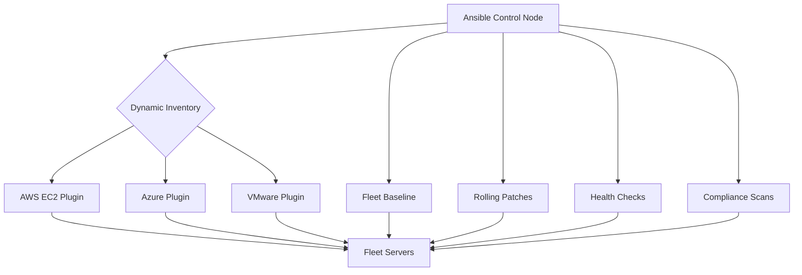

# How to Use Ansible for Server Fleet Management

Author: [nawazdhandala](https://www.github.com/nawazdhandala)

Tags: Ansible, Fleet Management, Server Administration, DevOps

Description: Learn how to manage large server fleets with Ansible using dynamic inventory, rolling updates, fleet-wide commands, and automated patching strategies.

---

Managing a fleet of servers means keeping hundreds or thousands of machines consistent, patched, and healthy. Ansible is built for this. You define the desired state once, and Ansible enforces it across every server in your fleet. The challenge is doing this efficiently at scale without bringing down your services.

## Dynamic Inventory for Fleet Discovery

Static inventory files do not scale for large fleets. Use dynamic inventory plugins to discover servers automatically:

```yaml
# inventories/aws_ec2.yml
# Automatically discover all managed EC2 instances
plugin: amazon.aws.aws_ec2
regions:
  - us-east-1
  - us-west-2
  - eu-west-1

keyed_groups:
  - key: tags.Role
    prefix: role
  - key: tags.Environment
    prefix: env
  - key: tags.Team
    prefix: team
  - key: instance_type
    prefix: type
  - key: placement.availability_zone
    prefix: az

groups:
  # Create groups based on complex conditions
  production_web: "tags.Environment == 'production' and tags.Role == 'web'"
  staging_all: "tags.Environment == 'staging'"
  needs_patching: "tags.PatchGroup is defined"

filters:
  instance-state-name: running
  "tag:ManagedBy": ansible

compose:
  ansible_host: private_ip_address
  ansible_user: "'ubuntu'"
```

Test your dynamic inventory:

```bash
# List all discovered hosts
ansible-inventory -i inventories/aws_ec2.yml --list

# Show hosts in a specific group
ansible-inventory -i inventories/aws_ec2.yml --graph role_web

# Ping all hosts in the fleet
ansible all -i inventories/aws_ec2.yml -m ping --forks 50
```

## Fleet-Wide Configuration Enforcement

Apply consistent configuration across every server:

```yaml
# playbooks/fleet-baseline.yml
# Enforce baseline configuration on all fleet servers
- name: Enforce fleet baseline
  hosts: all
  become: yes
  gather_facts: yes
  strategy: free
  serial: 100

  pre_tasks:
    - name: Gather minimal facts
      ansible.builtin.setup:
        gather_subset:
          - hardware
          - network
          - distribution

  roles:
    - role: common
      tags: [baseline, common]
    - role: security_baseline
      tags: [baseline, security]
    - role: monitoring_agent
      tags: [baseline, monitoring]
    - role: log_forwarder
      tags: [baseline, logging]
```

```yaml
# roles/common/tasks/main.yml
# Base configuration for every server in the fleet

- name: Set timezone
  community.general.timezone:
    name: "{{ server_timezone | default('UTC') }}"

- name: Configure NTP
  ansible.builtin.template:
    src: chrony.conf.j2
    dest: /etc/chrony/chrony.conf
  notify: restart chrony

- name: Install standard packages
  ansible.builtin.apt:
    name: "{{ fleet_standard_packages }}"
    state: present
    update_cache: yes
    cache_valid_time: 3600

- name: Configure SSH hardening
  ansible.builtin.template:
    src: sshd_config.j2
    dest: /etc/ssh/sshd_config
    validate: sshd -t -f %s
  notify: restart sshd

- name: Set MOTD with server info
  ansible.builtin.template:
    src: motd.j2
    dest: /etc/motd

- name: Configure log rotation
  ansible.builtin.template:
    src: logrotate.conf.j2
    dest: /etc/logrotate.d/fleet-standard
```

## Rolling Patching Strategy

Patch servers in waves to avoid fleet-wide outages:

```yaml
# playbooks/patch-fleet.yml
# Rolling OS patching across the fleet
- name: Patch fleet servers
  hosts: "{{ patch_group | default('all') }}"
  become: yes
  serial: "{{ patch_batch_size | default('10%') }}"
  max_fail_percentage: 5

  pre_tasks:
    - name: Check if server is healthy before patching
      ansible.builtin.uri:
        url: "http://localhost:{{ health_check_port | default(80) }}/health"
        status_code: 200
      register: pre_health
      failed_when: false
      when: health_check_port is defined

    - name: Remove server from load balancer
      ansible.builtin.command:
        cmd: /opt/scripts/drain-connections.sh
      when: "'webservers' in group_names"
      changed_when: true

    - name: Wait for connections to drain
      ansible.builtin.pause:
        seconds: 30
      when: "'webservers' in group_names"

  tasks:
    - name: Update all packages
      ansible.builtin.apt:
        upgrade: safe
        update_cache: yes
        cache_valid_time: 0
      register: patch_result

    - name: Check if reboot is required
      ansible.builtin.stat:
        path: /var/run/reboot-required
      register: reboot_required

    - name: Reboot if required
      ansible.builtin.reboot:
        reboot_timeout: 300
        msg: "Ansible patching reboot"
      when: reboot_required.stat.exists

    - name: Wait for server to come back
      ansible.builtin.wait_for_connection:
        delay: 10
        timeout: 300
      when: reboot_required.stat.exists

  post_tasks:
    - name: Verify server health after patching
      ansible.builtin.uri:
        url: "http://localhost:{{ health_check_port | default(80) }}/health"
        status_code: 200
      retries: 10
      delay: 10
      when: health_check_port is defined

    - name: Re-add server to load balancer
      ansible.builtin.command:
        cmd: /opt/scripts/enable-connections.sh
      when: "'webservers' in group_names"
      changed_when: true

    - name: Log patching result
      ansible.builtin.debug:
        msg: "{{ inventory_hostname }}: {{ patch_result.stdout_lines | default(['No changes']) | join(', ') }}"
```

## Fleet Health Dashboard Data

Collect health information from every server:

```yaml
# playbooks/fleet-health-check.yml
# Gather health metrics from all fleet servers
- name: Fleet health check
  hosts: all
  become: yes
  gather_facts: yes
  strategy: free

  tasks:
    - name: Check disk usage
      ansible.builtin.command: df -h /
      register: disk_usage
      changed_when: false

    - name: Check memory usage
      ansible.builtin.command: free -m
      register: memory_usage
      changed_when: false

    - name: Check system uptime
      ansible.builtin.command: uptime
      register: uptime_info
      changed_when: false

    - name: Check for pending security updates
      ansible.builtin.command: apt list --upgradable 2>/dev/null
      register: pending_updates
      changed_when: false

    - name: Compile health report
      ansible.builtin.set_fact:
        server_health:
          hostname: "{{ inventory_hostname }}"
          disk_usage: "{{ disk_usage.stdout_lines[-1] }}"
          uptime: "{{ uptime_info.stdout }}"
          pending_updates: "{{ pending_updates.stdout_lines | length - 1 }}"
          os: "{{ ansible_distribution }} {{ ansible_distribution_version }}"
          kernel: "{{ ansible_kernel }}"

    - name: Write health report
      ansible.builtin.copy:
        content: "{{ server_health | to_nice_json }}"
        dest: "/tmp/health-{{ inventory_hostname }}.json"
      delegate_to: localhost
```

## Fleet Management Architecture



## Ad-Hoc Fleet Commands

Sometimes you need to run quick commands across the fleet:

```bash
# Check OS version on all servers
ansible all -i inventories/aws_ec2.yml -m command -a "lsb_release -a" --forks 50

# Check disk space on web servers only
ansible role_web -i inventories/aws_ec2.yml -m command -a "df -h /" --forks 50

# Restart a service on all app servers
ansible role_app -i inventories/aws_ec2.yml -m service -a "name=myapp state=restarted" -b

# Copy a file to all servers
ansible all -i inventories/aws_ec2.yml -m copy -a "src=emergency-patch.sh dest=/tmp/ mode=0755" -b

# Gather facts from all servers and cache them
ansible all -i inventories/aws_ec2.yml -m setup --forks 100
```

## Summary

Fleet management with Ansible combines dynamic inventory for discovery, baseline playbooks for consistency, rolling patches for safe updates, and health checks for visibility. Use the `free` strategy and high fork counts for parallelism. Implement rolling updates with load balancer draining. Collect health metrics for fleet-wide visibility. Ad-hoc commands handle one-off operations. These practices keep large server fleets consistent and healthy without requiring manual intervention on individual machines.
