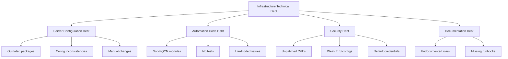

# How to Use Ansible for Technical Debt Reduction

Author: [nawazdhandala](https://www.github.com/nawazdhandala)

Tags: Ansible, Technical Debt, Refactoring, Infrastructure

Description: Learn how to use Ansible to identify, prioritize, and systematically reduce technical debt in your infrastructure automation and server configurations.

---

Technical debt in infrastructure is the gap between how your servers are configured and how they should be. It accumulates through manual changes, skipped upgrades, quick fixes that became permanent, and automation that nobody refactored. Ansible can both identify and fix this debt systematically.

## Types of Infrastructure Technical Debt

Infrastructure debt comes in several forms: outdated packages, inconsistent configurations across servers that should be identical, deprecated OS versions, manual changes that were never codified, and Ansible code itself that has grown messy over time.



## Detecting Server Configuration Debt

Build an assessment playbook that checks for common debt indicators:

```yaml
# playbooks/assess-technical-debt.yml
# Scan infrastructure for technical debt indicators
- name: Assess technical debt
  hosts: all
  become: yes
  gather_facts: yes

  tasks:
    - name: Check OS version
      ansible.builtin.set_fact:
        os_debt: >-
          {{ ansible_distribution_version is version('20.04', '<')
             if ansible_distribution == 'Ubuntu' else false }}

    - name: Check kernel version
      ansible.builtin.command: uname -r
      register: kernel_version
      changed_when: false

    - name: Count packages with available updates
      ansible.builtin.command: apt list --upgradable
      register: upgradable_packages
      changed_when: false

    - name: Check for known vulnerable packages
      ansible.builtin.command: apt list --installed
      register: installed_packages
      changed_when: false

    - name: Check SSH configuration for weak settings
      ansible.builtin.command: sshd -T
      register: sshd_config
      changed_when: false

    - name: Check for weak SSH settings
      ansible.builtin.set_fact:
        ssh_debt_items: []

    - name: Flag weak SSH ciphers
      ansible.builtin.set_fact:
        ssh_debt_items: "{{ ssh_debt_items + ['Weak SSH ciphers detected'] }}"
      when: "'3des' in sshd_config.stdout or 'arcfour' in sshd_config.stdout"

    - name: Check TLS configuration
      ansible.builtin.command: openssl s_client -connect localhost:443 -tls1_1 < /dev/null
      register: tls11_check
      changed_when: false
      failed_when: false

    - name: Flag TLS 1.1 support as debt
      ansible.builtin.set_fact:
        tls_debt: "{{ tls11_check.rc == 0 }}"

    - name: Check for manual configuration changes
      ansible.builtin.command: "find /etc -newer /var/log/ansible-last-run -name '*.conf' -type f"
      register: manual_changes
      changed_when: false

    - name: Compile debt report
      ansible.builtin.set_fact:
        debt_report:
          hostname: "{{ inventory_hostname }}"
          os_version: "{{ ansible_distribution }} {{ ansible_distribution_version }}"
          os_needs_upgrade: "{{ os_debt }}"
          pending_updates: "{{ (upgradable_packages.stdout_lines | length) - 1 }}"
          ssh_issues: "{{ ssh_debt_items }}"
          tls_11_enabled: "{{ tls_debt | default(false) }}"
          manual_changes: "{{ manual_changes.stdout_lines | length }}"
          kernel: "{{ kernel_version.stdout }}"

    - name: Display debt report
      ansible.builtin.debug:
        var: debt_report
```

## Fixing Package Debt

Create a role that standardizes package versions:

```yaml
# roles/package_standardization/tasks/main.yml
# Bring all servers to standard package versions

- name: Remove deprecated packages
  ansible.builtin.apt:
    name: "{{ deprecated_packages }}"
    state: absent
    purge: yes

- name: Install standardized package versions
  ansible.builtin.apt:
    name: "{{ item.name }}={{ item.version }}"
    state: present
  loop: "{{ standardized_packages }}"
  when: item.version is defined

- name: Apply security updates
  ansible.builtin.apt:
    upgrade: safe
    update_cache: yes

- name: Remove unused dependencies
  ansible.builtin.apt:
    autoremove: yes
```

```yaml
# group_vars/all.yml
deprecated_packages:
  - python2
  - python-pip
  - telnet
  - rsh-client

standardized_packages:
  - name: python3
    version: "3.10*"
  - name: openssl
    version: "3.0*"
  - name: openssh-server
    version: "1:8.9*"
```

## Refactoring Ansible Code Debt

Audit your Ansible code for debt indicators:

```bash
# Check for non-FQCN module usage
ansible-lint roles/ playbooks/ 2>&1 | grep "fqcn\[action" | wc -l

# Check for missing task names
ansible-lint roles/ playbooks/ 2>&1 | grep "name\[missing\]" | wc -l

# Check for unprefixed variables
ansible-lint roles/ playbooks/ 2>&1 | grep "var-naming" | wc -l

# Count shell/command usage (potential for module replacement)
grep -r "ansible.builtin.shell\|ansible.builtin.command" roles/ | wc -l
```

Create a migration playbook for code modernization:

```yaml
# scripts/modernize-ansible-code.yml
# Checklist for modernizing Ansible code debt
#
# Phase 1: FQCN Migration
# - Replace all short module names with FQCNs
# - Use ansible-lint fqcn rules to find violations
#
# Phase 2: Variable Standardization
# - Prefix all role variables with role name
# - Move hardcoded values to defaults/main.yml
# - Separate secrets into vault files
#
# Phase 3: Testing
# - Add Molecule tests to every role
# - Set up CI pipeline for automated testing
#
# Phase 4: Documentation
# - Add README.md to every role
# - Document all variables with types and descriptions
```

## Systematic Debt Reduction Plan

```yaml
# technical-debt-tracker.yml
# Track and prioritize technical debt items

debt_items:
  - id: TD-001
    title: "Upgrade Ubuntu 18.04 servers to 22.04"
    priority: critical
    affected_hosts: 45
    effort: large
    risk: medium
    playbook: playbooks/os-upgrade.yml
    status: in_progress
    assigned_to: platform-team

  - id: TD-002
    title: "Replace shell tasks with proper modules"
    priority: high
    affected_roles: 12
    effort: medium
    risk: low
    status: planned
    assigned_to: all-teams

  - id: TD-003
    title: "Standardize TLS to 1.2+ only"
    priority: high
    affected_hosts: 120
    effort: small
    risk: medium
    playbook: playbooks/tls-standardization.yml
    status: planned

  - id: TD-004
    title: "Add Molecule tests to all roles"
    priority: medium
    affected_roles: 35
    effort: large
    risk: none
    status: planned
```

## OS Upgrade Automation

One of the biggest debt items is outdated operating systems:

```yaml
# playbooks/os-upgrade-prep.yml
# Prepare servers for OS upgrade
- name: Pre-upgrade preparation
  hosts: "{{ upgrade_hosts }}"
  become: yes
  serial: 1

  tasks:
    - name: Create full system backup
      ansible.builtin.include_role:
        name: backup
      vars:
        backup_label: "pre-os-upgrade"

    - name: Record current package list
      ansible.builtin.command: dpkg --get-selections
      register: current_packages
      changed_when: false

    - name: Save package list
      ansible.builtin.copy:
        content: "{{ current_packages.stdout }}"
        dest: /root/pre-upgrade-packages.txt
        mode: '0644'

    - name: Record current service states
      ansible.builtin.service_facts:

    - name: Save running services list
      ansible.builtin.copy:
        content: "{{ services | to_nice_json }}"
        dest: /root/pre-upgrade-services.json
        mode: '0644'

    - name: Run upgrade readiness check
      ansible.builtin.command: do-release-upgrade --check-dist-upgrade-only
      register: upgrade_check
      changed_when: false
      failed_when: false

    - name: Report readiness
      ansible.builtin.debug:
        msg: |
          Host: {{ inventory_hostname }}
          Current OS: {{ ansible_distribution }} {{ ansible_distribution_version }}
          Upgrade ready: {{ 'yes' if upgrade_check.rc == 0 else 'no' }}
```

## Measuring Debt Reduction Progress

Track progress over time:

```yaml
# playbooks/debt-metrics.yml
# Collect technical debt metrics for trending
- name: Collect debt metrics
  hosts: all
  become: yes
  gather_facts: yes

  tasks:
    - name: Count outdated OS instances
      ansible.builtin.set_fact:
        outdated_os: "{{ ansible_distribution_version is version('22.04', '<') }}"

    - name: Count pending security updates
      ansible.builtin.command: apt list --upgradable 2>/dev/null
      register: updates
      changed_when: false

    - name: Write metrics
      ansible.builtin.copy:
        content: |
          {
            "date": "{{ ansible_date_time.date }}",
            "host": "{{ inventory_hostname }}",
            "outdated_os": {{ outdated_os | lower }},
            "pending_updates": {{ (updates.stdout_lines | length) - 1 }},
            "os_version": "{{ ansible_distribution_version }}"
          }
        dest: "/tmp/debt-metrics-{{ inventory_hostname }}.json"
      delegate_to: localhost
```

## Summary

Technical debt reduction with Ansible is a systematic process. First, build assessment playbooks that scan your fleet for debt indicators: outdated packages, manual changes, weak security configurations, and inconsistent setups. Second, prioritize debt items by impact and effort. Third, create targeted playbooks that fix each category of debt. Fourth, modernize your Ansible code itself by migrating to FQCNs, adding tests, and standardizing variables. Fifth, track metrics over time to demonstrate progress. The key is treating debt reduction as ongoing work, not a one-time project.
