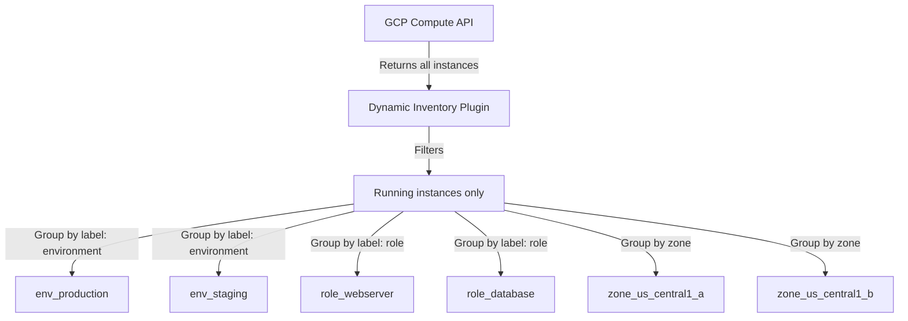

# How to Use Ansible GCP Dynamic Inventory

Author: [nawazdhandala](https://www.github.com/nawazdhandala)

Tags: Ansible, GCP, Dynamic Inventory, Automation, DevOps

Description: Complete guide to setting up and using Ansible dynamic inventory for GCP to automatically discover and manage Compute Engine instances.

---

Static inventory files work fine when you have a handful of servers that rarely change. But in cloud environments, instances come and go constantly. Autoscaling groups add and remove VMs based on load. Deployments spin up new instances and tear down old ones. Maintaining a static inventory file in this kind of environment is a losing battle. That is exactly the problem Ansible's dynamic inventory solves.

## What is Dynamic Inventory?

Instead of listing hosts in a static file, dynamic inventory queries an external source (in this case, the GCP Compute Engine API) to discover hosts at runtime. Every time you run a playbook, Ansible asks GCP "what instances do you have?" and builds the inventory from the response.

This means:

- No inventory file to maintain
- New instances are automatically discovered
- Terminated instances are automatically removed
- You can group hosts by labels, zones, machine types, and more

## Prerequisites

- Ansible 2.10+ with the `google.cloud` collection
- A GCP service account with `compute.instances.list` permission
- Python `google-auth` library installed

```bash
# Install the GCP Ansible collection
ansible-galaxy collection install google.cloud

# Install the required Python library
pip install google-auth requests
```

## Setting Up the Inventory Plugin

The GCP dynamic inventory uses a plugin configuration file. This file must end in `.gcp.yml` or `.gcp.yaml` for Ansible to recognize it as a GCP inventory source.

```yaml
# inventory.gcp.yml - GCP dynamic inventory configuration
---
plugin: google.cloud.gcp_compute

# Authentication settings
auth_kind: serviceaccount
service_account_file: /path/to/service-account-key.json

# Which projects to scan for instances
projects:
  - my-project-id

# Which regions/zones to scan (leave empty for all)
zones:
  - us-central1-a
  - us-central1-b
  - us-central1-c
  - us-east1-b

# Only include running instances
filters:
  - status = RUNNING

# Group instances by labels, zones, and machine types
keyed_groups:
  # Group by the 'environment' label
  - key: labels.environment
    prefix: env
    separator: "_"
  # Group by the 'role' label
  - key: labels.role
    prefix: role
    separator: "_"
  # Group by zone
  - key: zone
    prefix: zone
    separator: "_"
  # Group by machine type
  - key: machineType
    prefix: type
    separator: "_"

# Compose variables for each host
compose:
  # Use the private IP for SSH connections
  ansible_host: networkInterfaces[0].networkIP
  # Or use the public IP if instances have one
  # ansible_host: networkInterfaces[0].accessConfigs[0].natIP

# Host variables to set
hostvar_expressions:
  # Make instance metadata available as host vars
  gcp_zone: zone
  gcp_machine_type: machineType
  gcp_status: status
  gcp_project: project
```

## Testing the Dynamic Inventory

Before using it in playbooks, verify that the inventory plugin discovers your instances correctly.

```bash
# List all discovered hosts
ansible-inventory -i inventory.gcp.yml --list

# Show a graph of groups and hosts
ansible-inventory -i inventory.gcp.yml --graph

# Ping all discovered hosts to verify connectivity
ansible -i inventory.gcp.yml all -m ping
```

The `--graph` output will look something like this:

```
@all:
  |--@env_production:
  |  |--web-server-1
  |  |--web-server-2
  |  |--db-server-1
  |--@env_staging:
  |  |--staging-web-1
  |--@role_webserver:
  |  |--web-server-1
  |  |--web-server-2
  |  |--staging-web-1
  |--@role_database:
  |  |--db-server-1
  |--@zone_us_central1_a:
  |  |--web-server-1
  |  |--db-server-1
  |--@zone_us_central1_b:
  |  |--web-server-2
  |  |--staging-web-1
```

## How Grouping Works



## Using Dynamic Inventory in Playbooks

Once your inventory file is set up, you just reference it with `-i` when running playbooks.

```yaml
# deploy-app.yml - Deploy to all web servers discovered dynamically
---
- name: Deploy Application to Web Servers
  hosts: role_webserver
  become: true

  tasks:
    - name: Show which host we are on
      ansible.builtin.debug:
        msg: "Deploying to {{ inventory_hostname }} in zone {{ gcp_zone }}"

    - name: Pull latest application code
      ansible.builtin.git:
        repo: "https://github.com/myorg/myapp.git"
        dest: /opt/myapp
        version: main

    - name: Restart the application service
      ansible.builtin.systemd:
        name: myapp
        state: restarted
```

Run it with:

```bash
# Deploy to all dynamically discovered web servers
ansible-playbook -i inventory.gcp.yml deploy-app.yml
```

## Filtering by Multiple Criteria

You can target specific subsets of your infrastructure by combining groups.

```yaml
# update-prod-databases.yml - Target production database servers only
---
- name: Update Production Database Servers
  # Use the intersection of env_production and role_database
  hosts: env_production:&role_database
  become: true

  tasks:
    - name: Update system packages
      ansible.builtin.apt:
        upgrade: safe
        update_cache: true

    - name: Show update results
      ansible.builtin.debug:
        msg: "Updated packages on {{ inventory_hostname }}"
```

```bash
# Target only production databases
ansible-playbook -i inventory.gcp.yml update-prod-databases.yml

# Or use the command line to limit further
ansible-playbook -i inventory.gcp.yml deploy-app.yml --limit "zone_us_central1_a"
```

## Advanced Filtering with Instance Filters

The `filters` parameter in the inventory file accepts GCP API filter expressions. These reduce the API response before Ansible processes it.

```yaml
# filtered-inventory.gcp.yml - Inventory with advanced filters
---
plugin: google.cloud.gcp_compute

auth_kind: serviceaccount
service_account_file: /path/to/service-account-key.json

projects:
  - my-project-id

# Multiple filters (all must match)
filters:
  # Only running instances
  - status = RUNNING
  # Only instances with the 'managed-by-ansible' label
  - labels.managed_by = ansible
  # Only specific machine type families
  - machineType ~ e2-.*

keyed_groups:
  - key: labels.environment
    prefix: env
  - key: labels.role
    prefix: role
  - key: labels.team
    prefix: team

compose:
  ansible_host: networkInterfaces[0].networkIP
  ansible_user: ubuntu
  ansible_ssh_private_key_file: ~/.ssh/gcp_key
```

## Connecting Through a Bastion Host

In a secure setup, your VMs will only have private IPs. You need to go through a bastion (jump) host to reach them.

```yaml
# bastion-inventory.gcp.yml - Dynamic inventory with bastion host config
---
plugin: google.cloud.gcp_compute

auth_kind: serviceaccount
service_account_file: /path/to/service-account-key.json

projects:
  - my-project-id

filters:
  - status = RUNNING

keyed_groups:
  - key: labels.role
    prefix: role

compose:
  ansible_host: networkInterfaces[0].networkIP
  ansible_user: ubuntu
  # Configure SSH to jump through the bastion
  ansible_ssh_common_args: '-o ProxyJump=bastion-user@bastion.example.com'
```

Alternatively, configure this in your `ansible.cfg`:

```ini
# ansible.cfg - SSH configuration for bastion access
[ssh_connection]
ssh_args = -o ProxyJump=ubuntu@35.202.100.50
```

## Using Multiple Inventory Sources

You can combine dynamic and static inventories. This is useful when you have some hosts that are not in GCP.

```bash
# Use both a static file and the GCP dynamic inventory
ansible-playbook -i static-hosts.ini -i inventory.gcp.yml site.yml
```

Or configure it in `ansible.cfg`:

```ini
# ansible.cfg - Use an inventory directory
[defaults]
inventory = ./inventory/
```

Then put your files in the `inventory/` directory:

```
inventory/
  01-static-hosts.ini
  02-gcp.gcp.yml
```

Ansible will process them in order and merge the results.

## Caching for Performance

Querying the GCP API every time you run a playbook adds latency. You can enable inventory caching to speed things up.

```yaml
# cached-inventory.gcp.yml - Enable caching for faster runs
---
plugin: google.cloud.gcp_compute

auth_kind: serviceaccount
service_account_file: /path/to/service-account-key.json

projects:
  - my-project-id

filters:
  - status = RUNNING

keyed_groups:
  - key: labels.role
    prefix: role

compose:
  ansible_host: networkInterfaces[0].networkIP

# Cache settings
cache: true
cache_plugin: jsonfile
cache_connection: /tmp/ansible-gcp-cache
cache_timeout: 300
```

With this configuration, the inventory will be fetched from GCP once and cached for 5 minutes. Subsequent runs within that window will use the cached data.

## Tips from Experience

1. **Label everything.** The power of dynamic inventory comes from grouping by labels. If your instances do not have labels, you just get a flat list of hostnames.

2. **Use `compose` for connection settings.** Setting `ansible_host`, `ansible_user`, and SSH key paths in the inventory file keeps your playbooks clean.

3. **Start with `--list` debugging.** Before running any playbooks, always verify the inventory output with `ansible-inventory --list`. This catches authentication issues and filter problems early.

4. **Enable caching for large inventories.** If you have hundreds of instances, the API call can take several seconds. Caching makes subsequent runs much faster.

5. **Keep filter expressions simple.** Complex filters are hard to debug. Use simple API-level filters and let Ansible's host patterns handle the rest.

## Conclusion

Dynamic inventory transforms how you work with Ansible in cloud environments. Instead of fighting to keep a static inventory file in sync with your ever-changing infrastructure, you let Ansible discover what is there and group it automatically. Combined with a good labeling strategy on your GCP instances, dynamic inventory makes it trivial to target specific subsets of your infrastructure with the right playbooks.
