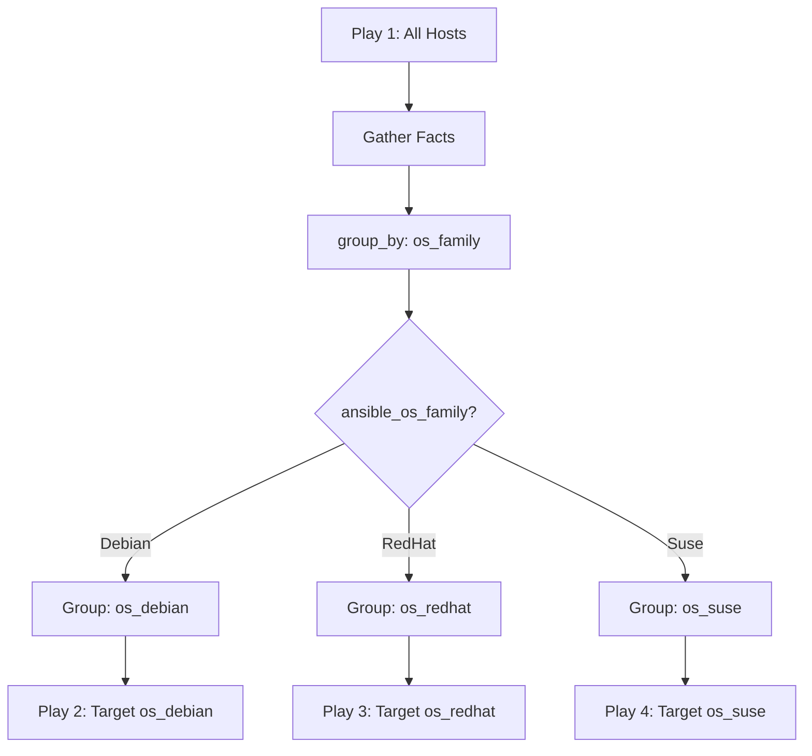

# How to Use Ansible group_by to Create Dynamic Groups from Facts

Author: [nawazdhandala](https://www.github.com/nawazdhandala)

Tags: Ansible, Dynamic Inventory, group_by, Configuration Management

Description: Learn how to use the Ansible group_by module to create dynamic host groups based on gathered facts during playbook execution.

---

Static inventory files work fine when your infrastructure is predictable and rarely changes. But the moment you need to apply different configurations based on OS type, kernel version, or available memory, static groups become a maintenance headache. This is where the `group_by` module comes in. It lets you create host groups on the fly during playbook execution, using any fact or variable available at runtime.

## What Does group_by Actually Do?

The `group_by` module creates new groups during play execution. These groups persist for the rest of the playbook run and can be referenced in subsequent plays. The grouping key is typically built from gathered facts, but you can use any variable.

Here is a simple example that groups hosts by their operating system family:

```yaml
# playbook.yml - Group hosts by OS family at runtime
---
- name: Gather facts and create dynamic groups
  hosts: all
  tasks:
    - name: Group hosts by OS family
      ansible.builtin.group_by:
        key: "os_{{ ansible_os_family | lower }}"
```

After this task runs, if you have a mix of Debian and RedHat hosts, Ansible creates two groups: `os_debian` and `os_redhat`. You can then target those groups in later plays.

## Targeting Dynamic Groups in Subsequent Plays

The real power shows up when you write follow-up plays that target these dynamic groups. Each play can apply OS-specific configuration without littering your tasks with `when` conditionals.

```yaml
# full-playbook.yml - Dynamic grouping with targeted plays
---
- name: Create dynamic groups from facts
  hosts: all
  gather_facts: true
  tasks:
    - name: Group by OS family
      ansible.builtin.group_by:
        key: "os_{{ ansible_os_family | lower }}"

- name: Configure Debian-based hosts
  hosts: os_debian
  tasks:
    - name: Install packages with apt
      ansible.builtin.apt:
        name:
          - htop
          - curl
          - jq
        state: present
        update_cache: true

- name: Configure RedHat-based hosts
  hosts: os_redhat
  tasks:
    - name: Install packages with dnf
      ansible.builtin.dnf:
        name:
          - htop
          - curl
          - jq
        state: present
```

This approach is cleaner than adding `when: ansible_os_family == "Debian"` to every single task. The play-level separation makes it obvious what runs where.

## Grouping by Custom Facts

You are not limited to built-in facts. You can group by anything you can compute. For example, suppose you want to group hosts by how much memory they have, splitting them into "small" and "large" categories.

```yaml
# memory-grouping.yml - Group hosts by available memory
---
- name: Group hosts by memory size
  hosts: all
  gather_facts: true
  tasks:
    - name: Set memory category fact
      ansible.builtin.set_fact:
        memory_category: "{{ 'large' if ansible_memtotal_mb > 4096 else 'small' }}"

    - name: Group by memory category
      ansible.builtin.group_by:
        key: "memory_{{ memory_category }}"

- name: Configure large memory hosts
  hosts: memory_large
  tasks:
    - name: Set higher connection pool limits
      ansible.builtin.template:
        src: templates/db-pool-large.conf.j2
        dest: /etc/app/db-pool.conf
        mode: '0644'

- name: Configure small memory hosts
  hosts: memory_small
  tasks:
    - name: Set conservative connection pool limits
      ansible.builtin.template:
        src: templates/db-pool-small.conf.j2
        dest: /etc/app/db-pool.conf
        mode: '0644'
```

## Grouping by Kernel Version

This pattern is especially useful when you need to apply kernel-specific workarounds or configurations.

```yaml
# kernel-grouping.yml - Group by major kernel version
---
- name: Create kernel version groups
  hosts: all
  gather_facts: true
  tasks:
    - name: Group by kernel major version
      ansible.builtin.group_by:
        key: "kernel_{{ ansible_kernel.split('.')[0] }}_{{ ansible_kernel.split('.')[1] }}"

- name: Apply settings for kernel 5.x hosts
  hosts: kernel_5_15
  tasks:
    - name: Load specific kernel module
      community.general.modprobe:
        name: br_netfilter
        state: present
```

## Combining Multiple Grouping Criteria

You can run `group_by` multiple times to create overlapping groups. A host can belong to several dynamic groups at once, which is exactly what you want for multi-dimensional configuration.

```yaml
# multi-group.yml - Multiple grouping dimensions
---
- name: Create multiple dynamic group dimensions
  hosts: all
  gather_facts: true
  tasks:
    - name: Group by OS family
      ansible.builtin.group_by:
        key: "os_{{ ansible_os_family | lower }}"

    - name: Group by virtualization type
      ansible.builtin.group_by:
        key: "virt_{{ ansible_virtualization_type | default('physical') }}"

    - name: Group by datacenter (from custom variable)
      ansible.builtin.group_by:
        key: "dc_{{ datacenter | default('unknown') }}"
```

After these tasks execute, a host might belong to `os_debian`, `virt_kvm`, and `dc_us_east`. Later plays can target any combination.

## Using group_by with Inventory Variables

The grouping key does not have to come from gathered facts. You can use any host variable or group variable. This is handy when you have metadata in your inventory that you want to pivot on.

```yaml
# inventory/hosts.yml
all:
  hosts:
    web1:
      app_tier: frontend
      app_env: production
    web2:
      app_tier: frontend
      app_env: staging
    db1:
      app_tier: backend
      app_env: production
    db2:
      app_tier: backend
      app_env: staging
```

```yaml
# regroup.yml - Regroup based on inventory variables
---
- name: Create environment-based groups
  hosts: all
  gather_facts: false
  tasks:
    - name: Group by application tier
      ansible.builtin.group_by:
        key: "tier_{{ app_tier }}"

    - name: Group by environment
      ansible.builtin.group_by:
        key: "env_{{ app_env }}"

- name: Deploy to production frontend only
  hosts: tier_frontend:&env_production
  tasks:
    - name: Deploy latest release
      ansible.builtin.debug:
        msg: "Deploying to {{ inventory_hostname }}"
```

Notice the `tier_frontend:&env_production` pattern. The `&` operator gives you the intersection of two groups, so only hosts that are both frontend and production get targeted.

## How the Flow Works

Here is a diagram showing how `group_by` creates groups during execution:



## Common Pitfalls

One thing that catches people off guard: `group_by` only affects the current playbook run. It does not modify your inventory file. If you run a second playbook, those dynamic groups will not exist unless you create them again.

Another gotcha is fact gathering. If you set `gather_facts: false` in the play where you use `group_by`, facts like `ansible_os_family` will not be available. Make sure facts are gathered before you reference them in the grouping key.

Also, watch out for special characters in your grouping key. The key becomes a group name, and group names should stick to alphanumeric characters and underscores. Use Jinja filters like `| lower` or `| replace('-', '_')` to sanitize values.

```yaml
# Sanitize the grouping key to avoid invalid group names
- name: Group by distribution with sanitized name
  ansible.builtin.group_by:
    key: "distro_{{ ansible_distribution | lower | replace(' ', '_') }}"
```

## When to Use group_by vs Static Groups

Use static groups when the grouping criteria is known ahead of time and does not change, like grouping by datacenter or by team ownership. Use `group_by` when the grouping depends on runtime information, like OS version, installed software, or hardware characteristics.

The `group_by` module is one of those features that you might not reach for every day, but when you need it, nothing else does the job as cleanly. It keeps your playbooks readable by moving conditional logic out of individual tasks and into play-level targeting. If you find yourself writing the same `when` clause on dozens of tasks, that is a strong signal that `group_by` would simplify your automation.
