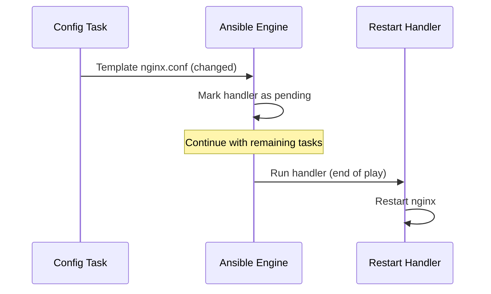

# How to Use Ansible Handlers to Restart Services on Config Change

Author: [nawazdhandala](https://www.github.com/nawazdhandala)

Tags: Ansible, Handlers, Service Management, Configuration Management

Description: Learn how to use Ansible handlers to automatically restart or reload services only when configuration files change, avoiding unnecessary downtime.

---

One of the most common patterns in configuration management is: update a config file, then restart the service so it picks up the changes. But you do not want to restart a service if the config did not actually change, because restarts cause downtime and disrupt active connections. Ansible handlers solve this problem elegantly. They only run when they are notified by a task that actually made a change.

## How Handlers Work

A handler is a special task that sits in a `handlers` section and only runs when another task notifies it. If a task reports `changed`, the handler runs. If the task reports `ok` (no change needed), the handler is skipped. Handlers run at the end of the play, after all regular tasks are complete.



## Basic Handler Pattern

The simplest and most common use of handlers:

```yaml
---
- name: Configure Nginx
  hosts: web_servers
  become: yes
  tasks:
    - name: Deploy Nginx configuration
      ansible.builtin.template:
        src: nginx.conf.j2
        dest: /etc/nginx/nginx.conf
        owner: root
        group: root
        mode: '0644'
        validate: nginx -t -c %s
      notify: Restart Nginx

    - name: Deploy site configuration
      ansible.builtin.template:
        src: mysite.conf.j2
        dest: /etc/nginx/sites-available/mysite.conf
        owner: root
        group: root
        mode: '0644'
      notify: Reload Nginx

  handlers:
    - name: Restart Nginx
      ansible.builtin.systemd:
        name: nginx
        state: restarted

    - name: Reload Nginx
      ansible.builtin.systemd:
        name: nginx
        state: reloaded
```

Notice I used `Reload` for the site config and `Restart` for the main config. Nginx can pick up new site configs with just a reload, which is graceful and does not drop connections. But changes to the main nginx.conf (like worker_processes or error_log path) need a full restart.

## Multiple Tasks Notifying the Same Handler

A handler only runs once per play, even if multiple tasks notify it.

Multiple config files triggering a single restart:

```yaml
tasks:
  - name: Deploy main Syslog config
    ansible.builtin.template:
      src: rsyslog.conf.j2
      dest: /etc/rsyslog.conf
    notify: Restart rsyslog

  - name: Deploy custom log rules
    ansible.builtin.template:
      src: 50-custom.conf.j2
      dest: /etc/rsyslog.d/50-custom.conf
    notify: Restart rsyslog

  - name: Deploy log rotation config
    ansible.builtin.template:
      src: 60-rotation.conf.j2
      dest: /etc/rsyslog.d/60-rotation.conf
    notify: Restart rsyslog

handlers:
  - name: Restart rsyslog
    ansible.builtin.systemd:
      name: rsyslog
      state: restarted
```

If all three config files change, rsyslog is still only restarted once at the end. This is much better than restarting after each file.

## Handler Execution Order

Handlers run in the order they are defined in the `handlers` section, not in the order they are notified. This lets you control the sequence.

Control handler execution order by definition order:

```yaml
handlers:
  # This runs first because it is defined first
  - name: Reload systemd daemon
    ansible.builtin.systemd:
      daemon_reload: yes

  # This runs second
  - name: Restart application
    ansible.builtin.systemd:
      name: myapp
      state: restarted

  # This runs third
  - name: Verify application health
    ansible.builtin.uri:
      url: http://localhost:8080/health
      timeout: 30
    register: health
    retries: 5
    delay: 5
    until: health.status == 200
```

## Flushing Handlers Early

By default, handlers run at the end of the play. But sometimes you need the restart to happen before subsequent tasks. Use `meta: flush_handlers` for this.

Flush handlers to force immediate execution:

```yaml
tasks:
  - name: Update database configuration
    ansible.builtin.template:
      src: postgresql.conf.j2
      dest: /etc/postgresql/15/main/postgresql.conf
    notify: Restart PostgreSQL

  - name: Force handler to run now
    ansible.builtin.meta: flush_handlers

  - name: Run database migrations (needs PostgreSQL running with new config)
    ansible.builtin.command: /opt/myapp/bin/migrate
    args:
      chdir: /opt/myapp
```

Without the `flush_handlers`, the migration would run before PostgreSQL restarts, which means it would connect to the database with the old configuration.

## Notifying Multiple Handlers

A single task can notify multiple handlers.

One task triggering multiple handler actions:

```yaml
tasks:
  - name: Update SSL certificate
    ansible.builtin.copy:
      src: "{{ ssl_cert_file }}"
      dest: /etc/ssl/certs/myapp.crt
      mode: '0644'
    notify:
      - Restart Nginx
      - Restart application
      - Send deployment notification

handlers:
  - name: Restart Nginx
    ansible.builtin.systemd:
      name: nginx
      state: restarted

  - name: Restart application
    ansible.builtin.systemd:
      name: myapp
      state: restarted

  - name: Send deployment notification
    ansible.builtin.uri:
      url: "{{ slack_webhook }}"
      method: POST
      body_format: json
      body:
        text: "SSL cert updated on {{ inventory_hostname }}"
    delegate_to: localhost
```

## Listen Directive for Handler Groups

The `listen` directive lets multiple handlers respond to a single notification topic, which is useful for complex restart sequences.

Group handlers under a single listen topic:

```yaml
tasks:
  - name: Update application config
    ansible.builtin.template:
      src: app-config.yaml.j2
      dest: /etc/myapp/config.yaml
    notify: "app config changed"

handlers:
  - name: Stop the application gracefully
    ansible.builtin.command: /opt/myapp/bin/myapp --shutdown-graceful
    listen: "app config changed"

  - name: Clear application cache
    ansible.builtin.file:
      path: /var/cache/myapp
      state: absent
    listen: "app config changed"

  - name: Start the application
    ansible.builtin.systemd:
      name: myapp
      state: started
    listen: "app config changed"
```

All three handlers run (in order) when any task notifies `"app config changed"`.

## Handlers in Roles

Roles can define their own handlers in `handlers/main.yml`. Tasks in the role's `tasks/main.yml` can notify these handlers by name.

Role handler file:

```yaml
# roles/nginx/handlers/main.yml
---
- name: Restart Nginx
  ansible.builtin.systemd:
    name: nginx
    state: restarted

- name: Reload Nginx
  ansible.builtin.systemd:
    name: nginx
    state: reloaded

- name: Test Nginx config
  ansible.builtin.command: nginx -t
  listen: "validate nginx"
```

Role task file using the handlers:

```yaml
# roles/nginx/tasks/main.yml
---
- name: Deploy main config
  ansible.builtin.template:
    src: nginx.conf.j2
    dest: /etc/nginx/nginx.conf
  notify: Restart Nginx

- name: Deploy virtual hosts
  ansible.builtin.template:
    src: "{{ item }}.conf.j2"
    dest: "/etc/nginx/sites-available/{{ item }}.conf"
  loop: "{{ nginx_virtual_hosts }}"
  notify: Reload Nginx
```

## Conditional Handlers

Handlers support `when` conditions, just like regular tasks.

Only restart if a certain condition is met:

```yaml
handlers:
  - name: Restart application
    ansible.builtin.systemd:
      name: myapp
      state: restarted
    when: not rolling_update | default(false)

  - name: Graceful reload application
    ansible.builtin.command: /opt/myapp/bin/myapp --reload
    when: rolling_update | default(false)
```

## Handling Handler Failures

If a handler fails, subsequent handlers will not run. You can use `ignore_errors` on a handler if its failure should not block the rest.

Handle potential handler failures:

```yaml
handlers:
  - name: Restart application
    ansible.builtin.systemd:
      name: myapp
      state: restarted
    register: restart_result
    ignore_errors: yes

  - name: Check if restart succeeded
    ansible.builtin.debug:
      msg: "Restart failed, attempting recovery"
    when: restart_result is defined and restart_result is failed

  - name: Emergency recovery
    ansible.builtin.command: /opt/myapp/bin/recover.sh
    when: restart_result is defined and restart_result is failed
```

## Real-World Pattern: Rolling Service Restart

For critical services, you want to restart one host at a time and verify health before moving on.

Rolling restart with health verification:

```yaml
---
- name: Rolling config update
  hosts: web_servers
  become: yes
  serial: 1  # One host at a time

  tasks:
    - name: Remove from load balancer
      ansible.builtin.uri:
        url: "http://{{ lb_host }}/api/backends/{{ inventory_hostname }}/disable"
        method: POST
      delegate_to: localhost

    - name: Update configuration
      ansible.builtin.template:
        src: app.conf.j2
        dest: /etc/myapp/app.conf
      notify: Restart and verify

    - name: Flush handlers
      ansible.builtin.meta: flush_handlers

    - name: Re-add to load balancer
      ansible.builtin.uri:
        url: "http://{{ lb_host }}/api/backends/{{ inventory_hostname }}/enable"
        method: POST
      delegate_to: localhost

  handlers:
    - name: Restart and verify
      block:
        - name: Restart the service
          ansible.builtin.systemd:
            name: myapp
            state: restarted

        - name: Wait for service to be healthy
          ansible.builtin.uri:
            url: http://localhost:8080/health
          register: health
          retries: 10
          delay: 3
          until: health.status == 200
      listen: "Restart and verify"
```

## Summary

Handlers are the right tool for "restart on config change" workflows in Ansible. They eliminate unnecessary restarts, run at the right time, and only execute once per play regardless of how many tasks notify them. The key patterns to remember are: use `notify` on template and copy tasks, use `flush_handlers` when ordering matters, use `listen` for complex multi-step restart sequences, and use `serial` for rolling restarts in production. These patterns together give you safe, efficient configuration management that minimizes downtime.
