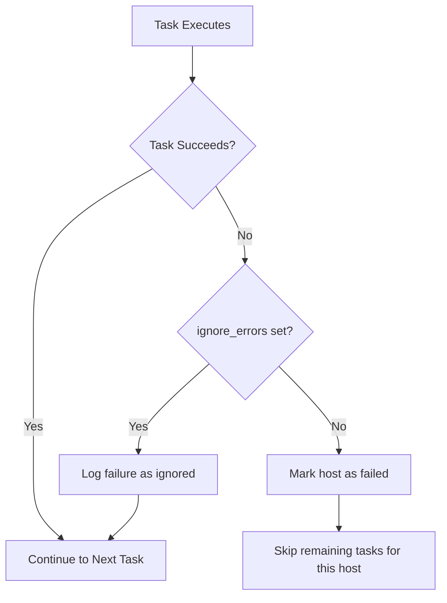

# How to Use Ansible ignore_errors to Continue on Failure

Author: [nawazdhandala](https://www.github.com/nawazdhandala)

Tags: Ansible, Error Handling, DevOps, Playbooks

Description: Learn how to use ignore_errors in Ansible to handle task failures gracefully and continue playbook execution when expected errors occur.

---

In a perfect world, every task in your Ansible playbook would succeed every time. In reality, tasks fail for all kinds of reasons, and sometimes that failure is expected or acceptable. The `ignore_errors` directive tells Ansible to continue executing the playbook even when a task fails. This guide covers how to use it properly and, more importantly, when you should and should not use it.

## The Basics of ignore_errors

When a task fails without `ignore_errors`, Ansible stops executing tasks on that host. The host is marked as failed, and no further tasks run on it. With `ignore_errors: yes`, Ansible logs the failure but keeps going.

Here is a simple example:

```yaml
# check-services.yml - Check multiple services, even if some are not installed
---
- name: Check service statuses
  hosts: all

  tasks:
    - name: Check if nginx is running
      command: systemctl status nginx
      register: nginx_status
      ignore_errors: yes

    - name: Check if apache is running
      command: systemctl status apache2
      register: apache_status
      ignore_errors: yes

    - name: Report which web server is active
      debug:
        msg: >
          nginx: {{ 'running' if nginx_status.rc == 0 else 'not running' }},
          apache: {{ 'running' if apache_status.rc == 0 else 'not running' }}
```

Without `ignore_errors`, if nginx is not installed on a host, Ansible would stop at the first task and never check apache or produce the report.

## How ignore_errors Works Internally

When a task fails and `ignore_errors: yes` is set, Ansible does the following:

1. Records the task result (including the failure)
2. Marks the task as "ignored" rather than "failed"
3. Continues to the next task
4. The host remains in the "ok" state, not the "failed" state
5. The `register` variable still captures the full failure details



## Using ignore_errors with register

The most powerful pattern is combining `ignore_errors` with `register` to make decisions based on whether the task succeeded or failed:

```yaml
# conditional-install.yml - Install based on what is available
---
- name: Setup monitoring agent
  hosts: all
  become: yes

  tasks:
    - name: Check if the custom repo is reachable
      uri:
        url: https://packages.internal.example.com/status
        timeout: 10
      register: repo_check
      ignore_errors: yes

    - name: Install from internal repo if available
      apt:
        deb: https://packages.internal.example.com/monitoring-agent.deb
      when: repo_check is succeeded

    - name: Fall back to public repo
      apt:
        name: monitoring-agent
        state: present
      when: repo_check is failed
```

## ignore_errors: yes vs ignore_unreachable: yes

These are different directives for different situations:

```yaml
# difference-demo.yml - Showing both ignore directives
---
- name: Demonstrate ignore directives
  hosts: all

  tasks:
    # ignore_errors handles task execution failures
    # (command returns non-zero exit code, module fails, etc.)
    - name: Try to read a file that might not exist
      command: cat /etc/custom-config.conf
      register: config_content
      ignore_errors: yes

    # ignore_unreachable handles connection failures
    # (host is down, SSH fails, network issues)
    - name: Try to run a command on potentially unreachable host
      command: uptime
      ignore_unreachable: yes
      register: uptime_result

    - name: Process result only if host was reachable
      debug:
        var: uptime_result
      when: uptime_result is not unreachable
```

## Block-Level ignore_errors

You can apply `ignore_errors` to an entire block of tasks:

```yaml
# optional-setup.yml - Optional configuration steps
---
- name: Configure optional features
  hosts: all
  become: yes

  tasks:
    - name: Core setup that must succeed
      apt:
        name:
          - nginx
          - python3
        state: present

    - name: Optional monitoring setup
      block:
        - name: Install monitoring agent
          apt:
            name: datadog-agent
            state: present

        - name: Configure monitoring agent
          template:
            src: datadog.yaml.j2
            dest: /etc/datadog-agent/datadog.yaml

        - name: Start monitoring agent
          systemd:
            name: datadog-agent
            state: started
            enabled: yes
      ignore_errors: yes  # If any task in the block fails, continue

    - name: This task always runs regardless of monitoring setup
      debug:
        msg: "Core setup complete, monitoring setup {{ 'succeeded' if ansible_failed_result is not defined else 'failed' }}"
```

## Better Alternative: block/rescue/always

Instead of blindly ignoring errors, consider using `block/rescue/always` for structured error handling:

```yaml
# graceful-deploy.yml - Deploy with proper error handling
---
- name: Deploy with fallback
  hosts: webservers
  become: yes

  tasks:
    - name: Deploy application with rollback capability
      block:
        - name: Backup current version
          command: cp -r /opt/myapp /opt/myapp.bak

        - name: Deploy new version
          unarchive:
            src: "files/myapp-{{ version }}.tar.gz"
            dest: /opt/myapp/

        - name: Run database migrations
          command: /opt/myapp/bin/migrate
          register: migration

        - name: Restart application
          systemd:
            name: myapp
            state: restarted

      rescue:
        - name: Rollback to previous version
          command: mv /opt/myapp.bak /opt/myapp

        - name: Restart old version
          systemd:
            name: myapp
            state: restarted

        - name: Alert on deployment failure
          debug:
            msg: "Deployment failed on {{ inventory_hostname }}, rolled back successfully"

      always:
        - name: Clean up backup directory
          file:
            path: /opt/myapp.bak
            state: absent
```

## Real-World Example: Multi-OS Package Installation

Here is a practical playbook that handles different operating systems where some packages might not be available:

```yaml
# multi-os-setup.yml - Install packages across different OS versions
---
- name: Install development tools across OS variants
  hosts: all
  become: yes

  tasks:
    - name: Gather OS info
      setup:
        gather_subset:
          - distribution

    - name: Install packages on Debian/Ubuntu
      block:
        - name: Install primary packages
          apt:
            name:
              - build-essential
              - git
              - curl
              - jq
            state: present

        - name: Try to install optional newer tools
          apt:
            name: "{{ item }}"
            state: present
          loop:
            - fd-find
            - ripgrep
            - bat
          ignore_errors: yes  # These might not be in older repos
      when: ansible_os_family == "Debian"

    - name: Install packages on RHEL/CentOS
      block:
        - name: Install primary packages
          yum:
            name:
              - gcc
              - make
              - git
              - curl
              - jq
            state: present

        - name: Try to install from EPEL
          yum:
            name: "{{ item }}"
            state: present
          loop:
            - ripgrep
            - fd-find
          ignore_errors: yes  # EPEL might not be configured
      when: ansible_os_family == "RedHat"
```

## When NOT to Use ignore_errors

Avoid `ignore_errors` in these situations:

1. **Security-critical tasks**: Do not ignore errors when setting up firewall rules or managing certificates
2. **Data operations**: Never ignore errors during database operations or file transfers where data integrity matters
3. **As a lazy fix**: If a task keeps failing, fix the root cause instead of ignoring the error
4. **Without register**: If you ignore an error but never check the result, you have a silent failure

```yaml
# BAD - ignoring errors blindly
- name: Create database backup
  command: pg_dump mydb > /backups/mydb.sql
  ignore_errors: yes  # DANGEROUS - you might lose your only backup window

# GOOD - check the result and act accordingly
- name: Create database backup
  command: pg_dump mydb -f /backups/mydb.sql
  register: backup_result
  ignore_errors: yes

- name: Fail the play if backup failed
  fail:
    msg: "Database backup failed! Cannot proceed with deployment."
  when: backup_result is failed
```

## Summary

The `ignore_errors` directive is a useful tool when you expect certain tasks to fail and want the playbook to continue. Always pair it with `register` so you can inspect the result and make informed decisions. For more structured error handling, prefer `block/rescue/always` over `ignore_errors`. And remember, ignoring errors silently is a recipe for hidden problems, so always log or act on the failure in some way.
