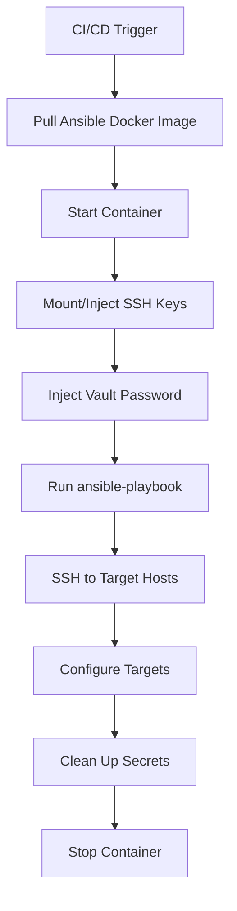

# How to Use Ansible in Docker-Based CI/CD Pipelines

Author: [nawazdhandala](https://www.github.com/nawazdhandala)

Tags: Ansible, Docker, CI/CD, DevOps

Description: Run Ansible playbooks inside Docker containers in CI/CD pipelines for consistent, reproducible deployment environments.

---

Running Ansible inside Docker containers for CI/CD gives you a consistent, reproducible execution environment. No more "it works on my machine" problems when the CI runner has a different Ansible version or missing Python dependencies. Every pipeline run uses the exact same container image with the exact same Ansible version and libraries.

This guide covers building Ansible Docker images, using them in various CI/CD platforms, and handling the tricky parts like SSH key injection and network access.

## Building the Ansible Docker Image

Start with a Docker image that has everything you need for your Ansible playbooks.

```dockerfile
# Dockerfile.ansible
FROM python:3.11-slim

# Install system dependencies
RUN apt-get update && \
    apt-get install -y --no-install-recommends \
    openssh-client \
    git \
    curl \
    jq \
    sshpass \
    && rm -rf /var/lib/apt/lists/*

# Install Ansible and common dependencies
RUN pip install --no-cache-dir \
    ansible==8.7.0 \
    ansible-lint==6.22.0 \
    jmespath \
    netaddr \
    boto3 \
    pywinrm

# Install commonly used Ansible collections
RUN ansible-galaxy collection install \
    community.general \
    community.docker \
    ansible.posix \
    amazon.aws

# Create a working directory
WORKDIR /ansible

# Default command shows Ansible version
CMD ["ansible", "--version"]
```

Build and push it to your container registry.

```bash
# Build the image
docker build -t ansible-runner:latest -f Dockerfile.ansible .

# Tag and push to your registry
docker tag ansible-runner:latest registry.example.com/ansible-runner:latest
docker push registry.example.com/ansible-runner:latest

# Also tag with a specific version for pinning
docker tag ansible-runner:latest registry.example.com/ansible-runner:8.7.0
docker push registry.example.com/ansible-runner:8.7.0
```

## Running Locally in Docker

Test your Docker-based Ansible setup locally before integrating with CI/CD.

```bash
# Run a playbook using the Docker container
docker run --rm \
  -v $(pwd)/ansible:/ansible \
  -v ~/.ssh/id_rsa:/root/.ssh/id_rsa:ro \
  -e ANSIBLE_HOST_KEY_CHECKING=false \
  ansible-runner:latest \
  ansible-playbook -i inventory/staging.ini playbooks/site.yml
```

For vault-encrypted playbooks, pass the vault password.

```bash
# Pass vault password via environment variable and a script
docker run --rm \
  -v $(pwd)/ansible:/ansible \
  -v ~/.ssh/id_rsa:/root/.ssh/id_rsa:ro \
  -e ANSIBLE_HOST_KEY_CHECKING=false \
  -e ANSIBLE_VAULT_PASSWORD=your-vault-pass \
  ansible-runner:latest \
  bash -c 'echo "$ANSIBLE_VAULT_PASSWORD" > /tmp/vault.txt && \
    ansible-playbook -i inventory/staging.ini \
    --vault-password-file /tmp/vault.txt \
    playbooks/site.yml'
```

## GitHub Actions with Docker

Use your custom Ansible Docker image in GitHub Actions.

```yaml
# .github/workflows/deploy.yml
name: Deploy with Docker Ansible

on:
  push:
    branches: [main]

jobs:
  deploy:
    runs-on: ubuntu-latest
    container:
      image: registry.example.com/ansible-runner:8.7.0
      credentials:
        username: ${{ secrets.REGISTRY_USER }}
        password: ${{ secrets.REGISTRY_PASSWORD }}

    steps:
      - uses: actions/checkout@v4

      - name: Set up SSH key
        run: |
          mkdir -p ~/.ssh
          echo "${{ secrets.SSH_PRIVATE_KEY }}" > ~/.ssh/id_rsa
          chmod 600 ~/.ssh/id_rsa

      - name: Create vault password file
        run: echo "${{ secrets.ANSIBLE_VAULT_PASSWORD }}" > /tmp/vault.txt

      - name: Run Ansible playbook
        run: |
          ansible-playbook \
            -i inventory/staging.ini \
            --vault-password-file /tmp/vault.txt \
            playbooks/site.yml
        env:
          ANSIBLE_HOST_KEY_CHECKING: "false"

      - name: Clean up
        if: always()
        run: rm -f /tmp/vault.txt ~/.ssh/id_rsa
```

## GitLab CI with Custom Image

```yaml
# .gitlab-ci.yml
image: registry.example.com/ansible-runner:8.7.0

stages:
  - lint
  - deploy

variables:
  ANSIBLE_HOST_KEY_CHECKING: "false"
  ANSIBLE_FORCE_COLOR: "true"

lint:
  stage: lint
  script:
    - ansible-lint playbooks/
    - ansible-playbook --syntax-check playbooks/site.yml

deploy-staging:
  stage: deploy
  script:
    - mkdir -p ~/.ssh
    - echo "$SSH_PRIVATE_KEY" > ~/.ssh/id_rsa
    - chmod 600 ~/.ssh/id_rsa
    - echo "$ANSIBLE_VAULT_PASSWORD" > /tmp/vault.txt
    - >
      ansible-playbook
      -i inventory/staging.ini
      --vault-password-file /tmp/vault.txt
      playbooks/site.yml
  after_script:
    - rm -f /tmp/vault.txt ~/.ssh/id_rsa
  rules:
    - if: $CI_COMMIT_BRANCH == "main"
```

## Jenkins with Docker Agent

```groovy
// Jenkinsfile - Run Ansible in Docker
pipeline {
    agent {
        docker {
            image 'registry.example.com/ansible-runner:8.7.0'
            registryUrl 'https://registry.example.com'
            registryCredentialsId 'docker-registry'
        }
    }

    environment {
        ANSIBLE_HOST_KEY_CHECKING = 'false'
    }

    stages {
        stage('Lint') {
            steps {
                sh 'ansible-lint playbooks/'
            }
        }

        stage('Deploy') {
            steps {
                withCredentials([
                    string(credentialsId: 'vault-pass', variable: 'VAULT_PASS'),
                    sshUserPrivateKey(credentialsId: 'ssh-key', keyFileVariable: 'SSH_KEY')
                ]) {
                    sh '''
                        echo "$VAULT_PASS" > /tmp/vault.txt
                        ansible-playbook \
                            -i inventory/staging.ini \
                            --vault-password-file /tmp/vault.txt \
                            --private-key "$SSH_KEY" \
                            playbooks/site.yml
                        rm -f /tmp/vault.txt
                    '''
                }
            }
        }
    }
}
```

## Docker Compose for Local Development

Use Docker Compose to make local Ansible development match your CI/CD environment.

```yaml
# docker-compose.yml
services:
  ansible:
    build:
      context: .
      dockerfile: Dockerfile.ansible
    volumes:
      - ./ansible:/ansible
      - ~/.ssh/id_rsa:/root/.ssh/id_rsa:ro
    environment:
      ANSIBLE_HOST_KEY_CHECKING: "false"
      ANSIBLE_FORCE_COLOR: "true"
    working_dir: /ansible

  # Lint runner
  lint:
    build:
      context: .
      dockerfile: Dockerfile.ansible
    volumes:
      - ./ansible:/ansible
    working_dir: /ansible
    command: ansible-lint playbooks/
    profiles:
      - lint
```

Run tasks with Docker Compose.

```bash
# Run lint
docker compose --profile lint run lint

# Run a playbook
docker compose run ansible ansible-playbook -i inventory/staging.ini playbooks/site.yml

# Open a shell in the Ansible container for debugging
docker compose run ansible bash
```

## Multi-Stage Docker Build

If your playbooks need specific collections or roles, use a multi-stage build to keep the image clean.

```dockerfile
# Dockerfile.ansible-multi-stage
# Stage 1: Download collections and roles
FROM python:3.11-slim AS builder

RUN pip install --no-cache-dir ansible==8.7.0

COPY requirements.yml /tmp/requirements.yml
RUN ansible-galaxy collection install -r /tmp/requirements.yml -p /collections
RUN ansible-galaxy role install -r /tmp/requirements.yml -p /roles

# Stage 2: Final image
FROM python:3.11-slim

RUN apt-get update && \
    apt-get install -y --no-install-recommends openssh-client && \
    rm -rf /var/lib/apt/lists/*

RUN pip install --no-cache-dir \
    ansible==8.7.0 \
    jmespath

# Copy pre-downloaded collections and roles
COPY --from=builder /collections /root/.ansible/collections
COPY --from=builder /roles /root/.ansible/roles

WORKDIR /ansible
```

## Docker Container Network Flow



## Handling Network Access

When running Ansible in a Docker container, the container needs network access to your target hosts. In CI/CD environments, this usually works out of the box because containers use the host network. But if you are running Docker-in-Docker or on an isolated network, you might need extra configuration.

```yaml
# Docker run with host networking (useful for accessing hosts on the same network)
docker run --rm \
  --network host \
  -v $(pwd)/ansible:/ansible \
  ansible-runner:latest \
  ansible-playbook -i inventory/staging.ini playbooks/site.yml
```

## Versioning Your Docker Image

Tag your Docker images with the Ansible version and a build number.

```bash
# Tagging strategy
registry.example.com/ansible-runner:latest
registry.example.com/ansible-runner:8.7.0
registry.example.com/ansible-runner:8.7.0-build-42

# In CI/CD, always use a specific version tag, not latest
image: registry.example.com/ansible-runner:8.7.0
```

## Tips for Docker-Based Ansible CI/CD

1. Pin your Docker image version in CI/CD configs. Using `latest` will eventually break something when the image gets updated.
2. Rebuild and push your Ansible Docker image on a schedule (weekly or monthly) to pick up security patches.
3. Do not bake secrets into your Docker image. Always inject them at runtime through environment variables or mounted files.
4. Use multi-stage builds to keep your image small. Download collections in a builder stage and copy them into the final image.
5. Test your Docker image locally before using it in CI/CD. Run `docker run ansible-runner:latest ansible --version` to verify.
6. If your target hosts are on a private network, make sure your CI/CD runner or Docker networking can reach them.

Docker-based Ansible pipelines give you consistent, reproducible deployments. The key benefit is that your CI/CD environment is identical every time, eliminating a whole class of "works on CI but not on my machine" problems.
