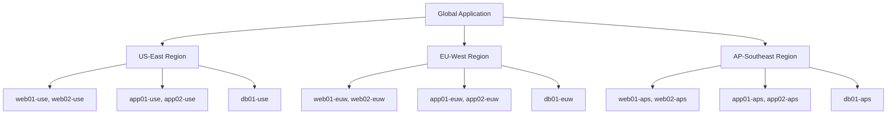

# How to Use Ansible Inventory for Multi-Region Cloud Deployments

Author: [nawazdhandala](https://www.github.com/nawazdhandala)

Tags: Ansible, Multi-Region, Cloud, AWS, Inventory

Description: Learn how to organize Ansible inventory for multi-region cloud deployments across AWS, Azure, and GCP with region-specific grouping.

---

When your application runs across multiple cloud regions for high availability or compliance, your Ansible inventory needs to reflect that geographic distribution. You need to target specific regions independently, deploy to all regions at once, and handle region-specific configuration differences. This post covers inventory patterns that work well for multi-region cloud deployments.

## The Multi-Region Challenge

A typical multi-region setup might look like this:



Each region has the same set of services, but they need region-specific configuration (endpoint URLs, database connections, CDN settings). Your inventory needs to support both "deploy to all web servers everywhere" and "deploy to web servers in EU-West only."

## Static Inventory Approach

Here is a YAML inventory that organizes hosts by both region and role:

```yaml
# inventory/multi-region.yml
all:
  vars:
    ansible_user: deploy
    global_cdn_url: "https://cdn.example.com"
  children:
    # Region-based grouping
    us_east:
      vars:
        aws_region: us-east-1
        region_code: use
        db_endpoint: "db.use.internal.example.com"
        cdn_origin: "origin-use.example.com"
      children:
        us_east_web:
          hosts:
            web01-use:
              ansible_host: 10.1.1.10
            web02-use:
              ansible_host: 10.1.1.11
        us_east_app:
          hosts:
            app01-use:
              ansible_host: 10.1.2.20
            app02-use:
              ansible_host: 10.1.2.21
        us_east_db:
          hosts:
            db01-use:
              ansible_host: 10.1.3.30

    eu_west:
      vars:
        aws_region: eu-west-1
        region_code: euw
        db_endpoint: "db.euw.internal.example.com"
        cdn_origin: "origin-euw.example.com"
      children:
        eu_west_web:
          hosts:
            web01-euw:
              ansible_host: 10.2.1.10
            web02-euw:
              ansible_host: 10.2.1.11
        eu_west_app:
          hosts:
            app01-euw:
              ansible_host: 10.2.2.20
            app02-euw:
              ansible_host: 10.2.2.21
        eu_west_db:
          hosts:
            db01-euw:
              ansible_host: 10.2.3.30

    ap_southeast:
      vars:
        aws_region: ap-southeast-1
        region_code: aps
        db_endpoint: "db.aps.internal.example.com"
        cdn_origin: "origin-aps.example.com"
      children:
        ap_southeast_web:
          hosts:
            web01-aps:
              ansible_host: 10.3.1.10
            web02-aps:
              ansible_host: 10.3.1.11
        ap_southeast_app:
          hosts:
            app01-aps:
              ansible_host: 10.3.2.20
            app02-aps:
              ansible_host: 10.3.2.21
        ap_southeast_db:
          hosts:
            db01-aps:
              ansible_host: 10.3.3.30

    # Role-based grouping (cross-region)
    webservers:
      children:
        us_east_web:
        eu_west_web:
        ap_southeast_web:
    appservers:
      children:
        us_east_app:
        eu_west_app:
        ap_southeast_app:
    databases:
      children:
        us_east_db:
        eu_west_db:
        ap_southeast_db:
```

Now you can target by region, by role, or by intersection:

```bash
# Deploy to ALL web servers across all regions
ansible-playbook -i inventory/multi-region.yml deploy-web.yml --limit webservers

# Deploy to EU-West region only (all roles)
ansible-playbook -i inventory/multi-region.yml deploy.yml --limit eu_west

# Deploy to web servers in US-East only
ansible-playbook -i inventory/multi-region.yml deploy-web.yml --limit us_east_web

# Deploy to web servers in US-East and EU-West
ansible-playbook -i inventory/multi-region.yml deploy-web.yml --limit 'us_east_web:eu_west_web'
```

## Dynamic Inventory with AWS EC2

For AWS, use the EC2 dynamic inventory plugin with region-based grouping:

```yaml
# inventory/aws_ec2.yml
plugin: amazon.aws.aws_ec2
regions:
  - us-east-1
  - eu-west-1
  - ap-southeast-1

# Create groups based on region, role, and environment
keyed_groups:
  - key: placement.region
    prefix: region
    separator: "_"
  - key: tags.Role | default('untagged')
    prefix: role
    separator: "_"
  - key: tags.Environment | default('unknown')
    prefix: env
    separator: "_"

# Map instance attributes to Ansible variables
compose:
  ansible_host: private_ip_address
  ansible_user: "'ec2-user'"
  aws_region: placement.region
  instance_type: instance_type

# Only include running instances managed by Ansible
filters:
  instance-state-name: running
  "tag:ManagedBy": ansible

# Cache to avoid repeated API calls across 3 regions
cache: true
cache_plugin: ansible.builtin.jsonfile
cache_connection: /tmp/aws_inventory_cache
cache_timeout: 3600
```

This automatically creates groups like `region_us_east_1`, `role_webserver`, and `env_production`. You can target them:

```bash
# All webservers in EU
ansible-playbook deploy.yml --limit 'role_webserver:&region_eu_west_1'

# All production instances in Asia Pacific
ansible-playbook deploy.yml --limit 'env_production:&region_ap_southeast_1'
```

## Multi-Cloud Multi-Region

If you run across multiple cloud providers, use separate inventory files per provider:

```
inventory/
  01_aws_ec2.yml          # AWS instances
  02_azure_rm.yml         # Azure VMs
  03_gcp_compute.yml      # GCP instances
  04_constructed.yml      # Cross-cloud grouping
  group_vars/
    all.yml
    webservers.yml
```

```yaml
# inventory/02_azure_rm.yml
plugin: azure.azcollection.azure_rm
include_vm_resource_groups:
  - production-westeurope-rg
  - production-eastus-rg
auth_source: auto

keyed_groups:
  - key: location
    prefix: azure_region
    separator: "_"
  - key: tags.Role | default('untagged')
    prefix: role
    separator: "_"

compose:
  ansible_host: private_ipv4_addresses[0]
  cloud_provider: "'azure'"
```

```yaml
# inventory/04_constructed.yml
plugin: ansible.builtin.constructed
strict: false

# Create unified cross-cloud groups
groups:
  # All web servers regardless of cloud provider
  all_webservers: "'role_webserver' in group_names or 'role_web' in group_names"
  # All instances in European regions
  europe: "'eu' in (aws_region | default('')) or 'europe' in (location | default(''))"
  # All instances in US regions
  north_america: "'us-' in (aws_region | default('')) or 'eastus' in (location | default(''))"
```

## Region-Specific Variables with group_vars

Use the group_vars directory to store region-specific configuration:

```yaml
# inventory/group_vars/us_east.yml
# US East region configuration
aws_region: us-east-1
region_dns_zone: "use.internal.example.com"
region_s3_bucket: "myapp-assets-us-east-1"
region_db_endpoint: "myapp-db.us-east-1.rds.amazonaws.com"
region_cache_endpoint: "myapp-cache.us-east-1.cache.amazonaws.com"
region_lb_dns: "lb-use.example.com"
```

```yaml
# inventory/group_vars/eu_west.yml
# EU West region configuration
aws_region: eu-west-1
region_dns_zone: "euw.internal.example.com"
region_s3_bucket: "myapp-assets-eu-west-1"
region_db_endpoint: "myapp-db.eu-west-1.rds.amazonaws.com"
region_cache_endpoint: "myapp-cache.eu-west-1.cache.amazonaws.com"
region_lb_dns: "lb-euw.example.com"
# GDPR-specific settings for EU
data_residency: "eu"
encryption_required: true
```

## Rolling Regional Deployments

Deploy region by region with verification between each:

```bash
#!/bin/bash
# multi_region_deploy.sh
# Deploy to regions one at a time with health checks between each

REGIONS=("us_east" "eu_west" "ap_southeast")
PLAYBOOK="deploy.yml"
INVENTORY="inventory/"

for region in "${REGIONS[@]}"; do
    echo "=== Deploying to ${region} ==="

    ansible-playbook -i "$INVENTORY" "$PLAYBOOK" --limit "$region"

    if [ $? -ne 0 ]; then
        echo "ERROR: Deployment to ${region} failed. Stopping."
        exit 1
    fi

    # Run health check against the deployed region
    echo "Running health checks for ${region}..."
    ansible-playbook -i "$INVENTORY" health-check.yml --limit "$region"

    if [ $? -ne 0 ]; then
        echo "ERROR: Health checks failed for ${region}. Stopping."
        exit 1
    fi

    echo "=== ${region} deployed and healthy ==="
    echo ""
done

echo "All regions deployed successfully."
```

## Playbook Template with Region Awareness

Write playbooks that adapt based on the region group:

```yaml
# deploy.yml
- hosts: webservers
  serial: "50%"
  tasks:
    - name: Deploy application
      ansible.builtin.copy:
        src: "app-{{ app_version }}.tar.gz"
        dest: /opt/app/

    - name: Configure application with region-specific settings
      ansible.builtin.template:
        src: app-config.yml.j2
        dest: /opt/app/config.yml

    - name: Restart application
      ansible.builtin.service:
        name: myapp
        state: restarted
```

```yaml
# templates/app-config.yml.j2
# Generated by Ansible - region: {{ aws_region }}
database:
  host: {{ region_db_endpoint }}
  port: 5432
cache:
  host: {{ region_cache_endpoint }}
  port: 6379
storage:
  bucket: {{ region_s3_bucket }}
  region: {{ aws_region }}
```

The variables automatically resolve to the correct region-specific values based on which group the host belongs to.

Multi-region inventory is fundamentally about having two grouping dimensions (region and role) and being able to target any combination of them. Use nested groups for static inventories, keyed_groups for dynamic inventories, and the constructed plugin when you need cross-provider grouping. Always deploy region by region in production with health checks between each to catch issues before they go global.
