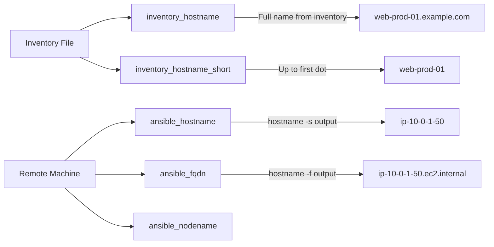

# How to Use Ansible inventory_hostname vs ansible_hostname

Author: [nawazdhandala](https://www.github.com/nawazdhandala)

Tags: Ansible, Inventory, Variables, Hostname, Configuration Management

Description: Understand the critical difference between inventory_hostname and ansible_hostname in Ansible and when to use each one.

---

If you have spent any time writing Ansible playbooks, you have probably seen both `inventory_hostname` and `ansible_hostname` used in examples and wondered if they are interchangeable. They are not. Using the wrong one can lead to subtle bugs that are hard to track down, especially in environments where hostnames do not match what is in the inventory file. Let me break down exactly what each variable contains and when to use which.

## inventory_hostname: What the Inventory Says

The `inventory_hostname` variable contains the name of the host as it appears in your inventory file. This is not discovered from the remote machine. It is purely whatever string you used to define the host.

```yaml
# inventory/hosts.yml
all:
  children:
    webservers:
      hosts:
        web-prod-01:
          ansible_host: 10.0.1.50
        web-prod-02.example.com:
          ansible_host: 10.0.1.51
        10.0.1.52:
```

For these hosts, `inventory_hostname` would be:
- `web-prod-01` (a short alias)
- `web-prod-02.example.com` (a fully qualified domain name)
- `10.0.1.52` (an IP address used directly as the host name)

```yaml
# show-inventory-hostname.yml
---
- name: Display inventory_hostname for each host
  hosts: webservers
  gather_facts: false
  tasks:
    - name: Print inventory hostname
      ansible.builtin.debug:
        msg: "inventory_hostname is: {{ inventory_hostname }}"
```

Note that `gather_facts: false` still works here. Since `inventory_hostname` comes from the inventory, not from the remote machine, it is always available without gathering facts.

## ansible_hostname: What the Machine Reports

The `ansible_hostname` variable is a gathered fact. It contains the short hostname that the remote machine reports about itself, which is essentially the output of the `hostname -s` command on that machine.

```yaml
# show-ansible-hostname.yml
---
- name: Display ansible_hostname for each host
  hosts: webservers
  gather_facts: true  # Required for ansible_hostname
  tasks:
    - name: Print machine hostname
      ansible.builtin.debug:
        msg: "ansible_hostname is: {{ ansible_hostname }}"
```

If the machine's actual hostname is `ip-10-0-1-50` (as is common with cloud instances), then `ansible_hostname` would be `ip-10-0-1-50`, while `inventory_hostname` would still be `web-prod-01`.

## Side-by-Side Comparison

Here is a playbook that shows both values for clarity:

```yaml
# compare-hostnames.yml - Show the difference between the two variables
---
- name: Compare inventory_hostname and ansible_hostname
  hosts: all
  gather_facts: true
  tasks:
    - name: Display both hostname variables
      ansible.builtin.debug:
        msg:
          - "inventory_hostname: {{ inventory_hostname }}"
          - "inventory_hostname_short: {{ inventory_hostname_short }}"
          - "ansible_hostname: {{ ansible_hostname }}"
          - "ansible_fqdn: {{ ansible_fqdn }}"
          - "ansible_nodename: {{ ansible_nodename }}"
```

Typical output for a cloud instance:

```
inventory_hostname: web-prod-01
inventory_hostname_short: web-prod-01
ansible_hostname: ip-10-0-1-50
ansible_fqdn: ip-10-0-1-50.ec2.internal
ansible_nodename: ip-10-0-1-50
```

## The Related Hostname Variables



## When to Use inventory_hostname

Use `inventory_hostname` when you need to reference other hosts in the inventory, access hostvars, or build consistent naming that matches your inventory structure.

```yaml
# use-inventory-hostname.yml - Referencing other hosts via hostvars
---
- name: Configure cluster with inventory names
  hosts: db_cluster
  gather_facts: true
  tasks:
    # Accessing hostvars requires inventory_hostname
    - name: Build cluster peer list
      ansible.builtin.set_fact:
        cluster_peers: >-
          {{ groups['db_cluster'] | reject('equalto', inventory_hostname) | list }}

    - name: Configure replication from peers
      ansible.builtin.template:
        src: replication.conf.j2
        dest: /etc/db/replication.conf
        mode: '0640'
      become: true

    # inventory_hostname is the key for hostvars
    - name: Get IP of another host
      ansible.builtin.debug:
        msg: >
          Primary IP: {{ hostvars['db-primary']['ansible_default_ipv4']['address'] }}
```

Also use `inventory_hostname` for generating consistent file names, DNS records, or monitoring labels:

```yaml
# consistent-naming.yml
---
- name: Use inventory names for consistent resources
  hosts: all
  gather_facts: true
  tasks:
    - name: Create log directory with inventory name
      ansible.builtin.file:
        path: "/var/log/apps/{{ inventory_hostname }}"
        state: directory
        mode: '0755'
      become: true

    - name: Register with monitoring using inventory name
      ansible.builtin.uri:
        url: "https://monitoring.internal/api/register"
        method: POST
        body_format: json
        body:
          hostname: "{{ inventory_hostname }}"
          ip: "{{ ansible_default_ipv4.address }}"
          groups: "{{ group_names }}"
```

## When to Use ansible_hostname

Use `ansible_hostname` when you need to work with the machine's actual identity, such as when matching against system configurations, log entries, or processes that use the machine's real hostname.

```yaml
# use-ansible-hostname.yml - Working with the real machine hostname
---
- name: Tasks that need the real hostname
  hosts: all
  gather_facts: true
  tasks:
    # Set the hostname to match your naming convention
    - name: Set system hostname to match inventory
      ansible.builtin.hostname:
        name: "{{ inventory_hostname }}"
      become: true
      when: ansible_hostname != inventory_hostname

    # Check if a process is bound to the correct hostname
    - name: Verify application binds to correct hostname
      ansible.builtin.command:
        cmd: "ss -tlnp | grep {{ ansible_hostname }}"
      register: binding_check
      changed_when: false
      failed_when: false

    # Generate configs that reference the actual system hostname
    - name: Configure syslog with real hostname
      ansible.builtin.lineinfile:
        path: /etc/rsyslog.conf
        regexp: '^\$LocalHostName'
        line: "$LocalHostName {{ ansible_hostname }}"
      become: true
```

## Common Pattern: Synchronize Hostnames

A widespread pattern is to set the machine's hostname to match the inventory name. This eliminates the confusion between the two variables entirely.

```yaml
# sync-hostname.yml - Make the machine hostname match the inventory
---
- name: Synchronize system hostname with inventory
  hosts: all
  gather_facts: true
  become: true
  tasks:
    - name: Set hostname to inventory_hostname
      ansible.builtin.hostname:
        name: "{{ inventory_hostname }}"

    - name: Update /etc/hosts with new hostname
      ansible.builtin.lineinfile:
        path: /etc/hosts
        regexp: '^127\.0\.1\.1'
        line: "127.0.1.1 {{ inventory_hostname }}"

    - name: Verify hostname was set
      ansible.builtin.command:
        cmd: hostname
      register: hostname_result
      changed_when: false

    - name: Confirm hostname matches
      ansible.builtin.assert:
        that:
          - hostname_result.stdout == inventory_hostname
        fail_msg: "Hostname mismatch: got {{ hostname_result.stdout }}"
```

## Gotcha: Using ansible_hostname Without Gathering Facts

Since `ansible_hostname` is a gathered fact, it is not available when `gather_facts: false`. If you try to use it without gathering facts, you will get an undefined variable error.

```yaml
# This will fail
---
- name: Broken example
  hosts: all
  gather_facts: false
  tasks:
    - name: This will error out
      ansible.builtin.debug:
        msg: "{{ ansible_hostname }}"
      # Error: 'ansible_hostname' is undefined
```

If you need fact-based variables but want to skip the full fact gathering for speed, you can gather just the subset you need:

```yaml
# selective-facts.yml - Gather only network facts
---
- name: Gather minimal facts
  hosts: all
  gather_facts: false
  tasks:
    - name: Gather only network-related facts
      ansible.builtin.setup:
        gather_subset:
          - network
      # This populates ansible_hostname along with network facts
```

## Summary

The rule is straightforward: `inventory_hostname` is your label for the host, defined in the inventory. `ansible_hostname` is what the host calls itself. They often differ, especially in cloud environments. Use `inventory_hostname` for inventory lookups, hostvars access, and consistent naming. Use `ansible_hostname` when you need the machine's actual identity. If the mismatch causes confusion in your team, synchronize them early in your provisioning process.
