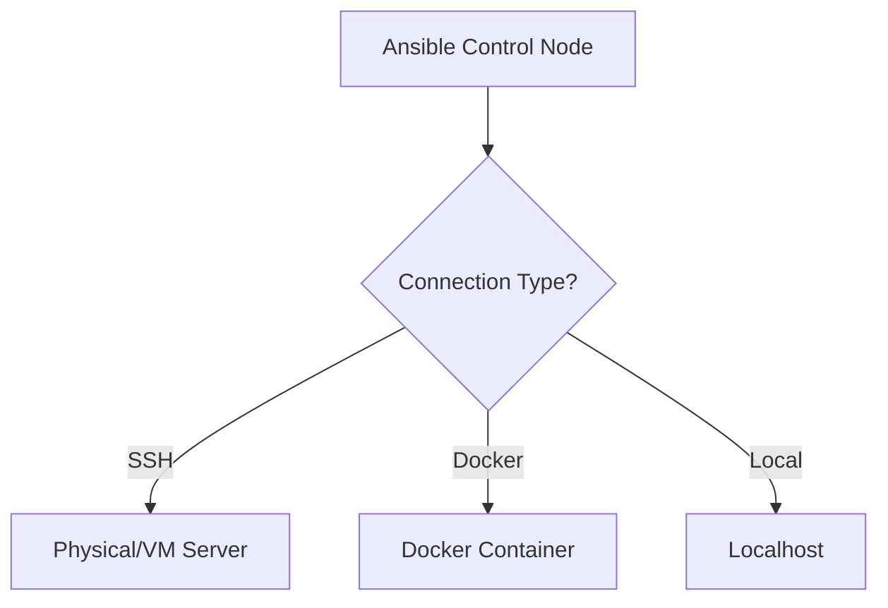

# How to Use Ansible Inventory with Docker Containers

Author: [nawazdhandala](https://www.github.com/nawazdhandala)

Tags: Ansible, Docker, Containers, Inventory, DevOps

Description: Learn how to create Ansible inventory for Docker containers using the docker connection plugin and dynamic inventory scripts.

---

Ansible is not just for managing traditional servers. You can use it to configure Docker containers as well, whether they are running locally on your development machine or spread across a Docker Swarm cluster. The trick is setting up your inventory and connection settings correctly. This post covers the different approaches to managing Docker containers with Ansible.

## The Docker Connection Plugin

Unlike traditional SSH-based management, Ansible talks to Docker containers using the `docker` connection plugin. This plugin uses the Docker API (through the `docker exec` command under the hood) to run commands inside containers.

Here is the simplest static inventory for Docker containers:

```ini
# inventory/docker_hosts.ini
# Static inventory for known Docker containers
[containers]
my_nginx ansible_connection=docker ansible_docker_extra_args=""
my_postgres ansible_connection=docker
my_redis ansible_connection=docker
```

The `ansible_connection=docker` setting tells Ansible to use `docker exec` instead of SSH. The host name must match the container name or container ID.

## Static Inventory in YAML

Here is the YAML equivalent with more configuration:

```yaml
# inventory/docker_hosts.yml
all:
  vars:
    # Use the Docker connection plugin for all hosts
    ansible_connection: docker
  children:
    web_containers:
      hosts:
        nginx-web-01:
          ansible_docker_extra_args: "--user root"
          container_role: webserver
        nginx-web-02:
          ansible_docker_extra_args: "--user root"
          container_role: webserver
    db_containers:
      hosts:
        postgres-01:
          container_role: database
          db_port: 5432
    cache_containers:
      hosts:
        redis-01:
          container_role: cache
```

Test connectivity:

```bash
# Ping a running container (container must be running with the exact name)
ansible -i inventory/docker_hosts.yml nginx-web-01 -m ping

# Run a command inside a container
ansible -i inventory/docker_hosts.yml nginx-web-01 -m command -a "nginx -v"
```

## Dynamic Inventory from Running Containers

For a more automated approach, create a dynamic inventory script that discovers running Docker containers:

```python
#!/usr/bin/env python3
# docker_inventory.py
# Dynamic inventory that discovers running Docker containers

import json
import subprocess
import sys

def get_running_containers():
    """Get list of running Docker containers with their details."""
    cmd = [
        'docker', 'ps', '--format',
        '{"name":"{{.Names}}","id":"{{.ID}}","image":"{{.Image}}","ports":"{{.Ports}}","labels":"{{.Labels}}"}'
    ]
    result = subprocess.run(cmd, capture_output=True, text=True)
    containers = []
    for line in result.stdout.strip().split('\n'):
        if line:
            containers.append(json.loads(line))
    return containers

def build_inventory():
    """Build Ansible inventory from running Docker containers."""
    containers = get_running_containers()
    inventory = {}
    hostvars = {}

    for container in containers:
        name = container['name']

        # Parse labels to determine group membership
        labels = {}
        if container['labels']:
            for label in container['labels'].split(','):
                if '=' in label:
                    k, v = label.split('=', 1)
                    labels[k] = v

        # Use the ansible.group label to assign groups, default to "containers"
        group = labels.get('ansible.group', 'containers')
        if group not in inventory:
            inventory[group] = {'hosts': [], 'vars': {}}
        inventory[group]['hosts'].append(name)

        # Also group by image name
        image_name = container['image'].split(':')[0].replace('/', '_')
        image_group = f'image_{image_name}'
        if image_group not in inventory:
            inventory[image_group] = {'hosts': [], 'vars': {}}
        inventory[image_group]['hosts'].append(name)

        # Set host variables
        hostvars[name] = {
            'ansible_connection': 'docker',
            'docker_container_id': container['id'],
            'docker_image': container['image'],
            'docker_labels': labels,
        }

        # Pull ansible variables from labels
        if 'ansible.user' in labels:
            hostvars[name]['ansible_user'] = labels['ansible.user']

    inventory['_meta'] = {'hostvars': hostvars}
    return inventory

if __name__ == '__main__':
    if '--list' in sys.argv or len(sys.argv) == 1:
        print(json.dumps(build_inventory(), indent=2))
    elif '--host' in sys.argv:
        print(json.dumps({}))
```

## Labeling Containers for Inventory

The dynamic script above reads Docker labels to organize containers into groups. When you start containers, add labels that the inventory script can use:

```bash
# Start containers with Ansible-relevant labels
docker run -d --name web-01 \
    --label ansible.group=webservers \
    --label ansible.user=www-data \
    --label environment=production \
    nginx:latest

docker run -d --name api-01 \
    --label ansible.group=appservers \
    --label ansible.user=app \
    --label environment=production \
    python:3.11-slim

docker run -d --name db-01 \
    --label ansible.group=databases \
    --label ansible.user=postgres \
    --label environment=production \
    postgres:15
```

Or use Docker Compose with labels:

```yaml
# docker-compose.yml
version: "3.8"
services:
  web:
    image: nginx:latest
    container_name: web-01
    labels:
      ansible.group: webservers
      ansible.user: root
      environment: production
    ports:
      - "8080:80"

  api:
    image: python:3.11-slim
    container_name: api-01
    labels:
      ansible.group: appservers
      ansible.user: app
    command: sleep infinity

  db:
    image: postgres:15
    container_name: db-01
    labels:
      ansible.group: databases
      ansible.user: postgres
    environment:
      POSTGRES_PASSWORD: devpassword
```

## Using the community.docker Inventory Plugin

The `community.docker` collection includes a proper inventory plugin:

```bash
# Install the Docker collection
ansible-galaxy collection install community.docker
```

Configure the plugin:

```yaml
# inventory/docker.yml
# community.docker inventory plugin configuration
plugin: community.docker.docker_containers
docker_host: unix:///var/run/docker.sock

# Only include running containers
status:
  - running

# Add containers to groups based on labels
keyed_groups:
  - key: docker_config.Labels['ansible.group'] | default('ungrouped')
    separator: ""
  - key: docker_config.Image | regex_replace('[:/]', '_')
    prefix: image

# Set connection variables
compose:
  ansible_connection: "'community.docker.docker'"
  ansible_docker_extra_args: "'-u root'"
```

Enable it:

```ini
# ansible.cfg
[inventory]
enable_plugins = community.docker.docker_containers, ansible.builtin.yaml
```

## Managing Remote Docker Hosts

If your Docker containers run on remote hosts (not locally), you need to configure the Docker connection to reach the remote Docker daemon:

```yaml
# inventory/remote_docker.yml
all:
  children:
    remote_containers:
      hosts:
        app-container-01:
          ansible_connection: docker
          # Tell Docker CLI to connect to a remote Docker host
          ansible_docker_extra_args: "--host ssh://deploy@docker-host.example.com"
        app-container-02:
          ansible_connection: docker
          ansible_docker_extra_args: "--host ssh://deploy@docker-host.example.com"
```

Alternatively, set the Docker host via environment variable:

```bash
# Set the remote Docker host
export DOCKER_HOST="ssh://deploy@docker-host.example.com"

# Now Ansible's Docker connection uses the remote daemon
ansible -i inventory/docker_hosts.yml containers -m ping
```

## Playbook Example: Configuring Containers

Here is a practical playbook that configures Docker containers through the inventory:

```yaml
# playbooks/configure-containers.yml
- hosts: webservers
  gather_facts: false
  tasks:
    - name: Copy nginx configuration
      ansible.builtin.copy:
        content: |
          server {
              listen 80;
              server_name {{ inventory_hostname }};
              root /usr/share/nginx/html;
          }
        dest: /etc/nginx/conf.d/default.conf

    - name: Reload nginx
      ansible.builtin.command: nginx -s reload

- hosts: databases
  gather_facts: false
  tasks:
    - name: Create application database
      community.postgresql.postgresql_db:
        name: myapp
        state: present
      become: true
      become_user: postgres
```

Run it:

```bash
# Configure all containers discovered by the dynamic inventory
ansible-playbook -i docker_inventory.py playbooks/configure-containers.yml
```

## Mixing Docker and Traditional Hosts

You can have Docker containers and regular SSH hosts in the same inventory:

```yaml
# inventory/mixed.yml
all:
  children:
    # Traditional SSH-managed hosts
    physical_servers:
      hosts:
        server01:
          ansible_host: 10.0.1.10
          ansible_connection: ssh
        server02:
          ansible_host: 10.0.1.11
          ansible_connection: ssh
    # Docker containers
    docker_containers:
      hosts:
        web-container:
          ansible_connection: docker
        api-container:
          ansible_connection: docker
    # Cross-cutting groups
    webservers:
      children:
        physical_servers:
        docker_containers:
```

The `ansible_connection` variable determines how Ansible reaches each host. SSH for traditional servers, Docker for containers.



## Tips and Gotchas

Container names must be exact. Ansible uses the container name (or ID) to run `docker exec`, so the name in your inventory must match the running container exactly.

Some modules need Python in the container. If the container does not have Python installed, use the `raw` module or install Python first:

```yaml
- hosts: minimal_containers
  gather_facts: false
  tasks:
    - name: Install Python in Alpine containers
      ansible.builtin.raw: apk add --no-cache python3
```

The `gather_facts` step also requires Python. Set `gather_facts: false` for containers that might not have it, and gather facts manually after installing Python if needed.

Using Ansible with Docker containers bridges the gap between container orchestration and traditional configuration management. The dynamic inventory approach with labels keeps things automated, while the static inventory works well for stable container environments that do not change often.
