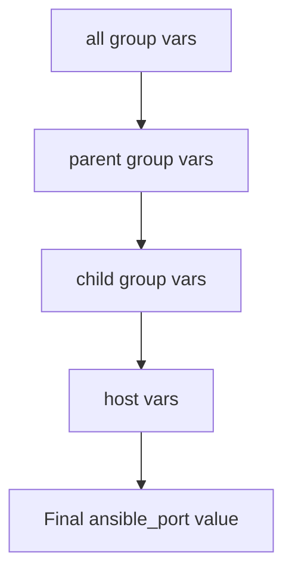

# How to Use Ansible Inventory with Non-Standard SSH Ports

Author: [nawazdhandala](https://www.github.com/nawazdhandala)

Tags: Ansible, SSH, Inventory, Security, DevOps

Description: Learn how to configure Ansible inventory files to connect to hosts using non-standard SSH ports for better security.

---

Running SSH on port 22 is the default, but many teams change it to a non-standard port as a basic security hardening step. It does not replace proper security practices, but it cuts down on automated brute-force attacks significantly. When you manage hosts with different SSH ports using Ansible, you need to tell the inventory about those ports. This post covers every way to do that.

## The Problem

By default, Ansible assumes every host listens on SSH port 22. If you have changed the SSH port on some or all of your servers, Ansible connections will fail with a timeout or connection refused error. You need a way to specify the correct port for each host or group of hosts in your inventory.

## Method 1: Inline Port in INI Inventory

The simplest way is to append the port directly after the hostname using a colon in the INI format:

```ini
# inventory/hosts.ini
# Specify non-standard SSH ports directly after the hostname
[webservers]
web01.example.com:2222
web02.example.com:2222
web03.example.com:8022

[database]
db01.example.com:3022
db02.example.com:3022
```

This is straightforward, but it gets repetitive when all hosts in a group use the same port.

## Method 2: Using ansible_port Variable

A cleaner approach for groups that share the same non-standard port is to use the `ansible_port` variable:

```ini
# inventory/hosts.ini
# Use ansible_port at the group level to avoid repetition
[webservers]
web01.example.com
web02.example.com
web03.example.com

[webservers:vars]
ansible_port=2222

[database]
db01.example.com
db02.example.com

[database:vars]
ansible_port=3022
```

When set as a group variable, every host in that group will use the specified port. You can still override it per host if needed:

```ini
[webservers]
web01.example.com
web02.example.com
# This host runs SSH on a different port than the rest of the group
web03.example.com ansible_port=8022

[webservers:vars]
ansible_port=2222
```

## Method 3: YAML Inventory Format

In YAML inventory files, you set `ansible_port` as a host or group variable:

```yaml
# inventory/hosts.yml
all:
  children:
    webservers:
      hosts:
        web01.example.com:
          # Standard port for this group
        web02.example.com:
        web03.example.com:
          # Override: this host uses a different port
          ansible_port: 8022
      vars:
        ansible_port: 2222
    database:
      hosts:
        db01.example.com:
        db02.example.com:
      vars:
        ansible_port: 3022
```

## Method 4: Using group_vars and host_vars

For production setups, I recommend pulling port configuration into dedicated variable files. This keeps your inventory file clean and makes it easier to manage across environments:

```
inventory/
  hosts.ini
  group_vars/
    webservers.yml
    database.yml
  host_vars/
    web03.example.com.yml
```

Set the port at the group level:

```yaml
# inventory/group_vars/webservers.yml
# All web servers use SSH port 2222
ansible_port: 2222
ansible_user: deploy
```

```yaml
# inventory/group_vars/database.yml
# Database servers use SSH port 3022
ansible_port: 3022
ansible_user: dbadmin
```

Override for a specific host:

```yaml
# inventory/host_vars/web03.example.com.yml
# This server was set up by a different team with a different port
ansible_port: 8022
```

## Method 5: Setting a Global Default Port

If most of your infrastructure uses the same non-standard port, you can set it globally for all hosts:

```yaml
# inventory/group_vars/all.yml
# Global default SSH port for every host in inventory
ansible_port: 2222
```

Individual groups or hosts can still override this value. Ansible applies variable precedence in this order (most specific wins):



## Method 6: ansible.cfg Default Port

You can also set a default remote port in your `ansible.cfg` file:

```ini
# ansible.cfg
[defaults]
remote_port = 2222
```

This applies to all hosts that do not have `ansible_port` explicitly set in the inventory. The inventory value always takes precedence over the config file.

## Mixing Standard and Non-Standard Ports

Real-world inventories often have a mix of port configurations. Here is a practical example:

```yaml
# inventory/mixed-ports.yml
all:
  children:
    # Legacy servers still on port 22
    legacy:
      hosts:
        old-app01.example.com:
        old-app02.example.com:
      vars:
        ansible_port: 22

    # New servers hardened with custom ports
    production:
      children:
        web_tier:
          hosts:
            web01.prod.example.com:
            web02.prod.example.com:
          vars:
            ansible_port: 2222
        app_tier:
          hosts:
            app01.prod.example.com:
            app02.prod.example.com:
          vars:
            ansible_port: 3322
        db_tier:
          hosts:
            db01.prod.example.com:
            db02.prod.example.com:
          vars:
            ansible_port: 4422

    # Cloud instances using yet another port
    cloud:
      hosts:
        cloud-vm01.example.com:
        cloud-vm02.example.com:
      vars:
        ansible_port: 2200
```

## Non-Standard Ports with Bastion Hosts

When you combine non-standard ports with SSH jump hosts, you need to specify ports in both places:

```ini
# inventory/bastion-ports.ini
[bastion]
# Bastion itself runs SSH on port 2222
jump01.example.com ansible_port=2222

[app_servers]
app01 ansible_host=10.0.1.10 ansible_port=3322
app02 ansible_host=10.0.1.11 ansible_port=3322

[app_servers:vars]
ansible_user=deploy
# Note: the bastion port is specified in the ProxyJump directive
ansible_ssh_common_args=-o ProxyJump=admin@jump01.example.com:2222
```

## Verifying Port Configuration

Always verify your port settings before running playbooks. Use the `ansible-inventory` command to check what Ansible sees:

```bash
# Show the complete inventory with all variables including ansible_port
ansible-inventory -i inventory/hosts.yml --list | python3 -m json.tool

# Check a specific host's port configuration
ansible-inventory -i inventory/hosts.yml --host web01.example.com

# Visualize the inventory structure
ansible-inventory -i inventory/hosts.yml --graph
```

Test connectivity to verify ports are correct:

```bash
# Ping all hosts to verify SSH connectivity on their configured ports
ansible -i inventory/hosts.yml all -m ping

# Verbose output shows the exact SSH command with port
ansible -i inventory/hosts.yml web01.example.com -m ping -vvvv
```

## Dynamic Inventory with Non-Standard Ports

When using dynamic inventory scripts (for AWS, GCP, etc.), the port information usually comes from tags or metadata. You can set the port mapping in the dynamic inventory configuration:

```yaml
# aws_ec2.yml - Dynamic inventory plugin config
plugin: amazon.aws.aws_ec2
regions:
  - us-east-1
compose:
  # Map the SSHPort tag to ansible_port
  ansible_port: tags.SSHPort | default('22')
```

This pulls the SSH port from an EC2 instance tag called `SSHPort` and falls back to port 22 if the tag is not present.

## Common Mistakes

There are a few things that trip people up when working with non-standard ports:

First, in the INI format, the colon syntax only works with hostnames. If you are using `ansible_host` to specify an IP address, you must use `ansible_port` separately:

```ini
# Wrong: this will not work
[servers]
myserver ansible_host=10.0.1.10:2222

# Correct: separate the host and port
[servers]
myserver ansible_host=10.0.1.10 ansible_port=2222
```

Second, when using `ansible_ssh_common_args` with ProxyJump, the port in the ProxyJump string applies to the jump host, not the target. The target port still comes from `ansible_port`.

Third, if you set `ansible_port` in both `group_vars` and inline on the host, the inline value wins. This is expected, but it can be confusing if you forget about an inline override.

Getting non-standard SSH ports right in your inventory is a small detail, but it is the kind of thing that blocks your entire automation workflow if it is wrong. Use `ansible_port` at the group level for consistency, override at the host level when needed, and always verify with `ansible-inventory --list` before running playbooks against production.
