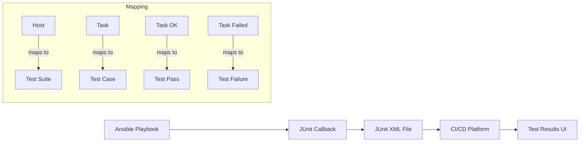

# How to Use Ansible junit Callback for CI Test Reports

Author: [nawazdhandala](https://www.github.com/nawazdhandala)

Tags: Ansible, JUnit, CI/CD, Testing, DevOps

Description: Generate JUnit XML test reports from Ansible playbook runs for integration with CI/CD platforms like Jenkins, GitLab, and GitHub Actions.

---

Most CI/CD platforms have built-in support for JUnit XML test reports. They display test results in a nice UI with pass/fail counts, timing data, and failure details. Ansible ships with a `junit` callback plugin that generates these JUnit XML files from playbook runs, treating each task as a "test case". This means you get native test result integration in Jenkins, GitLab, Azure DevOps, and other platforms without writing any custom code.

This guide shows you how to enable the JUnit callback, configure it for your needs, and integrate it with various CI/CD platforms.

## Enabling the JUnit Callback

The JUnit callback plugin comes with Ansible. Just enable it in your configuration.

```ini
# ansible.cfg
[defaults]
# Enable the junit callback plugin
callbacks_enabled = junit

[callback_junit]
# Directory where JUnit XML files will be written
output_dir = ./junit-reports

# Include the task class name (useful for filtering)
task_class = true

# Fail on change - treat changed tasks as test failures (optional)
fail_on_change = false

# Include task output in the report
include_setup_tasks_in_report = true
```

Alternatively, configure via environment variables.

```bash
# Enable junit callback and set output directory
export ANSIBLE_CALLBACK_PLUGINS=junit
export ANSIBLE_CALLBACKS_ENABLED=junit
export JUNIT_OUTPUT_DIR=./junit-reports
export JUNIT_TASK_CLASS=true
```

## How It Works

The JUnit callback maps Ansible concepts to JUnit concepts:

- Each host becomes a test suite
- Each task becomes a test case
- OK tasks are "passed" tests
- Failed tasks are "failed" tests
- Skipped tasks are "skipped" tests
- Changed tasks can optionally be treated as failures



## Running a Playbook with JUnit Output

Run your playbook normally. The JUnit callback writes XML files automatically.

```bash
# Create the output directory
mkdir -p junit-reports

# Run the playbook - JUnit XML is generated automatically
ansible-playbook -i inventory/staging.ini playbooks/site.yml

# Check the generated reports
ls junit-reports/
# Output: staging-host-01.xml staging-host-02.xml
```

## JUnit XML Output Format

Here is what the generated XML looks like.

```xml
<?xml version="1.0" encoding="utf-8"?>
<testsuites>
  <testsuite name="staging-host-01" tests="15" failures="1" errors="0" skipped="2" time="42.3">
    <testcase name="Install packages" classname="deploy.yml" time="12.5">
    </testcase>
    <testcase name="Configure nginx" classname="deploy.yml" time="3.2">
    </testcase>
    <testcase name="Deploy application" classname="deploy.yml" time="8.7">
      <failure message="Failed to deploy application">
        msg: Could not find application artifact
        rc: 1
      </failure>
    </testcase>
    <testcase name="Check disk space" classname="deploy.yml" time="0.5">
      <skipped message="Conditional check failed"/>
    </testcase>
  </testsuite>
</testsuites>
```

## GitHub Actions Integration

GitHub Actions can display JUnit test results using third-party actions.

```yaml
# .github/workflows/deploy.yml
name: Deploy with Test Report

on:
  push:
    branches: [main]

jobs:
  deploy:
    runs-on: ubuntu-latest

    steps:
      - uses: actions/checkout@v4

      - name: Install Ansible
        run: pip install ansible==8.7.0

      - name: Create report directory
        run: mkdir -p junit-reports

      - name: Set up SSH
        run: |
          mkdir -p ~/.ssh
          echo "${{ secrets.SSH_PRIVATE_KEY }}" > ~/.ssh/id_rsa
          chmod 600 ~/.ssh/id_rsa

      - name: Run Ansible playbook
        run: |
          ansible-playbook \
            -i inventory/staging.ini \
            playbooks/site.yml
        env:
          ANSIBLE_HOST_KEY_CHECKING: "false"
          ANSIBLE_CALLBACKS_ENABLED: junit
          JUNIT_OUTPUT_DIR: junit-reports
        continue-on-error: true

      # Publish JUnit test results
      - name: Publish Test Results
        uses: dorny/test-reporter@v1
        if: always()
        with:
          name: Ansible Deployment Results
          path: junit-reports/*.xml
          reporter: java-junit

      # Also upload as artifact
      - name: Upload JUnit reports
        uses: actions/upload-artifact@v4
        if: always()
        with:
          name: ansible-junit-reports
          path: junit-reports/
```

## GitLab CI Integration

GitLab has native JUnit report support.

```yaml
# .gitlab-ci.yml
deploy:
  stage: deploy
  image: python:3.11-slim
  script:
    - pip install ansible==8.7.0
    - mkdir -p junit-reports
    - apt-get update && apt-get install -y openssh-client
    - mkdir -p ~/.ssh
    - echo "$SSH_PRIVATE_KEY" > ~/.ssh/id_rsa
    - chmod 600 ~/.ssh/id_rsa
    - >
      ANSIBLE_CALLBACKS_ENABLED=junit
      JUNIT_OUTPUT_DIR=junit-reports
      ANSIBLE_HOST_KEY_CHECKING=false
      ansible-playbook
      -i inventory/staging.ini
      playbooks/site.yml
  after_script:
    - rm -f ~/.ssh/id_rsa
  artifacts:
    when: always
    reports:
      # GitLab automatically parses and displays JUnit results
      junit: junit-reports/*.xml
```

GitLab will display the test results directly in the merge request UI and pipeline view.

## Jenkins Integration

Jenkins has excellent JUnit support through the built-in JUnit plugin.

```groovy
// Jenkinsfile
pipeline {
    agent any

    stages {
        stage('Deploy') {
            steps {
                sh '''
                    mkdir -p junit-reports
                    ANSIBLE_CALLBACKS_ENABLED=junit \
                    JUNIT_OUTPUT_DIR=junit-reports \
                    ANSIBLE_HOST_KEY_CHECKING=false \
                    ansible-playbook \
                        -i inventory/staging.ini \
                        playbooks/site.yml
                '''
            }
            post {
                always {
                    // Jenkins JUnit publisher
                    junit 'junit-reports/*.xml'
                }
            }
        }
    }
}
```

## Azure DevOps Integration

Azure DevOps also supports JUnit XML natively.

```yaml
# azure-pipelines.yml
steps:
  - script: |
      mkdir -p junit-reports
      pip install ansible==8.7.0
      ANSIBLE_CALLBACKS_ENABLED=junit \
      JUNIT_OUTPUT_DIR=junit-reports \
      ansible-playbook -i inventory/staging.ini playbooks/site.yml
    displayName: 'Run Ansible'
    continueOnError: true

  - task: PublishTestResults@2
    condition: always()
    inputs:
      testResultsFormat: 'JUnit'
      testResultsFiles: 'junit-reports/*.xml'
      testRunTitle: 'Ansible Deployment'
```

## Combining JUnit with Other Callbacks

You can use the JUnit callback alongside other callbacks.

```ini
# ansible.cfg
[defaults]
# Use yaml for readable console output
stdout_callback = yaml

# Enable junit for file output plus other plugins
callbacks_enabled = junit, timer, profile_tasks

[callback_junit]
output_dir = ./junit-reports
```

## Treating Changed Tasks as Failures

For idempotency testing, you might want to treat "changed" tasks as failures. If your playbook reports changes on a second run, something is not idempotent.

```ini
# ansible.cfg
[callback_junit]
output_dir = ./junit-reports
# Changed tasks will appear as failures in the report
fail_on_change = true
```

This is useful in a CI pipeline that runs the playbook twice to verify idempotency.

```yaml
# GitHub Actions - Idempotency test
- name: First run (apply changes)
  run: |
    ANSIBLE_CALLBACKS_ENABLED=junit \
    JUNIT_OUTPUT_DIR=junit-reports-first \
    ansible-playbook -i inventory/test.ini playbooks/site.yml

- name: Second run (check idempotency)
  run: |
    ANSIBLE_CALLBACKS_ENABLED=junit \
    JUNIT_OUTPUT_DIR=junit-reports-second \
    JUNIT_FAIL_ON_CHANGE=true \
    ansible-playbook -i inventory/test.ini playbooks/site.yml

- name: Publish idempotency results
  uses: dorny/test-reporter@v1
  if: always()
  with:
    name: Idempotency Check
    path: junit-reports-second/*.xml
    reporter: java-junit
```

## Custom Test Names

By default, the JUnit callback uses the task name as the test case name. Make your task names descriptive so the reports are useful.

```yaml
# Good - descriptive task names appear clearly in JUnit reports
- name: "[web] Install nginx package"
  apt:
    name: nginx
    state: present

- name: "[web] Deploy application configuration"
  template:
    src: app.conf.j2
    dest: /etc/app/config.yml

# Bad - generic names are hard to read in reports
- name: Install package
  apt:
    name: nginx
    state: present
```

## Tips for JUnit Reports in CI/CD

1. Always set `continue-on-error: true` (or equivalent) on the Ansible step so that the JUnit publishing step still runs even when the playbook fails.
2. Use `artifacts: when: always` in GitLab CI to ensure JUnit files are uploaded regardless of the job result.
3. Descriptive task names are essential. They become the test case names in your CI/CD reports.
4. The `fail_on_change` option is great for idempotency testing but should be turned off for normal deployments where changes are expected.
5. Create separate report directories for different playbook runs if your pipeline runs multiple playbooks.
6. JUnit reports combined with `profile_tasks` give you both a visual test report and detailed timing information.

The JUnit callback plugin is one of the simplest ways to get rich Ansible reporting in your CI/CD platform. Enable it, point your CI platform at the XML files, and you get a proper test results view with no custom code required.
