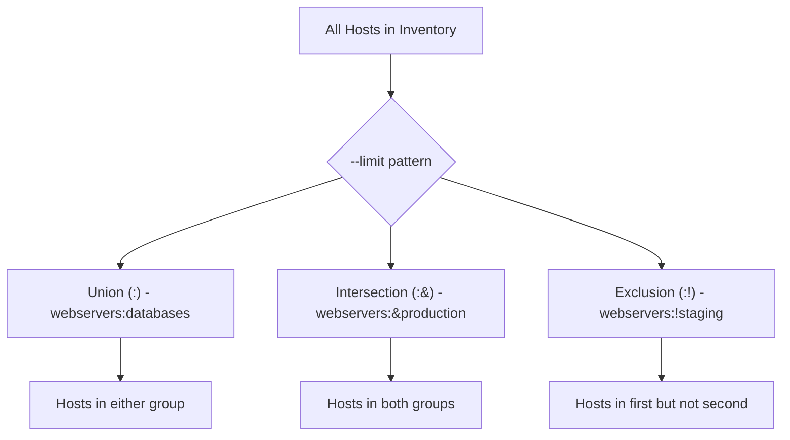

# How to Use Ansible limit Flag to Run on Specific Hosts

Author: [nawazdhandala](https://www.github.com/nawazdhandala)

Tags: Ansible, Limit, Targeting, Playbooks, DevOps

Description: Learn how to use the Ansible --limit flag to target specific hosts, groups, and patterns when running playbooks and ad-hoc commands.

---

The `--limit` flag is one of the most used flags in day-to-day Ansible operations. It lets you restrict which hosts a playbook runs against, without modifying the playbook or the inventory. Whether you are deploying to a single server, rolling out changes to one datacenter at a time, or excluding a problematic host, `--limit` gives you precise control over targeting.

## Basic --limit Usage

The `--limit` flag takes a host pattern and restricts execution to matching hosts:

```bash
# Run a playbook on only one specific host
ansible-playbook -i inventory/hosts.yml site.yml --limit web01

# Run on a specific group
ansible-playbook -i inventory/hosts.yml site.yml --limit webservers

# Run on multiple specific hosts (comma-separated)
ansible-playbook -i inventory/hosts.yml site.yml --limit 'web01,web02,db01'
```

The hosts specified in `--limit` must exist in the inventory. If you limit to a host that is not in the inventory, Ansible will report that no hosts matched.

## Pattern Matching with --limit

The `--limit` flag supports the same host patterns you can use in the `hosts` field of a play:

```bash
# Wildcard matching
ansible-playbook site.yml --limit 'web*'

# All hosts starting with "db" followed by two digits
ansible-playbook site.yml --limit 'db[0-9][0-9]'

# Regex pattern (prefix with ~)
ansible-playbook site.yml --limit '~web\d+\.prod\..*'
```

## Group Intersection and Union

You can combine groups using set operations:

```bash
# Union: hosts in webservers OR databases
ansible-playbook site.yml --limit 'webservers:databases'

# Intersection: hosts that are in BOTH webservers AND production
ansible-playbook site.yml --limit 'webservers:&production'

# Exclusion: all webservers EXCEPT those in staging
ansible-playbook site.yml --limit 'webservers:!staging'
```

These can be combined for precise targeting:

```bash
# Production webservers, excluding any in maintenance group
ansible-playbook site.yml --limit 'webservers:&production:!maintenance'
```

Here is how the set operations work visually:



## Using --limit with Ad-hoc Commands

The `--limit` flag works with ad-hoc `ansible` commands too:

```bash
# Check uptime on production webservers only
ansible -i inventory/ all -m command -a "uptime" --limit 'webservers:&production'

# Restart nginx on specific hosts
ansible -i inventory/ webservers -m service -a "name=nginx state=restarted" \
    --limit 'web01,web02' --become

# Gather facts from a single host
ansible -i inventory/ all -m setup --limit 'db01'
```

## Limiting to a File of Hosts

If you have a long list of hosts, put them in a file and reference it with `@`:

```bash
# Create a file with host names, one per line
cat > /tmp/target_hosts.txt << 'EOF'
web01
web02
web05
db01
app03
EOF

# Run the playbook on only those hosts
ansible-playbook -i inventory/ site.yml --limit @/tmp/target_hosts.txt
```

This is useful for maintenance windows where you have a specific list of hosts to patch.

## The retry File and --limit

When a playbook fails on some hosts, Ansible creates a `.retry` file containing the failed hosts. You can rerun the playbook against only those hosts:

```bash
# First run - some hosts might fail
ansible-playbook -i inventory/ site.yml

# If failures occurred, a retry file is created
# Rerun on only the failed hosts
ansible-playbook -i inventory/ site.yml --limit @site.retry
```

Enable or configure retry files in `ansible.cfg`:

```ini
# ansible.cfg
[defaults]
retry_files_enabled = true
retry_files_save_path = /tmp/ansible-retry
```

## Canary Deployments with --limit

A common pattern is deploying to a small subset first (canary), verifying, then rolling out to the rest:

```bash
# Step 1: Deploy to one canary host
ansible-playbook -i inventory/ deploy.yml --limit 'web01'

# Step 2: Verify the canary is healthy
ansible -i inventory/ web01 -m uri -a "url=http://localhost/health"

# Step 3: Deploy to the rest of the group, excluding the canary
ansible-playbook -i inventory/ deploy.yml --limit 'webservers:!web01'
```

Or use a script:

```bash
#!/bin/bash
# canary_deploy.sh
# Deploy with canary pattern

INVENTORY="inventory/"
PLAYBOOK="deploy.yml"
CANARY_HOST="web01"
GROUP="webservers"

echo "Deploying to canary host: $CANARY_HOST"
ansible-playbook -i "$INVENTORY" "$PLAYBOOK" --limit "$CANARY_HOST"

if [ $? -ne 0 ]; then
    echo "Canary deployment failed. Aborting."
    exit 1
fi

echo "Canary looks good. Deploying to remaining hosts..."
ansible-playbook -i "$INVENTORY" "$PLAYBOOK" --limit "${GROUP}:!${CANARY_HOST}"
```

## Rolling Deployments with --limit and serial

Combine `--limit` with the `serial` keyword for rolling deployments within a group:

```yaml
# deploy.yml
- hosts: webservers
  serial: 2  # Deploy to 2 hosts at a time
  tasks:
    - name: Deploy application
      ansible.builtin.copy:
        src: app.tar.gz
        dest: /opt/app/
    - name: Restart service
      ansible.builtin.service:
        name: myapp
        state: restarted
```

```bash
# Limit to a specific datacenter, deploy 2 at a time
ansible-playbook -i inventory/ deploy.yml --limit 'webservers:&us_east'
```

## Previewing Targeted Hosts

Always check which hosts will be targeted before running a playbook:

```bash
# List hosts that match the limit pattern WITHOUT running anything
ansible-playbook -i inventory/ site.yml --limit 'webservers:&production:!maintenance' --list-hosts

# Same with ad-hoc command
ansible -i inventory/ all --limit 'web*:&production' --list-hosts
```

The `--list-hosts` flag shows exactly which hosts would be targeted, without executing any tasks. This is essential for verifying complex limit patterns.

## Common --limit Patterns by Use Case

Here is a quick reference for common scenarios:

```bash
# Single host maintenance
ansible-playbook site.yml --limit 'db01'

# One datacenter at a time
ansible-playbook site.yml --limit '*:&datacenter_east'

# All web and app servers in production
ansible-playbook site.yml --limit 'webservers:appservers:&production'

# Everything except the problematic host
ansible-playbook site.yml --limit 'all:!broken-host-07'

# Hosts matching a name pattern in a specific environment
ansible-playbook site.yml --limit '~web\d+:&staging'

# First 5 hosts in a group (using head from list-hosts)
ansible -i inventory/ webservers --list-hosts | head -7
# Then manually use those names in --limit
```

## Interaction with play-level hosts

The `--limit` flag acts as an additional filter on top of the `hosts` directive in the play:

```yaml
# This play targets webservers
- hosts: webservers
  tasks:
    - name: Configure nginx
      ansible.builtin.template:
        src: nginx.conf.j2
        dest: /etc/nginx/nginx.conf
```

```bash
# --limit further restricts within the webservers group
ansible-playbook site.yml --limit 'web01,web02'

# If you limit to a host not in webservers, nothing runs
ansible-playbook site.yml --limit 'db01'
# Output: "skipping: no hosts matched"
```

The final set of targeted hosts is the intersection of the play's `hosts` field and the `--limit` pattern. Both conditions must match for a host to be included.

## Tips and Gotchas

Quote your limit patterns in the shell. Patterns with special characters like `!`, `&`, and `*` can be interpreted by the shell if not quoted:

```bash
# Wrong - shell interprets ! and &
ansible-playbook site.yml --limit webservers:&production:!staging

# Correct - quoted to prevent shell interpretation
ansible-playbook site.yml --limit 'webservers:&production:!staging'
```

The `--limit` flag does not change variable loading. Even if you limit to a single host, Ansible still loads all group_vars and host_vars. This means the playbook behaves identically whether you run on all hosts or a subset.

The `--limit` flag is a runtime filter, not an inventory modification. Your inventory stays unchanged. This makes it safe to use without worrying about accidentally modifying the inventory itself.

Mastering `--limit` is essential for anyone who runs Ansible regularly. It gives you surgical control over which hosts are affected by a playbook run, which is critical for safe deployments, targeted maintenance, and incident response.
