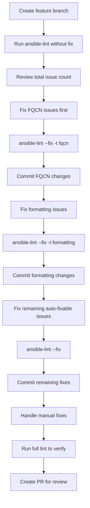

# How to Use ansible-lint Auto-Fix Feature

Author: [nawazdhandala](https://www.github.com/nawazdhandala)

Tags: Ansible, ansible-lint, Automation, Code Quality

Description: Learn how to use ansible-lint's auto-fix feature to automatically correct common playbook issues including FQCN names, formatting, and deprecated syntax.

---

Manually fixing hundreds of linting violations across a large Ansible codebase is the kind of tedious work nobody enjoys. The ansible-lint team recognized this and added an auto-fix feature that can automatically correct many common issues. Instead of spending hours renaming modules to their fully qualified names or fixing YAML formatting, you can let the tool handle the mechanical work while you focus on the changes that actually require human judgment.

## What Auto-Fix Can Do

The auto-fix feature does not cover every rule, but it handles the most common and most tedious violations. Here is what it can currently fix automatically:

- Converting short module names to fully qualified collection names (FQCN)
- Fixing YAML formatting issues (indentation, trailing whitespace, line length)
- Updating deprecated `include` to `include_tasks` or `import_tasks`
- Adding missing `changed_when` to command/shell tasks
- Fixing key ordering in tasks

Not every rule supports auto-fix. Rules that require understanding intent, like choosing the right module to replace a shell command, still need manual intervention.

## Basic Usage

The simplest way to use auto-fix is with the `--fix` flag.

```bash
# Run ansible-lint with auto-fix enabled on a single playbook
ansible-lint --fix playbook.yml

# Auto-fix all playbooks in a directory
ansible-lint --fix playbooks/

# Auto-fix across your entire project (playbooks and roles)
ansible-lint --fix .
```

When you run with `--fix`, ansible-lint will modify files in place. It will print which files were changed and what rules triggered the fixes.

## Seeing What Will Change Before Fixing

Running auto-fix directly on your codebase can feel risky, especially the first time. Here is how to preview changes safely.

```bash
# First, run without --fix to see all the issues
ansible-lint playbooks/

# Then use git diff after fixing to review what changed
ansible-lint --fix playbooks/
git diff

# If you do not like the changes, revert them
git checkout -- playbooks/
```

A better approach is to work on a branch so you can easily discard changes if needed.

```bash
# Create a branch for lint fixes
git checkout -b fix/ansible-lint-autofix

# Run the auto-fix
ansible-lint --fix .

# Review the diff
git diff

# If everything looks good, commit
git add -A
git commit -m "Apply ansible-lint auto-fixes"
```

## FQCN Auto-Fix in Action

The most impactful auto-fix is FQCN conversion. Here is a before-and-after example.

Before running auto-fix:

```yaml
# playbook.yml - before auto-fix
---
- name: Configure web servers
  hosts: webservers
  become: true
  tasks:
    - name: Install nginx
      apt:
        name: nginx
        state: present

    - name: Copy nginx config
      template:
        src: nginx.conf.j2
        dest: /etc/nginx/nginx.conf
        mode: "0644"
      notify: restart nginx

    - name: Ensure nginx is running
      service:
        name: nginx
        state: started
        enabled: true

  handlers:
    - name: restart nginx
      service:
        name: nginx
        state: restarted
```

After running `ansible-lint --fix playbook.yml`:

```yaml
# playbook.yml - after auto-fix
---
- name: Configure web servers
  hosts: webservers
  become: true
  tasks:
    - name: Install nginx
      ansible.builtin.apt:
        name: nginx
        state: present

    - name: Copy nginx config
      ansible.builtin.template:
        src: nginx.conf.j2
        dest: /etc/nginx/nginx.conf
        mode: "0644"
      notify: restart nginx

    - name: Ensure nginx is running
      ansible.builtin.service:
        name: nginx
        state: started
        enabled: true

  handlers:
    - name: restart nginx
      ansible.builtin.service:
        name: nginx
        state: restarted
```

Every module name was automatically prefixed with `ansible.builtin.` without any manual editing.

## Selective Auto-Fix

Sometimes you only want to fix specific categories of issues. You can combine `--fix` with rule tags.

```bash
# Only auto-fix FQCN issues
ansible-lint --fix -t fqcn playbooks/

# Only auto-fix formatting issues
ansible-lint --fix -t formatting playbooks/

# Only auto-fix deprecation issues
ansible-lint --fix -t deprecations playbooks/
```

This is useful when you want to break up the migration into smaller, reviewable chunks.

## Configuration for Auto-Fix

You can control auto-fix behavior through the `.ansible-lint` configuration file.

```yaml
# .ansible-lint
# Configure which rules can be auto-fixed

# Skip these rules entirely (they will not be fixed or reported)
skip_list:
  - yaml[line-length]  # We allow long lines in our project

# These rules will be reported as warnings but not auto-fixed
warn_list:
  - name[casing]

# Paths to exclude from fixing
exclude_paths:
  - tests/
  - .cache/
  - vendor/

# Enable strict mode
strict: true
```

## Auto-Fix Workflow for Large Codebases

When dealing with hundreds of playbooks and dozens of roles, a systematic approach works best.



Breaking the fixes into separate commits makes code review much easier. Reviewers can quickly scan a commit that only contains FQCN changes since those are mechanical and low-risk.

## Handling Auto-Fix Failures

Sometimes auto-fix will modify a file but not completely resolve the issue. This happens when a fix partially addresses the problem but related changes are needed.

```bash
# Run auto-fix
ansible-lint --fix playbooks/

# Check if any issues remain
ansible-lint playbooks/

# If issues remain, they need manual attention
# The output will tell you which rules could not be auto-fixed
```

Common cases where auto-fix cannot help:

```yaml
# Auto-fix cannot determine the right replacement for deprecated modules
# that have moved to different collections
- name: Manage Docker containers
  docker_container:  # Needs manual migration to community.docker.docker_container
    name: myapp
    image: myapp:latest

# Auto-fix cannot add meaningful changed_when conditions
# because it does not know when your command actually changes something
- name: Check current version
  ansible.builtin.command: app --version
  register: version_output
  # You need to manually add: changed_when: false
```

## Batch Processing with Scripts

For very large projects, you might want to process files in batches and test between each batch.

```bash
#!/bin/bash
# batch-fix.sh - Process ansible-lint fixes in batches with testing

PLAYBOOK_DIR="playbooks"
BATCH_SIZE=10

# Get list of files with issues
files_with_issues=$(ansible-lint -f json "$PLAYBOOK_DIR" 2>/dev/null | \
  python3 -c "import json,sys; data=json.load(sys.stdin); print('\n'.join(set(item['filename'] for item in data)))")

# Process in batches
echo "$files_with_issues" | while mapfile -n "$BATCH_SIZE" -t batch && ((${#batch[@]})); do
  echo "Processing batch of ${#batch[@]} files..."

  # Apply fixes to this batch
  for file in "${batch[@]}"; do
    ansible-lint --fix "$file" 2>/dev/null
  done

  # Run tests to make sure nothing broke
  if ansible-playbook --syntax-check "$PLAYBOOK_DIR"/*.yml; then
    echo "Syntax check passed for this batch"
    git add -A
    git commit -m "Auto-fix ansible-lint issues (batch)"
  else
    echo "Syntax check failed - reverting batch"
    git checkout -- .
  fi
done
```

## Pre-commit Integration with Auto-Fix

You can configure pre-commit to run ansible-lint with auto-fix so that issues are corrected before they even make it into a commit.

```yaml
# .pre-commit-config.yaml
repos:
  - repo: https://github.com/ansible/ansible-lint
    rev: v6.22.0
    hooks:
      - id: ansible-lint
        # The --fix flag will auto-correct files before commit
        args: ['--fix']
        additional_dependencies:
          - ansible-core>=2.15
```

```bash
# Install pre-commit hooks
pip install pre-commit
pre-commit install

# Now every commit will automatically fix what it can
git add playbook.yml
git commit -m "Update playbook"
# ansible-lint runs with --fix, modifies the file, and the fixed version gets committed
```

## Testing After Auto-Fix

Always verify that auto-fixed playbooks still work correctly. Auto-fix changes are syntactically correct, but there is always a chance that a renamed module or changed formatting affects behavior in edge cases.

```bash
# Run syntax check after auto-fix
ansible-playbook --syntax-check playbook.yml

# If you have molecule tests, run those too
molecule test

# Run in check mode against a test environment
ansible-playbook --check -i inventory/staging playbook.yml
```

The auto-fix feature in ansible-lint is a massive time saver, especially when maintaining codebases that were started before FQCN was the standard. Use it in batches, review the diffs, and always test afterward. The mechanical fixes are something no human should spend time on manually when a tool can handle them correctly in seconds.
