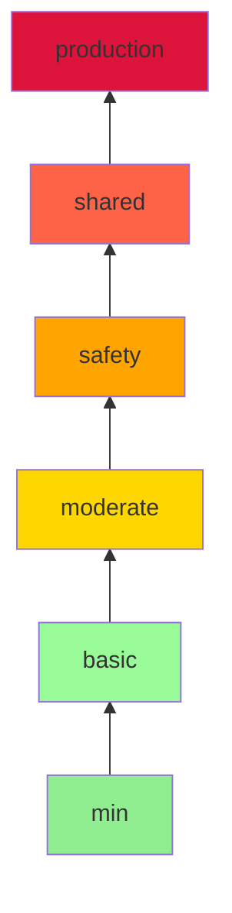

# How to Use ansible-lint Profiles (min, basic, moderate, safety, shared, production)

Author: [nawazdhandala](https://www.github.com/nawazdhandala)

Tags: Ansible, ansible-lint, Profiles, Best Practices

Description: Understand and choose the right ansible-lint profile for your project, from minimal checks to production-grade enforcement, with examples for each level.

---

ansible-lint profiles are a way to group rules by strictness level. Instead of manually enabling or disabling individual rules, you pick a profile and ansible-lint activates the appropriate set of checks. Each profile includes all the rules from the profiles below it, creating a layered system that you can gradually tighten.

This post explains each profile, what rules it includes, and when to use it.

## The Profile Hierarchy

Profiles stack on top of each other. If you choose `moderate`, you get all rules from `min`, `basic`, and `moderate`.



## Setting a Profile

Set the profile in your `.ansible-lint` configuration file:

```yaml
# .ansible-lint - Set the profile
---
profile: moderate
```

Or from the command line:

```bash
# Override profile from CLI
ansible-lint -p production playbook.yml
ansible-lint --profile safety playbook.yml
```

## Profile: min

The `min` profile is the least strict. It only checks for things that would cause Ansible itself to fail or produce obviously wrong results.

**Rules included:**
- `internal-error`: Catches ansible-lint internal errors
- `load-failure`: Files that cannot be parsed
- `parser-error`: YAML parsing errors
- `syntax-check`: Basic Ansible syntax validation

**When to use:** Start here if you have a very large legacy codebase and just want to make sure nothing is completely broken.

```yaml
# .ansible-lint - Minimal checking
---
profile: min
```

Example of what `min` catches:

```yaml
# This has a syntax error that min will catch
---
- name: Broken playbook
  hosts: all
  tasks:
    - name: Missing module
      this_module_does_not_exist:
        param: value
```

## Profile: basic

The `basic` profile adds rules about common mistakes that could lead to unexpected behavior.

**Rules added on top of min:**
- `command-instead-of-module`: Using shell/command when a module exists
- `command-instead-of-shell`: Using shell when command would suffice
- `deprecated-bare-vars`: Using bare variables without Jinja2 braces
- `deprecated-local-action`: Using `local_action` instead of `delegate_to`
- `deprecated-module`: Using modules that are deprecated
- `inline-env-var`: Setting environment variables inline in commands
- `key-order[task]`: Task key ordering
- `literal-compare`: Using `when: result == True` instead of `when: result`
- `jinja[spacing]`: Jinja2 template spacing
- `no-free-form`: Using free-form syntax instead of proper module parameters
- `no-jinja-when`: Using `{{ }}` in `when` conditions
- `no-tabs`: Tabs in YAML files
- `partial-become[task]`: Setting become without become_user
- `playbook-extension`: Playbook files should use .yml extension
- `role-name`: Role names should match expectations
- `schema`: YAML schema validation
- `name`: Various task naming rules
- `var-naming`: Variable naming conventions
- `yaml`: YAML formatting rules

**When to use:** Good starting point for existing projects that have basic standards but have not been linted before.

```yaml
# .ansible-lint - Basic checking
---
profile: basic

# You will likely need to skip some rules initially
skip_list:
  - yaml[line-length]
```

Example of what `basic` catches that `min` does not:

```yaml
# basic catches using shell when command works
- name: List files
  ansible.builtin.shell: ls -la /var/log  # Should use command, not shell

# basic catches deprecated bare variables
- name: Install package
  ansible.builtin.apt:
    name: my_package_var  # Should be {{ my_package_var }}
    state: present
```

## Profile: moderate

The `moderate` profile adds rules about best practices and maintainability.

**Rules added on top of basic:**
- `name[template]`: Task names should not use Jinja2 templates
- `name[imperative]`: Task names should start with a capital letter (verb)
- `spell-var-name`: Variable names should be meaningful
- Additional YAML formatting rules

**When to use:** This is the sweet spot for most active projects. It enforces good practices without being overly strict.

```yaml
# .ansible-lint - Moderate checking (recommended for most teams)
---
profile: moderate

exclude_paths:
  - .cache/
  - roles/external/
```

Example of what `moderate` catches:

```yaml
# moderate catches template usage in task names
- name: "Install {{ package_name }}"  # Bad: template in name
  ansible.builtin.apt:
    name: "{{ package_name }}"
    state: present

# Preferred: static task name
- name: Install the required application package
  ansible.builtin.apt:
    name: "{{ package_name }}"
    state: present
```

## Profile: safety

The `safety` profile adds rules focused on security and safe operations.

**Rules added on top of moderate:**
- `latest[git]`: Git operations should specify a version
- `latest[hg]`: Mercurial operations should specify a version
- `latest[pip]`: pip should install specific versions
- `risky-file-permissions`: File tasks should set explicit permissions
- `risky-octal`: Octal permissions should be quoted strings
- `risky-shell-pipe`: Shell pipes can hide errors

**When to use:** For infrastructure that handles sensitive data or runs in regulated environments.

```yaml
# .ansible-lint - Safety-focused checking
---
profile: safety
```

Example of what `safety` catches:

```yaml
# safety catches missing file permissions
- name: Copy config file
  ansible.builtin.copy:
    src: app.conf
    dest: /etc/myapp/app.conf
    # Missing mode! safety will flag this

# Fixed version:
- name: Copy config file
  ansible.builtin.copy:
    src: app.conf
    dest: /etc/myapp/app.conf
    owner: root
    group: root
    mode: "0644"

# safety catches unversioned pip installs
- name: Install Python packages
  ansible.builtin.pip:
    name: requests  # No version pinned!

# Fixed:
- name: Install Python packages
  ansible.builtin.pip:
    name: requests==2.31.0
```

## Profile: shared

The `shared` profile is designed for code that will be shared publicly, like Ansible Galaxy roles and collections.

**Rules added on top of safety:**
- `galaxy[no-changelog]`: Roles/collections should have a changelog
- `galaxy[version-incorrect]`: Version in galaxy.yml should follow semver
- `galaxy[no-runtime]`: Collections should have meta/runtime.yml
- `meta-incorrect`: Role meta information should be complete
- `meta-no-tags`: Roles should have tags in meta
- `meta-video-links`: Video links in meta should be valid
- `meta-runtime[unsupported-version]`: Runtime version checks

**When to use:** When you are developing roles or collections that will be published to Ansible Galaxy or shared across organizations.

```yaml
# .ansible-lint - For public roles/collections
---
profile: shared
```

Example requirements that `shared` enforces in a role:

```yaml
# roles/webserver/meta/main.yml - shared profile requires complete metadata
---
galaxy_info:
  author: your_name
  description: Installs and configures nginx web server
  company: Your Company
  license: MIT
  min_ansible_version: "2.14"
  platforms:
    - name: Ubuntu
      versions:
        - jammy
        - noble
    - name: Debian
      versions:
        - bookworm
  galaxy_tags:
    - nginx
    - webserver
    - web
dependencies: []
```

## Profile: production

The `production` profile is the strictest. It includes everything and adds rules that enforce the highest standards.

**Rules added on top of shared:**
- `avoid-implicit`: Avoid relying on implicit behaviors
- `sanity[cannot-ignore]`: Cannot ignore certain sanity checks
- `fqcn`: Strict FQCN enforcement everywhere

**When to use:** For mission-critical infrastructure where every playbook must meet the highest quality standards. Most teams will not need this level of strictness.

```yaml
# .ansible-lint - Maximum strictness
---
profile: production
```

## Comparing Profiles Side by Side

Here is a quick comparison to help you decide:

```yaml
# test_playbook.yml - This playbook triggers various rule levels
---
- name: Test different profiles
  hosts: localhost
  tasks:
    # min: would catch syntax errors only
    # basic: catches missing FQCN, yaml formatting
    - name: install package
      apt:
        name: nginx

    # moderate: catches lowercase task name
    # safety: catches missing mode on copy
    - name: copy file
      ansible.builtin.copy:
        src: test.txt
        dest: /tmp/test.txt

    # production: catches everything above plus implicit behaviors
    - name: Run a quick check
      ansible.builtin.command: echo hello
```

Results by profile:

```bash
# min: 0 violations (no syntax errors)
ansible-lint -p min test_playbook.yml

# basic: ~3 violations (fqcn, yaml issues)
ansible-lint -p basic test_playbook.yml

# moderate: ~4 violations (adds naming issues)
ansible-lint -p moderate test_playbook.yml

# safety: ~5 violations (adds file permissions)
ansible-lint -p safety test_playbook.yml

# production: ~6 violations (adds implicit behavior flags)
ansible-lint -p production test_playbook.yml
```

## Migration Strategy

The best approach is to start at a lower profile and work your way up:

1. Start with `min` to establish a baseline
2. Move to `basic` and fix the violations
3. Stay at `moderate` for regular development
4. Use `safety` for sensitive infrastructure
5. Adopt `production` for shared roles and collections

```yaml
# Week 1: Start here
profile: min

# Week 2-3: After fixing basic issues
profile: basic
skip_list:
  - yaml[line-length]

# Month 2: Comfortable with linting
profile: moderate

# Month 3+: For critical infrastructure
profile: safety
```

Each step up adds a manageable number of new rules. Trying to jump straight to `production` on an existing codebase will produce an overwhelming number of violations and discourage your team from using the tool at all. Take it gradually and you will build genuinely better Ansible code over time.
