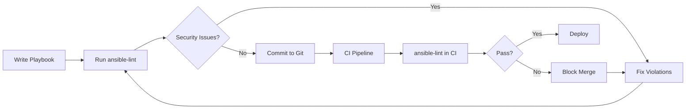

# How to Use ansible-lint to Check for Security Issues

Author: [nawazdhandala](https://www.github.com/nawazdhandala)

Tags: Ansible, ansible-lint, Security, DevOps, Automation

Description: Learn how to use ansible-lint security rules to catch vulnerabilities, hardcoded credentials, and risky patterns in your Ansible playbooks before they reach production.

---

If you have ever shipped a playbook to production only to realize later that it contained a hardcoded password or ran tasks with unnecessary elevated privileges, you know the sinking feeling that comes with it. The good news is that ansible-lint has a growing set of security-focused rules that can catch these problems long before deployment. In this guide, I will walk through how to configure and use ansible-lint specifically for security scanning, what rules matter most, and how to integrate security checks into your workflow.

## Why Security Linting Matters for Ansible

Ansible playbooks manage infrastructure at scale. A single misconfiguration can expose SSH keys, leave ports wide open, or grant excessive permissions across hundreds of servers. Static analysis with ansible-lint gives you a safety net that catches common security mistakes during development rather than after an incident.

The tool ships with several built-in rules that target security concerns, and you can extend it with custom rules for your organization's specific requirements.

## Installing ansible-lint

Before diving in, make sure you have a recent version installed. Security rules have been improved significantly in recent releases.

```bash
# Install the latest ansible-lint with pip
pip install ansible-lint --upgrade

# Verify the installed version
ansible-lint --version
```

You want version 6.0 or later since that is when many security-related rules were added or refined.

## Built-in Security Rules

ansible-lint ships with several rules that directly address security concerns. Here are the most important ones to know about.

### no-changed-when (command-instead-of-module)

When you use raw shell commands instead of Ansible modules, you lose idempotency and often bypass security controls that modules enforce.

```yaml
# BAD: Using shell to manage users bypasses Ansible's built-in protections
- name: Create application user
  shell: useradd -m appuser

# GOOD: The user module handles permissions, groups, and password hashing properly
- name: Create application user
  ansible.builtin.user:
    name: appuser
    state: present
    create_home: true
```

### no-log-password (risky-file-permissions)

This rule catches tasks that handle sensitive data without setting `no_log: true`, which would otherwise dump passwords and tokens into Ansible output logs.

```yaml
# BAD: Password will appear in plain text in ansible output and logs
- name: Set database password
  ansible.builtin.shell: |
    mysql -u root -p{{ db_root_password }} -e "ALTER USER 'app'@'localhost' IDENTIFIED BY '{{ db_app_password }}';"

# GOOD: Sensitive task output is suppressed from logs
- name: Set database password
  ansible.builtin.mysql_user:
    name: app
    password: "{{ db_app_password }}"
    login_user: root
    login_password: "{{ db_root_password }}"
  no_log: true
```

### risky-file-permissions

This rule flags file, copy, and template tasks that do not specify explicit permissions. Without explicit mode settings, files might inherit overly permissive umask defaults.

```yaml
# BAD: No mode specified, file permissions depend on umask
- name: Deploy application config
  ansible.builtin.copy:
    src: app.conf
    dest: /etc/myapp/app.conf

# GOOD: Explicit restrictive permissions set
- name: Deploy application config
  ansible.builtin.copy:
    src: app.conf
    dest: /etc/myapp/app.conf
    owner: appuser
    group: appgroup
    mode: "0640"
```

### risky-shell-pipe

Shell pipes can silently fail. If the first command in a pipeline fails but the second succeeds, Ansible reports success. This is a security concern because you might think a security script ran when it actually did not.

```yaml
# BAD: If the curl command fails, the pipe still returns success from tee
- name: Download and save security patches list
  ansible.builtin.shell: curl -s https://patches.example.com/list | tee /var/log/patches.txt

# GOOD: Use pipefail to catch failures at any point in the pipeline
- name: Download and save security patches list
  ansible.builtin.shell: |
    set -o pipefail
    curl -s https://patches.example.com/list | tee /var/log/patches.txt
  args:
    executable: /bin/bash
```

## Running Security-Focused Scans

You can run ansible-lint with only security-related tags to get a focused report.

```bash
# Run only security-related rules against your playbook
ansible-lint -t security playbook.yml

# List all available rules and filter for security-related ones
ansible-lint -L | grep -i security
```

To run a broader scan but ensure security rules are always enforced, create a configuration file.

```yaml
# .ansible-lint configuration file
# Place this in your project root

# Treat security warnings as errors (these must be fixed)
warn_list:
  - experimental

# Never skip these security-critical rules
enable_list:
  - no-log-password
  - risky-file-permissions
  - risky-shell-pipe
  - no-changed-when

# Fail on any security rule violation
strict: true
```

## Custom Security Rules

The built-in rules cover common cases, but your organization likely has specific security policies. You can write custom rules to enforce them.

Here is a custom rule that detects hardcoded IP addresses, which often indicate environments where proper DNS or inventory management is missing.

```python
# custom_rules/no_hardcoded_ips.py
"""Custom ansible-lint rule to detect hardcoded IP addresses in playbooks."""

import re
from ansiblelint.rules import AnsibleLintRule

class NoHardcodedIPs(AnsibleLintRule):
    """Tasks should not contain hardcoded IP addresses."""

    id = "custom-no-hardcoded-ips"
    shortdesc = "Hardcoded IP addresses detected"
    description = (
        "Using hardcoded IP addresses makes playbooks fragile and "
        "can indicate missing DNS configuration or inventory misuse."
    )
    severity = "MEDIUM"
    tags = ["security", "custom"]

    # Matches IPv4 addresses but excludes common safe ones like 127.0.0.1 and 0.0.0.0
    _ip_regex = re.compile(
        r"\b(?!127\.0\.0\.1|0\.0\.0\.0)(?:\d{1,3}\.){3}\d{1,3}\b"
    )

    def matchtask(self, task, file=None):
        """Check if task contains hardcoded IP addresses."""
        action = task.get("action", {})
        for key, value in action.items():
            if isinstance(value, str) and self._ip_regex.search(value):
                return self.create_matcherror(
                    message=f"Hardcoded IP found in '{key}': {value}",
                    filename=file,
                )
        return False
```

Load custom rules by pointing ansible-lint at your rules directory.

```bash
# Run ansible-lint with custom security rules included
ansible-lint -R -r ./custom_rules/ playbook.yml
```

## Security Scan Workflow

Here is how security linting fits into a typical development workflow.



## Integrating with CI/CD

For a GitLab CI pipeline, add a dedicated security lint stage.

```yaml
# .gitlab-ci.yml - Security linting stage
ansible-security-lint:
  stage: lint
  image: python:3.11-slim
  before_script:
    - pip install ansible-lint
  script:
    # Run with strict mode so any security violation fails the pipeline
    - ansible-lint --strict -t security playbooks/
  rules:
    - changes:
        - "playbooks/**/*.yml"
        - "roles/**/*.yml"
  allow_failure: false
```

For GitHub Actions, a similar approach works.

```yaml
# .github/workflows/security-lint.yml
name: Ansible Security Lint
on:
  pull_request:
    paths:
      - 'playbooks/**'
      - 'roles/**'

jobs:
  security-lint:
    runs-on: ubuntu-latest
    steps:
      - uses: actions/checkout@v4
      - name: Install ansible-lint
        run: pip install ansible-lint
      - name: Run security scan
        run: ansible-lint --strict -t security playbooks/
```

## Generating Security Reports

For compliance purposes, you might need to generate reports from your security scans.

```bash
# Output results in JSON format for processing by other tools
ansible-lint -f json playbook.yml > security-report.json

# Use codeclimate format for integration with code quality platforms
ansible-lint -f codeclimate playbook.yml > codeclimate-report.json
```

You can then parse these reports to track security issues over time or feed them into your security dashboard.

## Practical Tips

After running security scans on dozens of production Ansible codebases, here are the patterns I see most frequently:

1. **Missing no_log on credential tasks** - This is the most common finding. Any task that touches passwords, API keys, or tokens should have `no_log: true`.

2. **Overly permissive file modes** - Deploying config files without explicit mode settings is widespread. Default to `0644` for non-sensitive files and `0600` for anything containing secrets.

3. **Shell commands where modules exist** - Every shell or command task is a potential security gap. Always check if an Ansible module exists for what you are trying to do.

4. **Missing become directives** - Tasks that need root should explicitly declare `become: true` rather than running the entire playbook as root.

5. **Unvalidated external input** - If your playbooks accept variables from external sources, validate them before use with `assert` tasks.

Security linting is not a replacement for proper security reviews, but it catches the low-hanging fruit that accounts for the majority of configuration-related vulnerabilities. Make it part of your standard workflow and you will eliminate entire categories of security issues from your infrastructure code.
