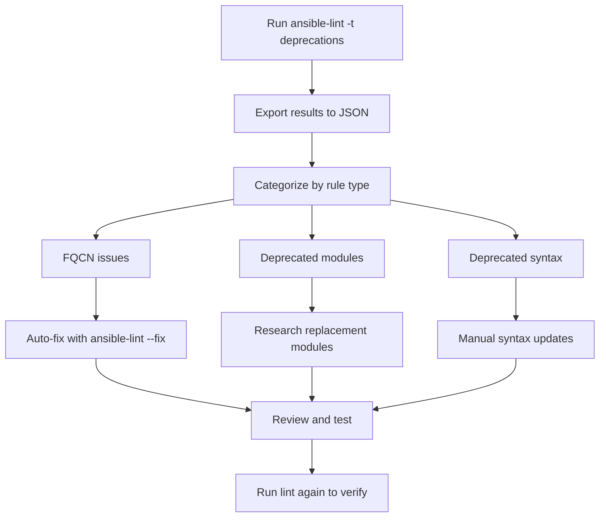

# How to Use ansible-lint to Detect Deprecated Syntax

Author: [nawazdhandala](https://www.github.com/nawazdhandala)

Tags: Ansible, ansible-lint, DevOps, Code Quality

Description: Learn how to use ansible-lint to find and fix deprecated syntax in your Ansible playbooks before upgrading to newer Ansible versions.

---

Ansible evolves quickly. Features get deprecated, module names change, and syntax that worked perfectly in Ansible 2.9 might throw warnings or break entirely in Ansible 2.16. If you manage a large collection of playbooks, keeping up with these changes manually is painful. That is where ansible-lint comes in. It can scan your entire codebase and flag every piece of deprecated syntax so you can fix things proactively rather than discovering problems during a production deployment.

## The Deprecation Problem

Every major Ansible release deprecates old patterns and introduces replacements. Some common examples include:

- The `include` keyword was replaced by `include_tasks` and `import_tasks`
- Short module names like `yum` should now be `ansible.builtin.yum` (FQCNs)
- The `sudo` keyword was replaced by `become`
- Various module parameters get renamed or removed across versions

If you have playbooks that were written over several years by different team members, there is a good chance you have a mix of old and new syntax scattered across your codebase.

## Setting Up ansible-lint for Deprecation Detection

Start by installing the latest version of ansible-lint since deprecation rules are updated with each release.

```bash
# Install or upgrade ansible-lint
pip install ansible-lint --upgrade

# Check which version you are running
ansible-lint --version
```

## Key Deprecation Rules

ansible-lint includes several rules specifically designed to catch deprecated syntax. Here are the most important ones.

### deprecated-module

This rule catches modules that have been deprecated and will be removed in future Ansible versions.

```yaml
# BAD: The 'docker' module was deprecated in favor of community.docker modules
- name: Start application container
  docker:
    name: myapp
    image: myapp:latest
    state: started

# GOOD: Use the current community collection module
- name: Start application container
  community.docker.docker_container:
    name: myapp
    image: myapp:latest
    state: started
```

### deprecated-command-syntax

Older playbooks often use the free-form command syntax which is now discouraged.

```yaml
# BAD: Free-form syntax for the command module
- name: Check disk space
  command: df -h /var creates=/tmp/disk_checked

# GOOD: Explicit parameter syntax is clearer and forward-compatible
- name: Check disk space
  ansible.builtin.command:
    cmd: df -h /var
    creates: /tmp/disk_checked
```

### fqcn (Fully Qualified Collection Name)

Starting with Ansible 2.10, modules should use fully qualified collection names. This is one of the biggest changes affecting existing playbooks.

```yaml
# BAD: Short module names are deprecated
- name: Install packages
  yum:
    name: httpd
    state: present

- name: Start service
  service:
    name: httpd
    state: started

# GOOD: Use fully qualified collection names
- name: Install packages
  ansible.builtin.yum:
    name: httpd
    state: present

- name: Start service
  ansible.builtin.service:
    name: httpd
    state: started
```

### deprecated-local-action

The `local_action` syntax was replaced by `delegate_to: localhost`.

```yaml
# BAD: local_action is deprecated
- name: Check if API is reachable
  local_action:
    module: ansible.builtin.uri
    url: "https://api.example.com/health"

# GOOD: Use delegate_to instead
- name: Check if API is reachable
  ansible.builtin.uri:
    url: "https://api.example.com/health"
  delegate_to: localhost
```

## Running Deprecation-Focused Scans

You can target only deprecation rules to get a focused view of what needs updating.

```bash
# Run only deprecation-related rules
ansible-lint -t deprecations playbook.yml

# Scan an entire directory of playbooks for deprecated syntax
ansible-lint -t deprecations playbooks/

# Scan roles as well
ansible-lint -t deprecations roles/ playbooks/
```

To see all available deprecation rules, list them.

```bash
# List all rules and filter for deprecation-related ones
ansible-lint -L 2>&1 | grep -i deprecat
```

## Configuration for Deprecation Scanning

Create an `.ansible-lint` configuration file in your project root to customize the behavior.

```yaml
# .ansible-lint
# Focus on deprecation detection across the project

# Enable strict mode to treat warnings as errors
strict: true

# Specify the Ansible version you are targeting
# This helps ansible-lint know which deprecations apply
# mock_modules and mock_roles help with scanning without full dependencies

# Paths to scan
exclude_paths:
  - .cache/
  - .git/
  - tests/fixtures/  # Skip test fixtures that intentionally use old syntax

# Enable all deprecation-related rules
enable_list:
  - fqcn
  - deprecated-module
  - deprecated-command-syntax
  - deprecated-local-action

# These are warnings you want to track but not block on yet
warn_list:
  - fqcn[action-core]  # Warn on missing FQCN for core modules
  - fqcn[action]       # Warn on missing FQCN for non-core modules
```

## Building a Deprecation Migration Plan

When you first run ansible-lint on a large codebase, the number of deprecation warnings can be overwhelming. Here is a practical approach to tackling them.



Start by exporting the results to JSON so you can analyze the scope of changes needed.

```bash
# Export deprecation findings to a JSON file for analysis
ansible-lint -t deprecations -f json playbooks/ > deprecation-report.json

# Count issues by rule type using jq
cat deprecation-report.json | python3 -c "
import json, sys
from collections import Counter
data = json.load(sys.stdin)
counts = Counter(item['rule']['id'] for item in data)
for rule, count in counts.most_common():
    print(f'{rule}: {count} occurrences')
"
```

## Handling FQCN Migration

FQCN migration is usually the biggest task. Here is a mapping of common module name changes.

```yaml
# Common FQCN mappings - save this as a reference
# Old name -> New FQCN

# Package management
# yum -> ansible.builtin.yum
# apt -> ansible.builtin.apt
# pip -> ansible.builtin.pip

# File operations
# copy -> ansible.builtin.copy
# template -> ansible.builtin.template
# file -> ansible.builtin.file
# lineinfile -> ansible.builtin.lineinfile

# System
# service -> ansible.builtin.service
# systemd -> ansible.builtin.systemd
# user -> ansible.builtin.user
# group -> ansible.builtin.group
# cron -> ansible.builtin.cron

# Commands
# command -> ansible.builtin.command
# shell -> ansible.builtin.shell
# raw -> ansible.builtin.raw
# script -> ansible.builtin.script

# Networking
# uri -> ansible.builtin.uri
# get_url -> ansible.builtin.get_url

# Facts and variables
# set_fact -> ansible.builtin.set_fact
# debug -> ansible.builtin.debug
# assert -> ansible.builtin.assert
```

## Integrating into CI/CD

Add deprecation checks to your CI pipeline to prevent new deprecated syntax from entering the codebase.

```yaml
# GitHub Actions workflow for deprecation checking
name: Deprecation Check
on:
  pull_request:
    paths:
      - '**.yml'
      - '**.yaml'

jobs:
  check-deprecations:
    runs-on: ubuntu-latest
    steps:
      - uses: actions/checkout@v4

      - name: Set up Python
        uses: actions/setup-python@v5
        with:
          python-version: '3.11'

      - name: Install ansible-lint
        run: pip install ansible-lint

      # Run deprecation scan and capture the output
      - name: Check for deprecated syntax
        run: |
          ansible-lint -t deprecations --strict playbooks/ roles/
```

## Version-Specific Deprecation Profiles

Different Ansible versions deprecate different things. If you are planning an upgrade, scan against the target version's rules.

```bash
# Check what will break when upgrading to a specific version
# Install the ansible-lint version that matches your target Ansible release

# Create a virtual environment for testing
python3 -m venv /tmp/lint-test
source /tmp/lint-test/bin/activate

# Install the specific version of ansible-lint
pip install ansible-lint==6.22.0

# Run the scan
ansible-lint -t deprecations playbooks/

# Clean up
deactivate
```

## Suppressing Known Deprecations Temporarily

Sometimes you need to acknowledge a deprecation but cannot fix it immediately, perhaps because you depend on a collection that has not been updated yet.

```yaml
# Temporarily suppress a specific deprecation with an inline comment
- name: Use legacy module until collection is updated
  old_module_name:  # noqa: deprecated-module
    param: value

# Or suppress in the config file for project-wide exceptions
# .ansible-lint
skip_list:
  - deprecated-module[specific-module]  # Track as tech debt
```

Always add comments explaining why the suppression exists and when it should be removed. Otherwise these suppressions become permanent and defeat the purpose of deprecation scanning.

## Tracking Progress Over Time

If you are migrating a large codebase, track your progress by running periodic scans and comparing results.

```bash
# Generate a deprecation count baseline
ansible-lint -t deprecations -f json playbooks/ 2>/dev/null | \
  python3 -c "import json,sys; print(len(json.load(sys.stdin)))" > baseline.txt

# After making fixes, compare
ansible-lint -t deprecations -f json playbooks/ 2>/dev/null | \
  python3 -c "import json,sys; print(len(json.load(sys.stdin)))" > current.txt

echo "Baseline: $(cat baseline.txt) issues"
echo "Current:  $(cat current.txt) issues"
```

Deprecation scanning is not glamorous work, but it is the kind of maintenance that prevents nasty surprises during upgrades. Running ansible-lint with deprecation rules as part of your regular workflow means you will always know exactly where your playbooks stand in terms of compatibility with current and upcoming Ansible releases. Fix things incrementally, and major version upgrades become a non-event instead of a fire drill.
