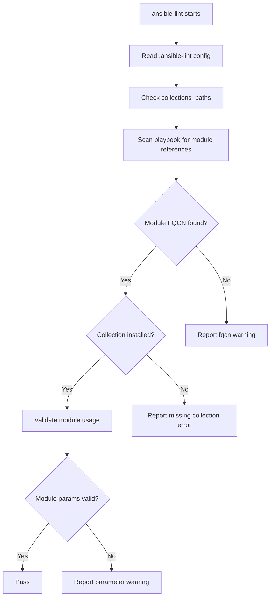

# How to Use ansible-lint with Collections

Author: [nawazdhandala](https://www.github.com/nawazdhandala)

Tags: Ansible, ansible-lint, Collections, Code Quality

Description: Learn how to configure ansible-lint to work with Ansible collections including linting collection content, resolving dependencies, and handling FQCN.

---

Ansible collections are the standard way to distribute Ansible content, including modules, roles, plugins, and playbooks. As you adopt collections in your projects or develop your own, you need ansible-lint to understand and validate collection content. The linting experience with collections differs from linting plain playbooks, and there are specific configurations and gotchas to be aware of.

This post covers linting playbooks that use collections, linting the collection content itself, and handling common issues.

## Linting Playbooks That Use Collections

When your playbooks reference modules from external collections, ansible-lint needs those collections installed to validate the references.

### Install Collections First

Create a `requirements.yml` file listing all collections your project depends on:

```yaml
# collections/requirements.yml - Collection dependencies
---
collections:
  - name: community.general
    version: ">=8.0.0"
  - name: community.docker
    version: ">=3.0.0"
  - name: amazon.aws
    version: ">=7.0.0"
  - name: ansible.posix
    version: ">=1.5.0"
  - name: community.postgresql
    version: ">=3.0.0"
  - name: kubernetes.core
    version: ">=3.0.0"
```

Install them before running ansible-lint:

```bash
# Install collections to the default path
ansible-galaxy collection install -r collections/requirements.yml

# Or install to a project-local path
ansible-galaxy collection install -r collections/requirements.yml -p ./collections/
```

### Configure Collection Paths

Tell ansible-lint where to find your collections:

```yaml
# .ansible-lint - Configure collection paths
---
profile: moderate

# If collections are installed in a custom path
# collections_paths:
#   - ./collections/
```

Also set it in `ansible.cfg`:

```ini
# ansible.cfg - Collection paths
[defaults]
collections_path = ./collections:~/.ansible/collections
```

### Handling Missing Collections

If a collection is not installed, ansible-lint will report errors about unknown modules. You can handle this in two ways:

```yaml
# Option 1: Skip FQCN checks for missing collections (not recommended)
# .ansible-lint
skip_list:
  - fqcn[action]

# Option 2: Use offline mode (prevents network access but requires local collections)
# .ansible-lint
offline: true
```

The better approach is to always install all required collections.

## Linting Collection Content

If you are developing your own collection, ansible-lint can validate the entire collection structure.

### Collection Directory Structure

```
my_namespace/
  my_collection/
    galaxy.yml
    meta/
      runtime.yml
    plugins/
      modules/
        my_module.py
    roles/
      my_role/
        tasks/
          main.yml
        defaults/
          main.yml
        meta/
          main.yml
    playbooks/
      setup.yml
    tests/
      integration/
        targets/
```

### Running ansible-lint on a Collection

Navigate to the collection root and run ansible-lint:

```bash
# From the collection root directory
cd collections/ansible_collections/my_namespace/my_collection
ansible-lint
```

Or specify the path:

```bash
ansible-lint collections/ansible_collections/my_namespace/my_collection/
```

### Collection-Specific Configuration

```yaml
# .ansible-lint - Configuration for collection development
---
profile: shared  # Use 'shared' profile for publishable collections

exclude_paths:
  - tests/output/
  - .cache/

# Enable collection-specific rules
enable_list:
  - galaxy[no-changelog]
  - galaxy[version-incorrect]
```

## Validating galaxy.yml

ansible-lint checks your `galaxy.yml` for completeness and correctness:

```yaml
# galaxy.yml - Collection metadata that ansible-lint validates
---
namespace: my_namespace
name: my_collection
version: 1.2.3
readme: README.md
authors:
  - Your Name <your.email@example.com>
description: A collection for managing custom infrastructure
license:
  - GPL-3.0-or-later
license_file: LICENSE
tags:
  - infrastructure
  - automation
  - cloud
repository: https://github.com/myorg/my-collection
documentation: https://github.com/myorg/my-collection/docs
homepage: https://github.com/myorg/my-collection
issues: https://github.com/myorg/my-collection/issues
build_ignore:
  - .gitignore
  - .github
  - tests/output
```

Rules ansible-lint checks for galaxy.yml:

- **galaxy[no-changelog]**: Collection should have a changelog
- **galaxy[version-incorrect]**: Version should follow semantic versioning
- **galaxy[no-runtime]**: Collection should have `meta/runtime.yml`

## Validating meta/runtime.yml

The `meta/runtime.yml` file declares module routing and version requirements:

```yaml
# meta/runtime.yml - Module routing and version info
---
requires_ansible: ">=2.14.0"
action_groups:
  my_group:
    - my_module
    - my_other_module
plugin_routing:
  modules:
    old_module_name:
      redirect: my_namespace.my_collection.new_module_name
      deprecation:
        removal_version: "2.0.0"
        warning_text: Use new_module_name instead.
```

## FQCN Enforcement with Collections

When using collections, always use fully qualified names. ansible-lint strictly enforces this:

```yaml
# Bad: short module name (ansible-lint will warn)
- name: Use community module
  postgresql_db:
    name: mydb
    state: present

# Good: fully qualified collection name
- name: Use community module
  community.postgresql.postgresql_db:
    name: mydb
    state: present
```

Even within a collection itself, use FQCN when calling modules from other collections:

```yaml
# roles/my_role/tasks/main.yml - Inside a collection role
---
- name: Install dependencies
  ansible.builtin.apt:  # FQCN even for builtins
    name: "{{ item }}"
    state: present
  loop: "{{ my_role_packages }}"

- name: Configure PostgreSQL
  community.postgresql.postgresql_conf:  # FQCN for collection modules
    name: max_connections
    value: "200"
```

## Linting Roles Within Collections

Roles inside collections follow the same rules as standalone roles, plus collection-specific requirements:

```yaml
# roles/webserver/meta/main.yml - Role metadata inside a collection
---
galaxy_info:
  author: your_name
  description: Configures nginx web server
  min_ansible_version: "2.14"
  platforms:
    - name: Ubuntu
      versions:
        - jammy
  galaxy_tags:
    - nginx
    - web
dependencies: []
```

```yaml
# roles/webserver/tasks/main.yml - Tasks in a collection role
---
- name: Install nginx
  ansible.builtin.apt:
    name: nginx
    state: present
  when: ansible_os_family == "Debian"

- name: Deploy nginx configuration
  ansible.builtin.template:
    src: nginx.conf.j2
    dest: /etc/nginx/nginx.conf
    owner: root
    group: root
    mode: "0644"
  notify: Restart nginx
```

## CI Pipeline for Collection Linting

Here is a CI workflow for linting a collection:

```yaml
# .github/workflows/collection-lint.yml - Lint Ansible collection
---
name: Collection Lint

on:
  push:
    branches: [main]
  pull_request:
    branches: [main]

jobs:
  lint:
    runs-on: ubuntu-latest
    steps:
      - name: Check out collection
        uses: actions/checkout@v4
        with:
          path: ansible_collections/my_namespace/my_collection

      - name: Set up Python
        uses: actions/setup-python@v5
        with:
          python-version: "3.12"

      - name: Install dependencies
        run: pip install ansible-lint

      - name: Install collection dependencies
        run: |
          cd ansible_collections/my_namespace/my_collection
          if [ -f requirements.yml ]; then
            ansible-galaxy collection install -r requirements.yml
          fi

      - name: Run ansible-lint
        run: ansible-lint ansible_collections/my_namespace/my_collection/
```

## Dependency Resolution Flow

Here is how ansible-lint resolves collection dependencies:



## Common Issues and Solutions

**Issue: "Could not resolve collection" error.**
Install the missing collection with `ansible-galaxy collection install`.

**Issue: ansible-lint does not find locally developed collection.**
Make sure your collection is in a path that follows the `ansible_collections/namespace/name/` structure. ansible-lint requires this directory hierarchy.

**Issue: Conflicting collection versions.**
Check for version conflicts in your requirements.yml. Pin specific versions rather than using ranges to avoid surprises.

Working with collections and ansible-lint together requires a bit more setup than plain playbooks, but it results in much more maintainable and portable Ansible content. Install your dependencies, use FQCN everywhere, and choose the appropriate profile for your collection's intended audience.
