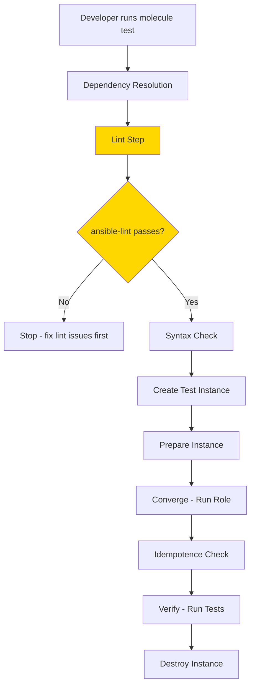

# How to Use ansible-lint with Molecule

Author: [nawazdhandala](https://www.github.com/nawazdhandala)

Tags: Ansible, ansible-lint, Molecule, Testing

Description: Integrate ansible-lint with Molecule testing framework to automatically lint your roles and playbooks as part of the testing workflow.

---

Molecule is the standard testing framework for Ansible roles. It creates test instances, runs your role against them, verifies the results, and tears everything down. What many people miss is that Molecule has built-in integration with ansible-lint. By default, Molecule runs ansible-lint as part of its testing sequence before it even creates the test instances. This means your role gets linted automatically every time you run `molecule test`.

In this post, we will cover how this integration works, how to configure it, and how to handle common issues.

## How Molecule Runs ansible-lint

Molecule's default test sequence includes a `lint` step. Here is the full default sequence:

```
dependency -> lint -> cleanup -> destroy -> syntax -> create -> prepare -> converge -> idempotence -> side_effect -> verify -> cleanup -> destroy
```

The `lint` step runs ansible-lint against your role's Molecule converge playbook and the role itself. If linting fails, Molecule stops and does not proceed to creating instances, saving you time.

## Setting Up Molecule with ansible-lint

If you are starting a new role with Molecule:

```bash
# Install molecule and ansible-lint
pip install molecule ansible-lint

# Initialize a new role with Molecule
molecule init role my_namespace.webserver
cd webserver
```

This creates the standard Molecule directory structure:

```
webserver/
  defaults/
    main.yml
  handlers/
    main.yml
  meta/
    main.yml
  molecule/
    default/
      molecule.yml
      converge.yml
      verify.yml
  tasks/
    main.yml
  vars/
    main.yml
```

## Molecule Configuration

The `molecule.yml` file controls how Molecule interacts with ansible-lint:

```yaml
# molecule/default/molecule.yml - Basic Molecule config with lint
---
dependency:
  name: galaxy

driver:
  name: docker

platforms:
  - name: instance
    image: ubuntu:22.04
    pre_build_image: true
    command: /sbin/init
    privileged: true
    volumes:
      - /sys/fs/cgroup:/sys/fs/cgroup:rw
    cgroupns_mode: host

provisioner:
  name: ansible
  lint:
    name: ansible-lint

verifier:
  name: ansible
```

In recent versions of Molecule (v5+), the lint configuration has moved. The linter is configured separately:

```yaml
# molecule/default/molecule.yml - Molecule v5+ configuration
---
dependency:
  name: galaxy

driver:
  name: docker

platforms:
  - name: instance
    image: ubuntu:22.04
    pre_build_image: true

provisioner:
  name: ansible

verifier:
  name: ansible
```

And ansible-lint is configured via your `.ansible-lint` file in the role root.

## The Converge Playbook

The converge playbook is what Molecule runs to test your role. ansible-lint checks this playbook too:

```yaml
# molecule/default/converge.yml - Molecule converge playbook
---
- name: Converge
  hosts: all
  become: true
  tasks:
    - name: Include the webserver role
      ansible.builtin.include_role:
        name: webserver
      vars:
        webserver_port: 8080
        webserver_document_root: /var/www/test
```

Keep the converge playbook clean and lint-compliant. Use FQCN, name your tasks, and follow all the same standards as your production playbooks.

## Excluding Molecule Files from Linting

You might want to exclude Molecule test files from your project-level ansible-lint run. Molecule converge playbooks sometimes use patterns (like `hosts: all`) that you would not use in production:

```yaml
# .ansible-lint - Exclude molecule from project-level linting
---
profile: moderate

exclude_paths:
  - molecule/
  - .cache/
```

However, when you run `molecule test` or `molecule lint`, Molecule runs ansible-lint against its own files independently. This means the converge playbook still gets linted during Molecule's test cycle.

## Running Just the Lint Step

You do not have to run the full Molecule test cycle to check linting. Run just the lint step:

```bash
# Run only the lint step
molecule lint

# Or run just ansible-lint directly against the role
ansible-lint
```

## Configuring ansible-lint for Molecule

Create a `.ansible-lint` file in your role root that works for both direct ansible-lint runs and Molecule:

```yaml
# .ansible-lint - Configuration for role with Molecule
---
profile: moderate

exclude_paths:
  - .cache/
  - .git/

# Molecule converge playbooks may have patterns
# that differ from production standards
# You can exclude them or adjust rules
warn_list:
  - experimental

skip_list:
  - yaml[line-length]
```

## Multi-Scenario Molecule Setup

Roles often have multiple Molecule scenarios for different operating systems or configurations:

```
molecule/
  default/
    molecule.yml
    converge.yml
  debian/
    molecule.yml
    converge.yml
  centos/
    molecule.yml
    converge.yml
  cluster/
    molecule.yml
    converge.yml
    prepare.yml
```

Each scenario's converge playbook gets linted when you run that scenario:

```bash
# Lint the default scenario
molecule lint

# Lint a specific scenario
molecule lint -s debian

# Lint all scenarios
for scenario in molecule/*/; do
  scenario_name=$(basename "$scenario")
  echo "Linting scenario: $scenario_name"
  molecule lint -s "$scenario_name"
done
```

## Handling Prepare and Verify Playbooks

Molecule's prepare and verify playbooks also get linted. Keep them clean:

```yaml
# molecule/default/prepare.yml - Prepare playbook (lint-compliant)
---
- name: Prepare test instance
  hosts: all
  become: true
  gather_facts: true
  tasks:
    - name: Update apt cache
      ansible.builtin.apt:
        update_cache: true
        cache_valid_time: 3600
      when: ansible_os_family == "Debian"

    - name: Install prerequisite packages
      ansible.builtin.package:
        name:
          - python3
          - sudo
        state: present
```

```yaml
# molecule/default/verify.yml - Verify playbook (lint-compliant)
---
- name: Verify web server configuration
  hosts: all
  gather_facts: true
  become: true
  tasks:
    - name: Check if nginx is installed
      ansible.builtin.package:
        name: nginx
        state: present
      check_mode: true
      register: nginx_check
      failed_when: nginx_check.changed

    - name: Check if nginx is running
      ansible.builtin.systemd:
        name: nginx
      register: nginx_service

    - name: Verify nginx is active
      ansible.builtin.assert:
        that:
          - nginx_service.status.ActiveState == "active"
        fail_msg: "nginx is not running"
        success_msg: "nginx is running"

    - name: Test HTTP response
      ansible.builtin.uri:
        url: "http://localhost:{{ webserver_port | default(80) }}"
        return_content: true
        status_code: 200
      register: http_response

    - name: Verify HTTP response content
      ansible.builtin.assert:
        that:
          - "'Welcome' in http_response.content"
        fail_msg: "Unexpected HTTP response"
```

## CI Pipeline with Molecule and ansible-lint

Here is a GitHub Actions workflow that runs Molecule (which includes linting):

```yaml
# .github/workflows/molecule.yml - CI with Molecule and ansible-lint
---
name: Molecule Test

on:
  push:
    branches: [main]
  pull_request:
    branches: [main]

jobs:
  lint:
    name: Lint
    runs-on: ubuntu-latest
    steps:
      - name: Check out code
        uses: actions/checkout@v4

      - name: Set up Python
        uses: actions/setup-python@v5
        with:
          python-version: "3.12"
          cache: "pip"

      - name: Install dependencies
        run: pip install ansible-lint yamllint

      - name: Run ansible-lint
        run: ansible-lint

  molecule:
    name: Molecule
    runs-on: ubuntu-latest
    needs: lint
    strategy:
      matrix:
        scenario:
          - default
          - debian
    steps:
      - name: Check out code
        uses: actions/checkout@v4

      - name: Set up Python
        uses: actions/setup-python@v5
        with:
          python-version: "3.12"
          cache: "pip"

      - name: Install dependencies
        run: pip install molecule molecule-plugins[docker] ansible-lint

      - name: Run Molecule tests
        run: molecule test -s ${{ matrix.scenario }}
```

## Workflow Diagram



## Debugging Molecule Lint Failures

When Molecule's lint step fails, the output can be less detailed than running ansible-lint directly. For better diagnostics:

```bash
# Run ansible-lint directly with verbose output
ansible-lint -vv

# Or run Molecule with debug logging
molecule --debug lint

# Check which files Molecule is linting
molecule lint 2>&1 | head -50
```

## Tips for Smooth Integration

1. **Run ansible-lint before molecule test.** It is faster to catch lint issues with a direct ansible-lint run than to wait for Molecule to get to the lint step.

2. **Use the same `.ansible-lint` config for both.** Do not maintain separate configs for Molecule and direct linting. One config file at the role root serves both.

3. **Keep converge playbooks simple.** They should just call your role with test variables. Do not put complex logic in them.

4. **Treat Molecule lint failures the same as test failures.** If the lint step fails, fix it before writing more tests.

5. **Pin your tool versions.** Use a `requirements.txt` to pin ansible-lint and Molecule versions so everyone gets consistent results.

```
# requirements.txt - Pin linting and testing tool versions
ansible-lint==24.10.0
molecule==24.9.0
molecule-plugins[docker]==23.5.3
yamllint==1.35.1
```

Molecule and ansible-lint together give you a complete quality gate for your roles: lint catches code quality issues, and Molecule tests catch functional issues. Run both in CI and you will have high confidence in every change.
