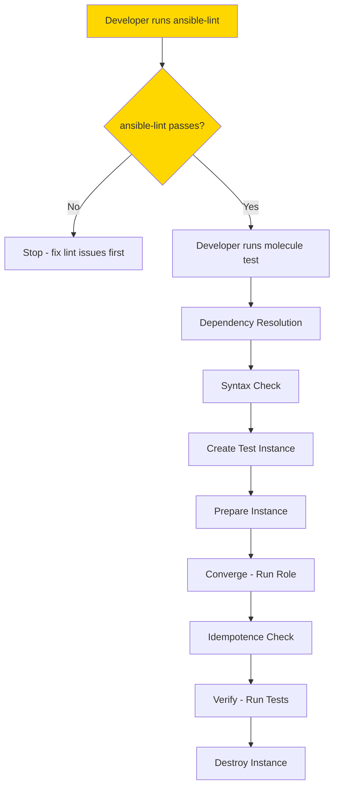

# How to Use ansible-lint with Molecule

Author: [nawazdhandala](https://www.github.com/nawazdhandala)

Tags: Ansible, ansible-lint, Molecule, Testing

Description: Integrate ansible-lint with Molecule testing framework to automatically lint your roles and playbooks as part of the testing workflow.

---

Molecule is the standard testing framework for Ansible roles. It creates test instances, runs your role against them, verifies the results, and tears everything down. ansible-lint is the companion tool that checks your role and playbooks before you spend time creating test instances. In current Molecule versions, linting is run as a separate command before `molecule test`, usually in the same local workflow or CI pipeline.

In this post, we will cover how this integration works, how to configure it, and how to handle common issues.

## How ansible-lint Fits with Molecule

Molecule's current default test sequence does not include a `lint` step. Here is the default sequence:

```text
dependency -> cleanup -> destroy -> syntax -> create -> prepare -> converge -> idempotence -> side_effect -> verify -> cleanup -> destroy
```

Run ansible-lint before this sequence so it checks your role, playbooks, and Molecule scenario files. If linting fails, stop before running `molecule test`, saving you time.

## Setting Up Molecule with ansible-lint

If you are starting a new role with Molecule:

```bash
# Install molecule and ansible-lint

pip install molecule molecule-plugins[docker] ansible-lint

# Initialize an Ansible role, then add a Molecule scenario
ansible-galaxy role init webserver
cd webserver
molecule init scenario
```

This creates the standard Molecule directory structure:

```text
webserver/
  defaults/
    main.yml
  handlers/
    main.yml
  meta/
    main.yml
  molecule/
    default/
      molecule.yml
      converge.yml
      verify.yml
  tasks/
    main.yml
  vars/
    main.yml
```

## Molecule Configuration

The `molecule.yml` file controls Molecule's test scenario. ansible-lint is configured separately:

```yaml
# molecule/default/molecule.yml - Molecule configuration
---
dependency:
  name: galaxy

driver:
  name: docker

platforms:
  - name: instance
    image: ubuntu:22.04
    pre_build_image: true

provisioner:
  name: ansible

verifier:
  name: ansible
```

Do not add the old `provisioner.lint` configuration you may see in older examples. Current Molecule does not use it. Configure ansible-lint via your `.ansible-lint` file in the role root and run `ansible-lint` directly.

## The Converge Playbook

The converge playbook is what Molecule runs to test your role. ansible-lint checks this playbook too when it is included in your ansible-lint run:

```yaml
# molecule/default/converge.yml - Molecule converge playbook
---
- name: Converge
  hosts: all
  become: true
  tasks:
    - name: Include the webserver role
      ansible.builtin.include_role:
        name: webserver
      vars:
        webserver_port: 8080
        webserver_document_root: /var/www/test
```

Keep the converge playbook clean and lint-compliant. Use FQCN, name your tasks, and follow all the same standards as your production playbooks.

## Excluding Molecule Files from Linting

You might want to exclude Molecule test files from your project-level ansible-lint run. Molecule converge playbooks sometimes use patterns (like `hosts: all`) that you would not use in production:

```yaml
# .ansible-lint - Exclude molecule from project-level linting
---
profile: moderate

exclude_paths:
  - molecule/
  - .cache/
```

If you exclude `molecule/`, ansible-lint will not check those scenario files in that run. If you want Molecule playbooks to stay lint-compliant, keep them included in your normal ansible-lint run or use targeted ignore entries for specific files and rules instead of excluding the whole directory.

## Running Just Linting

You do not have to run the full Molecule test cycle to check linting. Run ansible-lint directly:

```bash
# Run ansible-lint directly against the role
ansible-lint
```

## Configuring ansible-lint for Molecule

Create a `.ansible-lint` file in your role root that works for the role and the Molecule scenario files:

```yaml
# .ansible-lint - Configuration for role with Molecule
---
profile: moderate

exclude_paths:
  - .cache/
  - .git/

# Molecule converge playbooks may have patterns
# that differ from production standards
# You can exclude them or adjust rules
warn_list:
  - experimental

skip_list:
  - yaml[line-length]
```

## Multi-Scenario Molecule Setup

Roles often have multiple Molecule scenarios for different operating systems or configurations:

```text
molecule/
  default/
    molecule.yml
    converge.yml
  debian/
    molecule.yml
    converge.yml
  centos/
    molecule.yml
    converge.yml
  cluster/
    molecule.yml
    converge.yml
    prepare.yml
```

Each scenario's converge playbook can be linted by running ansible-lint against the project:

```bash
# Lint the default scenario
ansible-lint molecule/default/converge.yml

# Lint a specific scenario
ansible-lint molecule/debian/converge.yml

# Lint all scenarios
for scenario in molecule/*/; do
  scenario_name=$(basename "$scenario")
  echo "Linting scenario: $scenario_name"
  ansible-lint "$scenario"
done
```

## Handling Prepare and Verify Playbooks

Molecule's prepare and verify playbooks should also be included in your ansible-lint run. Keep them clean:

```yaml
# molecule/default/prepare.yml - Prepare playbook (lint-compliant)
---
- name: Prepare test instance
  hosts: all
  become: true
  gather_facts: true
  tasks:
    - name: Update apt cache
      ansible.builtin.apt:
        update_cache: true
        cache_valid_time: 3600
      when: ansible_os_family == "Debian"

    - name: Install prerequisite packages
      ansible.builtin.package:
        name:
          - python3
          - sudo
        state: present
```

```yaml
# molecule/default/verify.yml - Verify playbook (lint-compliant)
---
- name: Verify web server configuration
  hosts: all
  gather_facts: true
  become: true
  tasks:
    - name: Check if nginx is installed
      ansible.builtin.package:
        name: nginx
        state: present
      check_mode: true
      register: nginx_check
      failed_when: nginx_check.changed

    - name: Gather service facts
      ansible.builtin.service_facts:

    - name: Verify nginx is active
      ansible.builtin.assert:
        that:
          - "'nginx.service' in ansible_facts.services"
          - ansible_facts.services['nginx.service'].state == "running"
        fail_msg: "nginx is not running"
        success_msg: "nginx is running"

    - name: Test HTTP response
      ansible.builtin.uri:
        url: "http://localhost:{{ webserver_port | default(80) }}"
        return_content: true
        status_code: 200
      register: http_response

    - name: Verify HTTP response content
      ansible.builtin.assert:
        that:
          - "'Welcome' in http_response.content"
        fail_msg: "Unexpected HTTP response"
```

## CI Pipeline with Molecule and ansible-lint

Here is a GitHub Actions workflow that runs ansible-lint before Molecule:

```yaml
# .github/workflows/molecule.yml - CI with Molecule and ansible-lint
---
name: Molecule Test

on:
  push:
    branches: [main]
  pull_request:
    branches: [main]

jobs:
  lint:
    name: Lint
    runs-on: ubuntu-latest
    steps:
      - name: Check out code
        uses: actions/checkout@v4

      - name: Set up Python
        uses: actions/setup-python@v5
        with:
          python-version: "3.12"
          cache: "pip"

      - name: Install dependencies
        run: pip install ansible-lint yamllint

      - name: Run ansible-lint
        run: ansible-lint

  molecule:
    name: Molecule
    runs-on: ubuntu-latest
    needs: lint
    strategy:
      matrix:
        scenario:
          - default
          - debian
    steps:
      - name: Check out code
        uses: actions/checkout@v4

      - name: Set up Python
        uses: actions/setup-python@v5
        with:
          python-version: "3.12"
          cache: "pip"

      - name: Install dependencies
        run: pip install molecule molecule-plugins[docker] ansible-lint

      - name: Run Molecule tests
        run: molecule test -s ${{ matrix.scenario }}
```

## Workflow Diagram


```mermaid
flowchart TD
    A[Developer runs ansible-lint] --> B{ansible-lint passes?}
    B -->|No| C[Stop - fix lint issues first]
    B -->|Yes| D[Developer runs molecule test]
    D --> E[Dependency Resolution]
    E --> F[Syntax Check]
    F --> G[Create Test Instance]
    G --> H[Prepare Instance]
    H --> I[Converge - Run Role]
    I --> J[Idempotence Check]
    J --> K[Verify - Run Tests]
    K --> L[Destroy Instance]

    style A fill:#FFD700
    style B fill:#FFD700
```

## Debugging ansible-lint Failures

When ansible-lint fails, run it directly with verbose output for better diagnostics:

```bash
# Run ansible-lint directly with verbose output
ansible-lint -vv

# Check specific Molecule scenario files
ansible-lint molecule/default/converge.yml molecule/default/prepare.yml molecule/default/verify.yml
```

## Tips for Smooth Integration

1. **Run ansible-lint before molecule test.** It is faster to catch lint issues with a direct ansible-lint run than to start Molecule's instance lifecycle first.

2. **Use one `.ansible-lint` config.** Do not maintain separate lint configs for normal playbooks and Molecule playbooks unless you have a clear versioning reason. One config file at the role root is usually enough.

3. **Keep converge playbooks simple.** They should just call your role with test variables. Do not put complex logic in them.

4. **Treat lint failures the same as test failures.** If ansible-lint fails, fix it before writing more tests.

5. **Pin your tool versions.** Use a `requirements.txt` to pin ansible-lint and Molecule versions so everyone gets consistent results.

```text
# requirements.txt - Pin linting and testing tool versions
ansible-lint==26.4.0
molecule==26.4.0
molecule-plugins[docker]==25.8.12
yamllint==1.38.0
```

Molecule and ansible-lint together give you a complete quality gate for your roles: lint catches code quality issues, and Molecule tests catch functional issues. Run both in CI and you will have high confidence in every change.
