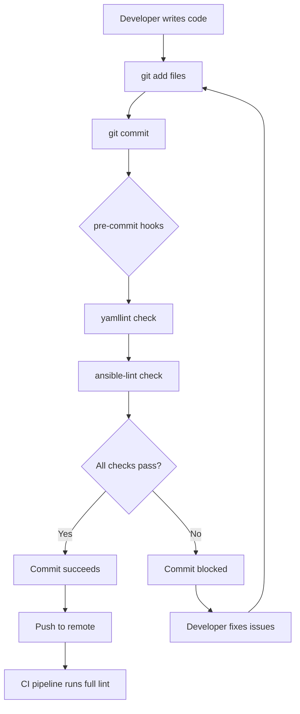

# How to Use ansible-lint with Pre-Commit Hooks

Author: [nawazdhandala](https://www.github.com/nawazdhandala)

Tags: Ansible, ansible-lint, Pre-Commit, Git Hooks

Description: Set up ansible-lint as a pre-commit hook to automatically check your Ansible code for issues before every commit using the pre-commit framework.

---

Running ansible-lint manually is fine when you remember to do it. The problem is that everyone forgets sometimes, and then broken or non-compliant code slips into the repository. Pre-commit hooks solve this by running ansible-lint automatically every time you try to commit. If the lint check fails, the commit is blocked until you fix the issues.

This guide covers setting up ansible-lint with the popular `pre-commit` framework, configuring it properly, and handling common situations like slow runs and false positives.

## Installing the pre-commit Framework

The `pre-commit` framework is a Python tool that manages Git hook scripts. It supports many linters and formatters, not just ansible-lint.

```bash
# Install pre-commit
pip install pre-commit

# Or with pipx for isolated installation
pipx install pre-commit

# Verify installation
pre-commit --version
```

## Creating the Pre-Commit Configuration

Create a `.pre-commit-config.yaml` file in the root of your repository:

```yaml
# .pre-commit-config.yaml - Configure pre-commit hooks
---
repos:
  - repo: https://github.com/ansible/ansible-lint
    rev: v24.10.0  # Use the latest stable version
    hooks:
      - id: ansible-lint
        name: ansible-lint
        description: Run ansible-lint on Ansible files
        entry: ansible-lint
        language: python
        files: \.(yml|yaml)$
        # Exclude non-Ansible YAML files
        exclude: >-
          (?x)^(
            docker-compose\.yml|
            .github/.*|
            .pre-commit-config\.yaml
          )$
```

## Installing the Hook

After creating the configuration, install the hook into your local repository:

```bash
# Install the pre-commit hooks
pre-commit install

# You should see:
# pre-commit installed at .git/hooks/pre-commit
```

From this point on, every `git commit` will trigger ansible-lint on the staged files.

## Testing the Hook

Run the hook manually against all files to see if everything is working:

```bash
# Run against all files (not just staged ones)
pre-commit run ansible-lint --all-files

# Run against specific files
pre-commit run ansible-lint --files playbooks/site.yml

# Run all configured hooks
pre-commit run --all-files
```

## Combining with Other Hooks

ansible-lint works well alongside other linting tools. Here is a more complete configuration:

```yaml
# .pre-commit-config.yaml - Multiple hooks for Ansible projects
---
repos:
  # YAML linting (runs first, catches basic syntax issues)
  - repo: https://github.com/adrienverge/yamllint
    rev: v1.35.1
    hooks:
      - id: yamllint
        args: [-c, .yamllint.yml]
        files: \.(yml|yaml)$

  # Ansible-lint (runs after yamllint)
  - repo: https://github.com/ansible/ansible-lint
    rev: v24.10.0
    hooks:
      - id: ansible-lint
        name: ansible-lint
        additional_dependencies:
          # Add any collections your playbooks need
          - ansible.posix
          - community.general

  # Check for merge conflicts, large files, etc.
  - repo: https://github.com/pre-commit/pre-commit-hooks
    rev: v4.6.0
    hooks:
      - id: check-merge-conflict
      - id: check-added-large-files
        args: [--maxkb=500]
      - id: end-of-file-fixer
        files: \.(yml|yaml)$
      - id: trailing-whitespace
        files: \.(yml|yaml)$
      - id: check-yaml
        args: [--unsafe]
        exclude: templates/
```

## Handling Additional Dependencies

If your Ansible code uses collections that ansible-lint needs to parse, add them as additional dependencies:

```yaml
# .pre-commit-config.yaml - With collection dependencies
---
repos:
  - repo: https://github.com/ansible/ansible-lint
    rev: v24.10.0
    hooks:
      - id: ansible-lint
        additional_dependencies:
          - ansible.posix>=1.5.0
          - community.general>=8.0.0
          - community.docker>=3.0.0
          - amazon.aws>=7.0.0
```

## Speeding Up Pre-Commit Runs

ansible-lint can be slow, especially on large projects. Here are ways to speed it up:

### Only Lint Changed Files

By default, pre-commit only passes staged files to the hook. This means only changed files are linted, which is already much faster than linting everything.

### Use the Progressive Profile

Configure ansible-lint to only report new violations:

```yaml
# .ansible-lint - Enable progressive mode for faster development
---
profile: moderate
progressive: true
```

### Skip Hooks When Needed

Sometimes you need to commit quickly without waiting for the linter. Use the `--no-verify` flag:

```bash
# Skip all pre-commit hooks for this commit
git commit --no-verify -m "WIP: work in progress, will fix lint later"
```

Use this sparingly. The CI pipeline should still catch any issues.

### Cache Pre-Commit Environments

Pre-commit caches its environments automatically in `~/.cache/pre-commit/`. If you are running into slow first-time setups, make sure this directory is persistent (especially in CI environments).

## Handling Hook Failures

When the pre-commit hook blocks a commit, you will see output like this:

```
ansible-lint.........................................................Failed
- hook id: ansible-lint
- exit code: 2

WARNING  Listing 2 violation(s) that are fatal
fqcn[action-core]: Use FQCN for builtin module actions.
playbooks/deploy.yml:15 Task/Handler: Install packages

name[missing]: All tasks should be named.
playbooks/deploy.yml:22 Task/Handler: ansible.builtin.apt
```

Fix the issues and try again:

```bash
# Fix the issues in your editor, then
git add playbooks/deploy.yml
git commit -m "fix: deploy playbook linting issues"
```

## Per-File Rule Skipping

If a specific file legitimately needs to skip certain rules, use inline comments rather than disabling the rule globally:

```yaml
# playbooks/emergency_fix.yml - Skip specific rules for this task
---
- name: Emergency hotfix deployment
  hosts: production
  tasks:
    - name: Apply hotfix  # noqa: command-instead-of-shell
      ansible.builtin.shell: |
        cd /opt/app && git pull origin hotfix/critical-fix
      tags:
        - hotfix
```

## Workflow Diagram

Here is how the pre-commit hook integrates into your development workflow:



## Keeping Hooks Updated

Pre-commit hook versions can get stale. Periodically update them:

```bash
# Update all hooks to their latest versions
pre-commit autoupdate

# Update only the ansible-lint hook
pre-commit autoupdate --repo https://github.com/ansible/ansible-lint

# After updating, run against all files to check for new violations
pre-commit run --all-files
```

## Team Onboarding

When a new team member clones the repository, they need to install the hooks locally:

```bash
# Clone the repo
git clone git@github.com:myorg/ansible-infra.git
cd ansible-infra

# Install pre-commit and the hooks
pip install pre-commit
pre-commit install
```

To automate this, add a setup script or a Makefile target:

```makefile
# Makefile - Automate development environment setup
.PHONY: setup lint

setup:
	pip install pre-commit ansible-lint
	pre-commit install
	@echo "Pre-commit hooks installed successfully"

lint:
	pre-commit run --all-files
```

## Committing the Configuration

Make sure to commit both configuration files to your repository:

```bash
git add .pre-commit-config.yaml .ansible-lint
git commit -m "Add pre-commit hooks for ansible-lint"
```

This way, every team member gets the same linting configuration when they set up their environment.

Pre-commit hooks are one of the best investments you can make for code quality. They catch issues early, prevent arguments in code reviews about style, and ensure that everyone on the team follows the same standards. Set it up once and forget about it.
