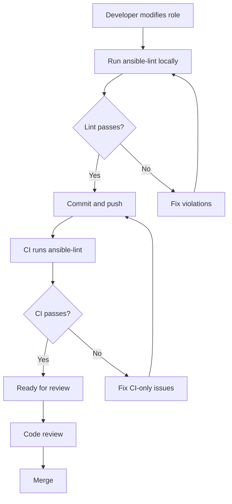

# How to Use ansible-lint with Roles

Author: [nawazdhandala](https://www.github.com/nawazdhandala)

Tags: Ansible, ansible-lint, Roles, Code Quality

Description: Configure ansible-lint to properly validate Ansible roles including tasks, handlers, defaults, meta, and templates with role-specific rules.

---

Ansible roles are self-contained units of automation that bundle tasks, handlers, variables, templates, and metadata together. Linting roles requires a slightly different approach than linting standalone playbooks because roles have their own structure, conventions, and metadata requirements. In this post, we will cover how to configure ansible-lint for role development, the role-specific rules you need to know, and common patterns for keeping your roles clean.

## Linting a Role

You can lint a role by pointing ansible-lint at the role directory:

```bash
# Lint a single role
ansible-lint roles/webserver/

# Lint all roles in a directory
ansible-lint roles/

# Lint from within the role directory
cd roles/webserver && ansible-lint
```

ansible-lint automatically detects the role structure and applies appropriate rules.

## Role Directory Structure

A well-structured role looks like this, and ansible-lint validates each component:

```
roles/webserver/
  tasks/
    main.yml       # Linted for task-level rules
    install.yml
    configure.yml
  handlers/
    main.yml       # Linted, handlers need names too
  defaults/
    main.yml       # Linted for variable naming
  vars/
    main.yml       # Linted for variable naming
  templates/
    nginx.conf.j2  # Referenced templates are checked
  files/
    index.html     # Static files are not linted
  meta/
    main.yml       # Linted for metadata completeness
  molecule/
    default/
      converge.yml # Can be excluded from linting
  README.md
```

## Role Metadata Validation

ansible-lint checks `meta/main.yml` for completeness. The rules vary by profile.

### Basic Metadata Requirements

```yaml
# roles/webserver/meta/main.yml - Minimum viable metadata
---
galaxy_info:
  author: your_name
  description: Installs and configures nginx web server
  license: MIT
  min_ansible_version: "2.14"
  platforms:
    - name: Ubuntu
      versions:
        - focal
        - jammy
    - name: Debian
      versions:
        - bullseye
        - bookworm
  galaxy_tags:
    - nginx
    - webserver
    - web

dependencies: []
```

### Common Metadata Warnings

**meta-no-info**: Missing or empty `galaxy_info`.

```yaml
# Bad: empty galaxy_info
galaxy_info: {}

# Good: complete galaxy_info (see above)
```

**meta-no-tags**: No tags defined in galaxy_info.

```yaml
# Bad: no tags
galaxy_info:
  author: your_name
  description: My role
  # Missing galaxy_tags

# Good: includes tags
galaxy_info:
  author: your_name
  description: My role
  galaxy_tags:
    - nginx
    - web
```

**meta-incorrect**: Incorrect data types in meta.

```yaml
# Bad: platforms should be a list
galaxy_info:
  platforms: Ubuntu

# Good: platforms as a list of dicts
galaxy_info:
  platforms:
    - name: Ubuntu
      versions:
        - jammy
```

## Role-Specific Configuration

Create an `.ansible-lint` file in the role root or in the parent project:

```yaml
# .ansible-lint - Configuration for role development
---
profile: shared  # For roles intended for Galaxy
# profile: moderate  # For internal roles

exclude_paths:
  - molecule/
  - tests/
  - .cache/

# Enable role-specific rules
enable_list:
  - no-same-owner

# Role-specific skips
skip_list:
  - yaml[line-length]  # Templates can have long lines
```

## Linting Role Tasks

Role tasks follow the same rules as playbook tasks, but there are some role-specific patterns.

### Use Role Variables with Defaults

```yaml
# roles/webserver/defaults/main.yml - Role defaults with proper naming
---
# Prefix all role variables with the role name
webserver_port: 80
webserver_ssl_enabled: false
webserver_document_root: /var/www/html
webserver_packages:
  - nginx
  - openssl
```

```yaml
# roles/webserver/tasks/main.yml - Tasks using role-prefixed variables
---
- name: Install web server packages
  ansible.builtin.apt:
    name: "{{ item }}"
    state: present
  loop: "{{ webserver_packages }}"

- name: Create document root directory
  ansible.builtin.file:
    path: "{{ webserver_document_root }}"
    state: directory
    owner: www-data
    group: www-data
    mode: "0755"

- name: Deploy nginx configuration
  ansible.builtin.template:
    src: nginx.conf.j2
    dest: /etc/nginx/nginx.conf
    owner: root
    group: root
    mode: "0644"
  notify: Restart nginx service
```

### Role Variable Naming Convention

ansible-lint's `var-naming` rule checks that variables follow naming conventions. For roles, the convention is to prefix all variables with the role name:

```yaml
# Bad: generic variable names that might conflict
port: 80
packages:
  - nginx

# Good: role-prefixed variable names
webserver_port: 80
webserver_packages:
  - nginx
```

## Linting Role Handlers

Handlers need names and should follow the same conventions as tasks:

```yaml
# roles/webserver/handlers/main.yml - Properly named handlers
---
- name: Restart nginx service
  ansible.builtin.systemd:
    name: nginx
    state: restarted

- name: Reload nginx configuration
  ansible.builtin.systemd:
    name: nginx
    state: reloaded

- name: Validate nginx configuration
  ansible.builtin.command: nginx -t
  changed_when: false
```

Make sure handler names match the `notify` directives in your tasks exactly.

## Linting Role Dependencies

If your role depends on other roles, declare them in `meta/main.yml`:

```yaml
# roles/app_server/meta/main.yml - Role with dependencies
---
galaxy_info:
  author: your_name
  description: Application server setup
  min_ansible_version: "2.14"
  platforms:
    - name: Ubuntu
      versions:
        - jammy
  galaxy_tags:
    - application
    - server

dependencies:
  - role: webserver
    vars:
      webserver_port: 8080
  - role: common
```

ansible-lint will validate that the dependent roles exist and are properly structured.

## Handling Include and Import in Roles

ansible-lint validates both included and imported task files:

```yaml
# roles/webserver/tasks/main.yml - Using include and import
---
- name: Import installation tasks
  ansible.builtin.import_tasks: install.yml

- name: Include OS-specific configuration
  ansible.builtin.include_tasks: "{{ ansible_os_family | lower }}.yml"

- name: Import service management tasks
  ansible.builtin.import_tasks: service.yml
  tags:
    - webserver-service
```

Each included file gets linted independently:

```yaml
# roles/webserver/tasks/install.yml - Included task file
---
- name: Update apt cache
  ansible.builtin.apt:
    update_cache: true
    cache_valid_time: 3600
  when: ansible_os_family == "Debian"

- name: Install nginx package
  ansible.builtin.package:
    name: nginx
    state: present
```

## Linting Multiple Roles

When you have a project with many roles, lint them all at once:

```bash
# Lint all roles
ansible-lint roles/

# Lint specific roles
ansible-lint roles/webserver/ roles/database/
```

For projects with both playbooks and roles:

```yaml
# .ansible-lint - Project with playbooks and roles
---
profile: moderate

exclude_paths:
  - roles/external/  # Downloaded Galaxy roles
  - .cache/
  - molecule/
```

## Common Role Linting Issues

### Issue: risky-file-permissions in file tasks

```yaml
# Before: missing explicit permissions
- name: Copy application config
  ansible.builtin.copy:
    src: app.conf
    dest: /etc/myapp/app.conf

# After: explicit permissions set
- name: Copy application config
  ansible.builtin.copy:
    src: app.conf
    dest: /etc/myapp/app.conf
    owner: root
    group: root
    mode: "0644"
```

### Issue: role-name convention

Role names should use lowercase letters, numbers, and underscores only:

```
# Bad role names
roles/Web-Server/
roles/MyRole/
roles/setup.nginx/

# Good role names
roles/webserver/
roles/my_role/
roles/setup_nginx/
```

### Issue: argument-spec validation

If your role provides an argument spec, ansible-lint validates that tasks use the declared parameters:

```yaml
# roles/webserver/meta/argument_specs.yml - Role argument specification
---
argument_specs:
  main:
    short_description: Configure web server
    options:
      webserver_port:
        type: int
        default: 80
        description: Port number for the web server
      webserver_ssl_enabled:
        type: bool
        default: false
        description: Enable SSL/TLS
      webserver_document_root:
        type: str
        default: /var/www/html
        description: Document root directory path
```

## Role Linting Workflow



Linting roles thoroughly from the start prevents downstream issues when those roles are consumed by playbooks. Whether you are developing internal roles or publishing to Galaxy, ansible-lint helps ensure your roles are well-structured, properly documented, and following best practices.
