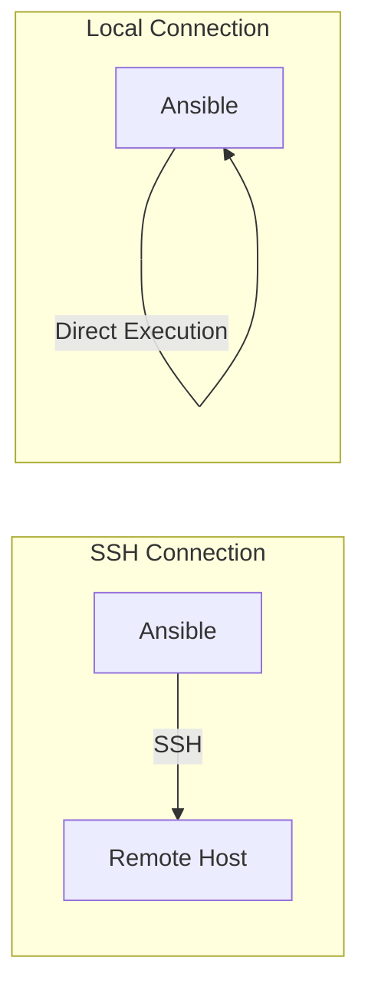

# How to Use Ansible local Connection Plugin

Author: [nawazdhandala](https://www.github.com/nawazdhandala)

Tags: Ansible, Connection Plugins, Local Execution, Configuration Management

Description: Use the Ansible local connection plugin to run playbooks on the control node itself without SSH for local configuration management.

---

Not every Ansible use case involves remote servers. Sometimes you want to configure the machine you are sitting at, run local tasks as part of a larger playbook, or execute actions that only make sense on the control node, like interacting with cloud APIs, updating local files, or building container images. The `local` connection plugin tells Ansible to skip SSH entirely and execute tasks directly on the control node.

## What Is the Local Connection Plugin?

Ansible uses connection plugins to communicate with managed hosts. The default is the `ssh` plugin, which connects over SSH. The `local` plugin bypasses the network entirely and runs commands directly on the machine running Ansible.



## Setting Connection to Local

There are several ways to tell Ansible to use the local connection.

### Method 1: Playbook Level

Set the connection for an entire play:

```yaml
# local_setup.yml
---
- name: Configure the control node
  hosts: localhost
  connection: local

  tasks:
    - name: Install packages on the control node
      apt:
        name:
          - jq
          - curl
          - httpie
        state: present
      become: yes

    - name: Create project directory
      file:
        path: /opt/projects/myapp
        state: directory
        owner: "{{ ansible_user_id }}"
        mode: '0755'
```

### Method 2: Inventory Definition

Define localhost in your inventory with local connection:

```ini
# inventory/hosts
[local]
localhost ansible_connection=local
```

Or in a YAML inventory:

```yaml
# inventory/hosts.yml
all:
  hosts:
    localhost:
      ansible_connection: local
```

### Method 3: Command Line

Force local connection from the command line:

```bash
# Run an ad hoc command locally
ansible localhost -m ping -c local

# Run a playbook with local connection
ansible-playbook site.yml -c local
```

### Method 4: Task Level

Set the connection for individual tasks:

```yaml
- name: Mixed local and remote tasks
  hosts: webservers

  tasks:
    # This runs on the remote hosts via SSH
    - name: Check remote status
      command: systemctl status nginx

    # This runs locally on the control node
    - name: Update local inventory cache
      command: ./scripts/refresh_cache.sh
      delegate_to: localhost
      connection: local
```

## The Implicit localhost

Ansible has a built-in implicit `localhost` entry. If you reference `localhost` in a playbook without defining it in your inventory, Ansible automatically uses the local connection:

```yaml
# This works without any inventory entry for localhost
---
- name: Local tasks
  hosts: localhost

  tasks:
    - name: Show current user
      command: whoami
      register: user_result

    - name: Display user
      debug:
        msg: "Running as {{ user_result.stdout }}"
```

However, if you explicitly define `localhost` in your inventory without setting `ansible_connection=local`, Ansible will try to SSH to 127.0.0.1.

## Practical Use Cases

### Local Development Environment Setup

```yaml
# dev_setup.yml - Set up a development machine
---
- name: Configure development workstation
  hosts: localhost
  connection: local
  become: yes

  vars:
    dev_packages:
      - git
      - vim
      - tmux
      - htop
      - docker.io
      - python3-pip

  tasks:
    - name: Update package cache
      apt:
        update_cache: yes
        cache_valid_time: 3600

    - name: Install development packages
      apt:
        name: "{{ dev_packages }}"
        state: present

    - name: Add user to docker group
      user:
        name: "{{ ansible_user_id }}"
        groups: docker
        append: yes

    - name: Install Python packages
      pip:
        name:
          - ansible-lint
          - yamllint
          - molecule
        state: present
```

### Cloud Resource Provisioning

Many cloud modules run on the control node because they call APIs, not remote servers:

```yaml
# provision_aws.yml
---
- name: Provision AWS resources
  hosts: localhost
  connection: local
  gather_facts: no

  tasks:
    - name: Create a VPC
      amazon.aws.ec2_vpc_net:
        name: my-vpc
        cidr_block: 10.0.0.0/16
        region: us-east-1
        state: present
      register: vpc

    - name: Create a subnet
      amazon.aws.ec2_vpc_subnet:
        vpc_id: "{{ vpc.vpc.id }}"
        cidr: 10.0.1.0/24
        az: us-east-1a
        state: present
      register: subnet

    - name: Launch an EC2 instance
      amazon.aws.ec2_instance:
        name: web-server
        instance_type: t3.micro
        image_id: ami-0c55b159cbfafe1f0
        subnet_id: "{{ subnet.subnet.id }}"
        state: running
      register: ec2
```

### Building Container Images

```yaml
# build_container.yml
---
- name: Build and push Docker image
  hosts: localhost
  connection: local

  vars:
    image_name: mycompany/myapp
    image_tag: "{{ lookup('pipe', 'git rev-parse --short HEAD') }}"

  tasks:
    - name: Build Docker image
      community.docker.docker_image:
        name: "{{ image_name }}"
        tag: "{{ image_tag }}"
        source: build
        build:
          path: ./docker
          pull: yes
        state: present

    - name: Push image to registry
      community.docker.docker_image:
        name: "{{ image_name }}"
        tag: "{{ image_tag }}"
        push: yes
        source: local
```

### Mixed Local and Remote Playbook

A common pattern is provisioning resources locally, then configuring them remotely:

```yaml
# deploy.yml
---
# Play 1: Local tasks (build, prepare)
- name: Build application locally
  hosts: localhost
  connection: local
  gather_facts: no

  tasks:
    - name: Build application
      command: make build
      args:
        chdir: /opt/projects/myapp

    - name: Create deployment package
      archive:
        path: /opt/projects/myapp/dist/
        dest: /tmp/myapp-deploy.tar.gz
        format: gz

# Play 2: Remote tasks (deploy)
- name: Deploy to web servers
  hosts: webservers

  tasks:
    - name: Copy deployment package
      copy:
        src: /tmp/myapp-deploy.tar.gz
        dest: /opt/app/myapp-deploy.tar.gz

    - name: Extract package
      unarchive:
        src: /opt/app/myapp-deploy.tar.gz
        dest: /opt/app/
        remote_src: yes

    - name: Restart application
      service:
        name: myapp
        state: restarted
      become: yes
```

## delegate_to vs connection: local

There is an important distinction between these two approaches:

```yaml
- name: Understanding delegation vs local connection
  hosts: webservers

  tasks:
    # delegate_to: Runs on localhost but the task still has
    # the context of the current host (hostvars, etc.)
    - name: Add host to load balancer (delegated)
      command: "./add_to_lb.sh {{ inventory_hostname }}"
      delegate_to: localhost

    # connection: local on a play targeting localhost
    # does not have remote host context
```

Use `delegate_to: localhost` when you need to run something locally but still need access to the remote host's variables. Use `connection: local` on a separate play targeting `localhost` when the tasks are truly independent of remote hosts.

## Gathering Facts Locally

When using local connection, facts are gathered about the control node:

```yaml
- name: Local facts
  hosts: localhost
  connection: local

  tasks:
    - name: Show local OS info
      debug:
        msg: "OS: {{ ansible_distribution }} {{ ansible_distribution_version }}"

    - name: Show local IP
      debug:
        msg: "IP: {{ ansible_default_ipv4.address }}"
```

If you do not need facts (like for API calls), skip them:

```yaml
- name: API calls (no facts needed)
  hosts: localhost
  connection: local
  gather_facts: no

  tasks:
    - name: Call an API
      uri:
        url: https://api.example.com/status
        method: GET
      register: api_result
```

## Performance Note

Local connection is faster than SSH because there is no network overhead or SSH handshake. However, Ansible still goes through its entire module execution pipeline (generating the module script, executing it, parsing output). For simple tasks, this overhead is negligible. For tasks that you run frequently, it is worth knowing that `local` is faster but not instant.

## Wrapping Up

The local connection plugin makes Ansible a versatile tool beyond just remote server management. Use it for workstation setup, cloud provisioning, container builds, and any task that needs to run on the control node. The implicit localhost makes it easy to get started, and `delegate_to: localhost` lets you mix local and remote operations within the same play. Just remember that when using local connection with `become`, you are escalating privileges on the control node itself, so be careful with what you automate.
