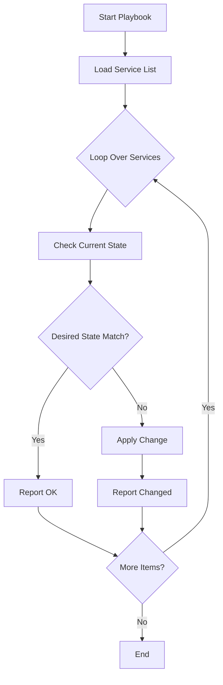

# How to Use Ansible loop to Manage Multiple Services

Author: [nawazdhandala](https://www.github.com/nawazdhandala)

Tags: Ansible, Service Management, Automation, Linux

Description: Learn how to use Ansible loop to start, stop, restart, and enable multiple services across your infrastructure efficiently.

---

Managing services is one of the most common tasks in system administration. On a typical server, you might need to ensure that nginx, redis, postgresql, and a handful of application services are all running and enabled at boot. Writing a separate task for each service works, but it clutters your playbook and makes it harder to maintain. The Ansible `loop` keyword lets you handle all of them in a single task.

This post covers practical patterns for managing multiple services with loops, including starting, stopping, enabling, and handling services conditionally.

## Starting Multiple Services

The most straightforward use case is ensuring a list of services are running.

```yaml
# start-services.yml
# Ensures all required services are running
- name: Start application services
  hosts: webservers
  become: true
  tasks:
    - name: Ensure services are started
      ansible.builtin.service:
        name: "{{ item }}"
        state: started
      loop:
        - nginx
        - redis-server
        - postgresql
        - memcached
```

Each iteration calls `systemctl start <service>` (or the equivalent on your init system). If the service is already running, Ansible reports "ok" and moves on.

## Enabling and Starting Services Together

Usually you want services both running and enabled to start on boot. You can set both in one task.

```yaml
# enable-and-start.yml
# Starts and enables services to survive reboots
- name: Enable and start services
  hosts: all
  become: true
  vars:
    required_services:
      - nginx
      - redis-server
      - postgresql
      - cron
      - rsyslog
      - fail2ban
  tasks:
    - name: Ensure services are started and enabled
      ansible.builtin.service:
        name: "{{ item }}"
        state: started
        enabled: true
      loop: "{{ required_services }}"
```

Defining the list in a variable (`required_services`) keeps the task clean. You can also put this list in `group_vars` so different server roles have different service lists.

## Services with Different Desired States

Not all services should be in the same state. Some should be running, others stopped, and some disabled entirely. Use dictionaries in your loop to handle this.

```yaml
# mixed-states.yml
# Manages services with different desired states
- name: Manage services with mixed states
  hosts: webservers
  become: true
  tasks:
    - name: Set service states
      ansible.builtin.service:
        name: "{{ item.name }}"
        state: "{{ item.state }}"
        enabled: "{{ item.enabled }}"
      loop:
        - { name: "nginx", state: "started", enabled: true }
        - { name: "redis-server", state: "started", enabled: true }
        - { name: "apache2", state: "stopped", enabled: false }
        - { name: "postfix", state: "stopped", enabled: false }
        - { name: "cron", state: "started", enabled: true }
```

This pattern is particularly useful when migrating from one web server to another. You can ensure the new one is running while the old one is stopped, all in one task.

## Restarting Services After Configuration Changes

A common pattern is to restart services after deploying new configuration files. You can combine `loop` with handlers for this.

```yaml
# config-deploy.yml
# Deploys configs and restarts affected services
- name: Deploy configuration and restart services
  hosts: webservers
  become: true
  vars:
    service_configs:
      - { service: "nginx", config_src: "nginx.conf.j2", config_dest: "/etc/nginx/nginx.conf" }
      - { service: "redis-server", config_src: "redis.conf.j2", config_dest: "/etc/redis/redis.conf" }
      - { service: "postgresql", config_src: "postgresql.conf.j2", config_dest: "/etc/postgresql/14/main/postgresql.conf" }
  tasks:
    - name: Deploy configuration files
      ansible.builtin.template:
        src: "{{ item.config_src }}"
        dest: "{{ item.config_dest }}"
      loop: "{{ service_configs }}"
      register: config_results

    - name: Restart services with changed configs
      ansible.builtin.service:
        name: "{{ item.item.service }}"
        state: restarted
      loop: "{{ config_results.results }}"
      when: item.changed
```

The `register` captures the result of each loop iteration. In the second task, we loop over those results and only restart services whose configuration actually changed. The original loop item is accessible via `item.item`.

## Group-Based Service Management

Different server roles need different services. Define them in group variables.

```yaml
# group_vars/webservers.yml
managed_services:
  - { name: "nginx", state: "started", enabled: true }
  - { name: "php8.1-fpm", state: "started", enabled: true }
  - { name: "redis-server", state: "started", enabled: true }

# group_vars/dbservers.yml
managed_services:
  - { name: "postgresql", state: "started", enabled: true }
  - { name: "pgbouncer", state: "started", enabled: true }

# group_vars/monitoring.yml
managed_services:
  - { name: "prometheus", state: "started", enabled: true }
  - { name: "grafana-server", state: "started", enabled: true }
  - { name: "alertmanager", state: "started", enabled: true }
```

Your playbook stays generic:

```yaml
# manage-services.yml
# Uses group-specific service lists for targeted management
- name: Manage services per group
  hosts: all
  become: true
  tasks:
    - name: Ensure services are in desired state
      ansible.builtin.service:
        name: "{{ item.name }}"
        state: "{{ item.state }}"
        enabled: "{{ item.enabled }}"
      loop: "{{ managed_services }}"
      when: managed_services is defined
```

## Checking Service Status

Sometimes you need to verify services are running without changing their state. Use the `service_facts` module combined with a loop.

```yaml
# check-services.yml
# Checks and reports the status of critical services
- name: Verify service status
  hosts: all
  become: true
  vars:
    critical_services:
      - nginx
      - postgresql
      - redis-server
  tasks:
    - name: Gather service facts
      ansible.builtin.service_facts:

    - name: Check critical services
      ansible.builtin.debug:
        msg: >
          {{ item }}: {{ ansible_facts.services[item + '.service'].state
          | default('not found') }}
      loop: "{{ critical_services }}"

    - name: Fail if any critical service is not running
      ansible.builtin.fail:
        msg: "Service {{ item }} is not running!"
      loop: "{{ critical_services }}"
      when: >
        ansible_facts.services[item + '.service'] is not defined or
        ansible_facts.services[item + '.service'].state != 'running'
```

This is great for health checks and compliance verification playbooks.

## Handling Services That May Not Exist

On some hosts, a service might not be installed yet. You can handle this gracefully.

```yaml
# safe-service-mgmt.yml
# Manages services while handling cases where they might not exist
- name: Safely manage optional services
  hosts: all
  become: true
  tasks:
    - name: Gather service facts
      ansible.builtin.service_facts:

    - name: Start services if they exist
      ansible.builtin.service:
        name: "{{ item }}"
        state: started
        enabled: true
      loop:
        - nginx
        - redis-server
        - node-exporter
        - filebeat
      when: (item + '.service') in ansible_facts.services
```

By first gathering service facts and then checking if the service exists, you avoid failures on hosts where the service is not installed.

## Workflow Visualization

Here is the typical flow when managing services with loops:



## Stopping Services Before Maintenance

During maintenance windows, you might need to stop services in a specific order.

```yaml
# maintenance-stop.yml
# Stops services in reverse dependency order for maintenance
- name: Stop services for maintenance
  hosts: webservers
  become: true
  vars:
    # Order matters: stop reverse of startup order
    services_to_stop:
      - nginx          # Stop accepting traffic first
      - php8.1-fpm     # Stop app processing
      - redis-server   # Stop cache
      - postgresql     # Stop database last
  tasks:
    - name: Stop services in order
      ansible.builtin.service:
        name: "{{ item }}"
        state: stopped
      loop: "{{ services_to_stop }}"

    - name: Confirm all services stopped
      ansible.builtin.service_facts:

    - name: Verify stopped state
      ansible.builtin.assert:
        that:
          - ansible_facts.services[item + '.service'].state == 'stopped'
        fail_msg: "{{ item }} did not stop properly"
      loop: "{{ services_to_stop }}"
```

Since Ansible processes loop items sequentially, the order you define is the order they execute. This is important when services have dependencies.

## Summary

Managing multiple services with Ansible `loop` keeps your playbooks concise and consistent. The key patterns are: use simple lists when all services need the same treatment, use dictionaries when services need different states, and store your service lists in group variables for role-based management. Combine `loop` with `register` and `when` to build smart workflows that only restart services when their configuration actually changes. For production environments, always include verification steps that confirm your services are in the expected state after the playbook runs.
