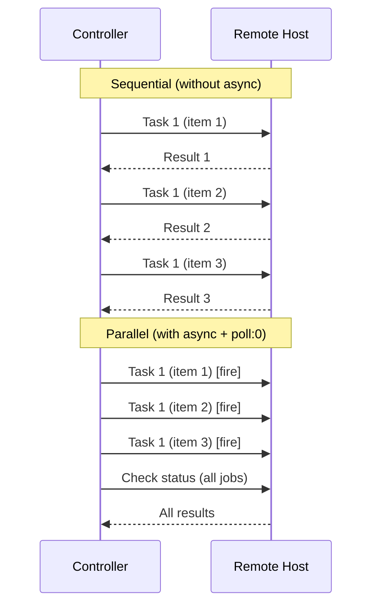

# How to Use Ansible loop with Async Tasks

Author: [nawazdhandala](https://www.github.com/nawazdhandala)

Tags: Ansible, Async, Parallel Processing, Automation

Description: Learn how to combine Ansible loop with async and poll to run long-running tasks in parallel and check their results efficiently.

---

By default, Ansible runs tasks sequentially. When you combine a loop with a task that takes a long time (like downloading large files, running database migrations, or compiling software), each iteration waits for the previous one to finish. This can make playbooks painfully slow. The `async` and `poll` keywords let you fire off tasks in parallel within a loop, then check on all of them later.

This post covers how to use `async` with loops, the fire-and-forget pattern, polling for results, and practical examples of parallel task execution.

## The Problem: Sequential Loop Execution

Without async, a loop runs each iteration sequentially.

```yaml
# slow-sequential.yml
# This takes 50 seconds total (10 seconds per item, 5 items)
- name: Download files sequentially (slow)
  hosts: webservers
  tasks:
    - name: Download large files one at a time
      ansible.builtin.get_url:
        url: "{{ item }}"
        dest: "/tmp/{{ item | basename }}"
      loop:
        - https://example.com/file1.tar.gz
        - https://example.com/file2.tar.gz
        - https://example.com/file3.tar.gz
        - https://example.com/file4.tar.gz
        - https://example.com/file5.tar.gz
```

If each download takes 10 seconds, the loop takes 50 seconds. With async, all five downloads run simultaneously.

## The Fire-and-Forget Pattern

Setting `async` with `poll: 0` launches each loop iteration as a background job without waiting for it to complete.

```yaml
# async-download.yml
# Launches all downloads in parallel, then waits for all to finish
- name: Download files in parallel
  hosts: webservers
  tasks:
    - name: Start all downloads simultaneously
      ansible.builtin.get_url:
        url: "{{ item }}"
        dest: "/tmp/{{ item | basename }}"
      loop:
        - https://example.com/file1.tar.gz
        - https://example.com/file2.tar.gz
        - https://example.com/file3.tar.gz
        - https://example.com/file4.tar.gz
        - https://example.com/file5.tar.gz
      async: 300          # Maximum runtime: 5 minutes
      poll: 0             # Do not wait for completion
      register: download_jobs

    - name: Wait for all downloads to complete
      ansible.builtin.async_status:
        jid: "{{ item.ansible_job_id }}"
      loop: "{{ download_jobs.results }}"
      register: job_results
      until: job_results.finished
      retries: 30
      delay: 10
```

Here is what happens:
1. The first task launches all five downloads as background jobs. With `poll: 0`, Ansible does not wait for any of them to finish.
2. The `register` captures the job IDs for each background task.
3. The second task checks each job's status using `async_status`, retrying until all jobs report as finished.

## Understanding async and poll

The `async` parameter sets the maximum time (in seconds) the task is allowed to run. If it exceeds this, Ansible kills the process.

The `poll` parameter controls how often Ansible checks on the task:
- `poll: 0` means fire-and-forget (do not check, move on immediately)
- `poll: 5` means check every 5 seconds until the task finishes
- Default poll is 15 seconds

When used with a loop, `poll: 0` is the only option that gives you true parallelism, because any other value would make Ansible wait for each iteration before starting the next one.

## Practical Example: Parallel Package Compilation

Compiling software from source is a perfect use case for async loops.

```yaml
# parallel-compile.yml
# Compiles multiple packages from source in parallel
- name: Compile packages in parallel
  hosts: buildservers
  become: true
  vars:
    source_packages:
      - { name: "nginx", dir: "/usr/local/src/nginx-1.24.0", cmd: "./configure && make" }
      - { name: "redis", dir: "/usr/local/src/redis-7.2.0", cmd: "make" }
      - { name: "haproxy", dir: "/usr/local/src/haproxy-2.8.0", cmd: "make TARGET=linux-glibc" }
  tasks:
    - name: Start compilation for all packages
      ansible.builtin.command:
        cmd: "{{ item.cmd }}"
        chdir: "{{ item.dir }}"
      loop: "{{ source_packages }}"
      async: 1800         # Allow up to 30 minutes per compilation
      poll: 0
      register: compile_jobs

    - name: Wait for all compilations to finish
      ansible.builtin.async_status:
        jid: "{{ item.ansible_job_id }}"
      loop: "{{ compile_jobs.results }}"
      loop_control:
        label: "{{ item.item.name }}"
      register: compile_results
      until: compile_results.finished
      retries: 60
      delay: 30

    - name: Report compilation results
      ansible.builtin.debug:
        msg: "{{ item.item.item.name }}: {{ 'SUCCESS' if item.rc == 0 else 'FAILED' }}"
      loop: "{{ compile_results.results }}"
      loop_control:
        label: "{{ item.item.item.name }}"
```

## Parallel Database Backups

Running backups of multiple databases simultaneously can save significant time.

```yaml
# parallel-backups.yml
# Runs database backups in parallel across multiple databases
- name: Run parallel database backups
  hosts: dbservers
  become: true
  become_user: postgres
  vars:
    databases:
      - production_app
      - production_analytics
      - production_reporting
      - production_audit
  tasks:
    - name: Start database dumps in parallel
      ansible.builtin.command: >
        pg_dump -Fc {{ item }}
        -f /backup/{{ item }}_{{ ansible_date_time.date }}.dump
      loop: "{{ databases }}"
      async: 3600         # Allow up to 1 hour per dump
      poll: 0
      register: dump_jobs

    - name: Wait for all dumps to complete
      ansible.builtin.async_status:
        jid: "{{ item.ansible_job_id }}"
      loop: "{{ dump_jobs.results }}"
      loop_control:
        label: "{{ item.item }}"
      register: dump_results
      until: dump_results.finished
      retries: 120
      delay: 30

    - name: Verify dump files exist
      ansible.builtin.stat:
        path: "/backup/{{ item }}_{{ ansible_date_time.date }}.dump"
      loop: "{{ databases }}"
      register: dump_files

    - name: Report backup status
      ansible.builtin.debug:
        msg: "{{ item.item }}: {{ 'OK' if item.stat.exists else 'MISSING' }} ({{ item.stat.size | default(0) | human_readable }})"
      loop: "{{ dump_files.results }}"
      loop_control:
        label: "{{ item.item }}"
```

## Execution Flow Visualization



## Error Handling with Async Loops

When a background job fails, you need to handle it properly.

```yaml
# async-error-handling.yml
# Handles failures in async loop tasks
- name: Run tasks with error handling
  hosts: all
  tasks:
    - name: Run scripts in parallel
      ansible.builtin.script: "scripts/{{ item }}.sh"
      loop:
        - migrate
        - seed
        - index
      async: 600
      poll: 0
      register: script_jobs

    - name: Check job results
      ansible.builtin.async_status:
        jid: "{{ item.ansible_job_id }}"
      loop: "{{ script_jobs.results }}"
      loop_control:
        label: "{{ item.item }}"
      register: script_results
      until: script_results.finished
      retries: 30
      delay: 10
      ignore_errors: true

    - name: Fail if any script failed
      ansible.builtin.fail:
        msg: "Script {{ item.item.item }} failed with rc={{ item.rc }}"
      loop: "{{ script_results.results }}"
      when: item.rc is defined and item.rc != 0
```

## Limiting Concurrency

Sometimes you want parallelism but not unlimited. You can combine `batch` with `async` to control concurrency.

```yaml
# controlled-concurrency.yml
# Runs tasks in parallel but limits to 3 concurrent jobs
- name: Process items with limited concurrency
  hosts: all
  tasks:
    - name: Process items in batches of 3
      ansible.builtin.include_tasks: process-batch-async.yml
      loop: "{{ all_items | batch(3) | list }}"
      loop_control:
        loop_var: current_batch
```

```yaml
# process-batch-async.yml
# Processes one batch of items in parallel
- name: Launch batch items in parallel
  ansible.builtin.command: "process_item {{ item }}"
  loop: "{{ current_batch }}"
  async: 300
  poll: 0
  register: batch_jobs

- name: Wait for batch to complete
  ansible.builtin.async_status:
    jid: "{{ item.ansible_job_id }}"
  loop: "{{ batch_jobs.results }}"
  register: batch_results
  until: batch_results.finished
  retries: 30
  delay: 10
```

This processes 3 items in parallel, waits for all 3 to finish, then processes the next 3.

## What Cannot Use Async

Not all modules support async. Specifically:
- Modules that require interactive input do not work with async
- The `async_status` module itself cannot be async
- Some connection plugins may have limitations

Test your specific modules before relying on async in production playbooks.

## Summary

Combining `loop` with `async` and `poll: 0` is the pattern for parallel task execution in Ansible. The workflow is: launch all tasks as fire-and-forget background jobs, register the job IDs, then use `async_status` in a second loop to wait for completion. Set `async` to a value higher than the expected maximum runtime to avoid premature task termination. For controlled concurrency, combine `batch` with async to limit how many jobs run simultaneously. Always include error handling to catch and report failed background jobs.
