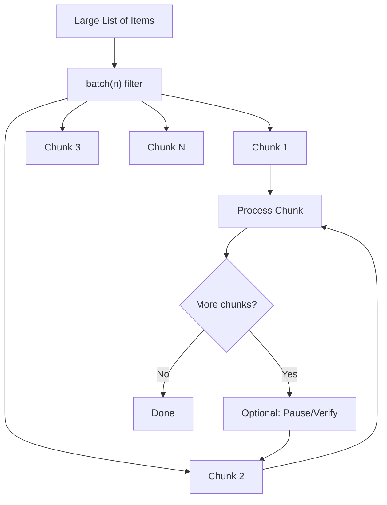

# How to Use Ansible loop with batch Filter for Chunked Processing

Author: [nawazdhandala](https://www.github.com/nawazdhandala)

Tags: Ansible, Batch Processing, Performance, Automation

Description: Learn how to use the Ansible batch filter to split large lists into smaller chunks for controlled processing in loops.

---

When you need to process a large number of items in Ansible, doing them all at once can overwhelm your target systems or hit API rate limits. The `batch` filter splits a list into smaller chunks (sublists of a specified size), letting you process items in controlled groups. This is useful for rolling deployments, rate-limited API calls, and batch database operations.

This post covers how the `batch` filter works, how to combine it with `loop`, and real-world scenarios where chunked processing makes a difference.

## How the batch Filter Works

The `batch` filter takes a list and splits it into sublists of a given size.

```yaml
# basic-batch.yml
# Shows how batch splits a list into chunks
- name: Demonstrate batch filter
  hosts: localhost
  gather_facts: false
  vars:
    all_items: [1, 2, 3, 4, 5, 6, 7, 8, 9, 10]
  tasks:
    - name: Show batches of 3
      ansible.builtin.debug:
        msg: "Batch: {{ item }}"
      loop: "{{ all_items | batch(3) | list }}"
```

This produces:
- Batch 1: [1, 2, 3]
- Batch 2: [4, 5, 6]
- Batch 3: [7, 8, 9]
- Batch 4: [10]

The last batch contains whatever is left over if the list does not divide evenly.

## Installing Packages in Batches

One practical use is installing packages in groups to avoid overwhelming the package manager or network bandwidth.

```yaml
# batch-install.yml
# Installs packages in batches of 5 to reduce system load
- name: Install packages in batches
  hosts: all
  become: true
  vars:
    all_packages:
      - nginx
      - redis-server
      - postgresql-14
      - memcached
      - curl
      - wget
      - htop
      - vim
      - git
      - unzip
      - jq
      - tmux
      - python3-pip
      - certbot
      - fail2ban
  tasks:
    - name: Install packages in groups of 5
      ansible.builtin.apt:
        name: "{{ item }}"
        state: present
      loop: "{{ all_packages | batch(5) | list }}"
```

Each iteration passes a list of 5 packages to the `apt` module. Since `apt` accepts a list in the `name` parameter, each batch is installed in a single transaction.

## Rate-Limited API Calls

When calling an API that has rate limits, batching with pauses between batches prevents hitting those limits.

```yaml
# rate-limited-api.yml
# Makes API calls in batches with pauses between batches
- name: Create users via rate-limited API
  hosts: localhost
  gather_facts: false
  vars:
    new_users:
      - alice
      - bob
      - charlie
      - diana
      - eve
      - frank
      - grace
      - henry
      - iris
      - jack
  tasks:
    - name: Process users in batches of 3
      ansible.builtin.include_tasks: create-user-batch.yml
      loop: "{{ new_users | batch(3) | list }}"
      loop_control:
        loop_var: user_batch
        index_var: batch_index
```

The included task file processes one batch and pauses.

```yaml
# create-user-batch.yml
# Processes one batch of users and pauses before the next batch
- name: Create users in this batch
  ansible.builtin.uri:
    url: "https://api.example.com/users"
    method: POST
    body:
      username: "{{ user }}"
    body_format: json
    headers:
      Authorization: "Bearer {{ api_token }}"
  loop: "{{ user_batch }}"
  loop_control:
    loop_var: user

- name: Pause between batches to respect rate limits
  ansible.builtin.pause:
    seconds: 5
  when: batch_index < (new_users | batch(3) | list | length) - 1
```

## Rolling Service Restarts

Restarting all instances of a service at once causes downtime. Batching lets you do rolling restarts.

```yaml
# rolling-restart.yml
# Restarts services in batches for zero-downtime deployments
- name: Rolling service restart
  hosts: localhost
  gather_facts: false
  vars:
    service_instances:
      - app-1
      - app-2
      - app-3
      - app-4
      - app-5
      - app-6
  tasks:
    - name: Restart instances in groups of 2
      ansible.builtin.include_tasks: restart-batch.yml
      loop: "{{ service_instances | batch(2) | list }}"
      loop_control:
        loop_var: instance_batch
        index_var: batch_num
```

```yaml
# restart-batch.yml
# Restarts a batch of service instances and waits for health checks
- name: "Restart batch {{ batch_num + 1 }}"
  ansible.builtin.debug:
    msg: "Restarting {{ instance }}"
  loop: "{{ instance_batch }}"
  loop_control:
    loop_var: instance

- name: Wait for instances to become healthy
  ansible.builtin.pause:
    seconds: 30

- name: Verify health of restarted instances
  ansible.builtin.uri:
    url: "http://{{ instance }}:8080/health"
    return_content: true
  loop: "{{ instance_batch }}"
  loop_control:
    loop_var: instance
  register: health_results
  until: health_results is not failed
  retries: 5
  delay: 10
```

## Database Batch Operations

When inserting many records into a database, batching prevents transaction size issues and reduces lock contention.

```yaml
# batch-db-insert.yml
# Inserts records in batches to avoid large transaction overhead
- name: Batch insert database records
  hosts: dbservers
  become: true
  become_user: postgres
  vars:
    records_to_insert:
      - { name: "record1", value: "data1" }
      - { name: "record2", value: "data2" }
      - { name: "record3", value: "data3" }
      - { name: "record4", value: "data4" }
      - { name: "record5", value: "data5" }
      - { name: "record6", value: "data6" }
      - { name: "record7", value: "data7" }
      - { name: "record8", value: "data8" }
  tasks:
    - name: Insert records in batches of 3
      community.postgresql.postgresql_query:
        db: myapp
        query: >
          INSERT INTO records (name, value) VALUES
          
          ('{{ record.name }}', '{{ record.value }}'){{ ',' if not loop.last else '' }}
          
      loop: "{{ records_to_insert | batch(3) | list }}"
```

Each batch generates a multi-row INSERT statement, which is much faster than individual INSERTs.

## Batch with Padding

The `batch` filter accepts a second argument for padding incomplete batches. This is useful when you need uniform batch sizes.

```yaml
# padded-batch.yml
# Splits items into equal-sized batches with padding
- name: Demonstrate padded batches
  hosts: localhost
  gather_facts: false
  vars:
    items: [1, 2, 3, 4, 5, 6, 7]
  tasks:
    - name: Show batches of 3 with padding
      ansible.builtin.debug:
        msg: "Batch: {{ item }}"
      loop: "{{ items | batch(3, 'N/A') | list }}"
      # Batch 1: [1, 2, 3]
      # Batch 2: [4, 5, 6]
      # Batch 3: [7, 'N/A', 'N/A']
```

## Tracking Batch Progress

When processing many batches, it helps to show progress information.

```yaml
# batch-progress.yml
# Shows processing progress for each batch
- name: Process items with progress tracking
  hosts: localhost
  gather_facts: false
  vars:
    work_items: "{{ range(1, 51) | list }}"
    batch_size: 10
  tasks:
    - name: Calculate total batches
      ansible.builtin.set_fact:
        total_batches: "{{ (work_items | length / batch_size) | round(0, 'ceil') | int }}"

    - name: Process batches with progress
      ansible.builtin.debug:
        msg: >
          Batch {{ batch_idx + 1 }}/{{ total_batches }}:
          Processing items {{ item | first }} to {{ item | last }}
      loop: "{{ work_items | batch(batch_size) | list }}"
      loop_control:
        index_var: batch_idx
        label: "Batch {{ batch_idx + 1 }}/{{ total_batches }}"
```

## Batch Processing Flow

Here is how batch processing flows through a playbook.



## Combining batch with Other Filters

You can chain `batch` with other filters for more control.

```yaml
# batch-with-filters.yml
# Filters items, removes duplicates, sorts, then batches
- name: Process filtered and batched items
  hosts: localhost
  gather_facts: false
  vars:
    raw_items:
      - { name: "alpha", priority: "high" }
      - { name: "beta", priority: "low" }
      - { name: "gamma", priority: "high" }
      - { name: "delta", priority: "low" }
      - { name: "epsilon", priority: "high" }
      - { name: "zeta", priority: "high" }
  tasks:
    - name: Process high-priority items in batches of 2
      ansible.builtin.debug:
        msg: "Batch: {{ item | map(attribute='name') | list }}"
      loop: >-
        {{
          raw_items
          | selectattr('priority', 'equalto', 'high')
          | list
          | batch(2)
          | list
        }}
```

This filters for high-priority items first, then splits the filtered results into batches of 2.

## Dynamic Batch Sizing

Sometimes the batch size should vary based on the total number of items or system capacity.

```yaml
# dynamic-batch.yml
# Adjusts batch size based on the total number of items
- name: Process with dynamic batch size
  hosts: all
  vars:
    all_items: "{{ range(1, 101) | list }}"
  tasks:
    - name: Calculate appropriate batch size
      ansible.builtin.set_fact:
        batch_size: >-
          {{
            [10, (all_items | length / 5) | int] | min
          }}

    - name: Process with calculated batch size
      ansible.builtin.debug:
        msg: "Processing {{ item | length }} items (batch size: {{ batch_size }})"
      loop: "{{ all_items | batch(batch_size | int) | list }}"
      loop_control:
        index_var: idx
        label: "Batch {{ idx + 1 }}"
```

## Summary

The `batch` filter is essential for controlled processing in Ansible. It splits large lists into manageable chunks, letting you install packages in groups, respect API rate limits, perform rolling restarts, and manage database batch operations. Use it with `include_tasks` when you need to add pauses or verification between batches. The filter accepts an optional padding value for uniform batch sizes, and you can chain it with other filters like `selectattr` and `sort` for precise control over what gets batched and in what order. Always append `| list` after `batch` since it returns a generator.
