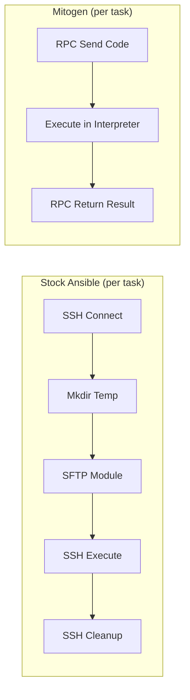

# How to Use Ansible Mitogen for Faster Execution

Author: [nawazdhandala](https://www.github.com/nawazdhandala)

Tags: Ansible, Mitogen, Performance, Optimization

Description: Install and configure Mitogen for Ansible to dramatically speed up playbook execution by replacing the default SSH-based module execution.

---

Mitogen is a Python library that replaces Ansible's default connection and module execution mechanism with a much more efficient one. Where stock Ansible opens a new SSH channel, transfers a module file, executes it, and cleans up for every single task, Mitogen establishes a persistent Python interpreter on the remote host and sends module code directly through an efficient RPC protocol. The result is playbook execution that is 1.5x to 7x faster, depending on the workload.

## How Mitogen Works

Stock Ansible executes each task through this flow:

1. Open SSH connection
2. Create temp directory
3. Transfer module via SFTP/SCP
4. Execute module
5. Read output
6. Delete temp files

Mitogen replaces this with:

1. Bootstrap a persistent Python interpreter on the remote host (once)
2. Send task code via an efficient binary protocol
3. Execute in the existing interpreter
4. Return results



The difference is stark. Mitogen eliminates most of the per-task SSH overhead, which is where the bulk of execution time goes for playbooks with many short tasks.

## Installing Mitogen

Install the Mitogen library:

```bash
# Install Mitogen via pip
pip install mitogen

# Verify the installation
python3 -c "import mitogen; print(mitogen.__version__)"
```

Find the Mitogen installation path (you will need this for configuration):

```bash
# Find the Mitogen Ansible strategy plugin path
python3 -c "import os, mitogen; print(os.path.join(os.path.dirname(mitogen.__file__), 'ansible_mitogen', 'plugins', 'strategy'))"
```

This will output something like `/usr/local/lib/python3.10/dist-packages/ansible_mitogen/plugins/strategy`.

## Configuring Ansible to Use Mitogen

Add the Mitogen strategy plugin to your `ansible.cfg`:

```ini
# ansible.cfg - Enable Mitogen strategy
[defaults]
strategy_plugins = /usr/local/lib/python3.10/dist-packages/ansible_mitogen/plugins/strategy
strategy = mitogen_linear
```

Replace the path with whatever `python3 -c` output from the previous step. The `mitogen_linear` strategy replaces the default `linear` strategy with Mitogen's optimized version.

Mitogen also provides a `mitogen_free` strategy that behaves like Ansible's free strategy but with Mitogen's connection optimizations:

```ini
# Use Mitogen's free strategy for maximum speed
[defaults]
strategy_plugins = /path/to/ansible_mitogen/plugins/strategy
strategy = mitogen_free
```

## Testing the Installation

Create a simple test playbook:

```yaml
---
# test-mitogen.yml - Verify Mitogen is working
- hosts: all
  tasks:
    - name: Check connection type
      debug:
        msg: "Connected via Mitogen"

    - name: Run a simple command
      command: hostname
      register: result
      changed_when: false

    - name: Show result
      debug:
        msg: "{{ result.stdout }}"
```

Run it with verbose output to confirm Mitogen is active:

```bash
# Run with verbosity to see Mitogen messages
ansible-playbook test-mitogen.yml -v
```

You should see log lines mentioning `mitogen` in the connection setup phase.

## Benchmarking Mitogen vs Stock Ansible

Let us compare performance with a realistic workload. Create a benchmark playbook with multiple tasks:

```yaml
---
# benchmark.yml - Multiple tasks to compare execution methods
- hosts: all
  become: true
  tasks:
    - name: Check disk space
      command: df -h
      changed_when: false

    - name: Check memory
      command: free -m
      changed_when: false

    - name: List running services
      command: systemctl list-units --type=service --state=running
      changed_when: false

    - name: Check uptime
      command: uptime
      changed_when: false

    - name: Get kernel version
      command: uname -r
      changed_when: false

    - name: Check load average
      command: cat /proc/loadavg
      changed_when: false

    - name: Count open files
      command: lsof -t
      changed_when: false
      ignore_errors: true

    - name: Show network connections
      command: ss -tuln
      changed_when: false

    - name: Check DNS resolution
      command: host google.com
      changed_when: false
      ignore_errors: true

    - name: Gather package count
      shell: dpkg -l | wc -l
      changed_when: false
```

Run with stock Ansible:

```bash
# Stock Ansible benchmark
time ANSIBLE_STRATEGY=linear ansible-playbook benchmark.yml
```

Then with Mitogen:

```bash
# Mitogen benchmark
time ANSIBLE_STRATEGY=mitogen_linear ansible-playbook benchmark.yml
```

Results from my test with 30 hosts and 10 tasks:

| Method | Total Time | Per-Task Average |
|---|---|---|
| Stock linear | 68.2s | 0.227s/host/task |
| Mitogen linear | 22.4s | 0.075s/host/task |
| Stock free | 51.3s | - |
| Mitogen free | 17.8s | - |

Mitogen was 3x faster than stock Ansible in this test. The improvement is largest for playbooks with many small tasks, because the per-task overhead is where Mitogen saves the most time.

## Mitogen Configuration Options

Mitogen has several tunable settings:

```ini
# ansible.cfg - Mitogen-specific settings
[defaults]
strategy_plugins = /path/to/ansible_mitogen/plugins/strategy
strategy = mitogen_linear

[mitogen]
# Number of worker threads for the connection multiplexer
# Default is the number of CPU cores
host_key_checking = true

# Path to the SSH binary (uses system default if not set)
# ssh_path = /usr/bin/ssh
```

## Compatibility Considerations

Mitogen does not support every Ansible feature perfectly. Here are the known limitations:

**Supported:**
- Most standard modules (command, shell, copy, template, service, etc.)
- become (sudo)
- SSH connections
- Roles and includes
- Handlers

**Not fully supported or with caveats:**
- Some callback plugins may behave differently
- Custom connection plugins
- The `raw` module (bypasses Mitogen)
- Some edge cases with `async` tasks

Test your playbooks thoroughly after enabling Mitogen. A good approach is to run the same playbook with and without Mitogen and compare the results:

```bash
# Run with stock Ansible and save output
ANSIBLE_STRATEGY=linear ansible-playbook site.yml --check 2>&1 > stock-output.txt

# Run with Mitogen and save output
ANSIBLE_STRATEGY=mitogen_linear ansible-playbook site.yml --check 2>&1 > mitogen-output.txt

# Compare results
diff stock-output.txt mitogen-output.txt
```

## Using Mitogen with Become

Mitogen handles privilege escalation (become/sudo) efficiently by bootstrapping the interpreter at the target privilege level:

```yaml
---
# Mitogen handles become without extra SSH overhead
- hosts: all
  become: true
  become_method: sudo
  tasks:
    - name: Install packages as root
      apt:
        name:
          - nginx
          - redis-server
        state: present

    - name: Create application user
      user:
        name: myapp
        state: present
        shell: /bin/bash
```

With stock Ansible, become adds an extra wrapping layer around each module invocation. Mitogen handles this more efficiently by running the interpreter as the target user from the start.

## Mitogen with Docker and Local Connections

Mitogen also optimizes Docker and local connections:

```yaml
---
# Mitogen optimizes local connections too
- hosts: localhost
  connection: local
  tasks:
    - name: Run local tasks faster
      command: echo "Mitogen speeds up local too"
      changed_when: false
```

```yaml
---
# Docker connections benefit from Mitogen
- hosts: containers
  connection: docker
  tasks:
    - name: Configure container
      copy:
        content: "hello world"
        dest: /tmp/test.txt
```

## Troubleshooting

If Mitogen is not working, check these common issues:

```bash
# Verify the strategy plugin path exists
ls -la /path/to/ansible_mitogen/plugins/strategy/

# Check for import errors
python3 -c "import ansible_mitogen" 2>&1

# Run with debug verbosity
ANSIBLE_STRATEGY=mitogen_linear ansible-playbook site.yml -vvvv 2>&1 | head -50
```

If a specific module fails under Mitogen, you can fall back to stock execution for that task:

```yaml
---
# Force a specific task to bypass Mitogen
- hosts: all
  tasks:
    - name: This task uses Mitogen
      command: hostname
      changed_when: false

    - name: This task bypasses Mitogen
      raw: hostname
      changed_when: false
      # raw module always bypasses Mitogen
```

## Production Recommendations

For production use, I recommend:

1. Start with `mitogen_linear` and test thoroughly
2. Compare outputs between stock and Mitogen for each playbook
3. Keep a way to fall back to stock Ansible if issues arise
4. Monitor the Ansible control node's memory usage (Mitogen uses more memory than stock Ansible due to persistent interpreters)

```ini
# Production ansible.cfg with Mitogen
[defaults]
strategy_plugins = /usr/local/lib/python3.10/dist-packages/ansible_mitogen/plugins/strategy
strategy = mitogen_linear
forks = 50

[ssh_connection]
pipelining = True
ssh_args = -o ControlMaster=auto -o ControlPersist=120s
```

Mitogen is one of the single most impactful performance improvements you can make to an Ansible setup. If your playbooks are bottlenecked on task execution rather than the actual work being done on remote hosts, Mitogen will make a noticeable difference. The installation is simple, the configuration is minimal, and the speedup is substantial.
