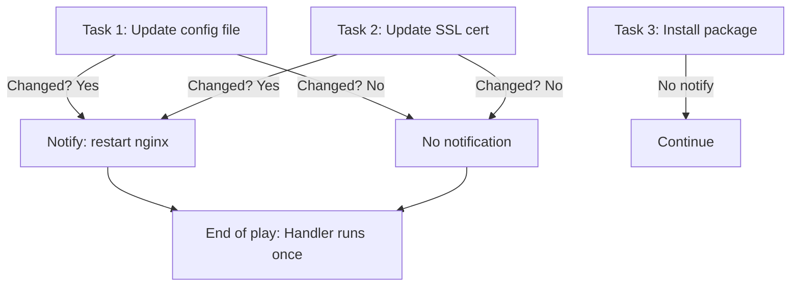

# How to Use Ansible notify and Handlers for Service Restarts

Author: [nawazdhandala](https://www.github.com/nawazdhandala)

Tags: Ansible, Handlers, Service Management, DevOps

Description: Learn how to use Ansible notify and handlers to trigger service restarts and other actions only when configuration changes are detected.

---

One of the most common patterns in server management is: change a configuration file, then restart the service so it picks up the new config. But you do not want to restart the service every time the playbook runs, only when the config actually changed. Ansible's handler system solves this perfectly. Tasks "notify" a handler when they make changes, and handlers run at the end of the play only if they were notified.

## How Handlers Work

Handlers are special tasks that only execute when triggered by a `notify` directive. They run at the end of the play (after all regular tasks), and they run only once even if multiple tasks notify them.



## Basic Handler Example

Here is the classic pattern of updating a config and restarting a service:

```yaml
# nginx-config.yml - Update nginx config and restart if changed
---
- name: Configure nginx web server
  hosts: webservers
  become: yes

  handlers:
    - name: Restart nginx
      systemd:
        name: nginx
        state: restarted

  tasks:
    - name: Install nginx
      apt:
        name: nginx
        state: present

    - name: Deploy nginx configuration
      template:
        src: nginx.conf.j2
        dest: /etc/nginx/nginx.conf
        owner: root
        group: root
        mode: '0644'
      notify: Restart nginx
      # If the template content changes, nginx gets restarted
      # If the file is already correct, no restart happens
```

If the template produces the same output as what is already on disk, the task reports "ok" (not "changed"), and the handler is not notified.

## Multiple Tasks Notifying the Same Handler

Multiple tasks can notify the same handler. The handler still runs only once:

```yaml
# multi-notify.yml - Multiple tasks trigger one restart
---
- name: Configure nginx completely
  hosts: webservers
  become: yes

  handlers:
    - name: Restart nginx
      systemd:
        name: nginx
        state: restarted

    - name: Reload nginx
      systemd:
        name: nginx
        state: reloaded

  tasks:
    - name: Update main nginx config
      template:
        src: nginx.conf.j2
        dest: /etc/nginx/nginx.conf
      notify: Restart nginx

    - name: Update SSL configuration
      template:
        src: ssl.conf.j2
        dest: /etc/nginx/conf.d/ssl.conf
      notify: Reload nginx

    - name: Deploy site configuration
      template:
        src: mysite.conf.j2
        dest: /etc/nginx/sites-available/mysite.conf
      notify: Reload nginx

    - name: Enable site
      file:
        src: /etc/nginx/sites-available/mysite.conf
        dest: /etc/nginx/sites-enabled/mysite.conf
        state: link
      notify: Reload nginx
      # Even though 3 tasks notify "Reload nginx",
      # the handler runs only once at the end
```

## One Task Notifying Multiple Handlers

A single task can notify multiple handlers:

```yaml
# multi-handler-notify.yml - One task triggers multiple handlers
---
- name: Deploy application configuration
  hosts: app_servers
  become: yes

  handlers:
    - name: Restart application
      systemd:
        name: myapp
        state: restarted

    - name: Reload nginx
      systemd:
        name: nginx
        state: reloaded

    - name: Clear application cache
      command: /opt/myapp/bin/cache-clear

  tasks:
    - name: Update application config
      template:
        src: app-config.yml.j2
        dest: /etc/myapp/config.yml
      notify:
        - Restart application
        - Reload nginx
        - Clear application cache
```

## Handler Execution Order

Handlers run in the order they are defined in the `handlers` section, not in the order they are notified. This gives you control over the sequence:

```yaml
# handler-order.yml - Handlers run in definition order
---
- name: Ordered handler execution
  hosts: webservers
  become: yes

  handlers:
    # These run in this order, regardless of notification order
    - name: Validate nginx config
      command: nginx -t
      changed_when: false

    - name: Reload nginx
      systemd:
        name: nginx
        state: reloaded

    - name: Verify nginx is serving
      uri:
        url: http://localhost/health
        status_code: 200
      retries: 3
      delay: 5

  tasks:
    - name: Update server block
      template:
        src: server-block.conf.j2
        dest: /etc/nginx/sites-available/myapp.conf
      notify:
        - Validate nginx config
        - Reload nginx
        - Verify nginx is serving
```

## Handlers in Roles

When using roles, handlers are defined in the role's `handlers/main.yml` file:

```yaml
# roles/nginx/handlers/main.yml
---
- name: Restart nginx
  systemd:
    name: nginx
    state: restarted

- name: Reload nginx
  systemd:
    name: nginx
    state: reloaded

- name: Test nginx configuration
  command: nginx -t
  changed_when: false
```

```yaml
# roles/nginx/tasks/main.yml
---
- name: Install nginx
  apt:
    name: nginx
    state: present

- name: Deploy configuration
  template:
    src: nginx.conf.j2
    dest: /etc/nginx/nginx.conf
  notify:
    - Test nginx configuration
    - Restart nginx
```

## Listening Handlers

Handlers can listen to a topic rather than being called by name. This is useful for decoupling:

```yaml
# listen-handlers.yml - Handlers that listen to topics
---
- name: Deploy with listen-based handlers
  hosts: app_servers
  become: yes

  handlers:
    - name: Restart application service
      systemd:
        name: myapp
        state: restarted
      listen: "application changed"

    - name: Clear application cache
      command: /opt/myapp/bin/cache-clear
      listen: "application changed"

    - name: Notify monitoring system
      uri:
        url: "{{ monitoring_webhook }}"
        method: POST
        body_format: json
        body:
          event: "restart"
          host: "{{ inventory_hostname }}"
      listen: "application changed"

  tasks:
    - name: Deploy new application code
      unarchive:
        src: "files/myapp-{{ version }}.tar.gz"
        dest: /opt/myapp
      notify: "application changed"
      # All three handlers listening to "application changed" will run

    - name: Update environment file
      template:
        src: env.j2
        dest: /opt/myapp/.env
      notify: "application changed"
```

## Practical Example: Full Web Application Deployment

Here is a complete deployment playbook with proper handler usage:

```yaml
# full-deploy.yml - Production deployment with handlers
---
- name: Deploy web application
  hosts: webservers
  become: yes
  serial: 3

  vars:
    app_version: "{{ version }}"
    app_dir: /opt/myapp

  handlers:
    - name: Validate nginx
      command: nginx -t
      listen: "nginx config changed"

    - name: Reload nginx
      systemd:
        name: nginx
        state: reloaded
      listen: "nginx config changed"

    - name: Restart application
      systemd:
        name: myapp
        state: restarted

    - name: Restart worker
      systemd:
        name: myapp-worker
        state: restarted

    - name: Restart celery
      systemd:
        name: celery
        state: restarted

  tasks:
    - name: Create release directory
      file:
        path: "{{ app_dir }}/releases/{{ app_version }}"
        state: directory

    - name: Deploy application code
      unarchive:
        src: "files/myapp-{{ app_version }}.tar.gz"
        dest: "{{ app_dir }}/releases/{{ app_version }}"
      notify:
        - Restart application
        - Restart worker

    - name: Update symlink to current release
      file:
        src: "{{ app_dir }}/releases/{{ app_version }}"
        dest: "{{ app_dir }}/current"
        state: link
        force: yes
      notify:
        - Restart application
        - Restart worker

    - name: Deploy application configuration
      template:
        src: "{{ item.src }}"
        dest: "{{ item.dest }}"
      loop:
        - src: app.conf.j2
          dest: /etc/myapp/app.conf
        - src: database.yml.j2
          dest: /etc/myapp/database.yml
      notify: Restart application

    - name: Deploy celery configuration
      template:
        src: celery.conf.j2
        dest: /etc/myapp/celery.conf
      notify: Restart celery

    - name: Deploy nginx site configuration
      template:
        src: nginx-site.conf.j2
        dest: /etc/nginx/sites-available/myapp.conf
      notify: "nginx config changed"

    - name: Deploy nginx upstream configuration
      template:
        src: nginx-upstream.conf.j2
        dest: /etc/nginx/conf.d/upstream.conf
      notify: "nginx config changed"
```

## Handler Gotchas

There are a few things to watch out for with handlers:

**Handlers run at the end of the play, not after each task:**

```yaml
# This can cause issues if you need the restart to happen before the next task
- name: Update config
  template:
    src: config.j2
    dest: /etc/myapp/config.yml
  notify: Restart myapp

- name: Run health check (myapp might still be using old config!)
  uri:
    url: http://localhost:8080/health
  # The restart has not happened yet!
```

**If the play fails before handlers run, notified handlers do not execute.** Use `--force-handlers` to change this behavior:

```bash
# Force handlers to run even if a task fails
ansible-playbook --force-handlers deploy.yml
```

Or set it in ansible.cfg:

```ini
# ansible.cfg
[defaults]
force_handlers = True
```

**Handlers only run once per play.** If you need a restart mid-play, use `meta: flush_handlers` (covered in the next section).

## Conditional Handlers

You can add conditions to handlers:

```yaml
# conditional-handlers.yml - Handlers with when conditions
---
- name: Conditional handler demo
  hosts: all
  become: yes

  handlers:
    - name: Restart nginx
      systemd:
        name: nginx
        state: restarted
      when: ansible_os_family == "Debian"

    - name: Restart httpd
      systemd:
        name: httpd
        state: restarted
      when: ansible_os_family == "RedHat"

  tasks:
    - name: Deploy web config
      template:
        src: web.conf.j2
        dest: /etc/web/config.conf
      notify:
        - Restart nginx
        - Restart httpd
      # Both handlers are notified, but only the matching one runs
```

## Summary

Handlers are the correct way to manage service restarts and other actions that should only happen when configuration changes. Use `notify` on tasks that modify configuration, define handlers for the resulting actions, and let Ansible handle the "only restart if changed" logic. Combine with `listen` for decoupled architectures, and remember that handlers run at the end of the play in the order they are defined.
