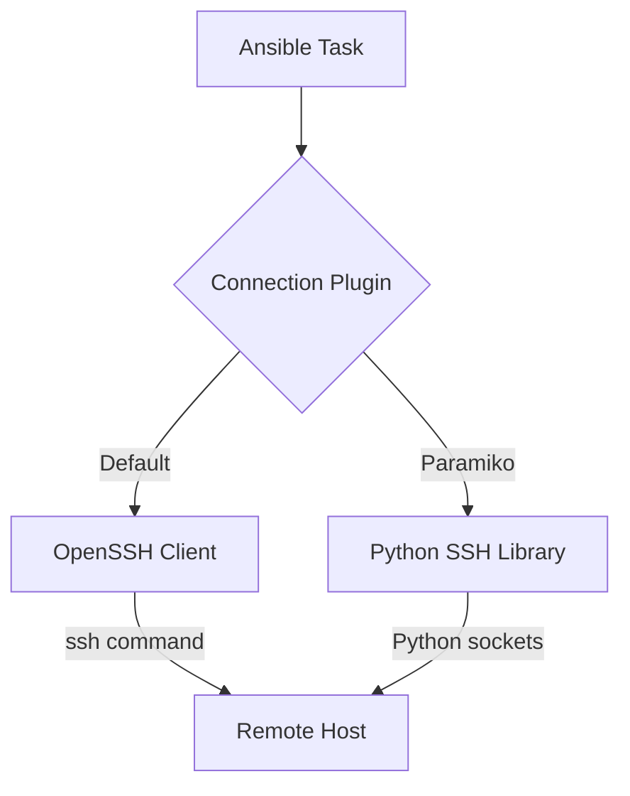

# How to Use Ansible paramiko SSH Connection Plugin

Author: [nawazdhandala](https://www.github.com/nawazdhandala)

Tags: Ansible, Paramiko, SSH, Connection Plugins

Description: Learn when and how to use Ansible's paramiko SSH connection plugin as an alternative to the default OpenSSH transport.

---

Ansible's default SSH connection plugin uses the system's OpenSSH client. But there is an alternative: the paramiko connection plugin, which is a pure Python SSH implementation. While most people never need to think about it, paramiko has specific use cases where it is the better choice. This post covers what paramiko is, when to use it, how to configure it, and the trade-offs compared to native SSH.

## What Is Paramiko?

Paramiko is a Python library that implements the SSH2 protocol. Instead of calling the `ssh` command-line tool, it handles the entire SSH connection natively in Python. Ansible bundled paramiko as its original SSH implementation before switching to native OpenSSH as the default.



## When to Use Paramiko

Paramiko is useful in a few specific scenarios:

1. **No OpenSSH client installed** - On some minimal systems or containers, the `ssh` binary is not available
2. **Old SSH versions** - When the system SSH is too old to support features Ansible needs
3. **Windows control nodes** - If running Ansible on Windows (via WSL or Cygwin), paramiko can be more reliable
4. **Network devices** - Some network equipment (routers, switches) responds better to paramiko than OpenSSH
5. **SFTP requirements** - Paramiko has built-in SFTP support that some tasks rely on

## Installing Paramiko

Paramiko is usually installed alongside Ansible, but verify it:

```bash
# Check if paramiko is installed
python3 -c "import paramiko; print(paramiko.__version__)"

# Install if missing
pip install paramiko

# Or install with Ansible
pip install ansible[paramiko]
```

## Enabling Paramiko

### Method 1: ansible.cfg

Set paramiko as the default connection:

```ini
# ansible.cfg
[defaults]
transport = paramiko
```

Or set it specifically for SSH connections:

```ini
# ansible.cfg
[paramiko_connection]
host_key_auto_add = True
look_for_keys = True
```

### Method 2: Command Line

Override the connection plugin at runtime:

```bash
# Use paramiko for a specific run
ansible all -m ping -c paramiko

# Or with a playbook
ansible-playbook site.yml -c paramiko
```

### Method 3: Inventory Variables

Set it per host or per group:

```ini
# inventory/hosts
[network_devices]
switch01 ansible_host=10.0.0.1 ansible_connection=paramiko
switch02 ansible_host=10.0.0.2 ansible_connection=paramiko
router01 ansible_host=10.0.0.3 ansible_connection=paramiko

[webservers]
web01 ansible_host=10.0.1.10
web02 ansible_host=10.0.1.11
# webservers use default OpenSSH
```

### Method 4: Playbook Level

```yaml
# network_config.yml
---
- name: Configure network devices
  hosts: network_devices
  connection: paramiko
  gather_facts: no

  tasks:
    - name: Show running config
      raw: show running-config
      register: config

    - name: Display config
      debug:
        msg: "{{ config.stdout_lines }}"
```

## Paramiko Configuration Options

The paramiko connection plugin has its own set of configuration options:

```ini
# ansible.cfg
[paramiko_connection]
# Automatically add new host keys (like StrictHostKeyChecking=no)
host_key_auto_add = True

# Search for SSH keys in the default locations
look_for_keys = True

# Record new host keys to the known_hosts file
record_host_keys = True

# Path to the known_hosts file
host_key_checking = False

# Use SSH agent for authentication
use_agent = True

# Connection timeout in seconds
connect_timeout = 30
```

## Paramiko with Password Authentication

Paramiko handles password authentication more gracefully than OpenSSH in some cases:

```yaml
# password_auth.yml
---
- name: Connect with password
  hosts: legacy_servers
  connection: paramiko
  vars:
    ansible_user: admin
    ansible_password: "{{ vault_admin_password }}"

  tasks:
    - name: Check connectivity
      ping:
```

Using Ansible Vault for the password:

```bash
# Encrypt the password
ansible-vault encrypt_string 'my_secret_password' --name 'vault_admin_password'

# Run with vault
ansible-playbook password_auth.yml --ask-vault-pass
```

## Paramiko for Network Devices

Paramiko is commonly used with network devices that have non-standard SSH implementations:

```yaml
# network_backup.yml
---
- name: Backup network device configs
  hosts: switches
  connection: paramiko
  gather_facts: no

  vars:
    ansible_user: admin
    ansible_password: "{{ vault_switch_password }}"
    ansible_network_os: ios

  tasks:
    # Use raw module for devices without Python
    - name: Get running configuration
      raw: show running-config
      register: running_config

    - name: Save config to local file
      copy:
        content: "{{ running_config.stdout }}"
        dest: "./backups/{{ inventory_hostname }}_config.txt"
      delegate_to: localhost
      connection: local
```

## Handling Host Keys with Paramiko

Paramiko manages host keys differently from OpenSSH:

```python
# Paramiko stores host keys in ~/.ssh/known_hosts by default
# You can also use a separate file
```

```ini
# ansible.cfg
[paramiko_connection]
# Auto-add new host keys without prompting
host_key_auto_add = True

# Do not verify host keys at all
host_key_checking = False

# Store discovered host keys
record_host_keys = True
```

If you want to pre-populate host keys for paramiko:

```yaml
- name: Add host keys for paramiko
  hosts: localhost
  connection: local

  tasks:
    - name: Scan and add host keys
      shell: "ssh-keyscan {{ item }} >> ~/.ssh/known_hosts"
      loop: "{{ groups['all'] | map('extract', hostvars, 'ansible_host') | list }}"
```

## Paramiko vs OpenSSH: Performance Comparison

Paramiko is generally slower than native OpenSSH for several reasons:

1. **No ControlMaster** - Paramiko does not support SSH connection multiplexing
2. **Pure Python** - Network operations are slower than the C-based OpenSSH
3. **No Pipelining** - Paramiko does not support Ansible pipelining

```ini
# These SSH-specific optimizations do NOT work with paramiko
[ssh_connection]
# These are ignored when using paramiko:
ssh_args = -o ControlMaster=auto -o ControlPersist=60s
pipelining = True
```

However, paramiko does have its own connection pooling:

```ini
# ansible.cfg
[paramiko_connection]
# Paramiko maintains its own connection pool
# This is controlled by forks
[defaults]
forks = 20
```

## Debugging Paramiko Connections

Enable verbose paramiko logging:

```bash
# Run with maximum verbosity
ansible all -m ping -c paramiko -vvvv
```

For even more detail, enable paramiko's own debug logging:

```python
# You can set the paramiko log level via environment
# Create a callback plugin or set it in your playbook
```

```yaml
- name: Debug paramiko
  hosts: all
  connection: paramiko

  tasks:
    - name: Test connection
      ping:
      register: result

    - name: Show result
      debug:
        var: result
```

Check for common errors:

```bash
# "paramiko is not installed" error
pip install paramiko

# "Authentication failed" error
# Verify credentials and key paths
ansible all -m ping -c paramiko --ask-pass -vvvv

# "No existing session" error
# Usually a timeout issue
# Increase the timeout in ansible.cfg
```

## Mixed Connection Types

You can use paramiko for some hosts and OpenSSH for others:

```ini
# inventory/hosts
[network_devices]
switch01 ansible_host=10.0.0.1 ansible_connection=paramiko
router01 ansible_host=10.0.0.2 ansible_connection=paramiko

[linux_servers]
web01 ansible_host=10.0.1.10 ansible_connection=ssh
db01 ansible_host=10.0.2.10 ansible_connection=ssh
```

```yaml
# mixed_playbook.yml
---
# Play 1: Network devices via paramiko
- name: Backup network configs
  hosts: network_devices
  connection: paramiko
  gather_facts: no

  tasks:
    - name: Get config
      raw: show running-config

# Play 2: Linux servers via native SSH
- name: Update Linux servers
  hosts: linux_servers
  # Uses default SSH connection

  tasks:
    - name: Update packages
      apt:
        upgrade: safe
      become: yes
```

## Paramiko SSH Key Authentication

Paramiko looks for SSH keys in the standard locations:

```yaml
# Specify key file explicitly
- name: Connect with specific key
  hosts: servers
  connection: paramiko
  vars:
    ansible_ssh_private_key_file: ~/.ssh/custom_key

  tasks:
    - name: Test connection
      ping:
```

Paramiko supports these key types:
- RSA
- DSA (deprecated, avoid)
- ECDSA
- Ed25519

```ini
# ansible.cfg
[paramiko_connection]
# Look for keys in default locations (~/.ssh/id_rsa, etc.)
look_for_keys = True

# Also use the SSH agent
use_agent = True
```

## Migration Path

If you are using paramiko and want to migrate to native SSH (or vice versa), test thoroughly:

```bash
# Test with paramiko
ansible all -m ping -c paramiko -v

# Test with native SSH
ansible all -m ping -c ssh -v

# Compare results
```

Key differences to watch for:
- ControlMaster features only work with native SSH
- Pipelining only works with native SSH
- Some network devices only work well with paramiko
- Password prompts may behave differently

## Wrapping Up

The paramiko connection plugin is a specialized tool for specific situations. Use it when you are managing network devices, working on systems without OpenSSH, or dealing with SSH implementations that are not fully compatible with OpenSSH. For standard Linux server management, stick with the default native SSH plugin, which supports ControlMaster, pipelining, and all the other performance optimizations Ansible offers. If you find yourself needing paramiko, make sure it is installed and properly configured, and be aware that you lose some performance features in the trade-off.
