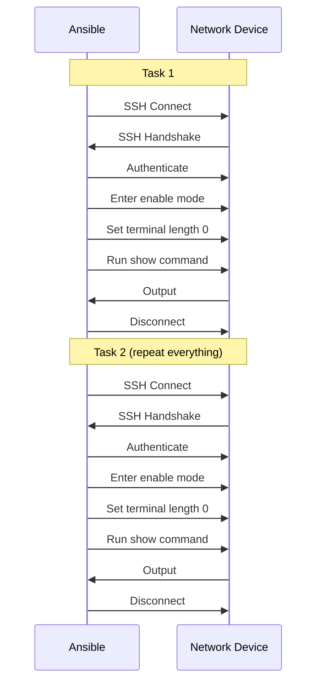
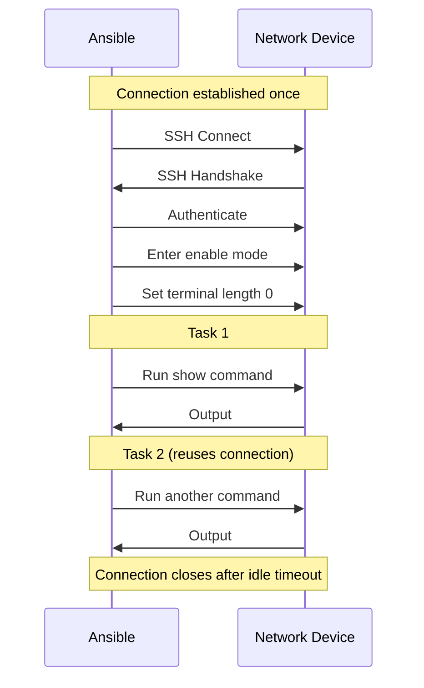

# How to Use Ansible Persistent Connections for Network Devices

Author: [nawazdhandala](https://www.github.com/nawazdhandala)

Tags: Ansible, Networking, Persistent Connections, Performance

Description: Configure Ansible persistent connections for network devices to reduce connection overhead and speed up network automation playbooks.

---

Network device automation with Ansible is fundamentally different from server automation. Network devices typically use SSH with a CLI interface rather than a Python interpreter, and each connection establishment involves protocol negotiation that is slower than standard Linux SSH. Persistent connections solve this by keeping a single connection open and reusing it across multiple tasks. This post covers how to configure and optimize persistent connections for network devices.

## The Network Connection Problem

When Ansible manages a Linux server, it opens SSH, runs a Python module, and closes the connection. For network devices using `network_cli` or `netconf`, the connection process involves additional steps: SSH handshake, CLI authentication, privilege escalation (enable mode), and terminal width/height negotiation.

Without persistent connections, every single task goes through this entire process:



With persistent connections, the connection is established once and reused:



## Configuring Persistent Connections

Add these settings to your `ansible.cfg`:

```ini
# ansible.cfg - Persistent connections for network devices
[persistent_connection]
connect_timeout = 30
connect_retry_timeout = 15
command_timeout = 30
```

These settings control:
- `connect_timeout`: How long to wait for the initial connection (default 30s)
- `connect_retry_timeout`: How long to retry a failed connection (default 15s)
- `command_timeout`: How long to wait for a command to complete (default 30s)

## Using network_cli Connection

The `network_cli` connection plugin is the most common way to manage network devices. It establishes a persistent SSH connection and sends CLI commands:

```yaml
---
# inventory/network.yml
all:
  children:
    cisco_routers:
      hosts:
        router01:
          ansible_host: 10.0.1.1
          ansible_network_os: cisco.ios.ios
          ansible_connection: network_cli
          ansible_user: admin
          ansible_password: "{{ vault_cisco_password }}"
          ansible_become: true
          ansible_become_method: enable
          ansible_become_password: "{{ vault_enable_password }}"
        router02:
          ansible_host: 10.0.1.2
          ansible_network_os: cisco.ios.ios
          ansible_connection: network_cli
          ansible_user: admin
          ansible_password: "{{ vault_cisco_password }}"
```

Now write a playbook that benefits from persistent connections:

```yaml
---
# configure-routers.yml - Multiple tasks reuse the same connection
- hosts: cisco_routers
  gather_facts: false
  tasks:
    - name: Get running config
      cisco.ios.ios_command:
        commands:
          - show running-config
      register: running_config

    - name: Get interface status
      cisco.ios.ios_command:
        commands:
          - show ip interface brief
      register: interfaces

    - name: Get routing table
      cisco.ios.ios_command:
        commands:
          - show ip route
      register: routes

    - name: Get version info
      cisco.ios.ios_command:
        commands:
          - show version
      register: version

    - name: Get CDP neighbors
      cisco.ios.ios_command:
        commands:
          - show cdp neighbors
      register: cdp
```

All five tasks share a single SSH connection to each router. Without persistent connections, this playbook would establish and tear down 5 separate connections per device.

## Using NETCONF Connection

For devices that support NETCONF, the `netconf` connection plugin provides a similar persistent connection over the NETCONF protocol:

```yaml
---
# inventory for NETCONF devices
all:
  children:
    juniper_switches:
      hosts:
        switch01:
          ansible_host: 10.0.2.1
          ansible_network_os: junipernetworks.junos.junos
          ansible_connection: netconf
          ansible_user: admin
          ansible_password: "{{ vault_juniper_password }}"
```

```yaml
---
# junos-config.yml - Configure Juniper devices via NETCONF
- hosts: juniper_switches
  gather_facts: false
  tasks:
    - name: Get device facts
      junipernetworks.junos.junos_facts:
        gather_subset: all

    - name: Configure interface
      junipernetworks.junos.junos_config:
        lines:
          - set interfaces ge-0/0/1 description "Uplink to Core"
          - set interfaces ge-0/0/1 unit 0 family inet address 10.0.100.1/30

    - name: Save configuration
      junipernetworks.junos.junos_config:
        confirm_commit: true
```

## Tuning Persistent Connection Timeouts

Network devices vary in their response times. Slow devices or devices under heavy load may need longer timeouts:

```ini
# ansible.cfg - Tuned for slow network devices
[persistent_connection]
connect_timeout = 60
connect_retry_timeout = 30
command_timeout = 60
```

You can also set timeouts per-host in the inventory:

```yaml
# Slower devices get longer timeouts
all:
  children:
    old_switches:
      hosts:
        legacy-sw01:
          ansible_host: 10.0.3.1
          ansible_network_os: cisco.ios.ios
          ansible_connection: network_cli
          ansible_command_timeout: 120
          ansible_connect_timeout: 60
    fast_switches:
      hosts:
        modern-sw01:
          ansible_host: 10.0.3.2
          ansible_network_os: cisco.ios.ios
          ansible_connection: network_cli
          ansible_command_timeout: 30
          ansible_connect_timeout: 15
```

## Persistent Connection Socket Path

Ansible creates Unix sockets for persistent connections. You can control where these sockets are stored:

```ini
# Custom socket path for persistent connections
[persistent_connection]
control_path_dir = /tmp/ansible-persistent-connections
```

Check active persistent connections:

```bash
# List active persistent connection sockets
ls -la /tmp/ansible-persistent-connections/ 2>/dev/null || \
ls -la ~/.ansible/pc/ 2>/dev/null
```

## Troubleshooting Persistent Connections

When persistent connections fail, increase verbosity:

```bash
# Debug persistent connection issues
ansible-playbook network-config.yml -vvvv 2>&1 | grep -i "persistent\|socket\|connection"
```

Common issues and fixes:

**Socket file not found:**
```bash
# Check if the socket directory exists and has correct permissions
ls -la ~/.ansible/pc/
# If missing, Ansible will create it. If permissions are wrong:
chmod 700 ~/.ansible/pc/
```

**Connection timeout on slow devices:**
```ini
# Increase all timeouts
[persistent_connection]
connect_timeout = 120
command_timeout = 120
connect_retry_timeout = 60
```

**Stale connections after device reboot:**
```bash
# Remove stale socket files
rm -f ~/.ansible/pc/*

# Or restart the persistent connection daemon
# by running the playbook again - Ansible will create new connections
```

## Performance Comparison

Benchmarking a 10-task playbook across 20 network devices:

```bash
# Test without persistent connections (using paramiko)
time ansible-playbook network-config.yml -c paramiko

# Test with persistent connections (using network_cli)
time ansible-playbook network-config.yml -c network_cli
```

Typical results:

| Connection Type | 20 Devices, 10 Tasks | Per-Device Time |
|---|---|---|
| paramiko (no persistence) | 4m 32s | 13.6s |
| network_cli (persistent) | 1m 48s | 5.4s |

That is a 60% reduction in execution time. The improvement is even more dramatic with more tasks per device, since the connection setup cost is paid only once.

## Persistent Connections with httpapi

For devices with REST APIs, the `httpapi` connection plugin provides persistent HTTP sessions:

```yaml
# inventory for API-driven devices
all:
  children:
    arista_switches:
      hosts:
        arista01:
          ansible_host: 10.0.4.1
          ansible_network_os: arista.eos.eos
          ansible_connection: httpapi
          ansible_httpapi_use_ssl: true
          ansible_httpapi_validate_certs: false
          ansible_user: admin
          ansible_password: "{{ vault_arista_password }}"
```

```yaml
---
# arista-config.yml - Configure Arista switches via eAPI
- hosts: arista_switches
  gather_facts: false
  tasks:
    - name: Get EOS facts
      arista.eos.eos_facts:
        gather_subset: all

    - name: Configure VLAN
      arista.eos.eos_vlans:
        config:
          - vlan_id: 100
            name: Production
            state: active
```

The HTTP session stays alive across tasks, avoiding repeated authentication and TLS handshake overhead.

## Best Practices for Network Persistent Connections

1. Always set `gather_facts: false` for network devices (the default fact gathering does not work with network_cli)
2. Group tasks by device type to maximize connection reuse
3. Set appropriate timeouts based on your slowest devices
4. Monitor the socket directory for stale connections
5. Use the `ansible_network_os` variable to ensure the correct platform modules are used

```yaml
---
# Best practice: group network tasks to maximize connection reuse
- hosts: cisco_routers
  gather_facts: false
  tasks:
    - name: Apply all config changes in one play
      cisco.ios.ios_config:
        lines: "{{ item }}"
      loop:
        - "interface GigabitEthernet0/1"
        - " description Updated by Ansible"
        - " ip address 10.0.1.1 255.255.255.0"
        - " no shutdown"
```

Persistent connections are essential for any serious network automation with Ansible. The connection overhead for network devices is much higher than for Linux servers, making the performance impact of persistent connections even more significant. Enable them, tune the timeouts for your environment, and structure your playbooks to maximize connection reuse.
