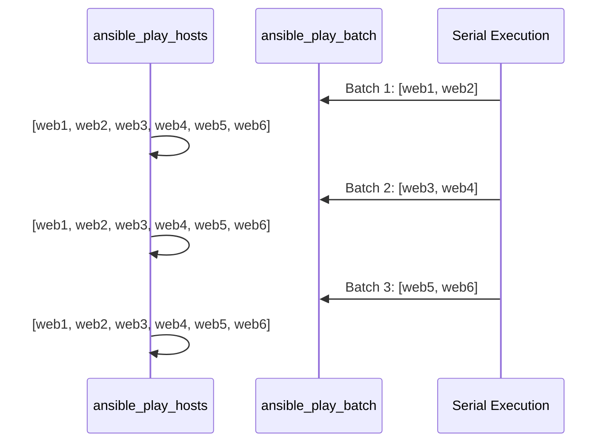

# How to Use Ansible play_hosts and ansible_play_batch Variables

Author: [nawazdhandala](https://www.github.com/nawazdhandala)

Tags: Ansible, Special Variables, play_hosts, Rolling Updates

Description: Understand the difference between play_hosts and ansible_play_batch in Ansible and learn how to use them for coordinated deployments.

---

When you are orchestrating deployments across multiple hosts, you often need to know which hosts are part of the current play and which are in the current batch. Ansible provides two special variables for this: `ansible_play_hosts` (also available as `play_hosts`) and `ansible_play_batch`. They look similar at first glance, but they serve different purposes, especially when you are using the `serial` keyword for rolling updates.

## What is ansible_play_hosts?

The `ansible_play_hosts` variable contains a list of all hostnames that are still active in the current play. "Still active" means hosts that have not failed or been unreachable. At the start of a play, this includes every host matched by the `hosts` directive. As hosts fail, they get removed from this list.

```yaml
# play-hosts-demo.yml - Show ansible_play_hosts contents
---
- name: Demonstrate ansible_play_hosts
  hosts: all
  gather_facts: false
  tasks:
    - name: Show all hosts in this play
      ansible.builtin.debug:
        msg: "Active hosts in play: {{ ansible_play_hosts }}"
      # This runs on every host but shows the same list
      run_once: true

    - name: Show total count of active hosts
      ansible.builtin.debug:
        msg: "Total active hosts: {{ ansible_play_hosts | length }}"
      run_once: true
```

If you have hosts web1, web2, web3, and db1 in your inventory under `all`, the output would show all four in the list. If web2 fails on a previous task, it drops out of `ansible_play_hosts` for all subsequent tasks.

## What is ansible_play_batch?

The `ansible_play_batch` variable contains only the hosts in the current batch when you use the `serial` keyword. Without `serial`, it is identical to `ansible_play_hosts`. The difference becomes clear during rolling updates.

```yaml
# play-batch-demo.yml - Show the difference with serial
---
- name: Rolling update with batch awareness
  hosts: webservers
  serial: 2
  gather_facts: false
  tasks:
    - name: Show play_hosts vs play_batch
      ansible.builtin.debug:
        msg: >
          play_hosts={{ ansible_play_hosts | join(', ') }}
          |
          play_batch={{ ansible_play_batch | join(', ') }}
```

If `webservers` contains web1 through web6 and you set `serial: 2`, here is what happens:

- Batch 1 (web1, web2): `ansible_play_hosts` shows all 6 hosts, `ansible_play_batch` shows just web1, web2
- Batch 2 (web3, web4): `ansible_play_hosts` still shows all active hosts, `ansible_play_batch` shows web3, web4
- Batch 3 (web5, web6): Same pattern, `ansible_play_batch` shows web5, web6

## The Flow During Rolling Updates



## Practical Use: Coordinating Load Balancer Draining

A common pattern is removing servers from a load balancer before deploying, then adding them back. You need `ansible_play_batch` to know which servers are being updated right now.

```yaml
# rolling-deploy.yml - Coordinated rolling deployment
---
- name: Rolling deployment with LB coordination
  hosts: webservers
  serial: 2
  gather_facts: true
  tasks:
    - name: Remove current batch from load balancer
      ansible.builtin.uri:
        url: "http://lb.internal/api/backends/{{ inventory_hostname }}/disable"
        method: POST
      delegate_to: localhost

    - name: Show which hosts are being updated now
      ansible.builtin.debug:
        msg: "Updating batch: {{ ansible_play_batch | join(', ') }}"
      run_once: true

    - name: Deploy application
      ansible.builtin.copy:
        src: /releases/latest/app.tar.gz
        dest: /opt/app/app.tar.gz
        mode: '0644'

    - name: Restart application service
      ansible.builtin.systemd:
        name: myapp
        state: restarted
      become: true

    - name: Wait for health check to pass
      ansible.builtin.uri:
        url: "http://{{ inventory_hostname }}:8080/health"
        status_code: 200
      register: health_check
      until: health_check.status == 200
      retries: 30
      delay: 5

    - name: Re-enable current batch in load balancer
      ansible.builtin.uri:
        url: "http://lb.internal/api/backends/{{ inventory_hostname }}/enable"
        method: POST
      delegate_to: localhost
```

## Using play_hosts for Cluster-Aware Configuration

When configuring clustered services, each node often needs to know about all other nodes in the cluster. `ansible_play_hosts` gives you that full list.

```yaml
# cluster-config.yml - Generate cluster configuration with all members
---
- name: Configure database cluster
  hosts: db_cluster
  gather_facts: true
  tasks:
    - name: Generate cluster member list
      ansible.builtin.set_fact:
        cluster_members: >-
          {{ ansible_play_hosts | map('extract', hostvars, 'ansible_default_ipv4')
             | map(attribute='address') | list }}

    - name: Template cluster configuration
      ansible.builtin.template:
        src: templates/cluster.conf.j2
        dest: /etc/db/cluster.conf
        mode: '0640'
      become: true
```

The corresponding template might look like this:

```jinja2
# templates/cluster.conf.j2 - Cluster configuration with all members
[cluster]

node.{{ loop.index }} = {{ hostvars[host]['ansible_default_ipv4']['address'] }}:5432

local_node = {{ ansible_default_ipv4.address }}:5432
```

## Calculating Batch Position

You can figure out which batch number you are on by comparing `ansible_play_batch` against `ansible_play_hosts`.

```yaml
# batch-position.yml - Determine current batch number
---
- name: Batch-aware deployment
  hosts: webservers
  serial: 3
  gather_facts: false
  tasks:
    - name: Calculate batch number
      ansible.builtin.set_fact:
        batch_number: >-
          {{ ((ansible_play_hosts.index(ansible_play_batch[0])) //
              (ansible_play_batch | length)) + 1 }}
        total_batches: >-
          {{ (ansible_play_hosts | length / (ansible_play_batch | length)) | round(0, 'ceil') | int }}
      run_once: true

    - name: Display batch progress
      ansible.builtin.debug:
        msg: "Processing batch {{ batch_number }} of {{ total_batches }}"
      run_once: true
```

## Handling Failed Hosts

When a host fails, it gets removed from `ansible_play_hosts` for subsequent tasks. This is useful for conditional logic that depends on how many hosts are still healthy.

```yaml
# failure-handling.yml - React to host failures during rolling update
---
- name: Deployment with failure threshold
  hosts: webservers
  serial: 2
  gather_facts: false
  max_fail_percentage: 25
  tasks:
    - name: Deploy application
      ansible.builtin.script:
        cmd: /scripts/deploy.sh
      register: deploy_result

    - name: Check remaining healthy hosts
      ansible.builtin.debug:
        msg: >
          Healthy hosts: {{ ansible_play_hosts | length }}.
          Originally: {{ groups['webservers'] | length }}.
      run_once: true

    - name: Abort if too many hosts failed
      ansible.builtin.fail:
        msg: "Too many hosts have failed. Aborting deployment."
      when: (ansible_play_hosts | length) < (groups['webservers'] | length * 0.5)
      run_once: true
```

## Quick Reference Table

Here is a comparison to keep things straight:

| Variable | With serial | Without serial |
|---|---|---|
| `ansible_play_hosts` | All active hosts in the entire play | All active hosts in the play |
| `ansible_play_batch` | Only hosts in the current batch | Same as ansible_play_hosts |
| `ansible_play_hosts_all` | All hosts including failed ones | All hosts including failed ones |

The `ansible_play_hosts_all` variable (available in newer Ansible versions) includes hosts that have already failed. This can be useful for reporting purposes.

## Key Takeaways

Use `ansible_play_hosts` when you need the full picture of which hosts are participating in the play. Use `ansible_play_batch` when you need to know which specific hosts are being processed in the current serial batch. The distinction matters most during rolling updates where you are processing subsets of your fleet at a time. Getting this right is the difference between a smooth zero-downtime deployment and accidentally pulling all your servers out of rotation at once.
