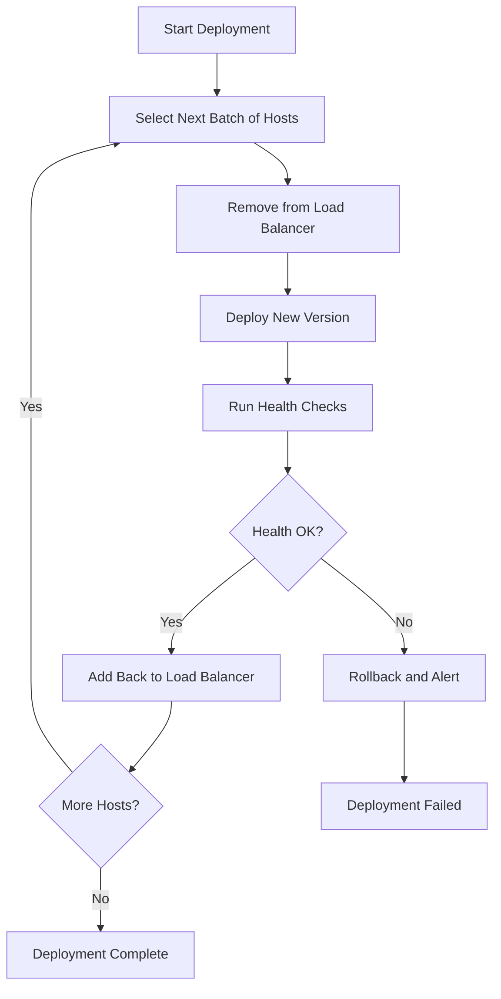

# How to Use Ansible Playbook for Zero-Downtime Deployments

Author: [nawazdhandala](https://www.github.com/nawazdhandala)

Tags: Ansible, Zero-Downtime, Deployment, DevOps, Rolling Updates

Description: Learn how to implement zero-downtime deployments with Ansible using rolling updates, serial execution, health checks, and load balancer management.

---

Deploying application updates without taking the service offline is a hard requirement for most production systems. Users expect 24/7 availability, and even brief outages during deployments erode trust. Ansible provides several built-in features that make zero-downtime deployments achievable: serial execution, delegation, health checks, and rolling update strategies. In this post, I will walk through a complete zero-downtime deployment playbook and explain each piece.

## The Core Strategy

Zero-downtime deployment with Ansible follows this pattern:

1. Update hosts in small batches (not all at once)
2. Remove each host from the load balancer before updating it
3. Deploy the new code and configuration
4. Run health checks to verify the new version works
5. Add the host back to the load balancer
6. Move to the next batch



## Serial Execution

The `serial` keyword controls how many hosts Ansible updates at a time. Without it, Ansible runs against all hosts in a group simultaneously, which would cause a full outage.

```yaml
---
# deploy.yml
# Deploy application with rolling updates, 2 hosts at a time

- hosts: webservers
  serial: 2          # Process 2 hosts at a time
  become: yes

  tasks:
    - name: Deploy application
      debug:
        msg: "Deploying to {{ inventory_hostname }}"
```

You can also use a percentage or a progressive batch strategy:

```yaml
# Progressive serial: start small, then increase batch size
# First batch: 1 host (canary), then 25% at a time, then the rest
- hosts: webservers
  serial:
    - 1        # First, deploy to just 1 host as a canary
    - "25%"    # Then deploy to 25% of remaining hosts
    - "100%"   # Then deploy to all remaining hosts
  become: yes
```

## The Complete Zero-Downtime Playbook

Here is a production-ready deployment playbook:

```yaml
---
# zero-downtime-deploy.yml
# Deploys a web application with zero downtime using rolling updates

- hosts: webservers
  serial: 2
  become: yes
  max_fail_percentage: 0    # Stop deployment if any host fails

  vars:
    app_version: "{{ deploy_version }}"
    app_dir: /opt/webapp
    health_check_url: "http://localhost:8080/health"
    health_check_retries: 10
    health_check_delay: 5
    lb_backend_name: webapp_backend

  pre_tasks:
    # Remove this host from the load balancer before making changes
    - name: Disable host in HAProxy
      haproxy:
        state: disabled
        host: "{{ inventory_hostname }}"
        socket: /var/run/haproxy/admin.sock
        backend: "{{ lb_backend_name }}"
        wait: yes
        drain: yes
        wait_interval: 5
      delegate_to: "{{ item }}"
      loop: "{{ groups['loadbalancers'] }}"

    # Wait for active connections to drain
    - name: Wait for connections to drain
      wait_for:
        timeout: 30
      delegate_to: localhost

  tasks:
    # Stop the application service
    - name: Stop application service
      service:
        name: webapp
        state: stopped

    # Deploy the new application version
    - name: Download new application package
      get_url:
        url: "https://releases.example.com/webapp/{{ app_version }}/webapp.tar.gz"
        dest: "/tmp/webapp-{{ app_version }}.tar.gz"
        checksum: "sha256:{{ app_checksum }}"

    - name: Create release directory
      file:
        path: "{{ app_dir }}/releases/{{ app_version }}"
        state: directory
        owner: webapp
        group: webapp
        mode: '0755'

    - name: Extract new release
      unarchive:
        src: "/tmp/webapp-{{ app_version }}.tar.gz"
        dest: "{{ app_dir }}/releases/{{ app_version }}"
        remote_src: yes
        owner: webapp
        group: webapp

    # Update the symlink to point to the new release
    - name: Update current symlink to new release
      file:
        src: "{{ app_dir }}/releases/{{ app_version }}"
        dest: "{{ app_dir }}/current"
        state: link
        force: yes

    - name: Deploy updated configuration
      template:
        src: templates/app-config.yml.j2
        dest: "{{ app_dir }}/current/config.yml"
        owner: webapp
        group: webapp
        mode: '0644'

    # Start the application with the new version
    - name: Start application service
      service:
        name: webapp
        state: started

    # Verify the new version is healthy before continuing
    - name: Wait for application to become healthy
      uri:
        url: "{{ health_check_url }}"
        return_content: yes
        status_code: 200
      register: health_result
      until: health_result.status == 200
      retries: "{{ health_check_retries }}"
      delay: "{{ health_check_delay }}"

    # Verify the correct version is running
    - name: Verify deployed version
      uri:
        url: "http://localhost:8080/version"
        return_content: yes
      register: version_check
      failed_when: "app_version not in version_check.content"

  post_tasks:
    # Add the host back to the load balancer after successful deployment
    - name: Enable host in HAProxy
      haproxy:
        state: enabled
        host: "{{ inventory_hostname }}"
        socket: /var/run/haproxy/admin.sock
        backend: "{{ lb_backend_name }}"
      delegate_to: "{{ item }}"
      loop: "{{ groups['loadbalancers'] }}"

    # Brief pause to let the load balancer start sending traffic
    - name: Wait for load balancer to resume traffic
      wait_for:
        timeout: 10
      delegate_to: localhost
```

Run it like this:

```bash
# Deploy version 3.2.0 with zero downtime
ansible-playbook zero-downtime-deploy.yml \
  -e "deploy_version=3.2.0" \
  -e "app_checksum=a1b2c3d4e5f6..."
```

## Using the Nginx Load Balancer Alternative

If you use Nginx instead of HAProxy, you can manage the upstream configuration:

```yaml
# Pre-task: Remove host from nginx upstream
- name: Remove host from nginx upstream
  template:
    src: nginx-upstream.conf.j2
    dest: /etc/nginx/conf.d/upstream.conf
  delegate_to: "{{ item }}"
  loop: "{{ groups['loadbalancers'] }}"
  vars:
    excluded_host: "{{ inventory_hostname }}"
  notify: reload nginx on lb

# Post-task: Add host back to nginx upstream
- name: Add host back to nginx upstream
  template:
    src: nginx-upstream.conf.j2
    dest: /etc/nginx/conf.d/upstream.conf
  delegate_to: "{{ item }}"
  loop: "{{ groups['loadbalancers'] }}"
  vars:
    excluded_host: ""
  notify: reload nginx on lb
```

The Nginx upstream template:

```nginx
# templates/nginx-upstream.conf.j2
# Generated by Ansible - do not edit manually
upstream webapp_backend {


    server {{ hostvars[host]['ansible_host'] }}:8080;

    server {{ hostvars[host]['ansible_host'] }}:8080 down;


}
```

## Implementing Rollback

If health checks fail, you need a rollback mechanism. The symlink-based release structure makes this straightforward:

```yaml
# rollback.yml
# Roll back to the previous application version

- hosts: webservers
  serial: 2
  become: yes
  tasks:
    # Find the previous release
    - name: List releases sorted by date
      find:
        paths: /opt/webapp/releases
        file_type: directory
      register: releases

    - name: Identify previous release
      set_fact:
        previous_release: "{{ (releases.files | sort(attribute='mtime') | map(attribute='path') | list)[-2] }}"
      when: releases.files | length > 1

    # Revert the symlink
    - name: Roll back to previous release
      file:
        src: "{{ previous_release }}"
        dest: /opt/webapp/current
        state: link
        force: yes
      when: previous_release is defined

    - name: Restart application with previous version
      service:
        name: webapp
        state: restarted
```

## The max_fail_percentage Safety Net

The `max_fail_percentage` directive stops the rolling deployment if too many hosts fail:

```yaml
# Stop the entire deployment if more than 10% of hosts fail
- hosts: webservers
  serial: 5
  max_fail_percentage: 10
```

Setting it to 0 means the deployment stops at the very first failure, which is the safest option for critical services.

## Wrapping Up

Zero-downtime deployments with Ansible boil down to three key ingredients: serial execution to process hosts in batches, delegation to manage load balancers from within the playbook, and health checks to verify each host before putting it back into service. The symlink-based release structure gives you instant rollback capability. Combined with `max_fail_percentage`, you get a deployment pipeline that is both safe and automated. Start with a small serial count and a strict failure threshold, then tune based on your fleet size and deployment confidence.
