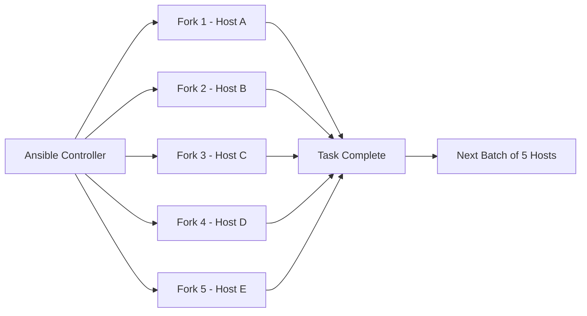
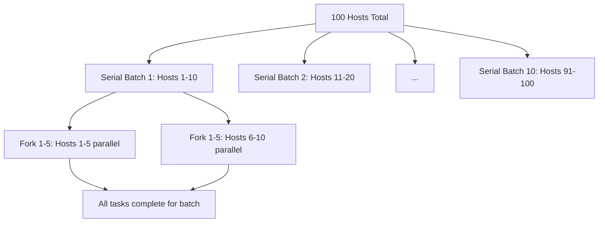

# How to Use Ansible Playbook Forks for Parallel Execution

Author: [nawazdhandala](https://www.github.com/nawazdhandala)

Tags: Ansible, Performance, Parallel Execution, DevOps

Description: Learn how to use the forks setting in Ansible to control parallel execution across multiple hosts and improve playbook performance.

---

When you manage a fleet of servers with Ansible, the speed at which playbooks run becomes critical. By default, Ansible processes tasks across 5 hosts at a time. That number is controlled by the `forks` setting. If you have 100 servers and the default 5 forks, Ansible will process them in batches of 5, which can take a long time. Tuning forks properly can cut your deployment time dramatically.

## What Are Forks?

Forks determine how many hosts Ansible will manage simultaneously. Each fork is essentially a separate process that connects to a host and runs the task. When Ansible starts a task, it spawns up to N processes (where N is the forks value), each handling a different host in parallel.

Here is a visual representation of how forks work:



## Checking the Current Forks Setting

You can see the current default by running:

```bash
# Display the current Ansible configuration including forks
ansible-config dump | grep FORKS
```

The output will show something like:

```
DEFAULT_FORKS(default) = 5
```

## Setting Forks via Command Line

The quickest way to increase parallelism is the `-f` or `--forks` flag:

```bash
# Run playbook with 20 parallel forks
ansible-playbook -f 20 deploy.yml

# Equivalent long form
ansible-playbook --forks=20 deploy.yml
```

## Setting Forks in ansible.cfg

For a persistent configuration, add it to your `ansible.cfg` file:

```ini
# ansible.cfg - Set default forks for the project
[defaults]
forks = 20
inventory = inventory.ini
host_key_checking = False
timeout = 30
```

Place this file in your project root or in `/etc/ansible/ansible.cfg` for system-wide settings.

## Setting Forks via Environment Variable

You can also use an environment variable, which is handy in CI/CD pipelines:

```bash
# Set forks via environment variable
export ANSIBLE_FORKS=20
ansible-playbook deploy.yml
```

## How Many Forks Should You Use?

The right number depends on several factors:

**Controller resources**: Each fork consumes memory and CPU on the Ansible control node. A good starting point is to match the number of CPU cores, then increase gradually while monitoring resource usage.

**Network bandwidth**: If your tasks involve transferring large files, too many forks can saturate your network.

**Target host capacity**: If all hosts share a common resource (like a package repository or database), too many parallel connections can overwhelm that resource.

Here is a practical benchmark script to find your sweet spot:

```bash
#!/bin/bash
# benchmark-forks.sh - Test different fork values and measure execution time

for forks in 5 10 20 50 100; do
    echo "Testing with $forks forks..."
    time ansible-playbook -f $forks -i inventory.ini check-hosts.yml > /dev/null 2>&1
    echo "---"
done
```

## Practical Example: Deploying to 100 Servers

Here is a deployment playbook that benefits from higher fork counts:

```yaml
# deploy.yml - Deploy application to web server fleet
---
- name: Deploy application to all web servers
  hosts: webservers
  become: yes
  serial: 0  # Process all hosts at once (limited by forks)

  vars:
    app_version: "2.4.1"
    app_dir: /opt/myapp

  pre_tasks:
    - name: Check disk space before deployment
      shell: df -h / | awk 'NR==2 {print $5}' | tr -d '%'
      register: disk_usage
      changed_when: false

    - name: Fail if disk usage is above 90%
      fail:
        msg: "Disk usage is {{ disk_usage.stdout }}%, too high for deployment"
      when: disk_usage.stdout | int > 90

  tasks:
    - name: Download application package
      get_url:
        url: "https://releases.example.com/myapp-{{ app_version }}.tar.gz"
        dest: "/tmp/myapp-{{ app_version }}.tar.gz"
        checksum: "sha256:abc123..."

    - name: Stop application service
      systemd:
        name: myapp
        state: stopped

    - name: Extract new version
      unarchive:
        src: "/tmp/myapp-{{ app_version }}.tar.gz"
        dest: "{{ app_dir }}"
        remote_src: yes

    - name: Start application service
      systemd:
        name: myapp
        state: started

    - name: Wait for application to be healthy
      uri:
        url: "http://localhost:8080/health"
        status_code: 200
      register: health_check
      until: health_check.status == 200
      retries: 10
      delay: 5
```

Run this with higher forks:

```bash
# Deploy to 100 servers with 50 parallel forks
ansible-playbook -f 50 -i production.ini deploy.yml
```

## Forks vs Serial

People often confuse `forks` with `serial`. They control different things:

- **forks**: How many hosts Ansible processes in parallel at the task level
- **serial**: How many hosts go through the entire play before moving to the next batch

```yaml
# Understanding the difference between forks and serial
---
- name: Rolling deployment
  hosts: webservers
  serial: 10  # Process 10 hosts through all tasks, then next 10
  # With forks=20, all 10 hosts in each serial batch run in parallel
  # With forks=5, each batch of 10 is split into 2 sub-batches of 5

  tasks:
    - name: Update application
      apt:
        name: myapp
        state: latest
```



## Monitoring Fork Usage

When running with many forks, monitor the control node:

```bash
# Monitor Ansible processes during playbook execution
watch -n 1 'ps aux | grep ansible | wc -l'
```

You can also check memory usage per fork:

```bash
# Check memory usage of ansible worker processes
ps aux | grep ansible-playbook | awk '{sum += $6} END {print "Total RSS:", sum/1024, "MB"}'
```

## Optimizing Beyond Forks

Forks are just one piece of the performance puzzle. Combine them with these settings for maximum speed:

```ini
# ansible.cfg - Full performance tuning
[defaults]
forks = 50
gathering = smart
fact_caching = jsonfile
fact_caching_connection = /tmp/ansible_fact_cache
fact_caching_timeout = 3600

[ssh_connection]
pipelining = True
ssh_args = -o ControlMaster=auto -o ControlPersist=60s -o PreferHostKeyChecking=no
```

Pipelining is especially important. Without it, Ansible makes multiple SSH connections per task. With pipelining enabled, it reuses a single connection, which reduces overhead significantly when combined with high fork counts.

## When Too Many Forks Cause Problems

Setting forks too high can cause issues:

```bash
# You might see errors like:
# "Too many open files" - increase ulimit
ulimit -n 65536

# "Cannot allocate memory" - reduce forks or add swap
# "Connection refused" - target SSH daemon overwhelmed
```

A safe approach is to start at your CPU core count and double it until you hit issues:

```bash
# Check CPU cores on the control node
nproc

# If nproc returns 8, start with forks=16 and go up from there
ansible-playbook -f 16 deploy.yml
```

## Summary

The forks setting is the primary lever for controlling Ansible's parallelism. Start with a value that matches your CPU cores, benchmark different values, and combine forks tuning with SSH pipelining and fact caching for the best results. For rolling deployments, pair forks with `serial` to get both safety and speed.
