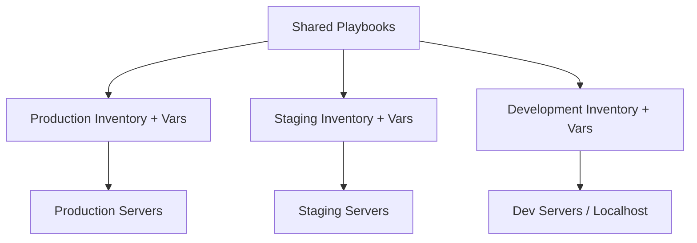

# How to Use Ansible Playbook with Multiple Environments

Author: [nawazdhandala](https://www.github.com/nawazdhandala)

Tags: Ansible, Environments, Infrastructure, DevOps

Description: Learn how to manage multiple environments like development, staging, and production with Ansible using separate inventories and group variables.

---

Every serious infrastructure setup has multiple environments: development, staging, production, and possibly more. Each environment has different servers, different configurations, and often different security requirements. Ansible handles this through a combination of separate inventories, environment-specific variables, and consistent playbooks that work across all environments. This guide covers the proven patterns for multi-environment management.

## The Core Principle

The same playbooks should work in every environment. Only the inventory and variables change. Your playbooks describe what the infrastructure should look like. Your inventories and variables describe where and with what values.



## Directory Structure for Multiple Environments

```
ansible-project/
  ansible.cfg
  site.yml
  deploy.yml
  inventories/
    development/
      hosts.ini
      group_vars/
        all.yml
        all/
          vault.yml
        webservers.yml
        dbservers.yml
      host_vars/
    staging/
      hosts.ini
      group_vars/
        all.yml
        all/
          vault.yml
        webservers.yml
        dbservers.yml
      host_vars/
    production/
      hosts.ini
      group_vars/
        all.yml
        all/
          vault.yml
        webservers.yml
        dbservers.yml
      host_vars/
  roles/
  group_vars/
    all.yml      # Shared across ALL environments
```

## Environment-Specific Inventories

Each environment has its own inventory file with its own hosts:

```ini
# inventories/development/hosts.ini
[webservers]
dev-web1 ansible_host=192.168.56.10

[dbservers]
dev-db1 ansible_host=192.168.56.20

[all:vars]
ansible_user=vagrant
ansible_ssh_private_key_file=~/.vagrant.d/insecure_private_key
```

```ini
# inventories/staging/hosts.ini
[webservers]
staging-web1.example.com
staging-web2.example.com

[dbservers]
staging-db1.example.com

[all:vars]
ansible_user=deploy
```

```ini
# inventories/production/hosts.ini
[webservers]
web1.example.com
web2.example.com
web3.example.com
web4.example.com

[dbservers]
db1.example.com
db2.example.com

[monitoring]
monitor1.example.com

[all:vars]
ansible_user=deploy
```

## Environment-Specific Variables

This is where the real differentiation happens. Each environment gets its own variable values:

```yaml
# inventories/development/group_vars/all.yml
---
env_name: development
domain: dev.example.com
app_debug: true
app_log_level: debug
app_workers: 1
db_host: dev-db1
db_name: myapp_dev
ssl_enabled: false
monitoring_enabled: false
backup_enabled: false
```

```yaml
# inventories/staging/group_vars/all.yml
---
env_name: staging
domain: staging.example.com
app_debug: false
app_log_level: info
app_workers: 2
db_host: staging-db1.example.com
db_name: myapp_staging
ssl_enabled: true
monitoring_enabled: true
backup_enabled: false
```

```yaml
# inventories/production/group_vars/all.yml
---
env_name: production
domain: www.example.com
app_debug: false
app_log_level: warning
app_workers: 8
db_host: db1.example.com
db_name: myapp_production
ssl_enabled: true
monitoring_enabled: true
backup_enabled: true
backup_retention_days: 30
```

## Shared Variables Across Environments

Variables that are the same in every environment go in the top-level `group_vars`:

```yaml
# group_vars/all.yml - Shared across every environment
---
app_name: myapp
app_user: appuser
app_dir: /opt/myapp
app_port: 8080

ntp_enabled: true
ssh_hardening: true

required_packages:
  - git
  - curl
  - htop
  - vim
  - unzip
```

## Environment-Specific Secrets

Each environment has its own encrypted secrets:

```bash
# Create encrypted vault files per environment
ansible-vault create inventories/production/group_vars/all/vault.yml
ansible-vault create inventories/staging/group_vars/all/vault.yml
ansible-vault create inventories/development/group_vars/all/vault.yml
```

```yaml
# inventories/production/group_vars/all/vault.yml (encrypted)
---
vault_db_password: "production-secret-password"
vault_api_key: "prod-api-key-xxx"
vault_ssl_certificate: |
  -----BEGIN CERTIFICATE-----
  ...production cert...
  -----END CERTIFICATE-----
```

```yaml
# inventories/staging/group_vars/all/vault.yml (encrypted)
---
vault_db_password: "staging-password"
vault_api_key: "staging-api-key-xxx"
```

Reference vault variables through intermediary variables for clarity:

```yaml
# inventories/production/group_vars/all.yml
---
db_password: "{{ vault_db_password }}"
api_key: "{{ vault_api_key }}"
```

## Writing Environment-Agnostic Playbooks

Your playbooks should work with any environment. Use variables, never hard-code environment-specific values:

```yaml
# site.yml - Works with any environment
---
- name: Configure all servers
  hosts: all
  become: yes
  roles:
    - common

- name: Configure web servers
  hosts: webservers
  become: yes
  roles:
    - nginx
    - myapp

- name: Configure database servers
  hosts: dbservers
  become: yes
  roles:
    - postgresql
```

```yaml
# roles/myapp/tasks/main.yml - Uses variables, no hard-coded values
---
- name: Create application directory
  file:
    path: "{{ app_dir }}"
    state: directory
    owner: "{{ app_user }}"
    mode: '0755'

- name: Deploy application configuration
  template:
    src: config.yml.j2
    dest: "{{ app_dir }}/config.yml"
    owner: "{{ app_user }}"
    mode: '0640'
  notify: Restart application

- name: Configure logging
  template:
    src: logging.yml.j2
    dest: "{{ app_dir }}/logging.yml"
  notify: Restart application
```

The template uses the environment-specific variables:

```yaml
# roles/myapp/templates/config.yml.j2
---
application:
  name: {{ app_name }}
  environment: {{ env_name }}
  debug: {{ app_debug }}
  workers: {{ app_workers }}

database:
  host: {{ db_host }}
  name: {{ db_name }}
  password: {{ db_password }}


ssl:
  certificate: /etc/ssl/certs/{{ domain }}.crt
  key: /etc/ssl/private/{{ domain }}.key



monitoring:
  enabled: true
  endpoint: {{ monitoring_endpoint | default('') }}

```

## Running Playbooks Against Specific Environments

Switch environments by changing the inventory flag:

```bash
# Deploy to development
ansible-playbook -i inventories/development/hosts.ini site.yml

# Deploy to staging
ansible-playbook -i inventories/staging/hosts.ini site.yml

# Deploy to production
ansible-playbook -i inventories/production/hosts.ini site.yml

# Deploy specific version to production
ansible-playbook -i inventories/production/hosts.ini deploy.yml -e version=2.1.0
```

## Using Wrapper Scripts

Create wrapper scripts to prevent targeting the wrong environment:

```bash
#!/bin/bash
# scripts/deploy.sh - Safe deployment wrapper

set -euo pipefail

ENV="${1:?Usage: $0 <environment> [playbook] [extra args...]}"
PLAYBOOK="${2:-site.yml}"
shift 2 || shift 1

INVENTORY="inventories/${ENV}/hosts.ini"

if [ ! -f "$INVENTORY" ]; then
    echo "Error: Environment '$ENV' not found (no $INVENTORY)"
    exit 1
fi

# Safety check for production
if [ "$ENV" = "production" ]; then
    echo "WARNING: You are deploying to PRODUCTION!"
    read -p "Type 'yes' to continue: " confirm
    if [ "$confirm" != "yes" ]; then
        echo "Aborted."
        exit 1
    fi
fi

echo "Deploying to $ENV using $PLAYBOOK..."
ansible-playbook -i "$INVENTORY" "$PLAYBOOK" "$@"
```

Use it:

```bash
# Deploy site.yml to staging
./scripts/deploy.sh staging

# Deploy specific playbook to production with extra vars
./scripts/deploy.sh production deploy.yml -e version=2.1.0
```

## Conditional Tasks Based on Environment

Sometimes certain tasks should only run in specific environments:

```yaml
# environment-conditional.yml - Tasks that vary by environment
---
- name: Environment-specific configuration
  hosts: all
  become: yes

  tasks:
    - name: Enable debug toolbar in development
      pip:
        name: django-debug-toolbar
        state: present
      when: env_name == "development"

    - name: Configure SSL certificates
      include_role:
        name: certbot
      when: ssl_enabled | bool

    - name: Configure monitoring agent
      include_role:
        name: monitoring
      when: monitoring_enabled | bool

    - name: Setup automated backups
      include_role:
        name: backup
      when: backup_enabled | bool

    - name: Apply production hardening
      include_role:
        name: hardening
      when: env_name == "production"
```

## Dynamic Inventory for Cloud Environments

For cloud environments, use dynamic inventory plugins instead of static files:

```yaml
# inventories/production/aws_ec2.yml - AWS dynamic inventory
---
plugin: aws_ec2
regions:
  - us-east-1
  - us-west-2
filters:
  tag:Environment: production
keyed_groups:
  - key: tags.Role
    prefix: role
  - key: placement.availability_zone
    prefix: az
compose:
  ansible_host: private_ip_address
```

```bash
# Use dynamic inventory
ansible-playbook -i inventories/production/aws_ec2.yml site.yml
```

## Testing with Molecule Across Environments

Test your roles work correctly in all environments:

```yaml
# roles/myapp/molecule/default/molecule.yml
---
dependency:
  name: galaxy
driver:
  name: docker
platforms:
  - name: test-instance
    image: ubuntu:22.04
provisioner:
  name: ansible
  inventory:
    group_vars:
      all:
        env_name: testing
        app_debug: true
        app_workers: 1
        db_host: localhost
        ssl_enabled: false
```

## Summary

Managing multiple environments in Ansible comes down to three principles: keep playbooks environment-agnostic, separate inventories by environment, and use group_vars for environment-specific configuration. The same playbook should run against development, staging, and production without modification. Only the inventory and variables change. Use wrapper scripts for safety, vault encryption for secrets, and dynamic inventories for cloud environments. This structure scales from 3 servers to 3,000.
