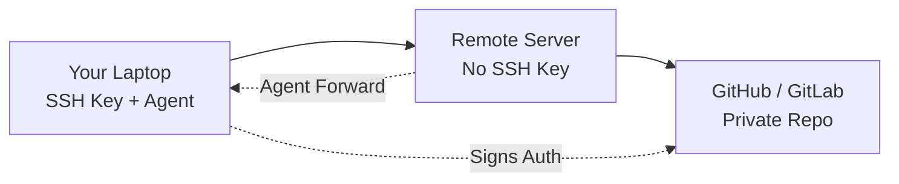

# How to Use Ansible Playbook with SSH Agent Forwarding

Author: [nawazdhandala](https://www.github.com/nawazdhandala)

Tags: Ansible, SSH, Security, DevOps

Description: Learn how to configure SSH agent forwarding with Ansible playbooks to securely access private repositories and remote servers through jump hosts.

---

SSH agent forwarding lets your SSH keys follow you through intermediate servers without copying private keys to those servers. When combined with Ansible, this is extremely useful for pulling code from private Git repositories on remote hosts, connecting through bastion/jump hosts, and accessing other SSH-secured resources. This guide walks through setting it up correctly and securely.

## What Is SSH Agent Forwarding?

Normally, when you SSH into a remote server and then try to access another SSH-secured resource (like a private Git repo), the remote server does not have your SSH key. With agent forwarding, the remote server can use your local SSH agent to authenticate without ever having your private key on disk.



## Enabling SSH Agent Forwarding in Ansible

There are several places to configure agent forwarding. The most common is in `ansible.cfg`:

```ini
# ansible.cfg - Enable SSH agent forwarding
[ssh_connection]
ssh_args = -o ForwardAgent=yes -o ControlMaster=auto -o ControlPersist=60s
```

Make sure your SSH agent is running and has your key loaded:

```bash
# Start the SSH agent if not already running
eval $(ssh-agent -s)

# Add your SSH key to the agent
ssh-add ~/.ssh/id_ed25519

# Verify the key is loaded
ssh-add -l
```

## Method 1: ansible.cfg Configuration

This is the recommended approach for project-wide settings:

```ini
# ansible.cfg
[defaults]
remote_user = deploy
host_key_checking = False

[ssh_connection]
ssh_args = -o ForwardAgent=yes -o ControlMaster=auto -o ControlPersist=60s
pipelining = True
```

With this configuration, every SSH connection Ansible makes will forward your agent.

## Method 2: Inventory Variables

You can enable agent forwarding per host or per group:

```ini
# inventory.ini
[webservers]
web1.example.com
web2.example.com

[webservers:vars]
ansible_ssh_extra_args=-o ForwardAgent=yes

[dbservers]
db1.example.com ansible_ssh_extra_args=-o ForwardAgent=no
```

## Method 3: Playbook-Level Configuration

Set it directly in the playbook for specific plays:

```yaml
# deploy-with-forwarding.yml - Enable agent forwarding per play
---
- name: Deploy application from private repository
  hosts: webservers
  become: yes
  vars:
    ansible_ssh_extra_args: "-o ForwardAgent=yes"

  tasks:
    - name: Clone private repository
      git:
        repo: git@github.com:myorg/private-app.git
        dest: /opt/myapp
        version: main
        accept_hostkey: yes
      become_user: deploy  # Use the deploy user's SSH context
```

## Practical Example: Deploying from a Private Git Repository

This is the most common use case. You need to pull code from a private repo onto remote servers without putting your SSH key on those servers:

```yaml
# git-deploy.yml - Clone private repos using SSH agent forwarding
---
- name: Deploy from private Git repository
  hosts: app_servers
  become: yes

  vars:
    app_repo: "git@github.com:myorg/myapp.git"
    app_dir: /opt/myapp
    app_version: "{{ version | default('main') }}"
    app_user: deploy

  pre_tasks:
    - name: Ensure git is installed
      apt:
        name: git
        state: present

    - name: Ensure app directory exists
      file:
        path: "{{ app_dir }}"
        state: directory
        owner: "{{ app_user }}"
        group: "{{ app_user }}"
        mode: '0755'

    - name: Add GitHub to known hosts
      known_hosts:
        name: github.com
        key: "{{ lookup('pipe', 'ssh-keyscan github.com 2>/dev/null') }}"
        state: present

  tasks:
    # SSH agent forwarding allows this without a key on the remote server
    - name: Clone or update application repository
      git:
        repo: "{{ app_repo }}"
        dest: "{{ app_dir }}"
        version: "{{ app_version }}"
        force: no
      become_user: "{{ app_user }}"

    - name: Install application dependencies
      command: make install
      args:
        chdir: "{{ app_dir }}"
      become_user: "{{ app_user }}"

    - name: Restart application
      systemd:
        name: myapp
        state: restarted
```

Run it:

```bash
# Make sure your SSH key is in the agent
ssh-add -l

# Run the playbook
ansible-playbook -i inventory.ini git-deploy.yml
```

## Using Agent Forwarding with Bastion/Jump Hosts

Agent forwarding through bastion hosts lets Ansible reach servers in private networks:

```ini
# inventory.ini - Servers behind a bastion host
[private_servers]
app1.internal ansible_host=10.0.1.10
app2.internal ansible_host=10.0.1.11
db1.internal ansible_host=10.0.2.10

[private_servers:vars]
ansible_ssh_common_args=-o ProxyJump=deploy@bastion.example.com -o ForwardAgent=yes
```

Or configure it in `ansible.cfg` with an SSH config file:

```ini
# ansible.cfg
[ssh_connection]
ssh_args = -F ssh.config -o ForwardAgent=yes
```

```
# ssh.config - SSH configuration for bastion access
Host bastion
    HostName bastion.example.com
    User deploy
    ForwardAgent yes
    IdentityFile ~/.ssh/id_ed25519

Host 10.0.*.*
    User deploy
    ProxyJump bastion
    ForwardAgent yes
```

A playbook using this setup:

```yaml
# bastion-deploy.yml - Deploy through bastion host
---
- name: Deploy to private network servers
  hosts: private_servers
  become: yes

  tasks:
    - name: Update system packages
      apt:
        upgrade: safe
        update_cache: yes

    - name: Clone code from private repo through bastion
      git:
        repo: git@github.com:myorg/internal-app.git
        dest: /opt/internal-app
        version: main
      become_user: deploy
      # Agent forwarding works through the bastion automatically

    - name: Pull Docker images from private registry
      command: docker pull registry.internal.example.com/myapp:latest
```

## Multi-Hop Forwarding

Sometimes you need to go through multiple jump hosts:

```ini
# inventory.ini - Double jump host setup
[deep_servers]
deep1.internal ansible_host=10.0.3.10

[deep_servers:vars]
ansible_ssh_common_args=-o ProxyJump=deploy@bastion1.example.com,deploy@bastion2.internal -o ForwardAgent=yes
```

## Verifying Agent Forwarding Works

Before running complex playbooks, verify that forwarding is working:

```yaml
# test-forwarding.yml - Verify SSH agent forwarding
---
- name: Test SSH agent forwarding
  hosts: all

  tasks:
    - name: Check if SSH agent socket exists on remote
      command: echo $SSH_AUTH_SOCK
      register: auth_sock
      changed_when: false

    - name: Display agent socket
      debug:
        msg: "SSH_AUTH_SOCK = {{ auth_sock.stdout }}"

    - name: List forwarded keys
      command: ssh-add -l
      register: forwarded_keys
      changed_when: false
      ignore_errors: yes

    - name: Display forwarded keys
      debug:
        msg: "{{ forwarded_keys.stdout_lines | default(['No keys forwarded']) }}"

    - name: Test GitHub access with forwarded key
      command: ssh -T git@github.com
      register: github_test
      changed_when: false
      failed_when: false  # GitHub returns exit code 1 even on success

    - name: Show GitHub auth result
      debug:
        msg: "{{ github_test.stderr }}"
```

## Security Considerations

Agent forwarding has security implications you should be aware of:

1. **Anyone with root on the remote server can use your forwarded agent** while the connection is active. Only forward your agent to servers you trust.

2. **Use `ForwardAgent` selectively**, not globally. Configure it per host rather than setting it as a global default.

3. **Consider using ProxyJump instead of agent forwarding** when you just need to reach hosts through a bastion. ProxyJump does not expose your agent on the intermediate server.

```ini
# Safer alternative: ProxyJump without agent forwarding on bastion
# Only forward the agent to the final destination
Host bastion
    HostName bastion.example.com
    User deploy
    ForwardAgent no  # Do not forward agent on bastion

Host app*.internal
    ProxyJump bastion
    ForwardAgent yes  # Only forward to final destination
```

4. **Confirm agent forwarding** works with ssh-add before running playbooks:

```bash
# Verify the agent has keys and forwarding will work
ssh-add -l || echo "No keys in agent - add your key first"
```

## Troubleshooting

Common issues and their fixes:

```bash
# Problem: "Permission denied (publickey)" on remote git clone
# Fix 1: Make sure your key is in the agent
ssh-add -l

# Fix 2: Make sure ForwardAgent is enabled
ansible -m command -a "echo \$SSH_AUTH_SOCK" webservers

# Fix 3: Check if the remote SSH server allows forwarding
# On the remote server, check /etc/ssh/sshd_config:
# AllowAgentForwarding yes

# Problem: Agent forwarding works via SSH but not in Ansible
# Fix: Check if become is breaking the agent socket
# When using become, the SSH_AUTH_SOCK environment variable may not be preserved
```

Handle the `become` agent socket issue:

```yaml
# fix-become-agent.yml - Preserve SSH agent socket through become
---
- name: Fix agent forwarding with become
  hosts: app_servers
  become: yes
  become_flags: '-E'  # Preserve environment variables including SSH_AUTH_SOCK

  tasks:
    - name: Clone repo as root with agent forwarding
      git:
        repo: git@github.com:myorg/myapp.git
        dest: /opt/myapp
        version: main
      environment:
        SSH_AUTH_SOCK: "{{ ansible_env.SSH_AUTH_SOCK | default('') }}"
```

## Summary

SSH agent forwarding with Ansible lets you access private Git repositories and internal servers without distributing SSH keys. Configure it in `ansible.cfg` for project-wide use, in inventory for per-host control, or in playbooks for specific plays. Always verify forwarding works before running deployments, and be mindful of the security implications. For bastion-only access patterns, consider ProxyJump as a more secure alternative.
