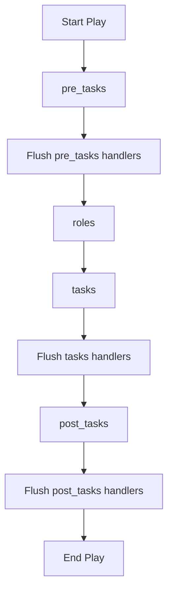

# How to Use Ansible Role Pre-Tasks and Post-Tasks

Author: [nawazdhandala](https://www.github.com/nawazdhandala)

Tags: Ansible, Roles, Pre-Tasks, Post-Tasks

Description: Learn how to use pre_tasks and post_tasks with Ansible roles for setup, validation, health checks, and notification workflows.

---

Ansible provides `pre_tasks` and `post_tasks` at the play level to run tasks before and after roles. These are not part of the role itself but are essential for building reliable deployment workflows around roles. You use pre-tasks for prerequisites like cache updates, vault lookups, and condition checks. You use post-tasks for health checks, notifications, and cleanup. This post covers how both work and the common patterns you will need.

## How Play Execution Order Works

When Ansible processes a play, it follows a strict order:



The key points:
1. `pre_tasks` run before any roles
2. Handlers notified during `pre_tasks` are flushed before roles start
3. All roles run in the order listed
4. Regular `tasks` run after all roles
5. `post_tasks` run last, after everything else
6. Each section flushes its own handlers

## Basic Usage

```yaml
# site.yml
# Pre-tasks run before roles, post-tasks run after
---
- name: Deploy web application
  hosts: web_servers
  become: yes

  pre_tasks:
    - name: Update apt cache
      ansible.builtin.apt:
        update_cache: yes
        cache_valid_time: 3600
      when: ansible_os_family == "Debian"

    - name: Verify minimum disk space
      ansible.builtin.assert:
        that:
          - ansible_mounts | selectattr('mount', 'equalto', '/') | map(attribute='size_available') | first > 1073741824
        fail_msg: "Less than 1GB free on root partition"

  roles:
    - common
    - nginx
    - app_deploy

  post_tasks:
    - name: Verify application is responding
      ansible.builtin.uri:
        url: "http://localhost:{{ app_port }}/health"
        status_code: 200
      retries: 5
      delay: 3

    - name: Send deployment notification
      ansible.builtin.uri:
        url: "https://hooks.slack.com/services/xxx/yyy/zzz"
        method: POST
        body_format: json
        body:
          text: "Deployed {{ app_version }} to {{ inventory_hostname }}"
      delegate_to: localhost
      become: no
```

## Common Pre-Task Patterns

### Updating Package Caches

```yaml
pre_tasks:
  # Ensure package caches are fresh before any role tries to install something
  - name: Update apt cache
    ansible.builtin.apt:
      update_cache: yes
      cache_valid_time: 3600
    when: ansible_os_family == "Debian"

  - name: Update yum cache
    ansible.builtin.yum:
      update_cache: yes
    when: ansible_os_family == "RedHat"
```

This prevents role failures caused by stale package caches. Doing it in `pre_tasks` means it happens once before any role runs, rather than inside each role.

### Gathering Custom Facts

```yaml
pre_tasks:
  # Gather information roles will need
  - name: Get current deployment version
    ansible.builtin.slurp:
      src: /opt/myapp/VERSION
    register: current_version_file
    failed_when: false

  - name: Set current version fact
    ansible.builtin.set_fact:
      current_app_version: "{{ (current_version_file.content | b64decode | trim) if current_version_file is success else 'none' }}"

  - name: Display current version
    ansible.builtin.debug:
      msg: "Current version: {{ current_app_version }}, deploying: {{ app_version }}"
```

### Pre-Flight Validation

```yaml
pre_tasks:
  # Validate all required variables are set before running any role
  - name: Validate required variables
    ansible.builtin.assert:
      that:
        - app_version is defined
        - app_version | length > 0
        - app_domain is defined
        - app_db_password is defined
      fail_msg: >
        Missing required variables. Ensure app_version, app_domain,
        and app_db_password are set in your inventory or extra vars.

  - name: Validate app_version format
    ansible.builtin.assert:
      that:
        - app_version is match('^[0-9]+\.[0-9]+\.[0-9]+$')
      fail_msg: "app_version must be in semver format (e.g., 1.2.3), got: {{ app_version }}"
```

### Maintenance Mode

```yaml
pre_tasks:
  # Put the application in maintenance mode before making changes
  - name: Enable maintenance mode
    ansible.builtin.copy:
      content: '{"maintenance": true}'
      dest: /opt/myapp/maintenance.json
      mode: '0644'
    when: app_enable_maintenance | default(true) | bool

  - name: Remove from load balancer
    community.general.haproxy:
      state: disabled
      host: "{{ inventory_hostname }}"
      socket: /var/run/haproxy/admin.sock
    delegate_to: "{{ haproxy_host }}"
    when: haproxy_host is defined
```

### Loading Secrets from Vault

```yaml
pre_tasks:
  # Fetch secrets that roles will need
  - name: Read database password from HashiCorp Vault
    ansible.builtin.set_fact:
      app_db_password: "{{ lookup('community.hashi_vault.hashi_vault', 'secret=myapp/data/db:password') }}"
    no_log: true

  - name: Read API key from Vault
    ansible.builtin.set_fact:
      app_api_key: "{{ lookup('community.hashi_vault.hashi_vault', 'secret=myapp/data/api:key') }}"
    no_log: true
```

## Common Post-Task Patterns

### Health Checks

```yaml
post_tasks:
  # Verify everything is working after roles have run
  - name: Wait for application to start
    ansible.builtin.wait_for:
      port: "{{ app_port }}"
      delay: 5
      timeout: 60

  - name: Check application health endpoint
    ansible.builtin.uri:
      url: "http://localhost:{{ app_port }}/health"
      status_code: 200
      return_content: yes
    register: health_check
    retries: 10
    delay: 5
    until: health_check.status == 200

  - name: Verify database connectivity
    ansible.builtin.uri:
      url: "http://localhost:{{ app_port }}/health/db"
      status_code: 200
    register: db_health
    retries: 5
    delay: 3
    until: db_health.status == 200
```

### Disabling Maintenance Mode

```yaml
post_tasks:
  # Take the application out of maintenance mode
  - name: Disable maintenance mode
    ansible.builtin.file:
      path: /opt/myapp/maintenance.json
      state: absent
    when: app_enable_maintenance | default(true) | bool

  - name: Re-enable in load balancer
    community.general.haproxy:
      state: enabled
      host: "{{ inventory_hostname }}"
      socket: /var/run/haproxy/admin.sock
    delegate_to: "{{ haproxy_host }}"
    when: haproxy_host is defined
```

### Sending Notifications

```yaml
post_tasks:
  # Notify the team about the deployment
  - name: Send Slack notification
    ansible.builtin.uri:
      url: "{{ slack_webhook_url }}"
      method: POST
      body_format: json
      body:
        text: "Deployment complete: {{ app_name }} {{ app_version }} deployed to {{ ansible_hostname }}"
    delegate_to: localhost
    become: no
    when: slack_webhook_url is defined
    run_once: true

  - name: Create deployment record
    ansible.builtin.uri:
      url: "https://api.example.com/deployments"
      method: POST
      body_format: json
      body:
        application: "{{ app_name }}"
        version: "{{ app_version }}"
        environment: "{{ deployment_env }}"
        timestamp: "{{ ansible_date_time.iso8601 }}"
        host: "{{ inventory_hostname }}"
    delegate_to: localhost
    become: no
```

### Recording the Deployed Version

```yaml
post_tasks:
  # Record what was deployed for future reference
  - name: Record deployed version
    ansible.builtin.copy:
      content: "{{ app_version }}"
      dest: /opt/myapp/VERSION
      mode: '0644'

  - name: Record deployment timestamp
    ansible.builtin.copy:
      content: |
        version={{ app_version }}
        deployed_at={{ ansible_date_time.iso8601 }}
        deployed_by={{ lookup('env', 'USER') }}
      dest: /opt/myapp/DEPLOY_INFO
      mode: '0644'
```

## Handler Flushing Between Sections

A critical detail: handlers notified during `pre_tasks` are flushed before roles start. This means if a pre-task notifies a handler, that handler runs before any role executes:

```yaml
pre_tasks:
  - name: Deploy temporary config
    ansible.builtin.template:
      src: temp_config.j2
      dest: /tmp/temp_config.yml
    notify: Process temp config

  # The handler fires HERE, before roles start

roles:
  - app_deploy    # This runs after the handler

handlers:
  - name: Process temp config
    ansible.builtin.command: /opt/tools/process-config /tmp/temp_config.yml
```

Similarly, handlers from `post_tasks` are flushed at the very end.

## Complete Deployment Playbook

Here is a full deployment playbook showing the complete lifecycle:

```yaml
# deploy.yml
# Full deployment workflow with pre-checks, roles, and post-validation
---
- name: Deploy application to production
  hosts: app_servers
  become: yes
  serial: "25%"  # Rolling deployment, 25% at a time

  pre_tasks:
    - name: Validate deployment variables
      ansible.builtin.assert:
        that:
          - app_version is defined
          - app_version is match('^[0-9]+\.[0-9]+\.[0-9]+$')
        fail_msg: "Invalid or missing app_version"

    - name: Update package cache
      ansible.builtin.apt:
        update_cache: yes
        cache_valid_time: 3600
      when: ansible_os_family == "Debian"

    - name: Record pre-deployment state
      ansible.builtin.command: cat /opt/myapp/VERSION
      register: pre_deploy_version
      failed_when: false
      changed_when: false

    - name: Remove from load balancer pool
      community.general.haproxy:
        state: disabled
        host: "{{ inventory_hostname }}"
        socket: /var/run/haproxy/admin.sock
      delegate_to: "{{ groups['loadbalancers'][0] }}"

    - name: Wait for connections to drain
      ansible.builtin.pause:
        seconds: 10

  roles:
    - role: common
    - role: app_deploy
      vars:
        app_deploy_version: "{{ app_version }}"

  post_tasks:
    - name: Wait for application to be ready
      ansible.builtin.uri:
        url: "http://localhost:{{ app_port }}/health"
        status_code: 200
      retries: 15
      delay: 4
      register: health

    - name: Add back to load balancer pool
      community.general.haproxy:
        state: enabled
        host: "{{ inventory_hostname }}"
        socket: /var/run/haproxy/admin.sock
      delegate_to: "{{ groups['loadbalancers'][0] }}"

    - name: Record deployment
      ansible.builtin.copy:
        content: "{{ app_version }}"
        dest: /opt/myapp/VERSION
        mode: '0644'
```

## Wrapping Up

Pre-tasks and post-tasks are the bookends of a reliable deployment workflow. Pre-tasks handle validation, prerequisite setup, maintenance mode, and secret loading. Post-tasks handle health verification, load balancer re-registration, notification, and state recording. The handler flushing behavior between sections is what makes this pattern safe: you know exactly when each phase completes before the next begins. Use pre-tasks and post-tasks to build deployment workflows that are auditable, reversible, and safe.
