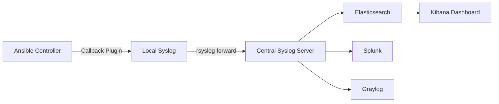

# How to Use Ansible Syslog Callback for Centralized Logging

Author: [nawazdhandala](https://www.github.com/nawazdhandala)

Tags: Ansible, Logging, Syslog, Monitoring

Description: Learn how to configure the Ansible syslog callback plugin to send playbook events to centralized logging systems like rsyslog and ELK.

---

In production environments, Ansible logs scattered across individual servers or CI/CD job outputs are not enough. You need centralized logging where all playbook events, task results, and failures flow into a single system. The syslog callback plugin ships with Ansible and sends playbook events to your system's syslog daemon, which can forward them to centralized logging infrastructure like ELK, Splunk, Graylog, or any syslog-compatible system.

## Enabling the Syslog Callback Plugin

The syslog callback plugin is included with Ansible. You just need to enable it.

```ini
# ansible.cfg - Enable the syslog callback
[defaults]
# Add syslog to the list of enabled callbacks
# The 'community.general.syslog_json' sends structured JSON to syslog
# The built-in 'syslog_json' works in most setups
callbacks_enabled = community.general.syslog_json

# You might also want the default stdout callback for console output
stdout_callback = default
```

If you want the plain-text syslog callback (not JSON), use:

```ini
# ansible.cfg - Plain text syslog callback
[defaults]
callbacks_enabled = ansible.posix.syslog
```

Install the required collections if you do not have them:

```bash
# Install the community.general collection for syslog_json
ansible-galaxy collection install community.general

# Or ansible.posix for the plain syslog callback
ansible-galaxy collection install ansible.posix
```

## How the Syslog Callback Works

When enabled, the callback sends a syslog message for every significant Ansible event: play start, task start, task result (ok, changed, failed, skipped, unreachable), and play recap.

Here is what the flow looks like:



## Configuring rsyslog to Forward Ansible Logs

Once Ansible sends events to local syslog, you need rsyslog (or syslog-ng) to forward them to your central logging server.

Create a dedicated rsyslog configuration for Ansible:

```bash
# /etc/rsyslog.d/50-ansible.conf - Forward Ansible logs to central server
# Filter Ansible messages by program name
if $programname == 'ansible' then {
    # Write to local file for debugging
    action(type="omfile" file="/var/log/ansible/syslog-ansible.log")

    # Forward to central syslog server via TCP
    action(type="omfwd"
           target="syslog.example.com"
           port="514"
           protocol="tcp"
           template="RSYSLOG_SyslogProtocol23Format")

    # Stop processing - do not duplicate in /var/log/syslog
    stop
}
```

Restart rsyslog after adding the configuration:

```bash
# Restart rsyslog to pick up new configuration
sudo systemctl restart rsyslog

# Verify rsyslog is running
sudo systemctl status rsyslog

# Check for configuration errors
sudo rsyslogd -N1
```

## Testing the Syslog Callback

Run a simple playbook and check that syslog receives the events:

```yaml
# test-syslog.yml - Simple playbook to verify syslog callback
---
- name: Test syslog callback
  hosts: localhost
  gather_facts: false
  tasks:
    - name: First task - should appear in syslog
      ansible.builtin.debug:
        msg: "This message should appear in syslog"

    - name: Second task - a changed result
      ansible.builtin.command: echo "test"
      changed_when: true

    - name: Third task - deliberate failure
      ansible.builtin.fail:
        msg: "Testing syslog error logging"
      ignore_errors: true
```

After running the playbook, check syslog:

```bash
# Run the test playbook
ansible-playbook test-syslog.yml

# Check local syslog for Ansible entries
sudo grep "ansible" /var/log/syslog | tail -20

# Or check the dedicated Ansible syslog file if configured
tail -20 /var/log/ansible/syslog-ansible.log
```

## Structured JSON Logging with syslog_json

The `syslog_json` callback sends structured JSON, which is much easier to parse and query in central logging systems.

A typical JSON syslog entry looks like this:

```json
{
    "ansible_type": "task",
    "ansible_playbook": "deploy.yml",
    "ansible_play": "Deploy application",
    "ansible_task": "Install packages",
    "ansible_host": "web1.example.com",
    "ansible_result": "ok",
    "ansible_changed": false,
    "ansible_timestamp": "2026-02-21T14:30:00.000Z"
}
```

For failed tasks, additional fields are included:

```json
{
    "ansible_type": "task",
    "ansible_playbook": "deploy.yml",
    "ansible_task": "Start application",
    "ansible_host": "web3.example.com",
    "ansible_result": "failed",
    "ansible_changed": false,
    "ansible_message": "Unable to start service myapp: Job for myapp.service failed",
    "ansible_timestamp": "2026-02-21T14:32:15.000Z"
}
```

## Setting Up ELK Stack Integration

To send Ansible syslog data to Elasticsearch via Logstash, configure a Logstash pipeline:

```ruby
# /etc/logstash/conf.d/ansible-syslog.conf - Logstash pipeline for Ansible logs
input {
  syslog {
    port => 5514
    type => "ansible"
  }
}

filter {
  if [type] == "ansible" {
    # Parse the JSON message body
    json {
      source => "message"
      target => "ansible"
    }

    # Add useful fields for querying
    if [ansible][ansible_result] == "failed" {
      mutate {
        add_tag => ["ansible_failure"]
      }
    }

    # Parse timestamp
    date {
      match => ["[ansible][ansible_timestamp]", "ISO8601"]
      target => "@timestamp"
    }

    # Remove redundant fields
    mutate {
      remove_field => ["message"]
    }
  }
}

output {
  if [type] == "ansible" {
    elasticsearch {
      hosts => ["elasticsearch.example.com:9200"]
      index => "ansible-logs-%{+YYYY.MM.dd}"
    }
  }
}
```

Point rsyslog at your Logstash syslog input:

```bash
# /etc/rsyslog.d/50-ansible.conf - Forward to Logstash
if $programname == 'ansible' then {
    action(type="omfwd"
           target="logstash.example.com"
           port="5514"
           protocol="tcp")
    stop
}
```

## Creating a Custom Syslog Callback with Extra Context

The built-in syslog callback is good, but you might want additional context like the git commit SHA, the CI job ID, or the deployer's username.

```python
# callback_plugins/custom_syslog.py - Enhanced syslog callback with extra context
import json
import os
import syslog
from datetime import datetime
from ansible.plugins.callback import CallbackBase

DOCUMENTATION = '''
    name: custom_syslog
    type: notification
    short_description: Enhanced syslog callback with deployment context
    description:
        - Sends structured JSON to syslog with extra deployment metadata
'''

class CallbackModule(CallbackBase):
    CALLBACK_VERSION = 2.0
    CALLBACK_TYPE = 'notification'
    CALLBACK_NAME = 'custom_syslog'
    CALLBACK_NEEDS_ENABLED = True

    def __init__(self):
        super().__init__()
        syslog.openlog('ansible', syslog.LOG_PID, syslog.LOG_USER)

        # Capture deployment context from environment
        self.context = {
            'ci_job_id': os.environ.get('CI_JOB_ID', 'manual'),
            'ci_pipeline_id': os.environ.get('CI_PIPELINE_ID', 'none'),
            'deployer': os.environ.get('DEPLOYER', os.environ.get('USER', 'unknown')),
            'git_sha': os.environ.get('GIT_SHA', 'unknown'),
        }

    def _send_syslog(self, data, priority=syslog.LOG_INFO):
        """Send a structured JSON message to syslog."""
        data.update(self.context)
        data['timestamp'] = datetime.utcnow().isoformat() + 'Z'
        syslog.syslog(priority, json.dumps(data))

    def v2_playbook_on_play_start(self, play):
        self._send_syslog({
            'event': 'play_start',
            'play': play.get_name(),
            'hosts': len(play.get_variable_manager().get_inventory().get_hosts(play.hosts)),
        })

    def v2_runner_on_ok(self, result):
        self._send_syslog({
            'event': 'task_ok',
            'host': result._host.get_name(),
            'task': result._task.get_name(),
            'changed': result._result.get('changed', False),
        })

    def v2_runner_on_failed(self, result, ignore_errors=False):
        priority = syslog.LOG_WARNING if ignore_errors else syslog.LOG_ERR
        self._send_syslog({
            'event': 'task_failed',
            'host': result._host.get_name(),
            'task': result._task.get_name(),
            'message': result._result.get('msg', ''),
            'ignored': ignore_errors,
        }, priority)

    def v2_runner_on_unreachable(self, result):
        self._send_syslog({
            'event': 'host_unreachable',
            'host': result._host.get_name(),
            'task': result._task.get_name(),
            'message': result._result.get('msg', ''),
        }, syslog.LOG_ERR)

    def v2_playbook_on_stats(self, stats):
        hosts = sorted(stats.processed.keys())
        summary = {}
        for host in hosts:
            s = stats.summarize(host)
            summary[host] = s
        self._send_syslog({
            'event': 'playbook_stats',
            'summary': summary,
        })
```

## Querying Ansible Logs in Kibana

Once your logs are in Elasticsearch, you can build dashboards and alerts. Here are useful Kibana queries:

```
# Find all failed tasks in the last 24 hours
ansible.ansible_result: "failed" AND @timestamp > now-24h

# Find failures on a specific host
ansible.ansible_host: "web3.example.com" AND ansible.ansible_result: "failed"

# Find all runs of a specific playbook
ansible.ansible_playbook: "deploy.yml"

# Find deployments by a specific user
deployer: "jane.smith" AND event: "play_start"
```

## Summary

The syslog callback plugin bridges Ansible and your centralized logging infrastructure. Enable `syslog_json` for structured data, configure rsyslog to forward to your central server, and pipe everything into ELK, Splunk, or Graylog. For extra deployment context, write a custom callback plugin that includes CI/CD metadata. Once you have Ansible events in your logging system, you can build dashboards, set up alerts on failures, and have a complete audit trail of every automation run across your fleet.
