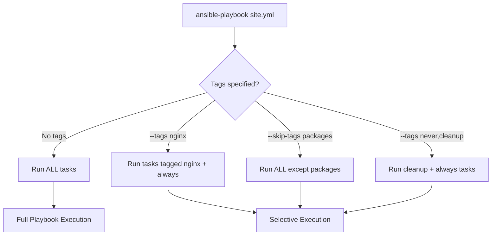

# How to Use Ansible Tags Best Practices

Author: [nawazdhandala](https://www.github.com/nawazdhandala)

Tags: Ansible, Tags, Playbook Optimization, DevOps

Description: Learn how to use Ansible tags effectively to run selective tasks, speed up deployments, and organize your playbooks for operational flexibility.

---

Ansible tags let you run a subset of tasks within a playbook without executing everything. This is critical for large playbooks where a full run takes 30 minutes but you only need to update a configuration file. Used well, tags give operators surgical precision. Used poorly, they create confusion about what actually runs. Here is how to use them properly.

## Basic Tag Usage

Tags are simple to add to any task, block, role, or play:

```yaml
# Apply tags directly to tasks
- name: Install nginx packages
  ansible.builtin.apt:
    name: nginx
    state: present
  tags:
    - nginx
    - packages

- name: Deploy nginx configuration
  ansible.builtin.template:
    src: nginx.conf.j2
    dest: /etc/nginx/nginx.conf
  tags:
    - nginx
    - configuration

- name: Ensure nginx is running
  ansible.builtin.service:
    name: nginx
    state: started
    enabled: yes
  tags:
    - nginx
    - services
```

Run only specific tagged tasks:

```bash
# Run only tasks tagged with 'configuration'
ansible-playbook site.yml --tags configuration

# Run tasks tagged with 'nginx' AND 'configuration'
ansible-playbook site.yml --tags "nginx,configuration"

# Skip tasks with specific tags
ansible-playbook site.yml --skip-tags "packages"
```

## Define a Tagging Strategy

Before applying tags, agree on a consistent strategy across your team. Here is one that works well:

```yaml
# Tag categories and their meanings:
#
# Component tags: nginx, postgresql, redis, app
#   - Select all tasks for a specific component
#
# Phase tags: install, configure, deploy, verify
#   - Select all tasks in a deployment phase
#
# Action tags: packages, services, firewall, users
#   - Select tasks by the type of change they make
#
# Special tags:
#   - always: Runs regardless of tag selection
#   - never: Only runs when explicitly selected
```

Here is a role using this strategy:

```yaml
# roles/nginx/tasks/main.yml
# Each task gets a component tag and a phase/action tag

- name: Add nginx apt repository
  ansible.builtin.apt_repository:
    repo: "ppa:nginx/stable"
    state: present
  tags:
    - nginx
    - install
    - packages

- name: Install nginx
  ansible.builtin.apt:
    name: "nginx={{ nginx_version }}*"
    state: present
  tags:
    - nginx
    - install
    - packages

- name: Deploy nginx main configuration
  ansible.builtin.template:
    src: nginx.conf.j2
    dest: /etc/nginx/nginx.conf
    validate: nginx -t -c %s
  notify: reload nginx
  tags:
    - nginx
    - configure

- name: Deploy virtual host configurations
  ansible.builtin.template:
    src: vhost.conf.j2
    dest: "/etc/nginx/sites-available/{{ item.name }}.conf"
  loop: "{{ nginx_vhosts }}"
  notify: reload nginx
  tags:
    - nginx
    - configure
    - vhosts

- name: Enable virtual host configurations
  ansible.builtin.file:
    src: "/etc/nginx/sites-available/{{ item.name }}.conf"
    dest: "/etc/nginx/sites-enabled/{{ item.name }}.conf"
    state: link
  loop: "{{ nginx_vhosts }}"
  notify: reload nginx
  tags:
    - nginx
    - configure
    - vhosts

- name: Open firewall ports for nginx
  community.general.ufw:
    rule: allow
    port: "{{ item }}"
    proto: tcp
  loop:
    - '80'
    - '443'
  tags:
    - nginx
    - firewall

- name: Ensure nginx is running
  ansible.builtin.service:
    name: nginx
    state: started
    enabled: yes
  tags:
    - nginx
    - services
```

## Use the always and never Special Tags

The `always` tag ensures a task runs no matter what tags are selected. Use it for prerequisite checks:

```yaml
# Validation tasks should always run
- name: Validate required variables
  ansible.builtin.assert:
    that:
      - nginx_vhosts is defined
      - nginx_vhosts | length > 0
    fail_msg: "nginx_vhosts must be defined with at least one entry"
  tags:
    - always

# Fact gathering tasks should always run if other tasks depend on them
- name: Get current nginx version
  ansible.builtin.command: nginx -v
  register: nginx_current_version
  changed_when: false
  failed_when: false
  tags:
    - always
```

The `never` tag means a task only runs when explicitly selected. Use it for destructive or rarely needed operations:

```yaml
# Destructive operations use the 'never' tag
- name: Purge nginx completely
  ansible.builtin.apt:
    name: nginx
    state: absent
    purge: yes
  tags:
    - never
    - purge_nginx

- name: Remove all nginx configuration
  ansible.builtin.file:
    path: /etc/nginx
    state: absent
  tags:
    - never
    - purge_nginx

# To run these: ansible-playbook site.yml --tags purge_nginx
```

## Tag Roles and Plays

Apply tags at the role level in playbooks:

```yaml
# playbooks/site.yml
# Tag entire roles for selective execution
- name: Configure all servers
  hosts: all
  become: yes
  roles:
    - role: common
      tags: [common]
    - role: security_baseline
      tags: [security]
    - role: monitoring_agent
      tags: [monitoring]

- name: Configure web servers
  hosts: webservers
  become: yes
  roles:
    - role: nginx
      tags: [nginx, web]
    - role: certbot
      tags: [certbot, ssl, web]

- name: Configure database servers
  hosts: dbservers
  become: yes
  roles:
    - role: postgresql
      tags: [postgresql, database]
    - role: backup_agent
      tags: [backup, database]
```

Running with role-level tags:

```bash
# Only configure web servers (both nginx and certbot)
ansible-playbook site.yml --tags web

# Only configure monitoring on all servers
ansible-playbook site.yml --tags monitoring

# Configure everything except security (for testing)
ansible-playbook site.yml --skip-tags security
```

## Tag Blocks for Grouped Tasks

Apply tags to blocks to avoid repeating tags on every task:

```yaml
# All tasks in the block inherit the block's tags
- name: SSL certificate management
  tags:
    - ssl
    - certificates
  block:
    - name: Create SSL directory
      ansible.builtin.file:
        path: /etc/ssl/app
        state: directory
        mode: '0700'

    - name: Deploy SSL certificate
      ansible.builtin.copy:
        content: "{{ ssl_certificate }}"
        dest: /etc/ssl/app/cert.pem
        mode: '0644'

    - name: Deploy SSL private key
      ansible.builtin.copy:
        content: "{{ ssl_private_key }}"
        dest: /etc/ssl/app/key.pem
        mode: '0600'
      no_log: true
```

## Tag Usage Patterns



## List Available Tags

Before running with tags, list what is available:

```bash
# See all tags in a playbook
ansible-playbook site.yml --list-tags

# Example output:
# playbook: site.yml
#   play #1 (all): Configure all servers    TAGS: []
#     TASK TAGS: [always, common, monitoring, packages, security, services]
#   play #2 (webservers): Configure web servers    TAGS: []
#     TASK TAGS: [certbot, configure, nginx, ssl, vhosts, web]
```

## Common Mistakes with Tags

Mistake 1: Over-tagging every task with too many tags.

```yaml
# BAD: Too many tags make it impossible to predict what runs
- name: Install nginx
  ansible.builtin.apt:
    name: nginx
    state: present
  tags: [nginx, web, packages, install, apt, server, infrastructure]
```

Mistake 2: Not tagging handlers. If you run with tags and a task notifies a handler, the handler must also be tagged or it will not run.

```yaml
# handlers/main.yml
# Handlers need matching tags or 'always' tag
- name: Reload nginx
  ansible.builtin.service:
    name: nginx
    state: reloaded
  tags:
    - nginx
    - configure
```

Mistake 3: Forgetting that `--tags` is exclusive. Only tagged tasks run, plus `always` tasks. Untagged tasks are skipped entirely.

## Summary

Tags are a power tool that requires a clear strategy. Agree on tag categories (component, phase, action) before you start tagging. Use `always` for prerequisite checks and fact gathering. Use `never` for destructive operations. Tag handlers so they run when their notifiers are selected. Keep tags to 2-3 per task. List available tags before running selectively. A good tagging strategy turns a 30-minute full playbook run into a 2-minute targeted operation.
