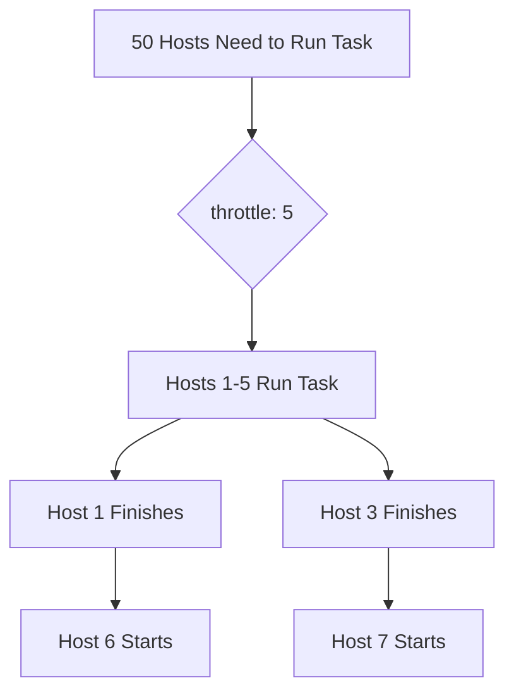

# How to Use Ansible throttle to Limit Concurrent Task Execution

Author: [nawazdhandala](https://www.github.com/nawazdhandala)

Tags: Ansible, Concurrency, Performance, DevOps

Description: Learn how to use the Ansible throttle directive to limit how many hosts execute a specific task simultaneously for resource protection.

---

Ansible's `forks` setting controls how many hosts run tasks in parallel. But sometimes a specific task should not run on too many hosts at once, even if you have plenty of forks available. Maybe the task hits a shared API with rate limits, accesses a package mirror that cannot handle 50 concurrent downloads, or makes changes that need to be gradually rolled out. The `throttle` directive limits concurrency at the task level, giving you granular control without changing your global fork count.

## What throttle Does

The `throttle` keyword limits how many hosts can execute a particular task at the same time. It works like a semaphore: only N hosts can run the task concurrently, and the rest wait their turn.



This is different from `serial`, which controls how many hosts go through the entire play. With `throttle`, only the specific task is limited; all other tasks in the play still use the full forks count.

## Basic Usage

Add `throttle` to any task to limit its concurrency:

```yaml
# basic-throttle.yml - Limit concurrent API calls
---
- name: Register all servers with monitoring service
  hosts: all  # Could be 100+ servers
  become: yes

  tasks:
    - name: Install monitoring agent
      apt:
        name: monitoring-agent
        state: present
      # This uses all available forks (no throttle)

    - name: Register with monitoring API
      uri:
        url: https://api.monitoring.example.com/register
        method: POST
        body_format: json
        body:
          hostname: "{{ inventory_hostname }}"
          ip: "{{ ansible_default_ipv4.address }}"
        headers:
          Authorization: "Bearer {{ monitoring_api_token }}"
      throttle: 3  # Only 3 hosts call the API at a time
      # The API has a rate limit of 5 requests/second

    - name: Start monitoring agent
      systemd:
        name: monitoring-agent
        state: started
        enabled: yes
      # Back to full forks
```

## throttle vs serial vs forks

These three settings control concurrency at different levels:

| Setting | Scope | Effect |
|---------|-------|--------|
| `forks` | Global | Max parallel hosts across all tasks |
| `serial` | Play level | How many hosts complete the entire play before the next batch |
| `throttle` | Task level | Max parallel hosts for one specific task |

```yaml
# comparison.yml - Showing all three in action
---
- name: Deploy with mixed concurrency
  hosts: webservers  # 20 hosts
  serial: 10         # Process 10 hosts at a time through the play
  # forks: 20 (in ansible.cfg)

  tasks:
    - name: Stop web server
      systemd:
        name: nginx
        state: stopped
      # Runs on all 10 serial hosts in parallel (limited by forks=20)

    - name: Download release from artifact server
      get_url:
        url: https://artifacts.example.com/myapp-latest.tar.gz
        dest: /tmp/myapp-latest.tar.gz
      throttle: 3  # Only 3 of the 10 hosts download at once
      # Protects the artifact server from overload

    - name: Extract and deploy
      unarchive:
        src: /tmp/myapp-latest.tar.gz
        dest: /opt/myapp
        remote_src: yes
      # Back to full parallelism (10 hosts)

    - name: Start web server
      systemd:
        name: nginx
        state: started
```

## Practical Example: Database Connection Limiting

When running tasks that connect to a shared database, you need to limit concurrent connections:

```yaml
# db-throttled.yml - Limit concurrent database operations
---
- name: Run database maintenance across all app servers
  hosts: app_servers
  become: yes

  tasks:
    - name: Stop application to free DB connections
      systemd:
        name: myapp
        state: stopped

    # This task connects to a shared PostgreSQL server
    # The DB has a max_connections of 100, and each migration holds a connection
    - name: Run database migration
      command: /opt/myapp/bin/migrate --apply
      environment:
        DATABASE_URL: "postgresql://app:{{ db_password }}@db.example.com/myapp"
      throttle: 5  # Only 5 servers run migrations concurrently
      register: migration_result
      changed_when: "'Applied' in migration_result.stdout"

    - name: Verify database schema
      command: /opt/myapp/bin/migrate --check
      environment:
        DATABASE_URL: "postgresql://app:{{ db_password }}@db.example.com/myapp"
      throttle: 10  # Read-only check can handle more concurrency
      changed_when: false

    - name: Start application
      systemd:
        name: myapp
        state: started
```

## Throttle with External Service Rate Limits

Many external services have rate limits. Use throttle to stay within them:

```yaml
# rate-limited-api.yml - Respect API rate limits
---
- name: Provision DNS records for all servers
  hosts: all

  tasks:
    # CloudFlare API rate limit: 1200 requests per 5 minutes
    # With 200 servers, we need to throttle
    - name: Create DNS A record
      uri:
        url: "https://api.cloudflare.com/client/v4/zones/{{ cf_zone_id }}/dns_records"
        method: POST
        body_format: json
        body:
          type: A
          name: "{{ inventory_hostname }}"
          content: "{{ ansible_default_ipv4.address }}"
          ttl: 300
        headers:
          Authorization: "Bearer {{ cf_api_token }}"
        status_code: [200, 409]  # 409 = already exists
      throttle: 10  # 10 concurrent requests keeps us well under the rate limit

    # AWS API rate limits are per-service
    - name: Tag EC2 instance
      command: >
        aws ec2 create-tags
        --resources {{ ec2_instance_id }}
        --tags Key=Environment,Value=production
      throttle: 5  # AWS EC2 API throttles at roughly 10 req/s
      changed_when: false
```

## Throttle in Roles

You can use throttle within role tasks:

```yaml
# roles/certificate-renewal/tasks/main.yml
---
- name: Request certificate from ACME server
  command: >
    certbot certonly --webroot
    -w /var/www/html
    -d {{ domain }}
    --agree-tos
    --email {{ admin_email }}
    --non-interactive
  throttle: 2  # ACME servers have strict rate limits
  register: certbot_result
  changed_when: "'Congratulations' in certbot_result.stdout"
  failed_when:
    - certbot_result.rc != 0
    - "'already exists' not in certbot_result.stderr"

- name: Reload web server with new certificate
  systemd:
    name: nginx
    state: reloaded
  when: certbot_result.changed
```

## Throttle with Blocks

Apply throttle to an entire block of tasks:

```yaml
# throttled-block.yml - Throttle a group of related tasks
---
- name: Perform rolling restart with throttled block
  hosts: app_servers
  become: yes

  tasks:
    - name: Throttled deployment block
      throttle: 2  # Only 2 hosts at a time go through this block
      block:
        - name: Drain connections
          command: /opt/myapp/bin/drain --timeout=30

        - name: Stop application
          systemd:
            name: myapp
            state: stopped

        - name: Deploy new version
          copy:
            src: "files/myapp-{{ version }}.jar"
            dest: /opt/myapp/myapp.jar

        - name: Start application
          systemd:
            name: myapp
            state: started

        - name: Wait for health check
          uri:
            url: "http://{{ inventory_hostname }}:8080/health"
            status_code: 200
          retries: 30
          delay: 5
          register: health
          until: health.status == 200

        - name: Re-enable in load balancer
          command: /opt/myapp/bin/enable
```

## Dynamic Throttle Values

You can use variables for the throttle value:

```yaml
# dynamic-throttle.yml - Set throttle based on environment
---
- name: Deploy with environment-specific throttle
  hosts: "{{ target_env }}_servers"
  become: yes

  vars:
    throttle_values:
      production: 2     # Very conservative in production
      staging: 5        # Moderate in staging
      development: 20   # Wide open in dev

  tasks:
    - name: Deploy application
      copy:
        src: "files/myapp-{{ version }}.tar.gz"
        dest: /opt/myapp/releases/
      throttle: "{{ throttle_values[target_env] | default(5) }}"

    - name: Restart application service
      systemd:
        name: myapp
        state: restarted
      throttle: "{{ throttle_values[target_env] | default(2) }}"
```

Run with:

```bash
# Production: throttle of 2
ansible-playbook -e target_env=production deploy.yml

# Development: throttle of 20
ansible-playbook -e target_env=development deploy.yml
```

## Monitoring Throttled Task Progress

When tasks are throttled, they can take a while. Here is how to track progress:

```bash
# Run with verbose output to see which hosts are waiting
ansible-playbook -v throttled-deploy.yml

# The output shows which hosts are active and which are queued:
# TASK [Register with monitoring API] *******************************************
# ok: [web1.example.com]
# ok: [web2.example.com]
# ok: [web3.example.com]  <-- These 3 ran first (throttle: 3)
# ok: [web4.example.com]
# ok: [web5.example.com]
# ok: [web6.example.com]  <-- These 3 ran next
```

## Summary

The `throttle` directive gives you task-level concurrency control that `forks` and `serial` cannot provide. Use it to protect shared resources like databases and APIs, respect external rate limits, and control the blast radius of risky operations. It works on individual tasks, blocks, and within roles. Set the value based on the resource constraints of whatever the task is interacting with, and use variables to adjust it per environment.
