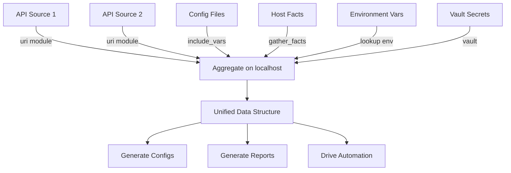

# How to Use Ansible to Aggregate Data from Multiple Sources

Author: [nawazdhandala](https://www.github.com/nawazdhandala)

Tags: Ansible, Data Aggregation, Automation, Integration

Description: Learn how to use Ansible to aggregate data from multiple sources including APIs, files, databases, and host facts into unified data structures for automation.

---

Modern infrastructure data lives in many places: CMDBs, cloud APIs, monitoring systems, DNS providers, and the hosts themselves. Ansible can pull data from all these sources and combine them into a single, unified view. This post covers practical patterns for multi-source data aggregation.

## Aggregating from Multiple API Endpoints

```yaml
# playbook-multi-api.yml
# Pulls data from three different APIs and combines into a single inventory
- name: Aggregate from multiple APIs
  hosts: localhost
  gather_facts: false
  vars:
    api_token: "{{ lookup('env', 'API_TOKEN') }}"

  tasks:
    - name: Fetch compute instances
      ansible.builtin.uri:
        url: "https://api.cloud.example.com/v1/instances"
        headers:
          Authorization: "Bearer {{ api_token }}"
      register: compute_response

    - name: Fetch DNS records
      ansible.builtin.uri:
        url: "https://api.dns.example.com/v1/zones/example.com/records"
        headers:
          Authorization: "Bearer {{ api_token }}"
      register: dns_response

    - name: Fetch monitoring targets
      ansible.builtin.uri:
        url: "https://api.monitoring.example.com/v1/targets"
        headers:
          Authorization: "Bearer {{ api_token }}"
      register: monitoring_response

    - name: Aggregate into unified view
      ansible.builtin.set_fact:
        unified_inventory: >-
          
          
          
          
          
          
          
          
          
          
          
          
          
          
          {{ instances }}

    - name: Show unified inventory
      ansible.builtin.debug:
        var: unified_inventory
```

## Combining Files and Variables

```yaml
# playbook-file-aggregation.yml
# Loads and merges configuration from multiple YAML files and inline variables
- name: Aggregate data from files
  hosts: localhost
  gather_facts: false

  tasks:
    - name: Load base configuration
      ansible.builtin.include_vars:
        file: config/defaults.yml
        name: defaults

    - name: Load environment overrides
      ansible.builtin.include_vars:
        file: "config/{{ target_env | default('production') }}.yml"
        name: env_config

    - name: Load secrets
      ansible.builtin.set_fact:
        secrets:
          db_password: "{{ lookup('env', 'DB_PASSWORD') }}"
          api_key: "{{ lookup('env', 'API_KEY') }}"
          ssl_cert: "{{ lookup('file', '/etc/ssl/certs/app.pem') }}"

    - name: Merge all sources
      ansible.builtin.set_fact:
        final_config: >-
          {{ defaults | combine(env_config, recursive=true) |
             combine({'secrets': secrets}) }}

    - name: Show merged config (redacted)
      ansible.builtin.debug:
        msg: "Config keys: {{ final_config.keys() | list }}"
```

## Aggregation Flow



## Cross-Host Data Aggregation

Collect data from multiple hosts and aggregate centrally:

```yaml
# playbook-cross-host-aggregate.yml
# Collects disk usage from all hosts and aggregates into a summary
- name: Collect data from all hosts
  hosts: all
  gather_facts: true

  tasks:
    - name: Get disk usage
      ansible.builtin.shell: "df -h / | tail -1 | awk '{print $5}' | tr -d '%'"
      register: disk_usage
      changed_when: false

    - name: Get load average
      ansible.builtin.shell: "cat /proc/loadavg | awk '{print $1}'"
      register: load_avg
      changed_when: false

- name: Aggregate collected data
  hosts: localhost
  gather_facts: false

  tasks:
    - name: Build aggregated metrics
      ansible.builtin.set_fact:
        fleet_metrics: >-
          
          
          
          
          
          
          
          
          
          
          
          
          
          
          
          
          
          
          
          
          
          
          
          
          
          
          {{ result }}

    - name: Show fleet summary
      ansible.builtin.debug:
        msg: |
          Fleet Summary:
          Total hosts: {{ fleet_metrics.summary.total_hosts }}
          Total CPUs: {{ fleet_metrics.summary.total_cpus }}
          Total Memory: {{ fleet_metrics.summary.total_memory_gb }} GB
          Avg Disk Usage: {{ fleet_metrics.summary.avg_disk_usage }}%
          Avg Load: {{ fleet_metrics.summary.avg_load }}
          Critical hosts: {{ fleet_metrics.summary.critical_hosts | join(', ') | default('None') }}
```

## Aggregating from Variable Files Directory

```yaml
# playbook-dir-aggregate.yml
# Loads all YAML files from a directory and merges them together
- name: Aggregate from directory of variable files
  hosts: localhost
  gather_facts: false

  tasks:
    - name: Find all config fragments
      ansible.builtin.find:
        paths: /etc/myapp/conf.d/
        patterns: "*.yml"
      register: config_files

    - name: Load all config fragments
      ansible.builtin.include_vars:
        file: "{{ item.path }}"
        name: "fragment_{{ item.path | basename | regex_replace('[^a-zA-Z0-9]', '_') }}"
      loop: "{{ config_files.files | sort(attribute='path') }}"
      loop_control:
        label: "{{ item.path | basename }}"

    - name: Merge all fragments
      ansible.builtin.set_fact:
        aggregated_config: >-
          
          
          
          
          
          
          {{ result }}
```

## Practical Example: Building Deployment Manifest

```yaml
# playbook-deploy-manifest.yml
# Aggregates data from git, Docker registry, and config to build a deployment manifest
- name: Build deployment manifest from multiple sources
  hosts: localhost
  gather_facts: false

  tasks:
    - name: Get latest git tag
      ansible.builtin.shell: "git describe --tags --abbrev=0"
      register: git_tag
      changed_when: false

    - name: Get Docker image digest
      ansible.builtin.uri:
        url: "https://registry.example.com/v2/myapp/manifests/{{ git_tag.stdout }}"
        headers:
          Accept: "application/vnd.docker.distribution.manifest.v2+json"
      register: docker_manifest

    - name: Load deployment config
      ansible.builtin.include_vars:
        file: deploy-config.yml
        name: deploy_config

    - name: Load secrets from vault
      ansible.builtin.set_fact:
        deploy_secrets:
          db_url: "{{ lookup('env', 'DATABASE_URL') }}"
          redis_url: "{{ lookup('env', 'REDIS_URL') }}"

    - name: Build complete deployment manifest
      ansible.builtin.set_fact:
        deployment_manifest:
          application: "{{ deploy_config.application }}"
          version: "{{ git_tag.stdout }}"
          image_digest: "{{ docker_manifest.json.config.digest | default('unknown') }}"
          timestamp: "{{ lookup('pipe', 'date -u +%Y-%m-%dT%H:%M:%SZ') }}"
          config: "{{ deploy_config.config }}"
          environment: "{{ deploy_secrets }}"

    - name: Write deployment manifest
      ansible.builtin.copy:
        content: "{{ deployment_manifest | to_nice_json(indent=2) }}"
        dest: /tmp/deployment_manifest.json
```

## Summary

Data aggregation in Ansible follows a consistent pattern: collect from each source using the appropriate module (uri for APIs, include_vars for files, gather_facts for hosts, env lookup for environment variables), then combine everything into a unified structure using `combine`, `union`, or Jinja2 expressions. Use `recursive=true` when merging nested configurations. Process the aggregated data to generate configs, reports, or deployment manifests. This pattern turns Ansible from a simple configuration tool into a data integration platform that can pull together information from across your entire infrastructure stack.
