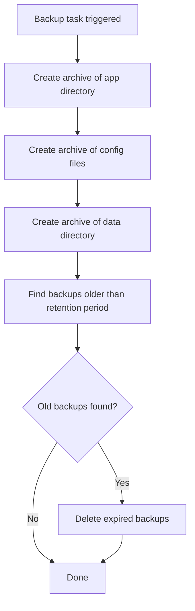

# How to Use Ansible to Archive Files on Remote Hosts

Author: [nawazdhandala](https://www.github.com/nawazdhandala)

Tags: Ansible, DevOps, Linux, Automation

Description: Learn how to use the Ansible archive module to create compressed archives of files and directories directly on remote hosts for backups and deployments.

---

Creating compressed archives of files on remote servers is a routine task for backups, log collection, deployment packaging, and data transfer. The Ansible `archive` module creates tar, tar.gz, tar.bz2, tar.xz, and zip archives directly on managed hosts without needing to write shell commands. It handles file selection, compression, and ownership in a clean, declarative way.

## Basic Archive Creation

The simplest use creates a gzipped tar archive of a directory.

```yaml
# Create a tar.gz archive of the application directory
- name: Archive application directory
  community.general.archive:
    path: /opt/myapp
    dest: /opt/backups/myapp-backup.tar.gz
    format: gz
```

This creates `/opt/backups/myapp-backup.tar.gz` containing the entire `/opt/myapp` directory.

## Supported Archive Formats

The `format` parameter supports several compression types.

```yaml
# Create a gzipped tar archive (most common)
- name: Create tar.gz archive
  community.general.archive:
    path: /opt/myapp
    dest: /opt/backups/myapp.tar.gz
    format: gz

# Create a bzip2 compressed tar archive (better compression, slower)
- name: Create tar.bz2 archive
  community.general.archive:
    path: /opt/myapp
    dest: /opt/backups/myapp.tar.bz2
    format: bz2

# Create an xz compressed tar archive (best compression, slowest)
- name: Create tar.xz archive
  community.general.archive:
    path: /opt/myapp
    dest: /opt/backups/myapp.tar.xz
    format: xz

# Create a zip archive
- name: Create zip archive
  community.general.archive:
    path: /opt/myapp
    dest: /opt/backups/myapp.zip
    format: zip

# Create a plain tar archive (no compression)
- name: Create uncompressed tar archive
  community.general.archive:
    path: /opt/myapp
    dest: /opt/backups/myapp.tar
    format: tar
```

## Archiving Multiple Paths

You can include multiple paths in a single archive.

```yaml
# Archive multiple directories and files into one archive
- name: Create backup of application and config
  community.general.archive:
    path:
      - /opt/myapp/data
      - /etc/myapp
      - /var/log/myapp
      - /opt/myapp/bin/myapp
    dest: /opt/backups/myapp-full-backup.tar.gz
    format: gz
```

## Excluding Files from the Archive

The `exclude_path` parameter lets you skip specific files or directories.

```yaml
# Archive application directory excluding temporary and cache files
- name: Create clean application archive
  community.general.archive:
    path: /opt/myapp
    dest: /opt/backups/myapp-clean.tar.gz
    format: gz
    exclude_path:
      - /opt/myapp/tmp
      - /opt/myapp/cache
      - /opt/myapp/logs
      - /opt/myapp/.git
      - /opt/myapp/node_modules
```

## Setting Permissions on the Archive

Control the ownership and permissions of the created archive file.

```yaml
# Create archive with specific ownership and permissions
- name: Create secure backup archive
  community.general.archive:
    path: /opt/myapp/data
    dest: /opt/backups/data-backup.tar.gz
    format: gz
    owner: backup
    group: backup
    mode: '0640'
```

## Creating Timestamped Backups

A common pattern is to include timestamps in archive names for versioning.

```yaml
# Create a timestamped backup archive
- name: Create dated backup of application
  community.general.archive:
    path: /opt/myapp
    dest: "/opt/backups/myapp-{{ ansible_date_time.date }}-{{ ansible_date_time.hour }}{{ ansible_date_time.minute }}.tar.gz"
    format: gz
    owner: backup
    group: backup
    mode: '0640'
  register: backup_result

- name: Show backup details
  ansible.builtin.debug:
    msg: "Backup created: {{ backup_result.dest }} ({{ backup_result.archived | length }} files, {{ backup_result.dest_state }})"
```

## Automated Backup Rotation

Combine archive creation with cleanup of old backups.

```yaml
# Create backup and clean up old ones
- name: Create daily application backup
  community.general.archive:
    path:
      - /opt/myapp/data
      - /etc/myapp
    dest: "/opt/backups/myapp-{{ ansible_date_time.date }}.tar.gz"
    format: gz
    mode: '0640'

- name: Find backups older than 30 days
  ansible.builtin.find:
    paths: /opt/backups
    patterns: "myapp-*.tar.gz"
    age: 30d
  register: old_backups

- name: Remove old backups
  ansible.builtin.file:
    path: "{{ item.path }}"
    state: absent
  loop: "{{ old_backups.files }}"
```

## Archive for Deployment Packages

Create deployment packages from built applications.

```yaml
# Build a deployment package from the latest release
- name: Create deployment package
  community.general.archive:
    path:
      - /opt/build/output/bin
      - /opt/build/output/conf
      - /opt/build/output/lib
      - /opt/build/output/scripts
    dest: "/opt/releases/myapp-{{ app_version }}.tar.gz"
    format: gz
  delegate_to: build_server

- name: Copy deployment package to target servers
  ansible.builtin.copy:
    src: "/opt/releases/myapp-{{ app_version }}.tar.gz"
    dest: "/tmp/myapp-{{ app_version }}.tar.gz"
  delegate_to: build_server

- name: Extract deployment package
  ansible.builtin.unarchive:
    src: "/tmp/myapp-{{ app_version }}.tar.gz"
    dest: /opt/myapp/
    remote_src: yes
```

## Archiving Log Files Before Rotation

```yaml
# Archive current logs before rotation
- name: Archive application logs
  community.general.archive:
    path: /var/log/myapp
    dest: "/opt/log-archive/myapp-logs-{{ ansible_date_time.iso8601_basic_short }}.tar.gz"
    format: gz
    exclude_path:
      - /var/log/myapp/current.log
    mode: '0640'
    owner: root
    group: adm
  register: log_archive

- name: Remove archived log files (keep current)
  ansible.builtin.shell: |
    find /var/log/myapp -name "*.log" -not -name "current.log" -mmin +5 -delete
  when: log_archive is changed
  changed_when: true
```

## Database Dump and Archive

Combine database exports with archiving.

```yaml
# Dump database and archive the dump
- name: Export PostgreSQL database
  ansible.builtin.shell: >
    pg_dump -U postgres mydb > /tmp/mydb-dump.sql
  become_user: postgres
  changed_when: true

- name: Archive database dump
  community.general.archive:
    path: /tmp/mydb-dump.sql
    dest: "/opt/backups/db/mydb-{{ ansible_date_time.date }}.sql.gz"
    format: gz
    mode: '0640'
    owner: postgres
    group: postgres

- name: Remove temporary dump file
  ansible.builtin.file:
    path: /tmp/mydb-dump.sql
    state: absent
```

## Complete Backup Role

Here is a full role that handles application backups.

```yaml
# roles/backup/tasks/main.yml
---
- name: Create backup directories
  ansible.builtin.file:
    path: "{{ item }}"
    state: directory
    owner: backup
    group: backup
    mode: '0750'
  loop:
    - "{{ backup_base_dir }}"
    - "{{ backup_base_dir }}/app"
    - "{{ backup_base_dir }}/config"
    - "{{ backup_base_dir }}/data"

- name: Archive application binaries and libraries
  community.general.archive:
    path: "{{ app_install_dir }}"
    dest: "{{ backup_base_dir }}/app/app-{{ ansible_date_time.date }}.tar.gz"
    format: gz
    exclude_path: "{{ backup_exclude_paths | default([]) }}"
    owner: backup
    group: backup
    mode: '0640'

- name: Archive configuration files
  community.general.archive:
    path: "{{ app_config_paths }}"
    dest: "{{ backup_base_dir }}/config/config-{{ ansible_date_time.date }}.tar.gz"
    format: gz
    owner: backup
    group: backup
    mode: '0640'

- name: Archive data directory
  community.general.archive:
    path: "{{ app_data_dir }}"
    dest: "{{ backup_base_dir }}/data/data-{{ ansible_date_time.date }}.tar.gz"
    format: gz
    owner: backup
    group: backup
    mode: '0640'
  when: app_data_dir is defined

- name: Clean up old backups
  ansible.builtin.find:
    paths: "{{ backup_base_dir }}"
    patterns: "*.tar.gz"
    recurse: yes
    age: "{{ backup_retention_days | default(30) }}d"
  register: old_backup_files

- name: Remove expired backups
  ansible.builtin.file:
    path: "{{ item.path }}"
    state: absent
  loop: "{{ old_backup_files.files }}"
```

## Backup Workflow



## Summary

The `archive` module handles the full range of archiving needs on remote hosts. It supports multiple compression formats, multiple source paths in a single archive, file exclusions, and proper ownership settings. Combined with timestamped filenames and the `find` module for cleanup, you can build comprehensive backup workflows. For deployment pipelines, the archive-copy-extract pattern provides a reliable way to package and distribute application releases. Keep your archives organized with consistent naming conventions, set appropriate permissions to protect sensitive data, and always implement retention policies to prevent disk space issues.
