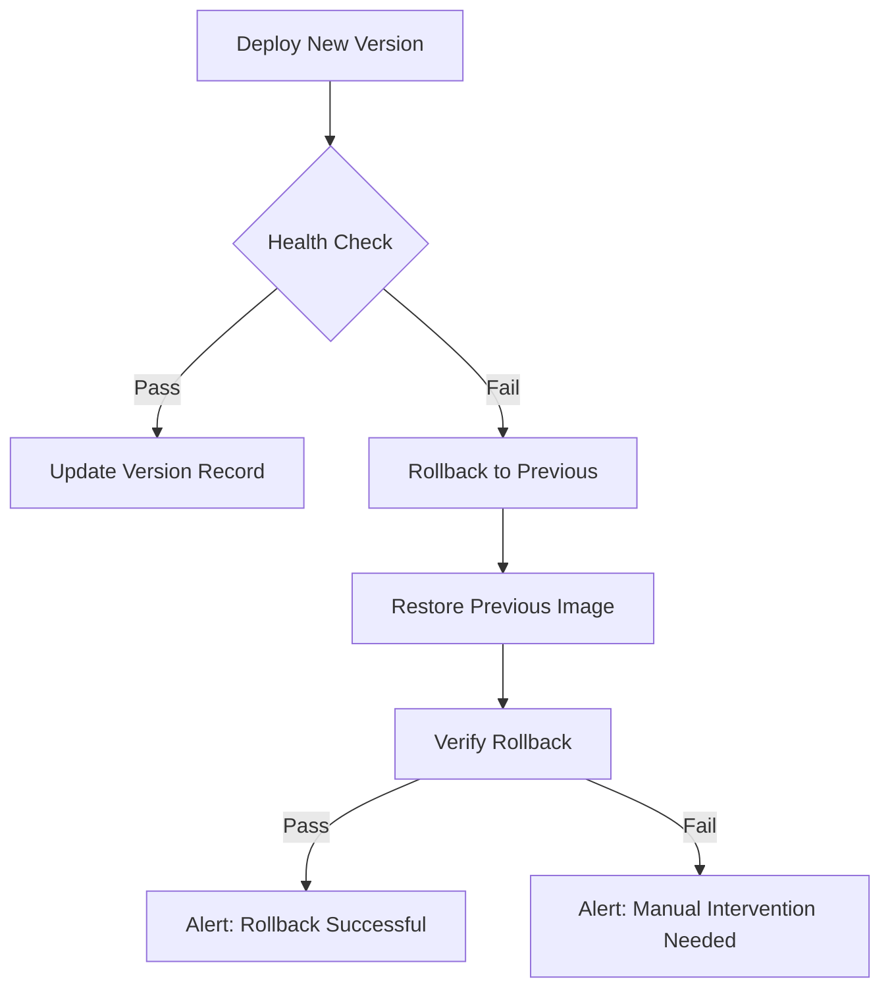

# How to Use Ansible to Automate Container Rollback

Author: [nawazdhandala](https://www.github.com/nawazdhandala)

Tags: Ansible, Docker, Rollback, Deployment, DevOps

Description: Automate container deployment rollbacks with Ansible including health check verification, automatic rollback triggers, and version tracking.

---

Rollbacks are your safety net when a deployment goes wrong. Automating them with Ansible means you can revert to a known-good state in seconds rather than minutes, reducing the impact of bad deployments on your users.

## Rollback Architecture



## Tracking Deployment Versions

```yaml
# roles/container_rollback/tasks/track.yml
# Track deployment versions for rollback capability
- name: Read current version file
  ansible.builtin.slurp:
    src: "{{ version_file }}"
  register: current_version_data
  failed_when: false

- name: Parse current version
  ansible.builtin.set_fact:
    previous_version: "{{ (current_version_data.content | b64decode | from_json) if current_version_data is not failed else {} }}"

- name: Save new version information
  ansible.builtin.copy:
    content: |
      {{ {
        'current': app_version,
        'previous': previous_version.current | default(''),
        'deployed_at': ansible_date_time.iso8601,
        'deployed_by': lookup('env', 'USER')
      } | to_nice_json }}
    dest: "{{ version_file }}"
    mode: '0644'
```

## Deploy with Automatic Rollback

```yaml
# roles/container_rollback/tasks/deploy.yml
# Deploy container with automatic rollback on failure
- name: Record pre-deployment state
  ansible.builtin.include_tasks: track.yml

- name: Pull new image
  community.docker.docker_image:
    name: "{{ app_image }}"
    tag: "{{ app_version }}"
    source: pull

- name: Deploy new version
  community.docker.docker_container:
    name: "{{ app_name }}"
    image: "{{ app_image }}:{{ app_version }}"
    state: started
    restart_policy: unless-stopped
    ports:
      - "{{ app_port }}:8080"
    env: "{{ app_env }}"
  register: deploy_result

- name: Wait for health check
  ansible.builtin.uri:
    url: "http://127.0.0.1:{{ app_port }}/health"
    status_code: 200
  register: health_check
  until: health_check.status == 200
  retries: "{{ health_check_retries }}"
  delay: "{{ health_check_delay }}"
  failed_when: false

- name: Trigger rollback if health check failed
  ansible.builtin.include_tasks: rollback.yml
  when: health_check.status is not defined or health_check.status != 200
```

## Rollback Tasks

```yaml
# roles/container_rollback/tasks/rollback.yml
# Roll back to the previous container version
- name: Read version file for rollback target
  ansible.builtin.slurp:
    src: "{{ version_file }}"
  register: version_data

- name: Parse rollback target
  ansible.builtin.set_fact:
    rollback_version: "{{ (version_data.content | b64decode | from_json).previous }}"

- name: Fail if no previous version available
  ansible.builtin.fail:
    msg: "No previous version found for rollback"
  when: rollback_version | length == 0

- name: Roll back to previous version
  community.docker.docker_container:
    name: "{{ app_name }}"
    image: "{{ app_image }}:{{ rollback_version }}"
    state: started
    restart_policy: unless-stopped
    ports:
      - "{{ app_port }}:8080"
    env: "{{ app_env }}"

- name: Verify rollback health
  ansible.builtin.uri:
    url: "http://127.0.0.1:{{ app_port }}/health"
    status_code: 200
  register: rollback_health
  until: rollback_health.status == 200
  retries: 10
  delay: 5

- name: Update version file after rollback
  ansible.builtin.copy:
    content: |
      {{ {
        'current': rollback_version,
        'previous': '',
        'deployed_at': ansible_date_time.iso8601,
        'rollback': true,
        'rolled_back_from': app_version
      } | to_nice_json }}
    dest: "{{ version_file }}"
    mode: '0644'

- name: Send rollback notification
  ansible.builtin.uri:
    url: "{{ webhook_url }}"
    method: POST
    body_format: json
    body:
      text: "Rollback executed on {{ inventory_hostname }}: {{ app_version }} -> {{ rollback_version }}"
  when: webhook_url is defined
  failed_when: false
```

## Manual Rollback Playbook

```yaml
# playbooks/rollback.yml
# Manually trigger a rollback to a specific version
- name: Manual rollback
  hosts: app_servers
  become: true
  vars:
    rollback_to: "{{ version | mandatory }}"
  tasks:
    - name: Deploy rollback version
      community.docker.docker_container:
        name: "{{ app_name }}"
        image: "{{ app_image }}:{{ rollback_to }}"
        state: started
        restart_policy: unless-stopped
        ports:
          - "{{ app_port }}:8080"
        env: "{{ app_env }}"

    - name: Verify rollback
      ansible.builtin.uri:
        url: "http://127.0.0.1:{{ app_port }}/health"
        status_code: 200
      register: health
      until: health.status == 200
      retries: 15
      delay: 5
```

Usage:

```bash
# Roll back to a specific version
ansible-playbook playbooks/rollback.yml -e version=v2.0.0
```


## Common Use Cases

Here are several practical scenarios where this module proves essential in real-world playbooks.

### Infrastructure Provisioning Workflow

```yaml
# Complete workflow incorporating this module
- name: Infrastructure provisioning
  hosts: all
  become: true
  gather_facts: true
  tasks:
    - name: Gather system information
      ansible.builtin.setup:
        gather_subset:
          - hardware
          - network

    - name: Display system summary
      ansible.builtin.debug:
        msg: >-
          Host {{ inventory_hostname }} has
          {{ ansible_memtotal_mb }}MB RAM,
          {{ ansible_processor_vcpus }} vCPUs,
          running {{ ansible_distribution }} {{ ansible_distribution_version }}

    - name: Install required packages
      ansible.builtin.package:
        name:
          - curl
          - wget
          - git
          - vim
          - htop
          - jq
        state: present

    - name: Configure system timezone
      ansible.builtin.timezone:
        name: "{{ system_timezone | default('UTC') }}"

    - name: Configure hostname
      ansible.builtin.hostname:
        name: "{{ inventory_hostname }}"

    - name: Update /etc/hosts
      ansible.builtin.lineinfile:
        path: /etc/hosts
        regexp: '^127\.0\.1\.1'
        line: "127.0.1.1 {{ inventory_hostname }}"

    - name: Configure SSH hardening
      ansible.builtin.lineinfile:
        path: /etc/ssh/sshd_config
        regexp: "{{ item.regexp }}"
        line: "{{ item.line }}"
      loop:
        - { regexp: '^PermitRootLogin', line: 'PermitRootLogin no' }
        - { regexp: '^PasswordAuthentication', line: 'PasswordAuthentication no' }
      notify: restart sshd

    - name: Configure firewall rules
      community.general.ufw:
        rule: allow
        port: "{{ item }}"
        proto: tcp
      loop:
        - "22"
        - "80"
        - "443"

    - name: Enable firewall
      community.general.ufw:
        state: enabled
        policy: deny

  handlers:
    - name: restart sshd
      ansible.builtin.service:
        name: sshd
        state: restarted
```

### Integration with Monitoring

```yaml
# Using gathered facts to configure monitoring thresholds
- name: Configure monitoring based on system specs
  hosts: all
  become: true
  tasks:
    - name: Set monitoring thresholds based on hardware
      ansible.builtin.template:
        src: monitoring_config.yml.j2
        dest: /etc/monitoring/config.yml
      vars:
        memory_warning_threshold: "{{ (ansible_memtotal_mb * 0.8) | int }}"
        memory_critical_threshold: "{{ (ansible_memtotal_mb * 0.95) | int }}"
        cpu_warning_threshold: 80
        cpu_critical_threshold: 95

    - name: Register host with monitoring system
      ansible.builtin.uri:
        url: "https://monitoring.example.com/api/hosts"
        method: POST
        body_format: json
        body:
          hostname: "{{ inventory_hostname }}"
          ip_address: "{{ ansible_default_ipv4.address }}"
          os: "{{ ansible_distribution }}"
          memory_mb: "{{ ansible_memtotal_mb }}"
          cpus: "{{ ansible_processor_vcpus }}"
        headers:
          Authorization: "Bearer {{ monitoring_api_token }}"
        status_code: [200, 201, 409]
```

### Error Handling Patterns

```yaml
# Robust error handling with this module
- name: Robust task execution
  hosts: all
  tasks:
    - name: Attempt primary operation
      ansible.builtin.command: /opt/app/primary-task.sh
      register: primary_result
      failed_when: false

    - name: Handle primary failure with fallback
      ansible.builtin.command: /opt/app/fallback-task.sh
      when: primary_result.rc != 0
      register: fallback_result

    - name: Report final status
      ansible.builtin.debug:
        msg: >-
          Task completed via {{ 'primary' if primary_result.rc == 0 else 'fallback' }} path.
          Return code: {{ primary_result.rc if primary_result.rc == 0 else fallback_result.rc }}

    - name: Fail if both paths failed
      ansible.builtin.fail:
        msg: "Both primary and fallback operations failed"
      when:
        - primary_result.rc != 0
        - fallback_result is defined
        - fallback_result.rc != 0
```

### Scheduling and Automation

```yaml
# Set up scheduled compliance scans using cron
- name: Configure automated scans
  hosts: all
  become: true
  tasks:
    - name: Create scan script
      ansible.builtin.copy:
        dest: /opt/scripts/compliance_scan.sh
        mode: '0755'
        content: |
          #!/bin/bash
          cd /opt/ansible
          ansible-playbook playbooks/validate.yml -i inventory/ > /var/log/compliance_scan.log 2>&1
          EXIT_CODE=$?
          if [ $EXIT_CODE -ne 0 ]; then
            curl -X POST https://hooks.example.com/alert \
              -H "Content-Type: application/json" \
              -d "{\"text\":\"Compliance scan failed on $(hostname)\"}"
          fi
          exit $EXIT_CODE

    - name: Schedule weekly compliance scan
      ansible.builtin.cron:
        name: "Weekly compliance scan"
        minute: "0"
        hour: "3"
        weekday: "1"
        job: "/opt/scripts/compliance_scan.sh"
        user: ansible
```


## Conclusion

Automated rollbacks with Ansible turn deployment failures from incidents into non-events. Track versions before each deployment, verify health after deployment, and automatically revert when health checks fail. With proper version tracking and health check integration, your rollback is just as tested and reliable as your deployment. The few minutes spent setting up automatic rollback saves hours of incident response.
