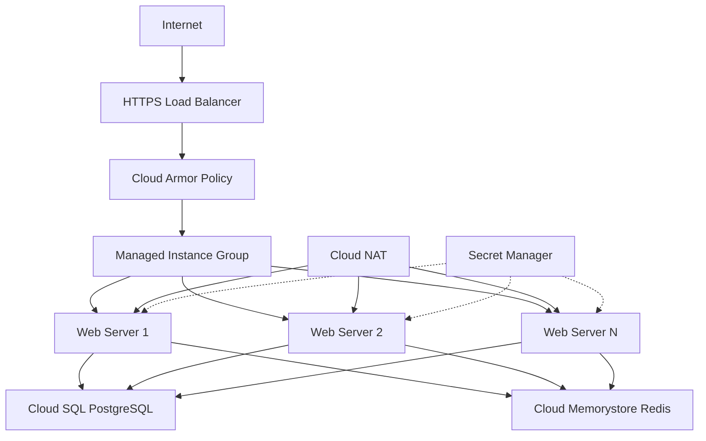
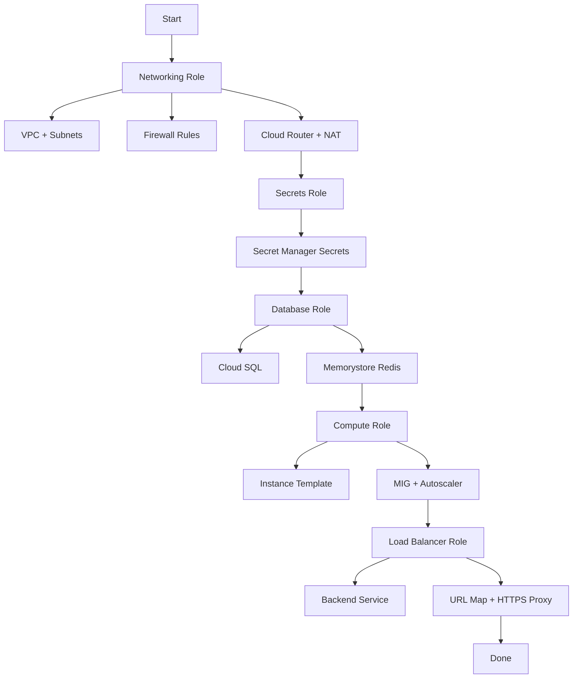

# How to Use Ansible to Automate GCP Infrastructure End-to-End

Author: [nawazdhandala](https://www.github.com/nawazdhandala)

Tags: Ansible, GCP, Infrastructure as Code, Automation, DevOps

Description: Complete guide to automating an entire GCP infrastructure stack with Ansible, from networking to compute to monitoring, with a real-world example.

---

Most Ansible tutorials show you how to create a single resource: a VM, a disk, a network. But real infrastructure is a stack of interconnected components that need to be provisioned in the right order and configured to work together. In this post, we will build a complete, production-ready GCP infrastructure from scratch using Ansible. By the end, you will have a full web application stack with networking, compute, load balancing, databases, and monitoring.

## What We Will Build

Our target architecture is a three-tier web application:

- A VPC network with public and private subnets
- Cloud NAT for outbound internet access from private VMs
- A Managed Instance Group with autoscaling web servers
- An HTTP(S) load balancer with Cloud Armor security
- A Cloud SQL database in the private subnet
- Cloud Memorystore for caching
- Secret Manager for sensitive configuration



## Project Structure

First, let us organize our playbooks properly.

```
gcp-infrastructure/
  ansible.cfg
  group_vars/
    all.yml
  roles/
    networking/
      tasks/main.yml
    compute/
      tasks/main.yml
    database/
      tasks/main.yml
    loadbalancer/
      tasks/main.yml
    secrets/
      tasks/main.yml
  site.yml
  teardown.yml
```

## Global Variables

Define shared variables that all roles need.

```yaml
# group_vars/all.yml - Shared variables for all roles
---
gcp_project: "my-project-id"
gcp_auth_kind: "serviceaccount"
gcp_service_account_file: "/path/to/service-account-key.json"
region: "us-central1"
zone: "us-central1-a"

# Naming convention
app_name: "myapp"
environment: "production"

# Network settings
vpc_name: "{{ app_name }}-vpc"
public_subnet_cidr: "10.0.1.0/24"
private_subnet_cidr: "10.0.2.0/24"

# Compute settings
machine_type: "e2-medium"
min_instances: 2
max_instances: 10
template_version: "v1"

# Database settings
db_instance_name: "{{ app_name }}-db"
db_tier: "db-custom-2-4096"
db_version: "POSTGRES_15"

# Redis settings
redis_name: "{{ app_name }}-cache"
redis_memory_gb: 2

# Standard labels
standard_labels:
  app: "{{ app_name }}"
  environment: "{{ environment }}"
  managed_by: "ansible"
```

## Role 1: Networking

The networking role creates the VPC, subnets, firewall rules, Cloud Router, and Cloud NAT.

```yaml
# roles/networking/tasks/main.yml - Set up the entire network layer
---
- name: Create VPC network
  google.cloud.gcp_compute_network:
    name: "{{ vpc_name }}"
    auto_create_subnetworks: false
    project: "{{ gcp_project }}"
    auth_kind: "{{ gcp_auth_kind }}"
    service_account_file: "{{ gcp_service_account_file }}"
    state: present
  register: vpc

- name: Create public subnet
  google.cloud.gcp_compute_subnetwork:
    name: "{{ app_name }}-public-subnet"
    region: "{{ region }}"
    network: "{{ vpc }}"
    ip_cidr_range: "{{ public_subnet_cidr }}"
    project: "{{ gcp_project }}"
    auth_kind: "{{ gcp_auth_kind }}"
    service_account_file: "{{ gcp_service_account_file }}"
    state: present
  register: public_subnet

- name: Create private subnet
  google.cloud.gcp_compute_subnetwork:
    name: "{{ app_name }}-private-subnet"
    region: "{{ region }}"
    network: "{{ vpc }}"
    ip_cidr_range: "{{ private_subnet_cidr }}"
    private_ip_google_access: true
    project: "{{ gcp_project }}"
    auth_kind: "{{ gcp_auth_kind }}"
    service_account_file: "{{ gcp_service_account_file }}"
    state: present
  register: private_subnet

- name: Create firewall rule for HTTP/HTTPS from load balancer
  google.cloud.gcp_compute_firewall:
    name: "{{ app_name }}-allow-lb-health-checks"
    network: "{{ vpc }}"
    allowed:
      - ip_protocol: "tcp"
        ports:
          - "80"
          - "443"
    source_ranges:
      # GCP health check and load balancer IP ranges
      - "130.211.0.0/22"
      - "35.191.0.0/16"
    target_tags:
      - "web-server"
    project: "{{ gcp_project }}"
    auth_kind: "{{ gcp_auth_kind }}"
    service_account_file: "{{ gcp_service_account_file }}"
    state: present

- name: Create firewall rule for internal communication
  google.cloud.gcp_compute_firewall:
    name: "{{ app_name }}-allow-internal"
    network: "{{ vpc }}"
    allowed:
      - ip_protocol: "tcp"
        ports:
          - "0-65535"
      - ip_protocol: "udp"
        ports:
          - "0-65535"
      - ip_protocol: "icmp"
    source_ranges:
      - "{{ public_subnet_cidr }}"
      - "{{ private_subnet_cidr }}"
    project: "{{ gcp_project }}"
    auth_kind: "{{ gcp_auth_kind }}"
    service_account_file: "{{ gcp_service_account_file }}"
    state: present

- name: Create Cloud Router for NAT
  google.cloud.gcp_compute_router:
    name: "{{ app_name }}-router"
    region: "{{ region }}"
    network: "{{ vpc }}"
    bgp:
      asn: 64514
    project: "{{ gcp_project }}"
    auth_kind: "{{ gcp_auth_kind }}"
    service_account_file: "{{ gcp_service_account_file }}"
    state: present
  register: router

- name: Configure Cloud NAT
  google.cloud.gcp_compute_router_nat:
    name: "{{ app_name }}-nat"
    router: "{{ router }}"
    region: "{{ region }}"
    nat_ip_allocate_option: "AUTO_ONLY"
    source_subnetwork_ip_ranges_to_nat: "ALL_SUBNETWORKS_ALL_IP_RANGES"
    min_ports_per_vm: 128
    project: "{{ gcp_project }}"
    auth_kind: "{{ gcp_auth_kind }}"
    service_account_file: "{{ gcp_service_account_file }}"
    state: present

- name: Set network facts for other roles
  ansible.builtin.set_fact:
    vpc_self_link: "{{ vpc.selfLink }}"
    public_subnet_self_link: "{{ public_subnet.selfLink }}"
    private_subnet_self_link: "{{ private_subnet.selfLink }}"
```

## Role 2: Secrets

Create application secrets before the compute instances need them.

```yaml
# roles/secrets/tasks/main.yml - Provision application secrets
---
- name: Create database password secret
  google.cloud.gcp_secret_manager_secret:
    name: "{{ app_name }}-db-password"
    replication:
      automatic: {}
    labels: "{{ standard_labels }}"
    project: "{{ gcp_project }}"
    auth_kind: "{{ gcp_auth_kind }}"
    service_account_file: "{{ gcp_service_account_file }}"
    state: present
  register: db_secret

- name: Set database password value
  google.cloud.gcp_secret_manager_secret_version:
    secret: "{{ db_secret }}"
    payload:
      data: "{{ lookup('password', '/dev/null length=32 chars=ascii_letters,digits') }}"
    project: "{{ gcp_project }}"
    auth_kind: "{{ gcp_auth_kind }}"
    service_account_file: "{{ gcp_service_account_file }}"
    state: present
  no_log: true

- name: Create application JWT secret
  google.cloud.gcp_secret_manager_secret:
    name: "{{ app_name }}-jwt-secret"
    replication:
      automatic: {}
    labels: "{{ standard_labels }}"
    project: "{{ gcp_project }}"
    auth_kind: "{{ gcp_auth_kind }}"
    service_account_file: "{{ gcp_service_account_file }}"
    state: present
  register: jwt_secret

- name: Set JWT secret value
  google.cloud.gcp_secret_manager_secret_version:
    secret: "{{ jwt_secret }}"
    payload:
      data: "{{ lookup('password', '/dev/null length=64 chars=ascii_letters,digits') }}"
    project: "{{ gcp_project }}"
    auth_kind: "{{ gcp_auth_kind }}"
    service_account_file: "{{ gcp_service_account_file }}"
    state: present
  no_log: true
```

## Role 3: Database and Cache

```yaml
# roles/database/tasks/main.yml - Provision Cloud SQL and Memorystore
---
- name: Create Cloud SQL PostgreSQL instance
  google.cloud.gcp_sql_instance:
    name: "{{ db_instance_name }}"
    database_version: "{{ db_version }}"
    region: "{{ region }}"
    settings:
      tier: "{{ db_tier }}"
      ip_configuration:
        ipv4_enabled: false
        private_network: "{{ vpc_self_link }}"
      backup_configuration:
        enabled: true
        start_time: "03:00"
      database_flags:
        - name: "max_connections"
          value: "100"
      user_labels: "{{ standard_labels }}"
    project: "{{ gcp_project }}"
    auth_kind: "{{ gcp_auth_kind }}"
    service_account_file: "{{ gcp_service_account_file }}"
    state: present
  register: sql_instance

- name: Create the application database
  google.cloud.gcp_sql_database:
    name: "{{ app_name }}"
    instance: "{{ sql_instance }}"
    charset: "UTF8"
    project: "{{ gcp_project }}"
    auth_kind: "{{ gcp_auth_kind }}"
    service_account_file: "{{ gcp_service_account_file }}"
    state: present

- name: Create Cloud Memorystore Redis instance
  google.cloud.gcp_redis_instance:
    name: "{{ redis_name }}"
    region: "{{ region }}"
    memory_size_gb: "{{ redis_memory_gb }}"
    tier: "STANDARD_HA"
    redis_version: "REDIS_7_0"
    authorized_network: "{{ vpc_self_link }}"
    redis_configs:
      maxmemory-policy: "allkeys-lru"
    labels: "{{ standard_labels }}"
    project: "{{ gcp_project }}"
    auth_kind: "{{ gcp_auth_kind }}"
    service_account_file: "{{ gcp_service_account_file }}"
    state: present
  register: redis_instance

- name: Store database and cache connection info
  ansible.builtin.set_fact:
    db_connection_name: "{{ sql_instance.connectionName }}"
    db_private_ip: "{{ sql_instance.ipAddresses | selectattr('type', 'eq', 'PRIVATE') | map(attribute='ipAddress') | first }}"
    redis_host: "{{ redis_instance.host }}"
    redis_port: "{{ redis_instance.port }}"
```

## Role 4: Compute

```yaml
# roles/compute/tasks/main.yml - Instance template and MIG
---
- name: Create instance template
  google.cloud.gcp_compute_instance_template:
    name: "{{ app_name }}-template-{{ template_version }}"
    properties:
      machine_type: "{{ machine_type }}"
      disks:
        - auto_delete: true
          boot: true
          initialize_params:
            source_image: "projects/ubuntu-os-cloud/global/images/family/ubuntu-2204-lts"
            disk_size_gb: 20
            disk_type: "pd-balanced"
      network_interfaces:
        - network:
            selfLink: "{{ vpc_self_link }}"
          subnetwork:
            selfLink: "{{ public_subnet_self_link }}"
      metadata:
        startup-script: |
          #!/bin/bash
          apt-get update && apt-get install -y nginx
          systemctl enable nginx && systemctl start nginx
      service_accounts:
        - email: "default"
          scopes:
            - "https://www.googleapis.com/auth/cloud-platform"
      labels: "{{ standard_labels | combine({'role': 'web-server'}) }}"
      tags:
        items:
          - "web-server"
    project: "{{ gcp_project }}"
    auth_kind: "{{ gcp_auth_kind }}"
    service_account_file: "{{ gcp_service_account_file }}"
    state: present
  register: instance_template

- name: Create health check
  google.cloud.gcp_compute_health_check:
    name: "{{ app_name }}-health-check"
    type: "HTTP"
    http_health_check:
      port: 80
      request_path: "/health"
    check_interval_sec: 10
    healthy_threshold: 2
    unhealthy_threshold: 3
    project: "{{ gcp_project }}"
    auth_kind: "{{ gcp_auth_kind }}"
    service_account_file: "{{ gcp_service_account_file }}"
    state: present
  register: health_check

- name: Create Managed Instance Group
  google.cloud.gcp_compute_instance_group_manager:
    name: "{{ app_name }}-mig"
    zone: "{{ zone }}"
    base_instance_name: "{{ app_name }}-web"
    instance_template: "{{ instance_template }}"
    target_size: "{{ min_instances }}"
    named_ports:
      - name: "http"
        port: 80
    project: "{{ gcp_project }}"
    auth_kind: "{{ gcp_auth_kind }}"
    service_account_file: "{{ gcp_service_account_file }}"
    state: present
  register: mig

- name: Create autoscaler
  google.cloud.gcp_compute_autoscaler:
    name: "{{ app_name }}-autoscaler"
    zone: "{{ zone }}"
    target: "{{ mig }}"
    autoscaling_policy:
      min_num_replicas: "{{ min_instances }}"
      max_num_replicas: "{{ max_instances }}"
      cool_down_period_sec: 120
      cpu_utilization:
        utilization_target: 0.7
    project: "{{ gcp_project }}"
    auth_kind: "{{ gcp_auth_kind }}"
    service_account_file: "{{ gcp_service_account_file }}"
    state: present
```

## The Main Playbook

Bring it all together with the site playbook.

```yaml
# site.yml - Main playbook that orchestrates all roles
---
- name: Deploy Complete GCP Infrastructure
  hosts: localhost
  connection: local
  gather_facts: false

  roles:
    - networking
    - secrets
    - database
    - compute
    - loadbalancer

  post_tasks:
    - name: Infrastructure deployment complete
      ansible.builtin.debug:
        msg: |
          Infrastructure deployment completed successfully.
          VPC: {{ vpc_name }}
          Database: {{ db_instance_name }}
          Redis: {{ redis_name }}
          MIG: {{ app_name }}-mig ({{ min_instances }}-{{ max_instances }} instances)
```

Run the full deployment:

```bash
# Deploy everything
ansible-playbook site.yml

# Deploy just networking
ansible-playbook site.yml --tags networking

# Deploy with a different environment
ansible-playbook site.yml -e "environment=staging min_instances=1 max_instances=3"
```

## Deployment Flow



## Tips for End-to-End Automation

1. **Order matters.** Resources have dependencies. Networks must exist before subnets. Subnets must exist before VMs. Plan your role execution order carefully.

2. **Use `register` and `set_fact` to pass data between roles.** When one role creates a resource that another role needs, register the output and share it through facts.

3. **Keep variables in `group_vars`.** This makes it easy to create different environments by overriding variables on the command line.

4. **Always have a teardown playbook.** Being able to tear down the entire stack is just as important as being able to create it.

5. **Test incrementally.** Do not try to build the entire stack at once. Get each role working independently first, then chain them together.

6. **Use tags for partial deployments.** Tags let you run just the networking or just the compute roles without running everything.

## Conclusion

Building a complete GCP infrastructure with Ansible requires careful planning, but the result is a fully automated, reproducible deployment process. Every component, from the VPC network to the load balancer to the database, is defined in code and can be deployed, modified, or torn down with a single command. This is the foundation of reliable infrastructure management, and it eliminates the drift and inconsistency that inevitably comes from manual configuration.
