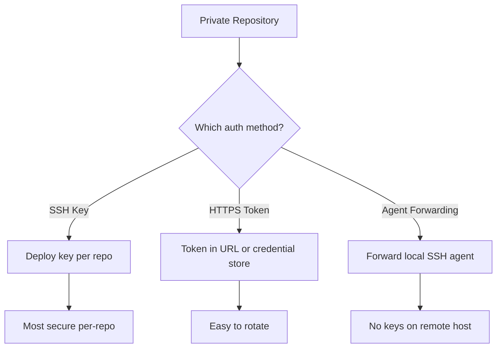

# How to Use Ansible to Clone Private Repositories

Author: [nawazdhandala](https://www.github.com/nawazdhandala)

Tags: Ansible, Git, Private Repositories, Authentication

Description: Learn how to use Ansible to clone private Git repositories using SSH keys, HTTPS tokens, deploy keys, and credential helpers for secure code deployment.

---

Cloning private repositories with Ansible requires some form of authentication. There are several approaches, each with different security tradeoffs. This post covers all the common methods: SSH keys, HTTPS tokens, deploy keys, and credential helpers.

## Method 1: SSH Keys

SSH is the most common method for private repository access:

```yaml
# playbook-ssh-clone.yml
# Clones a private repository using SSH key authentication
- name: Clone private repo with SSH
  hosts: webservers
  become: true

  tasks:
    - name: Deploy SSH key
      ansible.builtin.copy:
        content: "{{ lookup('file', 'keys/deploy_key') }}"
        dest: /root/.ssh/deploy_key
        mode: "0600"
      no_log: true

    - name: Add Git host to known_hosts
      ansible.builtin.known_hosts:
        name: github.com
        key: "github.com ssh-ed25519 AAAAC3NzaC1lZDI1NTE5AAAAIOMqqnkVzrm0SdG6UOoqKLsabgH5C9okWi0dh2l9GKJl"
        state: present

    - name: Clone private repository
      ansible.builtin.git:
        repo: "git@github.com:myorg/private-app.git"
        dest: /opt/app
        version: main
        key_file: /root/.ssh/deploy_key

    - name: Remove deploy key after clone
      ansible.builtin.file:
        path: /root/.ssh/deploy_key
        state: absent
```

## Method 2: HTTPS with Token

Use a personal access token or machine token in the URL:

```yaml
# playbook-https-token.yml
# Clones a private repository using HTTPS with a token in the URL
- name: Clone private repo with HTTPS token
  hosts: webservers
  become: true
  vars:
    git_token: "{{ lookup('env', 'GITHUB_TOKEN') }}"

  tasks:
    - name: Clone with HTTPS token
      ansible.builtin.git:
        repo: "https://{{ git_token }}@github.com/myorg/private-app.git"
        dest: /opt/app
        version: main
      no_log: true
```

For GitHub Apps or fine-grained tokens:

```yaml
    - name: Clone with GitHub App installation token
      ansible.builtin.git:
        repo: "https://x-access-token:{{ git_token }}@github.com/myorg/private-app.git"
        dest: /opt/app
        version: main
      no_log: true
```

## Method 3: Credential Helper

Configure a credential helper so the token is not in the command:

```yaml
# playbook-credential-helper.yml
# Sets up a Git credential helper to avoid tokens in clone URLs
- name: Clone with credential helper
  hosts: webservers
  become: true
  vars:
    git_user: "deploy-bot"
    git_token: "{{ lookup('env', 'GIT_TOKEN') }}"

  tasks:
    - name: Configure credential store
      ansible.builtin.copy:
        content: "https://{{ git_user }}:{{ git_token }}@github.com"
        dest: /root/.git-credentials
        mode: "0600"
      no_log: true

    - name: Set credential helper to store
      community.general.git_config:
        name: credential.helper
        value: store
        scope: global

    - name: Clone repository (credentials read from store)
      ansible.builtin.git:
        repo: "https://github.com/myorg/private-app.git"
        dest: /opt/app
        version: main
```

## Authentication Decision Flow



## Method 4: SSH Agent Forwarding

Use your local SSH agent without copying keys:

```yaml
# playbook-agent-forwarding.yml
# Clones private repos using SSH agent forwarding from the controller
- name: Clone with SSH agent forwarding
  hosts: webservers
  vars:
    ansible_ssh_common_args: "-o ForwardAgent=yes"

  tasks:
    - name: Clone private repository
      ansible.builtin.git:
        repo: "git@github.com:myorg/private-app.git"
        dest: /opt/app
        version: main
        accept_hostkey: true
```

Note: Agent forwarding requires that your SSH agent has the key loaded (`ssh-add`) and that the SSH server allows forwarding.

## Cloning Multiple Private Repos

```yaml
# playbook-multi-private.yml
# Clones multiple private repositories with shared authentication setup
- name: Clone multiple private repos
  hosts: webservers
  become: true
  vars:
    git_token: "{{ lookup('env', 'GITHUB_TOKEN') }}"
    private_repos:
      - name: frontend
        repo: myorg/frontend
        version: v3.0.0
        dest: /opt/frontend
      - name: backend
        repo: myorg/backend
        version: v2.5.0
        dest: /opt/backend
      - name: worker
        repo: myorg/worker
        version: v1.8.0
        dest: /opt/worker

  tasks:
    - name: Set up credential store
      ansible.builtin.copy:
        content: "https://x-access-token:{{ git_token }}@github.com"
        dest: /root/.git-credentials
        mode: "0600"
      no_log: true

    - name: Configure git to use credential store
      community.general.git_config:
        name: credential.helper
        value: store
        scope: global

    - name: Clone all private repositories
      ansible.builtin.git:
        repo: "https://github.com/{{ item.repo }}.git"
        dest: "{{ item.dest }}"
        version: "{{ item.version }}"
        depth: 1
      loop: "{{ private_repos }}"
      loop_control:
        label: "{{ item.name }}@{{ item.version }}"
      register: clone_results

    - name: Clean up credentials
      ansible.builtin.file:
        path: /root/.git-credentials
        state: absent

    - name: Show clone summary
      ansible.builtin.debug:
        msg: "{{ item.item.name }}: {{ 'UPDATED' if item.changed else 'unchanged' }}"
      loop: "{{ clone_results.results }}"
      loop_control:
        label: "{{ item.item.name }}"
```

## Using Ansible Vault for Tokens

```yaml
# playbook-vault-token.yml
# Uses an Ansible Vault encrypted token for secure private repo cloning
- name: Clone with vault-encrypted token
  hosts: webservers
  become: true
  vars:
    # This variable is encrypted with ansible-vault
    github_token: !vault |
      $ANSIBLE_VAULT;1.1;AES256
      61626364656667686970...

  tasks:
    - name: Clone private repository securely
      ansible.builtin.git:
        repo: "https://x-access-token:{{ github_token }}@github.com/myorg/app.git"
        dest: /opt/app
        version: main
      no_log: true
```

## GitLab and Bitbucket Authentication

Different platforms use slightly different token formats:

```yaml
# playbook-multi-platform.yml
# Clones from GitHub, GitLab, and Bitbucket with their respective auth formats
- name: Clone from different platforms
  hosts: webservers
  become: true

  tasks:
    - name: Clone from GitHub (personal access token)
      ansible.builtin.git:
        repo: "https://x-access-token:{{ github_token }}@github.com/org/repo.git"
        dest: /opt/github-app
        version: main
      no_log: true

    - name: Clone from GitLab (deploy token)
      ansible.builtin.git:
        repo: "https://{{ gitlab_deploy_user }}:{{ gitlab_deploy_token }}@gitlab.com/org/repo.git"
        dest: /opt/gitlab-app
        version: main
      no_log: true

    - name: Clone from Bitbucket (app password)
      ansible.builtin.git:
        repo: "https://{{ bitbucket_user }}:{{ bitbucket_app_password }}@bitbucket.org/org/repo.git"
        dest: /opt/bitbucket-app
        version: main
      no_log: true
```

## Security Best Practices

```yaml
# playbook-secure-clone.yml
# Demonstrates security best practices for private repository cloning
- name: Secure private repo cloning
  hosts: webservers
  become: true

  tasks:
    - name: Create temporary credential file
      ansible.builtin.tempfile:
        state: file
        suffix: .git-creds
      register: cred_file

    - name: Write credentials
      ansible.builtin.copy:
        content: "https://x-access-token:{{ lookup('env', 'GIT_TOKEN') }}@github.com"
        dest: "{{ cred_file.path }}"
        mode: "0600"
      no_log: true

    - name: Clone using temporary credentials
      ansible.builtin.git:
        repo: "https://github.com/myorg/private-app.git"
        dest: /opt/app
        version: main
      environment:
        GIT_CREDENTIAL_HELPER: "store --file={{ cred_file.path }}"

    - name: Remove temporary credentials
      ansible.builtin.file:
        path: "{{ cred_file.path }}"
        state: absent
      always_run: true
```

## Summary

Cloning private repositories with Ansible requires choosing the right authentication method for your environment. SSH deploy keys provide the best per-repository security. HTTPS tokens are the easiest to manage and rotate. Credential helpers keep tokens out of command-line arguments. SSH agent forwarding avoids placing any credentials on remote hosts. Whichever method you choose, always use `no_log: true` for tasks that handle credentials, store secrets in Ansible Vault, and clean up temporary credential files after use. Rotate tokens and keys on a regular schedule as part of your security practices.
