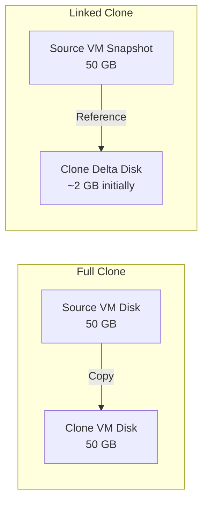

# How to Use Ansible to Clone VMware Virtual Machines

Author: [nawazdhandala](https://www.github.com/nawazdhandala)

Tags: Ansible, VMware, VM Cloning, vSphere, Automation

Description: Learn how to clone VMware virtual machines with Ansible, including full clones, linked clones, and customization during the cloning process.

---

Cloning is one of the most common VM operations in VMware environments. Instead of building every VM from scratch, you clone a golden image and customize it. Doing this through the vSphere Client works for the occasional VM, but when you are spinning up entire environments or building test infrastructure, automating clones with Ansible saves a tremendous amount of time. This guide covers full clones, linked clones, guest customization during cloning, and batch clone operations.

## How VMware Cloning Works

When you clone a VM in VMware, vCenter creates a copy of the source VM's disks and configuration. There are two types of clones:

- **Full clone** - A complete, independent copy of the source VM. All virtual disks are copied, and the clone has no dependency on the source.
- **Linked clone** - The clone's disks are thin delta disks that reference the source VM's snapshot. This saves storage but creates a dependency on the source.



## Basic VM Cloning

The `community.vmware.vmware_guest` module handles cloning when you specify a `template` parameter alongside the new VM name.

```yaml
# clone-vm.yml
---
- name: Clone a VMware virtual machine
  hosts: localhost
  gather_facts: false

  module_defaults:
    group/community.vmware.vmware:
      hostname: "{{ vcenter_hostname }}"
      username: "{{ vcenter_username }}"
      password: "{{ vcenter_password }}"
      validate_certs: false

  vars:
    vcenter_hostname: "vcenter.example.com"
    vcenter_username: "administrator@vsphere.local"
    vcenter_password: "{{ vault_vcenter_password }}"

  tasks:
    - name: Clone VM from an existing virtual machine
      community.vmware.vmware_guest:
        name: "web-clone-01"
        state: present
        template: "golden-rhel9"
        datacenter: "DC01"
        cluster: "Production"
        folder: "/DC01/vm/Clones"
        datastore: "vsanDatastore"
        # Wait for the clone to get an IP address
        wait_for_ip_address: true
        wait_for_ip_address_timeout: 600
      register: clone_result

    - name: Show clone details
      ansible.builtin.debug:
        msg: "Clone '{{ clone_result.instance.hw_name }}' created at IP {{ clone_result.instance.ipv4 }}"
```

## Cloning with Guest Customization

When you clone a VM, the clone has the same hostname, IP address, and other identity as the source. You need guest customization to give the clone its own identity.

```yaml
# clone-with-customization.yml
---
- name: Clone VM with full guest customization
  hosts: localhost
  gather_facts: false

  module_defaults:
    group/community.vmware.vmware:
      hostname: "{{ vcenter_hostname }}"
      username: "{{ vcenter_username }}"
      password: "{{ vcenter_password }}"
      validate_certs: false

  vars:
    vcenter_hostname: "vcenter.example.com"
    vcenter_username: "administrator@vsphere.local"
    vcenter_password: "{{ vault_vcenter_password }}"

  tasks:
    - name: Clone VM and customize the guest operating system
      community.vmware.vmware_guest:
        name: "app-server-03"
        state: poweredon
        template: "golden-rhel9"
        datacenter: "DC01"
        cluster: "Production"
        folder: "/DC01/vm/Production/AppServers"
        datastore: "vsanDatastore"
        # Override hardware from the template
        hardware:
          memory_mb: 8192
          num_cpus: 4
        # Override network configuration
        networks:
          - name: "VLAN-100-Production"
            device_type: vmxnet3
            ip: "10.100.1.53"
            netmask: "255.255.255.0"
            gateway: "10.100.1.1"
            dns_servers:
              - "10.100.1.10"
              - "10.100.1.11"
            connected: true
            start_connected: true
        # Guest OS customization
        customization:
          hostname: "app-server-03"
          domain: "prod.example.com"
          dns_servers:
            - "10.100.1.10"
            - "10.100.1.11"
          dns_suffix:
            - "prod.example.com"
        wait_for_ip_address: true
        wait_for_ip_address_timeout: 600
      register: clone_info

    - name: Display cloned VM details
      ansible.builtin.debug:
        msg: >
          VM: {{ clone_info.instance.hw_name }}
          IP: {{ clone_info.instance.ipv4 }}
          UUID: {{ clone_info.instance.hw_product_uuid }}
```

## Linked Clones

Linked clones use significantly less storage because they share the source VM's base disk. The clone only stores the differences.

```yaml
# linked-clone.yml
---
- name: Create a linked clone for testing
  hosts: localhost
  gather_facts: false

  module_defaults:
    group/community.vmware.vmware:
      hostname: "{{ vcenter_hostname }}"
      username: "{{ vcenter_username }}"
      password: "{{ vcenter_password }}"
      validate_certs: false

  vars:
    vcenter_hostname: "vcenter.example.com"
    vcenter_username: "administrator@vsphere.local"
    vcenter_password: "{{ vault_vcenter_password }}"

  tasks:
    # The source VM must have at least one snapshot for linked clones
    - name: Create a snapshot on the source VM if needed
      community.vmware.vmware_guest_snapshot:
        datacenter: "DC01"
        name: "golden-rhel9"
        folder: "/DC01/vm/Templates"
        snapshot_name: "linked-clone-base"
        description: "Base snapshot for linked clones"
        state: present
      register: snapshot_result

    - name: Create linked clone from snapshot
      community.vmware.vmware_guest:
        name: "test-linked-01"
        state: present
        template: "golden-rhel9"
        datacenter: "DC01"
        cluster: "Development"
        folder: "/DC01/vm/Testing"
        datastore: "vsanDatastore"
        # Enable linked clone mode
        linked_clone: true
        snapshot_src: "linked-clone-base"
      register: linked_clone_result

    - name: Show storage savings information
      ansible.builtin.debug:
        msg: "Linked clone created. Storage used will grow only as changes are made."
```

## Batch Cloning for Environment Provisioning

When you need to clone multiple VMs to build an entire environment, define the VMs in a variable list.

```yaml
# clone-environment.yml
---
- name: Clone an entire application environment
  hosts: localhost
  gather_facts: false

  module_defaults:
    group/community.vmware.vmware:
      hostname: "{{ vcenter_hostname }}"
      username: "{{ vcenter_username }}"
      password: "{{ vcenter_password }}"
      validate_certs: false

  vars:
    vcenter_hostname: "vcenter.example.com"
    vcenter_username: "administrator@vsphere.local"
    vcenter_password: "{{ vault_vcenter_password }}"
    environment_name: "staging"

    # Define the entire environment as a list of VMs to clone
    environment_vms:
      - name: "{{ environment_name }}-web-01"
        template: "golden-rhel9-web"
        cpus: 2
        memory_mb: 4096
        ip: "10.150.1.10"
        role: webserver
      - name: "{{ environment_name }}-web-02"
        template: "golden-rhel9-web"
        cpus: 2
        memory_mb: 4096
        ip: "10.150.1.11"
        role: webserver
      - name: "{{ environment_name }}-app-01"
        template: "golden-rhel9-app"
        cpus: 4
        memory_mb: 8192
        ip: "10.150.1.20"
        role: appserver
      - name: "{{ environment_name }}-db-01"
        template: "golden-rhel9-db"
        cpus: 8
        memory_mb: 32768
        ip: "10.150.1.30"
        role: database

  tasks:
    - name: Clone VMs for the environment
      community.vmware.vmware_guest:
        name: "{{ item.name }}"
        state: poweredon
        template: "{{ item.template }}"
        datacenter: "DC01"
        cluster: "Staging"
        folder: "/DC01/vm/{{ environment_name | capitalize }}"
        datastore: "vsanDatastore"
        hardware:
          memory_mb: "{{ item.memory_mb }}"
          num_cpus: "{{ item.cpus }}"
        networks:
          - name: "VLAN-150-Staging"
            ip: "{{ item.ip }}"
            netmask: "255.255.255.0"
            gateway: "10.150.1.1"
        customization:
          hostname: "{{ item.name }}"
          domain: "staging.example.com"
          dns_servers:
            - "10.150.1.5"
        wait_for_ip_address: true
        wait_for_ip_address_timeout: 600
      loop: "{{ environment_vms }}"
      register: cloned_vms

    - name: Build summary of cloned environment
      ansible.builtin.debug:
        msg: "{{ item.item.name }} ({{ item.item.role }}) -> {{ item.instance.ipv4 }}"
      loop: "{{ cloned_vms.results }}"
      when: item.changed
```

## Cloning to a Different Datastore or Cluster

Sometimes you need to clone a VM to a different location, perhaps moving it from a development cluster to production storage.

```yaml
# clone-cross-cluster.yml
- name: Clone VM to a different cluster and datastore
  community.vmware.vmware_guest:
    hostname: "{{ vcenter_hostname }}"
    username: "{{ vcenter_username }}"
    password: "{{ vcenter_password }}"
    validate_certs: false
    name: "prod-clone-from-dev"
    state: present
    template: "dev-app-server"
    datacenter: "DC01"
    # Clone to a different cluster than the source
    cluster: "Production"
    folder: "/DC01/vm/Production"
    # Specify the target datastore explicitly
    datastore: "production-vsan"
    # Convert thin disks to thick if needed for production
    disk:
      - size_gb: 100
        type: thick
        datastore: "production-vsan"
```

## Windows VM Cloning with Sysprep

Cloning Windows VMs requires Sysprep customization to generate new SIDs and configure the Windows identity.

```yaml
# clone-windows-vm.yml
- name: Clone Windows VM with Sysprep customization
  community.vmware.vmware_guest:
    hostname: "{{ vcenter_hostname }}"
    username: "{{ vcenter_username }}"
    password: "{{ vcenter_password }}"
    validate_certs: false
    name: "win-server-05"
    state: poweredon
    template: "golden-win2022"
    datacenter: "DC01"
    cluster: "Production"
    folder: "/DC01/vm/Windows"
    datastore: "vsanDatastore"
    networks:
      - name: "VLAN-100-Production"
        ip: "10.100.1.105"
        netmask: "255.255.255.0"
        gateway: "10.100.1.1"
    customization:
      hostname: "WIN-SRV-05"
      password: "{{ vault_windows_admin_password }}"
      autologon: true
      autologoncount: 1
      fullname: "Admin"
      orgname: "Example Corp"
      dns_servers:
        - "10.100.1.10"
      domain: "prod.example.com"
      joindomain: "prod.example.com"
      domainadmin: "svc-domainjoin@prod.example.com"
      domainadminpassword: "{{ vault_domain_join_password }}"
      timezone: 20  # Central Standard Time
    wait_for_ip_address: true
    wait_for_ip_address_timeout: 900
  no_log: true  # Hide passwords from the output
```

## Cleanup: Deleting Cloned VMs

When test environments are no longer needed, clean them up.

```yaml
# cleanup-clones.yml
- name: Remove cloned VMs from the environment
  community.vmware.vmware_guest:
    hostname: "{{ vcenter_hostname }}"
    username: "{{ vcenter_username }}"
    password: "{{ vcenter_password }}"
    validate_certs: false
    name: "{{ item }}"
    state: absent
    datacenter: "DC01"
    force: true  # Force removal even if the VM is powered on
  loop:
    - "staging-web-01"
    - "staging-web-02"
    - "staging-app-01"
    - "staging-db-01"
```

VM cloning with Ansible turns what is usually a manual, error-prone process into a repeatable operation that you can trigger on demand. Whether you are building test environments, scaling production, or provisioning developer workstations, the patterns in this guide give you a solid foundation to work from. Start with basic clones, add customization as needed, and scale up to full environment provisioning.
