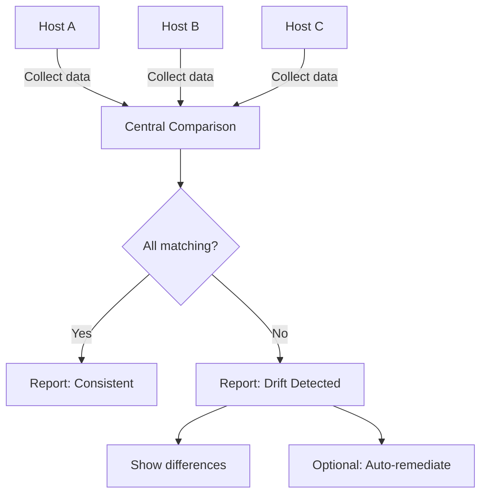

# How to Use Ansible to Compare Data Between Hosts

Author: [nawazdhandala](https://www.github.com/nawazdhandala)

Tags: Ansible, Data Comparison, Configuration Drift, Multi-Host

Description: Learn how to use Ansible to compare data between hosts for drift detection, configuration auditing, and ensuring consistency across your infrastructure.

---

When managing multiple hosts, you often need to verify that configurations are consistent, detect drift, or find differences between environments. Ansible's ability to collect data from many hosts and then process it centrally makes it an excellent tool for cross-host comparisons.

## Basic Configuration Comparison

The pattern is: collect data from all hosts, then compare on localhost:

```yaml
# playbook-basic-compare.yml
# Collects kernel versions from all hosts and identifies inconsistencies
- name: Collect data from all hosts
  hosts: all
  gather_facts: true

- name: Compare configurations
  hosts: localhost
  gather_facts: false

  tasks:
    - name: Compare kernel versions
      ansible.builtin.set_fact:
        kernel_versions: >-
          
          
          
          
          
          
          
          {{ result }}

    - name: Show kernel versions
      ansible.builtin.debug:
        var: kernel_versions

    - name: Check if all kernels match
      ansible.builtin.debug:
        msg: >-
          
          
          All hosts have the same kernel: {{ versions[0] }}
          
          MISMATCH: Found {{ versions | length }} different kernel versions: {{ versions | join(', ') }}
          
```

## Comparing Package Versions

```yaml
# playbook-package-compare.yml
# Compares installed package versions across all web servers
- name: Collect package versions
  hosts: webservers
  gather_facts: false

  tasks:
    - name: Get nginx version
      ansible.builtin.shell: "nginx -v 2>&1 | awk -F/ '{print $2}'"
      register: nginx_version
      changed_when: false
      failed_when: false

    - name: Get Python version
      ansible.builtin.shell: "python3 --version | awk '{print $2}'"
      register: python_version
      changed_when: false
      failed_when: false

- name: Compare versions
  hosts: localhost
  gather_facts: false

  tasks:
    - name: Build version matrix
      ansible.builtin.set_fact:
        version_matrix: >-
          
          
          
          
          {{ result }}

    - name: Display version matrix
      ansible.builtin.debug:
        msg: |
          Package Version Comparison:
          
          {{ "%-20s" | format(entry.host) }} nginx={{ entry.nginx }} python={{ entry.python }}
          

    - name: Find version mismatches
      ansible.builtin.debug:
        msg: |
          
          
          {{ pkg }}: {{ 'CONSISTENT (' ~ versions[0] ~ ')' if versions | length == 1 else 'MISMATCH: ' ~ versions | join(', ') }}
          
```

## Comparing Configuration Files

```yaml
# playbook-config-compare.yml
# Compares configuration file checksums across hosts to detect drift
- name: Collect config file checksums
  hosts: webservers
  gather_facts: false

  tasks:
    - name: Get checksums of key config files
      ansible.builtin.stat:
        path: "{{ item }}"
        checksum_algorithm: sha256
      register: config_checksums
      loop:
        - /etc/nginx/nginx.conf
        - /etc/ssh/sshd_config
        - /etc/sysctl.conf

- name: Compare configurations
  hosts: localhost
  gather_facts: false

  tasks:
    - name: Build checksum comparison
      ansible.builtin.set_fact:
        config_comparison: >-
          
          
          
          
          
          
          
          
          
          
          
          
          {{ result }}

    - name: Report drift
      ansible.builtin.debug:
        msg: |
          Configuration Drift Report:
          
          {{ file }}:
          
          
          
            {{ host }}: {{ files.get(file, 'N/A')[:16] }}...
          
          
            Status: {{ 'CONSISTENT' if unique_checksums | length == 1 else 'DRIFT DETECTED (' ~ unique_checksums | length ~ ' variants)' }}
          
```

## Comparison Process Flow



## Comparing Firewall Rules

```yaml
# playbook-firewall-compare.yml
# Compares open ports across hosts in the same group
- name: Collect firewall data
  hosts: webservers
  gather_facts: false

  tasks:
    - name: Get open ports
      ansible.builtin.shell: "ss -tlnp | awk 'NR>1 {print $4}' | grep -oP ':\\K[0-9]+' | sort -n | uniq"
      register: open_ports
      changed_when: false

- name: Compare firewall rules
  hosts: localhost
  gather_facts: false

  tasks:
    - name: Build port comparison
      ansible.builtin.set_fact:
        port_map: >-
          
          
          
          
          {{ result }}

    - name: Find ports unique to specific hosts
      ansible.builtin.debug:
        msg: |
          
          Port comparison across webservers:
          
          Port {{ port }}:
          
            {{ host }}: {{ 'OPEN' if port in ports else 'CLOSED' }}
          
          

    - name: Find common vs unique ports
      ansible.builtin.set_fact:
        port_analysis: >-
          
          
          
          
          
          
          {{ {'common': common | sort, 'all': all_ports | sort, 'inconsistent': all_ports | difference(common) | sort} }}

    - name: Show analysis
      ansible.builtin.debug:
        var: port_analysis
```

## Environment Comparison

Compare staging and production environments:

```yaml
# playbook-env-compare.yml
# Compares key metrics between staging and production environments
- name: Collect from both environments
  hosts: all
  gather_facts: true

- name: Compare environments
  hosts: localhost
  gather_facts: false

  tasks:
    - name: Build environment comparison
      ansible.builtin.set_fact:
        env_comparison: >-
          
          
          
          
          
          
          
          
          
          
          
          {{ result }}

    - name: Show environment comparison
      ansible.builtin.debug:
        msg: |
          Environment Comparison Report:
          
          {{ env | upper }}:
            Hosts: {{ data.host_count }}
            OS Versions: {{ data.os_versions | join(', ') }}
            Consistent: {{ data.os_consistent }}
          
```

## Practical Example: Compliance Drift Detection

```yaml
# playbook-compliance-drift.yml
# Compares current system state against a baseline to detect compliance drift
- name: Collect compliance data
  hosts: all
  become: true
  gather_facts: false

  tasks:
    - name: Collect sysctl settings
      ansible.builtin.shell: "sysctl net.ipv4.ip_forward net.ipv4.conf.all.send_redirects 2>/dev/null"
      register: sysctl_output
      changed_when: false

    - name: Parse sysctl values
      ansible.builtin.set_fact:
        sysctl_settings: >-
          
          
          
          
          
          
          
          {{ result }}

- name: Compare against baseline
  hosts: localhost
  gather_facts: false
  vars:
    baseline:
      net.ipv4.ip_forward: "0"
      net.ipv4.conf.all.send_redirects: "0"

  tasks:
    - name: Check compliance across all hosts
      ansible.builtin.debug:
        msg: |
          Compliance Drift Detection:
          
          
          {{ host }}:
          
          
            {{ setting }}: {{ 'PASS' if actual == expected else 'DRIFT (expected=' ~ expected ~ ', actual=' ~ actual ~ ')' }}
          
          
          
```

## Summary

Cross-host data comparison in Ansible follows a two-phase pattern: collect data from all target hosts, then aggregate and compare on localhost. Use `hostvars` to access data collected from other hosts. Compare package versions, config file checksums, firewall rules, sysctl settings, or any other measurable attribute. Use set operations (`intersect`, `difference`, `union`) for port and package comparisons. Use `unique` to quickly check if all values are the same. Generate reports that clearly highlight mismatches and drift. This pattern is the foundation for compliance auditing, drift detection, and pre-deployment environment validation.
