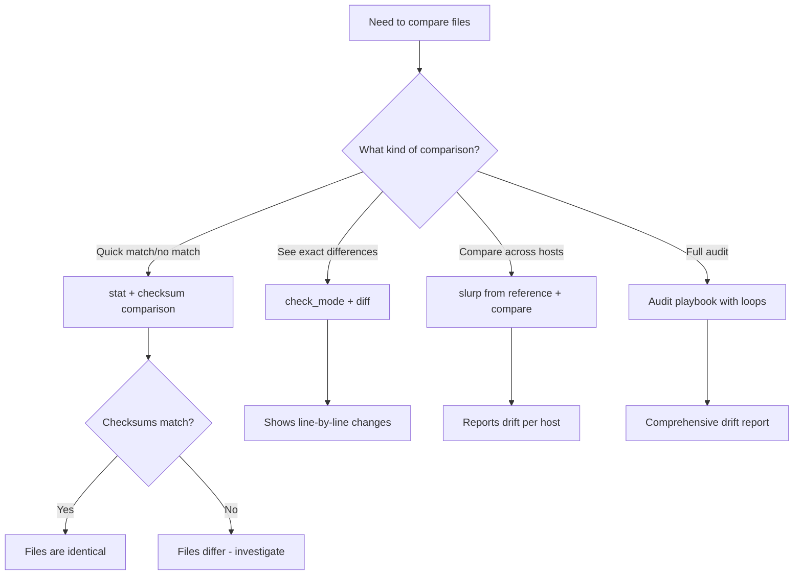

# How to Use Ansible to Compare Files Between Control and Remote

Author: [nawazdhandala](https://www.github.com/nawazdhandala)

Tags: Ansible, DevOps, Configuration Management, Auditing

Description: Learn how to compare files between the Ansible controller and remote hosts to detect configuration drift, validate deployments, and audit your infrastructure.

---

Configuration drift is one of the biggest challenges in infrastructure management. Someone manually edits a config file on one server, and suddenly it is different from all the others. Ansible gives you several ways to compare files between the controller and remote hosts, detect differences, and take corrective action. This guide covers practical techniques for file comparison and drift detection.

## Using check_mode to Detect Differences

The simplest way to check if a file on a remote host matches what Ansible would deploy is using check mode (dry run). When a task runs in check mode, it reports whether it would make a change without actually making it.

```yaml
# Check if the remote config matches the expected template
- name: Check if nginx config is in sync
  ansible.builtin.template:
    src: templates/nginx.conf.j2
    dest: /etc/nginx/nginx.conf
    owner: root
    group: root
    mode: '0644'
  check_mode: yes
  register: nginx_config_check

- name: Report drift status
  ansible.builtin.debug:
    msg: >
      {{ 'DRIFT DETECTED: nginx.conf has been modified on ' + inventory_hostname
         if nginx_config_check.changed
         else 'OK: nginx.conf matches expected configuration' }}
```

## Using the stat Module for Checksum Comparison

Compare file checksums between the controller and remote host.

```yaml
# Get checksum of local file
- name: Get checksum of local config file
  ansible.builtin.stat:
    path: "{{ playbook_dir }}/files/myapp.conf"
    checksum_algorithm: sha256
  register: local_file
  delegate_to: localhost

# Get checksum of remote file
- name: Get checksum of remote config file
  ansible.builtin.stat:
    path: /etc/myapp/myapp.conf
    checksum_algorithm: sha256
  register: remote_file

# Compare checksums
- name: Compare file checksums
  ansible.builtin.debug:
    msg: >
      {{ 'Files MATCH'
         if local_file.stat.checksum == remote_file.stat.checksum
         else 'Files DIFFER - local: ' + local_file.stat.checksum + ' remote: ' + remote_file.stat.checksum }}
```

## Using slurp and Jinja2 for Content Comparison

For detailed content comparison, read both files and compare them.

```yaml
# Read the remote file
- name: Read remote configuration file
  ansible.builtin.slurp:
    src: /etc/myapp/config.yml
  register: remote_config

# Read the local file
- name: Read local expected configuration
  ansible.builtin.set_fact:
    local_config: "{{ lookup('file', 'files/config.yml') }}"

# Compare content
- name: Check if files match
  ansible.builtin.set_fact:
    config_matches: "{{ (remote_config.content | b64decode) == local_config }}"

- name: Report comparison result
  ansible.builtin.debug:
    msg: "Configuration {{ 'matches' if config_matches else 'does NOT match' }} expected state on {{ inventory_hostname }}"
```

## Using the diff Option for Line-by-Line Comparison

The `--diff` flag shows actual content differences when running playbooks. Combine this with check mode for a powerful audit tool.

```bash
# Run playbook in check mode with diff to see exact changes
ansible-playbook site.yml --check --diff --limit webservers
```

You can also enable diff mode per task.

```yaml
# Show diff for config file changes
- name: Deploy configuration with diff output
  ansible.builtin.template:
    src: templates/myapp.conf.j2
    dest: /etc/myapp/myapp.conf
  diff: yes
  check_mode: yes
  register: config_diff

- name: Display differences
  ansible.builtin.debug:
    var: config_diff.diff
  when: config_diff.changed
```

## Comparing Files Across Multiple Hosts

Detect configuration drift between hosts by comparing files from a reference host against all others.

```yaml
# Read the config from the reference host
- name: Read config from reference host
  ansible.builtin.slurp:
    src: /etc/myapp/config.yml
  register: reference_config
  delegate_to: "{{ groups['app_servers'][0] }}"
  run_once: true

# Read config from each host
- name: Read config from current host
  ansible.builtin.slurp:
    src: /etc/myapp/config.yml
  register: local_config

# Compare
- name: Check for configuration drift
  ansible.builtin.assert:
    that:
      - local_config.content == reference_config.content
    fail_msg: >
      DRIFT DETECTED on {{ inventory_hostname }}!
      Config differs from reference host {{ groups['app_servers'][0] }}.
    success_msg: "Config matches reference host on {{ inventory_hostname }}"
  ignore_errors: yes
  register: drift_check

# Collect drift results
- name: Report hosts with drift
  ansible.builtin.debug:
    msg: "Host {{ inventory_hostname }} has configuration drift"
  when: drift_check is failed
```

## Building a Configuration Audit Playbook

Here is a complete playbook that audits multiple configuration files across your fleet.

```yaml
---
- name: Configuration Drift Audit
  hosts: app_servers
  become: yes
  vars:
    audit_files:
      - name: "Application Config"
        local: "files/myapp/config.yml"
        remote: "/etc/myapp/config.yml"
      - name: "Nginx Config"
        local: "files/nginx/nginx.conf"
        remote: "/etc/nginx/nginx.conf"
      - name: "Sysctl Settings"
        local: "files/sysctl/90-app.conf"
        remote: "/etc/sysctl.d/90-app.conf"
      - name: "Logrotate Config"
        local: "files/logrotate/myapp"
        remote: "/etc/logrotate.d/myapp"

  tasks:
    - name: Get checksum of local reference files
      ansible.builtin.stat:
        path: "{{ playbook_dir }}/{{ item.local }}"
        checksum_algorithm: sha256
      register: local_checksums
      loop: "{{ audit_files }}"
      delegate_to: localhost
      run_once: true

    - name: Get checksum of remote files
      ansible.builtin.stat:
        path: "{{ item.remote }}"
        checksum_algorithm: sha256
      register: remote_checksums
      loop: "{{ audit_files }}"

    - name: Compare and report drift
      ansible.builtin.debug:
        msg: >
          {{ item.0.item.name }}: {{ 'OK'
             if (item.0.stat.checksum | default('missing')) == (item.1.stat.checksum | default('missing'))
             else 'DRIFT DETECTED' }}
      loop: "{{ local_checksums.results | zip(remote_checksums.results) | list }}"
      loop_control:
        label: "{{ item.0.item.name }}"
```

## Using the copy Module's Backup Feature

When you deploy files with Ansible, the `backup` parameter saves the old version, giving you a history of changes.

```yaml
# Deploy config and keep the previous version for comparison
- name: Deploy configuration with backup
  ansible.builtin.template:
    src: templates/myapp.conf.j2
    dest: /etc/myapp/myapp.conf
    backup: yes
  register: deploy_result

- name: Show backup file location
  ansible.builtin.debug:
    msg: "Previous config saved to {{ deploy_result.backup_file }}"
  when: deploy_result.backup_file is defined
```

## Comparing Using diff Command on Remote Host

For a detailed line-by-line comparison on the remote host itself.

```yaml
# Copy the expected file to a temp location and diff
- name: Copy expected config to temp location
  ansible.builtin.copy:
    src: files/myapp.conf
    dest: /tmp/myapp.conf.expected
    mode: '0644'

- name: Compare expected vs actual config
  ansible.builtin.command:
    cmd: diff -u /etc/myapp/myapp.conf /tmp/myapp.conf.expected
  register: diff_result
  changed_when: false
  failed_when: diff_result.rc > 1

- name: Display differences
  ansible.builtin.debug:
    var: diff_result.stdout_lines
  when: diff_result.rc == 1

- name: Report if files match
  ansible.builtin.debug:
    msg: "Files are identical"
  when: diff_result.rc == 0

- name: Clean up temp file
  ansible.builtin.file:
    path: /tmp/myapp.conf.expected
    state: absent
```

## File Comparison Decision Tree



## Generating a Drift Report

Create a structured report of configuration drift.

```yaml
# Generate a drift report
- name: Initialize drift report
  ansible.builtin.set_fact:
    drift_report: []

- name: Check each configuration file
  ansible.builtin.stat:
    path: "{{ item.remote }}"
    checksum_algorithm: sha256
  register: remote_stats
  loop: "{{ audit_files }}"

- name: Build drift report
  ansible.builtin.set_fact:
    drift_report: "{{ drift_report + [{'host': inventory_hostname, 'file': item.1.item.name, 'status': 'MATCH' if item.0.stat.checksum == (item.1.stat.checksum | default('')) else 'DRIFT'}] }}"
  loop: "{{ local_checksums.results | zip(remote_stats.results) | list }}"
  loop_control:
    label: "{{ item.1.item.name }}"

- name: Display drift report
  ansible.builtin.debug:
    var: drift_report
```

## Summary

Comparing files between the Ansible controller and remote hosts is essential for detecting configuration drift, validating deployments, and maintaining infrastructure consistency. Use `check_mode` with `diff` for quick visual comparison, `stat` checksums for programmatic match detection, and `slurp` for content-level comparison. For fleet-wide auditing, combine these techniques in a loop-driven playbook that checks multiple files across all hosts and generates a structured drift report. Running these audits regularly, either as scheduled jobs or as part of your CI/CD pipeline, catches manual changes before they cause incidents.
