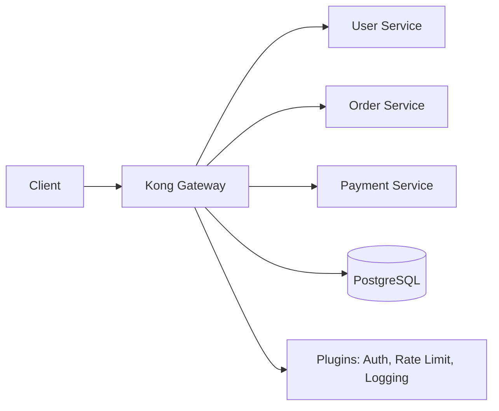

# How to Use Ansible to Configure API Gateways (Kong)

Author: [nawazdhandala](https://www.github.com/nawazdhandala)

Tags: Ansible, Kong, API Gateway, Microservices, DevOps

Description: How to deploy and configure Kong API Gateway using Ansible, including service routing, plugin setup, and rate limiting configuration.

---

Kong is an open-source API gateway that sits in front of your microservices and handles cross-cutting concerns like authentication, rate limiting, logging, and request transformation. Managing Kong through its Admin API is straightforward, but doing it manually does not scale. Ansible lets you define your entire Kong configuration as code and apply it consistently across environments.

I have managed Kong deployments that handle tens of thousands of requests per second across multiple data centers. The approach I describe here has worked reliably across all of them.

## Kong Architecture

Kong runs as a reverse proxy with a PostgreSQL or Cassandra database backing its configuration. In database-less (declarative) mode, Kong loads its configuration from a YAML file, which is even better for Ansible management.



## Role Structure

```yaml
# roles/kong/defaults/main.yml
# Default configuration for Kong API Gateway
kong_version: "3.5"
kong_mode: "db"  # or "dbless" for declarative mode
kong_database: postgres
kong_pg_host: "{{ db_host | default('127.0.0.1') }}"
kong_pg_port: 5432
kong_pg_user: kong
kong_pg_password: "{{ vault_kong_pg_password }}"
kong_pg_database: kong
kong_proxy_listen: "0.0.0.0:8000, 0.0.0.0:8443 ssl"
kong_admin_listen: "127.0.0.1:8001"
kong_admin_api: "http://127.0.0.1:8001"
kong_declarative_config_path: /etc/kong/kong.yml
```

## Installing Kong with Ansible

```yaml
# roles/kong/tasks/install.yml
# Install Kong Gateway from official repository
- name: Add Kong GPG key
  ansible.builtin.apt_key:
    url: "https://download.konghq.com/gateway-{{ kong_version }}/gpg-key"
    state: present
  when: ansible_os_family == 'Debian'

- name: Add Kong repository
  ansible.builtin.apt_repository:
    repo: "deb https://download.konghq.com/gateway-{{ kong_version }}/apt {{ ansible_distribution_release }} main"
    state: present
  when: ansible_os_family == 'Debian'

- name: Install Kong
  ansible.builtin.apt:
    name: kong
    state: present
    update_cache: true
  when: ansible_os_family == 'Debian'

- name: Deploy Kong configuration
  ansible.builtin.template:
    src: kong.conf.j2
    dest: /etc/kong/kong.conf
    owner: kong
    group: kong
    mode: '0640'
  notify: restart kong

- name: Run Kong database migrations
  ansible.builtin.command: kong migrations bootstrap
  register: kong_migrations
  changed_when: "'Database already bootstrapped' not in kong_migrations.stderr"
  failed_when: kong_migrations.rc != 0 and 'already bootstrapped' not in kong_migrations.stderr
  when: kong_mode == 'db'

- name: Start Kong service
  ansible.builtin.service:
    name: kong
    state: started
    enabled: true
```

## Kong Configuration Template

```
# roles/kong/templates/kong.conf.j2
# Kong Gateway configuration file

# Database settings
database = {{ kong_database }}

pg_host = {{ kong_pg_host }}
pg_port = {{ kong_pg_port }}
pg_user = {{ kong_pg_user }}
pg_password = {{ kong_pg_password }}
pg_database = {{ kong_pg_database }}

declarative_config = {{ kong_declarative_config_path }}


# Listener settings
proxy_listen = {{ kong_proxy_listen }}
admin_listen = {{ kong_admin_listen }}

# Logging
proxy_access_log = /var/log/kong/access.log
proxy_error_log = /var/log/kong/error.log
admin_access_log = /var/log/kong/admin_access.log
admin_error_log = /var/log/kong/admin_error.log

# Performance
nginx_worker_processes = auto
```

## Configuring Services and Routes via Admin API

```yaml
# roles/kong/tasks/configure_services.yml
# Register backend services and routes with Kong
- name: Register services with Kong
  ansible.builtin.uri:
    url: "{{ kong_admin_api }}/services/{{ item.name }}"
    method: PUT
    body_format: json
    body:
      name: "{{ item.name }}"
      url: "{{ item.url }}"
      connect_timeout: "{{ item.connect_timeout | default(60000) }}"
      read_timeout: "{{ item.read_timeout | default(60000) }}"
      write_timeout: "{{ item.write_timeout | default(60000) }}"
      retries: "{{ item.retries | default(5) }}"
    status_code: [200, 201]
  loop: "{{ kong_services }}"
  loop_control:
    label: "{{ item.name }}"

- name: Configure routes for services
  ansible.builtin.uri:
    url: "{{ kong_admin_api }}/services/{{ item.0.name }}/routes/{{ item.1.name }}"
    method: PUT
    body_format: json
    body:
      name: "{{ item.1.name }}"
      paths: "{{ item.1.paths }}"
      methods: "{{ item.1.methods | default(omit) }}"
      strip_path: "{{ item.1.strip_path | default(true) }}"
      preserve_host: "{{ item.1.preserve_host | default(false) }}"
    status_code: [200, 201]
  loop: "{{ kong_services | subelements('routes') }}"
  loop_control:
    label: "{{ item.1.name }}"
```

## Defining Services and Routes in Variables

```yaml
# inventories/production/group_vars/api_gateway.yml
# Kong services and routes configuration
kong_services:
  - name: user-service
    url: "http://user-service.internal:8001"
    routes:
      - name: user-api
        paths:
          - /api/v1/users
        methods:
          - GET
          - POST
          - PUT
          - DELETE
      - name: user-auth
        paths:
          - /api/v1/auth
        methods:
          - POST

  - name: order-service
    url: "http://order-service.internal:8002"
    routes:
      - name: order-api
        paths:
          - /api/v1/orders
        strip_path: false

  - name: payment-service
    url: "http://payment-service.internal:8003"
    connect_timeout: 30000
    routes:
      - name: payment-api
        paths:
          - /api/v1/payments
```

## Configuring Kong Plugins

```yaml
# roles/kong/tasks/configure_plugins.yml
# Enable and configure Kong plugins
- name: Enable rate limiting globally
  ansible.builtin.uri:
    url: "{{ kong_admin_api }}/plugins"
    method: POST
    body_format: json
    body:
      name: rate-limiting
      config:
        minute: 100
        hour: 5000
        policy: local
        fault_tolerant: true
    status_code: [200, 201, 409]

- name: Enable JWT authentication on specific services
  ansible.builtin.uri:
    url: "{{ kong_admin_api }}/services/{{ item }}/plugins"
    method: POST
    body_format: json
    body:
      name: jwt
      config:
        claims_to_verify:
          - exp
    status_code: [200, 201, 409]
  loop: "{{ kong_jwt_protected_services }}"

- name: Enable request logging
  ansible.builtin.uri:
    url: "{{ kong_admin_api }}/plugins"
    method: POST
    body_format: json
    body:
      name: http-log
      config:
        http_endpoint: "http://log-collector.internal:9200"
        method: POST
        timeout: 10000
        keepalive: 60000
    status_code: [200, 201, 409]

- name: Enable CORS plugin
  ansible.builtin.uri:
    url: "{{ kong_admin_api }}/plugins"
    method: POST
    body_format: json
    body:
      name: cors
      config:
        origins:
          - "https://app.example.com"
          - "https://admin.example.com"
        methods:
          - GET
          - POST
          - PUT
          - DELETE
          - OPTIONS
        headers:
          - Authorization
          - Content-Type
        max_age: 3600
    status_code: [200, 201, 409]
```

## Declarative Mode Configuration

For database-less deployments, generate the full config file:

```yaml
# roles/kong/templates/kong-declarative.yml.j2
# Kong declarative configuration
_format_version: "3.0"

services:

  - name: {{ service.name }}
    url: {{ service.url }}
    routes:

      - name: {{ route.name }}
        paths:

          - {{ path }}

        strip_path: {{ route.strip_path | default(true) | lower }}



plugins:
  - name: rate-limiting
    config:
      minute: 100
      policy: local
  - name: correlation-id
    config:
      header_name: X-Request-ID
      generator: uuid
```

## Health Check Verification

```yaml
# roles/kong/tasks/verify.yml
# Verify Kong deployment health
- name: Check Kong admin API health
  ansible.builtin.uri:
    url: "{{ kong_admin_api }}/status"
    status_code: 200
  register: kong_status

- name: Display Kong status
  ansible.builtin.debug:
    msg: "Kong database reachable: {{ kong_status.json.database.reachable }}"

- name: List registered services
  ansible.builtin.uri:
    url: "{{ kong_admin_api }}/services"
  register: services

- name: Verify all expected services are registered
  ansible.builtin.assert:
    that:
      - "item.name in (services.json.data | map(attribute='name') | list)"
    fail_msg: "Service {{ item.name }} is not registered in Kong"
  loop: "{{ kong_services }}"
  loop_control:
    label: "{{ item.name }}"
```

## Conclusion

Managing Kong with Ansible gives you version-controlled, repeatable API gateway configurations. Whether you use the Admin API approach for database-backed deployments or declarative mode for simpler setups, Ansible keeps your gateway configuration consistent across environments. The combination of service definitions, route mappings, and plugin configurations in YAML variables makes it easy to review changes and promote configurations from staging to production.
